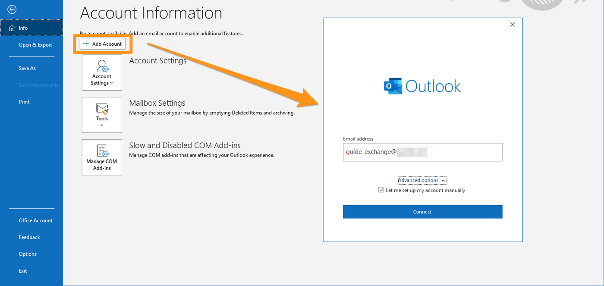
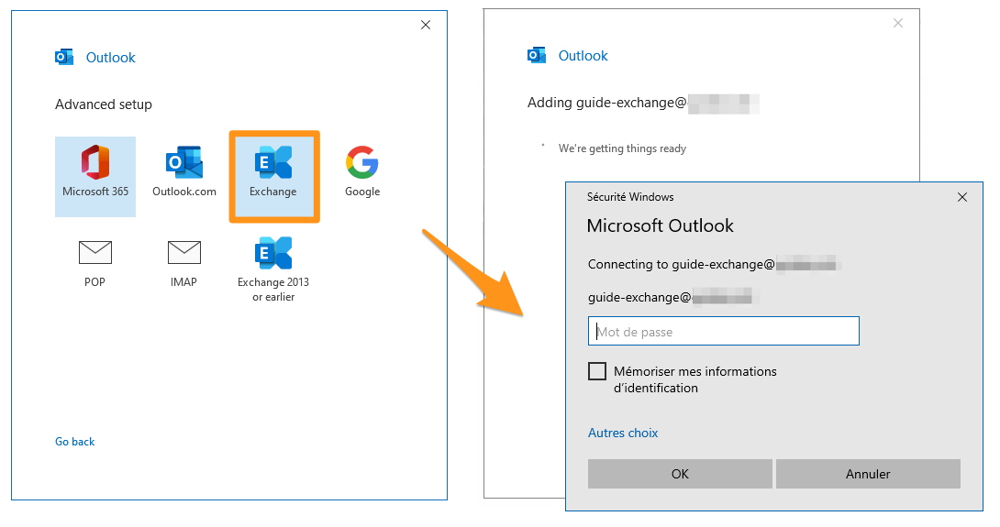
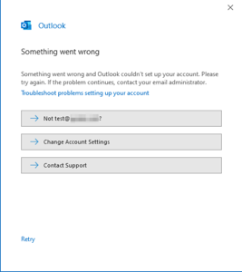
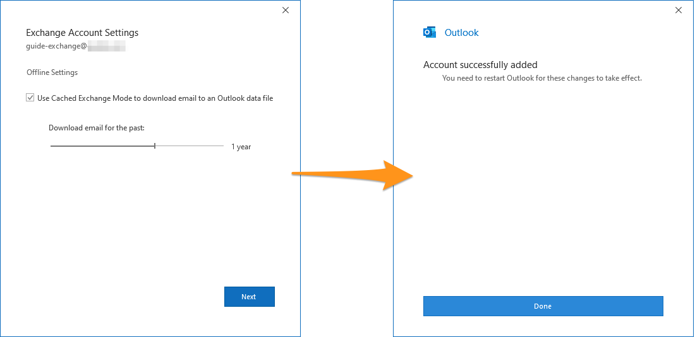

 
> [!primary]
> Questa traduzione è stata generata automaticamente dal nostro partner SYSTRAN. I contenuti potrebbero presentare imprecisioni, ad esempio la nomenclatura dei pulsanti o alcuni dettagli tecnici. In caso di dubbi consigliamo di fare riferimento alla versione inglese o francese della guida. Per aiutarci a migliorare questa traduzione, utilizza il pulsante "Contribuisci" di questa pagina.
>
 

## Obiettivo

Gli account Exchange possono essere configurati su client di posta compatibili, per permetterti di utilizzare il tuo account email dal dispositivo che preferisci. Microsoft Outlook è il software consigliato per utilizzare un indirizzo email Exchange con le sue funzioni collaborative.

**Questa guida ti mostra come configurare un account Exchange su Microsoft Outlook per Windows.**

> [!warning]
>
> OVHcloud mette a tua disposizione servizi di cui tu sei responsabile per la configurazione e la gestione. Garantirne quotidianamente il corretto funzionamento è quindi responsabilità dell’utente.
> 
> Questa guida ti aiuta a eseguire le operazioni necessarie alla configurazione del tuo account. Tuttavia, in caso di difficoltà o dubbi, ti consigliamo di contattare un fornitore specializzato o l’amministratore del servizio. OVHcloud non può fornirti alcuna assistenza. Per maggiori informazioni consulta la sezione “Per saperne di più” di questa guida.
> 

## Prerequisiti

- Disporre di una soluzione [Exchange](https://www.ovhcloud.com/it/emails/){.external}
- Aver installato il software Microsoft Outlook 2016 o successivo, sul tuo computer
- Disporre delle credenziali associate all’indirizzo email da configurare
- Il record SRV di OVHcloud deve essere configurato correttamente nella zona DNS del nome di dominio, consulta la nostra guida [Aggiungere un dominio sul servizio Exchange](/pages/web_cloud/email_and_collaborative_solutions/microsoft_exchange/exchange_adding_domain).

> [!primary]
>
> Utilizzi Outlook 2016 e poi per Mac? Consulta la nostra documentazione: [Configurare un account Exchange su Outlook 2016 per Mac](/pages/web_cloud/email_and_collaborative_solutions/microsoft_exchange/how_to_configure_outlook_2016_mac).
>

## Procedura

### Aggiungi l'account

- Durante il primo avvio dell’applicazione un assistente di configurazione apparirà sullo schermo e ti inviterà a inserire il tuo indirizzo e-mail.

- **Se hai già configurato un account**, clicca su `File`{.action} nella barra dei menù in alto nello schermo e poi su `Aggiungi account`{.action}.

- Ora inserisci il tuo indirizzo e-mail e clicca su Opzioni avanzate.  Selezione la voce accanto a Configurare il mio account manualmente appena comparsa e clicca su Connetti 

{.thumbnail}

- Tra i tipi di account, scegli Exchange.

- Inserisci la password del tuo indirizzo email nella finestra successiva, spunta la casella per memorizzarla e clicca su `OK`{.action}.

{.thumbnail}

> [!primary]
> 
> Se un messaggio ti indica che Outlook non ha potuto configurare il tuo account, ciò può indicare che il record SRV di OVHcloud non è stato configurato correttamente nella zona DNS del tuo dominio.
> 
> {.thumbnail}
>
> Ti consigliamo di verificare la configurazione del dominio impostato sul tuo servizio Exchange accedendo allo [Spazio Cliente OVHcloud](https://www.ovh.com/auth/?action=gotomanager&from=https://www.ovh.it/&ovhSubsidiary=it), scheda `Domini associati`{.action}, poi colonna `Diagnostica`{.action} della tabella.
>

- Se la configurazione del tuo dominio è valida, può apparire un messaggio di autorizzazione alla connessione ai server di OVHcloud. Accetta il messaggio per consentire la configurazione automatica del tuo account Exchange.
- In seguito, determina la periodicità di conservazione degli elementi del tuo account Exchange, **in locale sul tuo computer**. Clicca su `Seguente`{.action} e poi su `Fine`{.action}.

{.thumbnail}

### Utilizza l'indirizzo email

Una volta configurato l’indirizzo email, non ti resta che utilizzarlo! A partire da questo momento puoi inviare e ricevere messaggi.

Il tuo indirizzo email Exchange e tutte le sue funzioni collaborative sono disponibili anche tramite l'interfaccia [OWA](https://www.ovh.it/mail/). Per maggiori informazioni sul suo utilizzo, consulta la guida [Consultare il suo account Exchange dall'interfaccia OWA](/pages/web_cloud/email_and_collaborative_solutions/using_the_outlook_web_app_webmail/email_owa).

### Recuperare un backup del tuo indirizzo email

Se è necessario effettuare un'operazione che potrebbe comportare la perdita dei dati del tuo account email, ti consigliamo di effettuare un backup preliminare dell'account email in questione. Per effettuare questa operazione, consulta il paragrafo "**Esporta da Windows**" nella nostra guida [Migrare manualmente il tuo indirizzo email](/pages/web_cloud/email_and_collaborative_solutions/migrating/manual_email_migration#esporta-da-windows).

## Per saperne di più

[Configurare un account email su Outlook 2016 per Windows](/pages/web_cloud/email_and_collaborative_solutions/mx_plan/how_to_configure_outlook_2016)

[Configurare un account Email Pro su Outlook 2016 per Windows](/pages/web_cloud/email_and_collaborative_solutions/email_pro/how_to_configure_outlook_2016)

Contatta la nostra Community di utenti all’indirizzo <https://community.ovh.com/en/>.