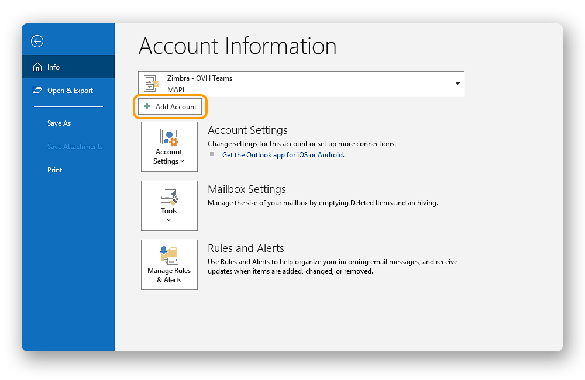
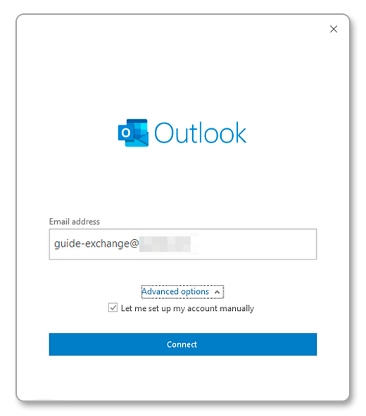
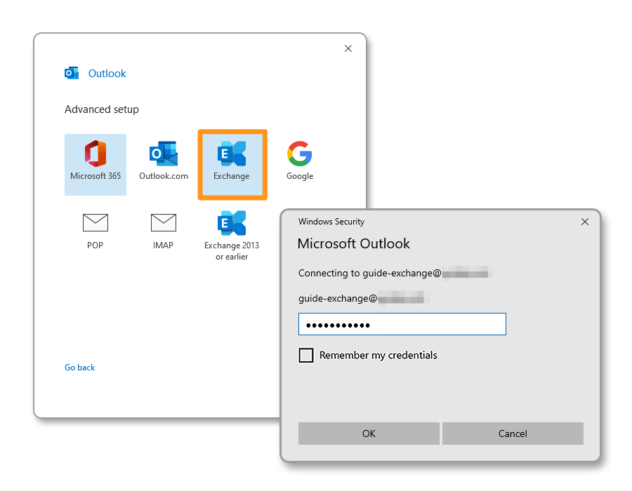
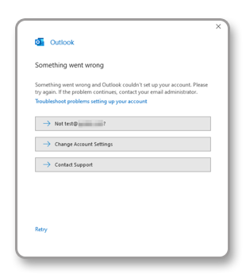
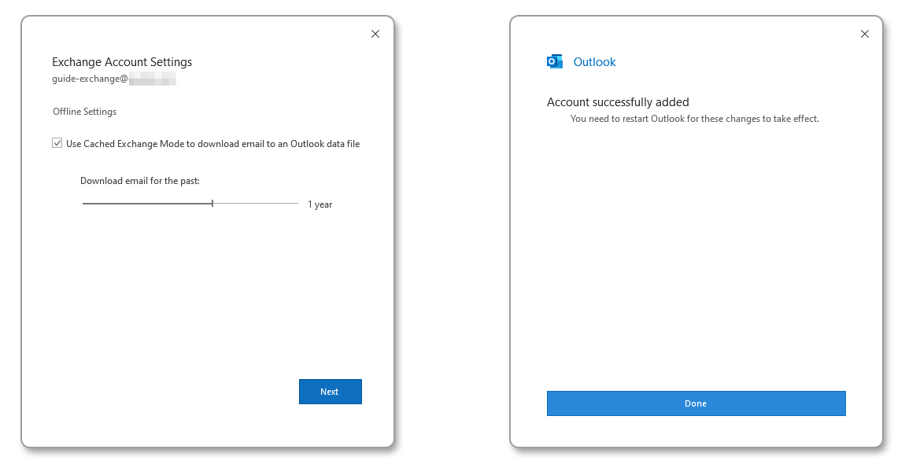
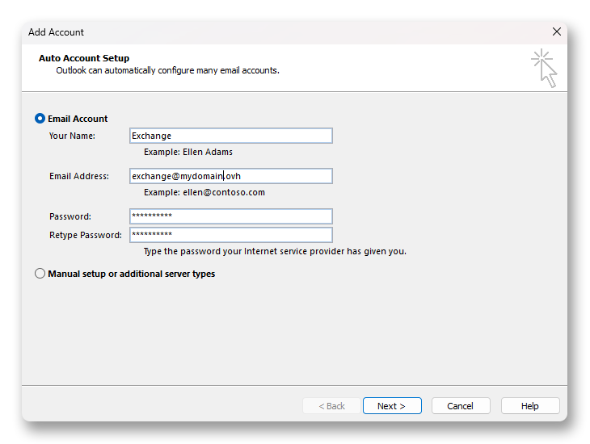
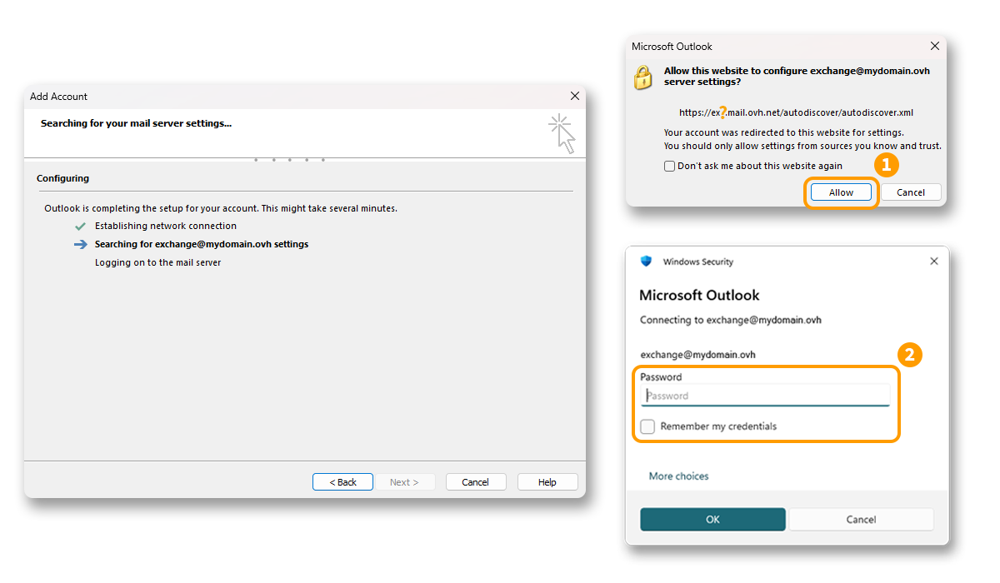
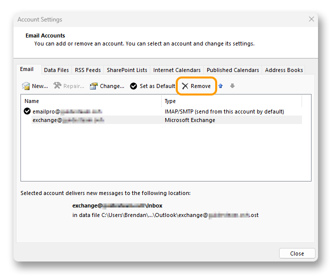

## Objetivo

As contas Exchange podem ser usadas com vários softwares de e-mail (desde que sejam compatíveis). Isto permite-lhe usar o seu endereço de e-mail no dispositivo que preferir. Microsoft Outlook é o software recomendado para utilizar um endereço de e-mail Exchange com as suas funções colaborativas.

**Saiba como configurar uma conta Exchange no Microsoft Outlook para Windows.**

<iframe class="video" width="560" height="315" src="https://www.youtube-nocookie.com/embed/2YeGXo10CX8?si=mINBBXq6qb4MiFEt" title="YouTube video player" frameborder="0" allow="accelerometer; autoplay; clipboard-write; encrypted-media; gyroscope; picture-in-picture; web-share" referrerpolicy="strict-origin-when-cross-origin" allowfullscreen></iframe>

## Requisitos

- Ter o serviço [E-mail Pro](/links/web/emails).
- Ter a aplicação [Outlook clássico](https://support.microsoft.com/pt-pt/office/instalar-ou-reinstalar-o-outlook-cl%C3%A1ssico-num-pc-windows-5c94902b-31a5-4274-abb0-b07f4661edf5) em Windows.
- Dispor das credenciais do endereço de e-mail que pretende configurar.
- O campo SRV da OVHcloud deve estar corretamente configurado na zona DNS do domínio. Por favor, consulte o nosso guia "[Adicionar um domínio ao serviço Exchange](/pages/web_cloud/email_and_collaborative_solutions/microsoft_exchange/exchange_adding_domain)".

<!-- CP-NAV-START:web-exchange -->
---

### Acesso à Área de Cliente OVHcloud

- **Ligação direta:** [Exchange](/links/control-panel/web-exchange)
- **Caminho de navegação:** `Web Cloud`{.action} > `Exchange`{.action} > Selecione a sua plataforma

---
<!-- CP-NAV-END:web-exchange -->

/// details | Informações relativas à gestão e configuração dos serviços OVHcloud

A responsabilidade sobre a configuração e a gestão dos serviços que a OVHcloud disponibiliza recai sobre o utilizador. Assim, deverá certificar-se de que estes funcionam corretamente.

Este manual fornece as instruções necessárias para realizar as operações mais habituais. No entanto, se encontrar dificuldades, recomendamos que recorra a um [prestador de serviços especializado](/links/partner) e/ou que contacte o editor do serviço. Não poderemos proporcionar-lhe assistência técnica. Para mais informações, aceda à secção "[Quer saber mais?](#go-further)" deste guia.

///

> [!primary]
>
> Utiliza o Outlook e posterior para Mac? consulte o nosso manual "[Configurar uma conta Exchange no Outlook para Mac](/pages/web_cloud/email_and_collaborative_solutions/microsoft_exchange/how_to_configure_outlook_2016_mac)".

## Instruções

> [!warning]
>
> Antes de iniciar a sua configuração, é importante notar que a aplicação Outlook incluída gratuitamente no Windows 11 é [incompatível](https://learn.microsoft.com/pt-pt/microsoft-365-apps/outlook/get-started/supported-account-types) com as ofertas Exchange OVHcloud, ditas *on-premises*. Deverá utilizar a versão **Outlook clássico**.
>
> Para instalar o Outlook clássico no seu computador Windows, transfira-o a partir da página Microsoft "[Instalar ou reinstalar o Outlook clássico num PC Windows](https://support.microsoft.com/pt-pt/office/instalar-ou-reinstalar-o-outlook-cl%C3%A1ssico-num-pc-windows-5c94902b-31a5-4274-abb0-b07f4661edf5)", e instale-o.
>
> Quando a instalação for concluída, para distinguir as duas versões quando instaladas, digite "Outlook" na barra de pesquisa do Windows. Poderá verificar a diferença como se mostra a seguir.
>
> {.thumbnail .h-500}

### Adicionar a conta

- **Se for a primeira vez que utiliza a aplicação**, aparecerá um assistente de configuração que lhe irá solicitar o seu endereço de e-mail.

- **Se já tem uma conta configurada**, clique em `Ficheiro`{.action} e selecione `Adicionar Conta`{.action}.

{.thumbnail .h-500}

**No Windows 11, a interface do Outlook clássico pode variar quando adiciona uma conta.**

Consoante o histórico de utilização do Outlook no computador em questão, uma configuração específica pode provocar a exibição de uma interface diferente. Em alguns casos, a interface dita « moderna » (**interface 1**) pode ser desativada a favor da interface clássica (**interface 2**).

É por isso que o convidamos a consultar o capítulo correspondente à interface exibida no seu ecrã.

> [!tabs]
> **Interface 1**
>>
>> - Preencha o seu endereço de e-mail, depois clique em `Opções avançadas`{.action}.
>> - Marque a caixa `Configurar a minha conta manualmente`{.action} e clique em `Conexão`{.action}.
>>
>> {.thumbnail}
>>
>> - Entre os tipos de contas propostos, escolha **Exchange**.
>> - Na janela seguinte, introduza a palavra-passe do seu endereço de e-mail, marque a caixa que permite guardar as suas credenciais e clique em `OK`{.action}.
>>
>> {.thumbnail}
>>
>> > [!primary]
>> > 
>> > Se uma mensagem lhe indicar que o Outlook não conseguiu configurar a sua conta, isso pode significar que o registo SRV da OVHcloud não está corretamente configurado na zona DNS do seu nome de domínio.
>> >
>> > {.thumbnail}
>> >
>> > Recomendamos que verifique a configuração do nome de domínio configurado no seu serviço Exchange no seu [Área de Cliente OVHcloud](/links/manager), separador `Domínios associados`{.action}, depois coluna `Diagnóstico`{.action} da tabela.
>> 
>> - Se a configuração do seu nome de domínio estiver correta, uma mensagem de autorização de ligação aos servidores da OVHcloud pode aparecer. Aceite-a para permitir a configuração automática da sua conta Exchange.
>> - Defina depois o período de conservação dos elementos da sua conta Exchange, **localmente no seu computador**. Clique em `Seguinte`{.action}, depois em `Terminado`{.action}.
>>
>> {.thumbnail}
>>
> **Interface 2**
>>
>> - Deixe `Conta de correio` marcado e preencha as seguintes informações:
>>     - **Nome**: defina um nome de exibição.
>>     - **Endereço de correio**: introduza o seu endereço de e-mail completo.
>>     - **Palavra-passe**: introduza a palavra-passe associada ao seu endereço de e-mail.
>>     - **Confirmar a palavra-passe**: introduza novamente a palavra-passe associada ao seu endereço de e-mail.
>> - Clique em `Seguinte`{.action} para continuar.
>>
>> {.thumbnail .h-500}
>>
>> - Se a configuração do seu nome de domínio for válida, uma mensagem de autorização de ligação ao servidor Exchange OVHcloud pode aparecer. Clique em `Autorizar`{.action} **(1)** para permitir a configuração automática da sua conta Exchange.
>> - Uma segunda janela de autenticação aparece, introduza a palavra-passe do seu endereço de e-mail **(2)**.
>>
>> {.thumbnail .h-500}
>>
>> Após a autorização e autenticação ao servidor Exchange OVHcloud, a configuração será concluída e a sua conta operacional.

### Utilizar o endereço de e-mail

Após a configuração, a conta de e-mail está pronta a usar e pode começar a enviar e receber mensagens no seu dispositivo.

O seu endereço de e-mail Exchange, bem como todas as suas funções de colaboração, estão igualmente disponíveis através da interface [OWA](/links/web/email). Para qualquer questão relativa à sua utilização, não hesite em consultar o nosso guia "[Consultar a sua conta Exchange a partir da interface OWA](/pages/web_cloud/email_and_collaborative_solutions/using_the_outlook_web_app_webmail/email_owa)".

### Modificar as definições existentes

> [!warning]
>
> Não é possível modificar as definições do servidor de uma conta Exchange. Se encontrar uma anomalia relacionada com a sincronização com o servidor, será necessário eliminar a conta do Outlook e configurá-la novamente. Para o fazer, siga as instruções abaixo.

Se a sua conta de e-mail já estiver configurada e tiver de aceder às definições da conta para a eliminar:

- Vá a `Ficheiro`{.action} a partir da barra de menu no topo do seu ecrã.
- Selecione a conta a modificar no menu suspenso **(1)**.
- Clique em `Definições da conta`{.action} **(2)** em baixo.
- Clique em `Definições da conta...`{.action} **(3)** para aceder à janela de definições.

{.thumbnail .h-500}

- A janela de definições das contas aparece, selecione a conta de e-mail afetada e clique em `Eliminar`{.action}.

{.thumbnail .h-500}

Uma vez a conta Exchange eliminada, siga a secção "[Adicionar a conta](#add-account)" deste guia para configurar novamente a sua conta de e-mail.

### Recuperar um backup do seu endereço de e-mail

Se tiver de efetuar uma operação suscetível de causar a perda dos dados da sua conta de e-mail, sugerimos que efetue uma cópia de segurança da conta de e-mail em questão. Para isso, consulte o manual "**Exportar do Windows**" no manual "[Migrar o seu endereço de e-mail](/pages/web_cloud/email_and_collaborative_solutions/migrating/manual_email_migration#exportar-a-partir-do-windows)".

## Quer saber mais? 

> [!primary]
>
> Para obter mais informações sobre a configuração de um endereço de e-mail a partir da aplicação Outlook no Windows, consulte o [Centro de Ajuda da Microsoft](https://support.microsoft.com/pt-pt/office/adicionar-uma-conta-de-correio-em-outlook-6e27792a-9267-4aa4-8bb6-c84ef146101b).

[Configurar um endereço de e-mail no Outlook para Windows](/pages/web_cloud/email_and_collaborative_solutions/mx_plan/how_to_configure_outlook_2016)

[Configurar uma conta E-mail Pro no Outlook para Windows](/pages/web_cloud/email_and_collaborative_solutions/email_pro/how_to_configure_outlook_2016)

Fale com nossa [comunidade de utilizadores](/links/community).