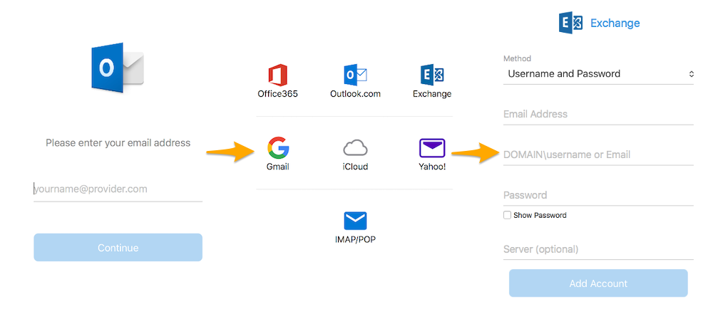

## Objectif

Les comptes Exchange peuvent être configurés sur différents logiciels de messagerie compatibles. Cela vous permet d'utiliser votre adresse e-mail depuis l'appareil de votre choix.

> [!warning]
>
> OVHcloud met à votre disposition des services dont la configuration, la gestion et la responsabilité vous incombent. Il vous revient de ce fait d'en assurer le bon fonctionnement.
> 
> Nous mettons à votre disposition ce guide afin de vous accompagner au mieux sur des tâches courantes. Néanmoins, nous vous recommandons de faire appel à un [partenaire spécialisé](https://marketplace.ovhcloud.com/c/support-collaboration) et/ou de contacter l'éditeur du service si vous éprouvez des difficultés. En effet, nous ne serons pas en mesure de vous fournir une assistance. Plus d'informations dans la section « Aller plus loin » de ce guide.
> 

## Prérequis

- Disposer d'une offre [Exchange](/links/web/emails).
- Disposer de l'application Microsoft Outlook installée sur votre Mac.
- Disposer des identifiants relatifs à l'adresse e-mail que vous souhaitez paramétrer.

> [!primary]
>
> Vous utilisez Outlook pour Windows ? Consultez notre documentation : [Configurer son compte Exchange sur Outlook pour Windows](/pages/web_cloud/email_and_collaborative_solutions/microsoft_exchange/how_to_configure_outlook_2016).
>

## En pratique

### Étape 1 : ajouter le compte

Une fois l'application Outlook lancée sur votre appareil, l'ajout d'un compte peut être effectué de deux manières différentes.

- **Lors du premier démarrage de l'application** : un assistant de configuration s'affiche et vous invite à renseigner votre adresse e-mail.

- **Si un compte a déjà été paramétré** : cliquez sur `Outils`{.action} dans la barre de menu en haut de votre écran puis sur `Comptes`{.action}. Dans la fenêtre qui s'affiche, cliquez sur `+`{.action} puis sur `Nouveau compte`{.action}.

{.thumbnail}

Renseignez à présent votre adresse e-mail puis cliquez sur `Continuer`{.action}. Si un choix de fournisseur apparaît, sélectionnez `Exchange`{.action}. Remplissez ensuite les informations demandées.

|Information|Description|
|---|---|
|Méthode|Laissez **Nom d'utilisateur et mot de passe** (sélectionné par défaut).|
|Adresse de courrier|Renseignez un nom vous permettant de reconnaître ce compte parmi d'autres affichés dans votre application Outlook.|
|DOMAINE\nom d’utilisateur ou adresse de courrier|Renseignez l'adresse e-mail complète.|
|Mot de passe|Renseignez le mot de passe de l'adresse e-mail.|
|Serveur|Selon la configuration DNS de votre nom de domaine, renseigner le serveur peut être facultatif. Si nécessaire, indiquez le serveur sur lequel est hébergé votre service Exchange. Vous pouvez le retrouver depuis votre [espace client OVHcloud](/links/manager) dans l'onglet `Informations générales`{.action} du service Exchange concerné, puis dans le cadre `Connexion`{.action}.|

Une fois les informations complétées, cliquez sur `Ajouter un compte`{.action}. Si celles-ci sont correctes, la connexion au compte réussira.

Vous pouvez effectuer un test d'envoi pour vérifier que le compte est bien paramétré.

{.thumbnail}

### Étape 2 : utiliser l'adresse e-mail

Une fois l'adresse e-mail configurée, il ne reste plus qu’à l'utiliser ! Vous pouvez dès à présent envoyer et recevoir des messages.

OVHcloud propose une application web disposant de [fonctions collaboratives](/links/web/emails). Celle-ci est accessible à l’adresse [Webmail](/links/web/email). Vous pouvez vous y connecter grâce aux identifiants de votre adresse e-mail.

## Aller plus loin

> [!primary]
>
> Pour plus d'informations sur la configuration d'une adresse e-mail depuis l'application Outlook sur macOS, consultez [le centre d'aide Microsoft](https://support.microsoft.com/fr-fr/office/add-an-email-account-to-outlook-for-mac-6aeec61b-86af-40af-8ffe-985d0fc82ddb).

[Configurer son adresse e-mail comprise dans l’offre MX Plan ou dans une offre d’hébergement web sur Outlook pour Mac](/pages/web_cloud/email_and_collaborative_solutions/mx_plan/how_to_configure_outlook_2016_mac)

[Configurer son compte E-mail Pro sur Outlook pour Mac](/pages/web_cloud/email_and_collaborative_solutions/email_pro/how_to_configure_outlook_2016_mac)

Échangez avec notre communauté d'utilisateurs sur <https://community.ovh.com>.