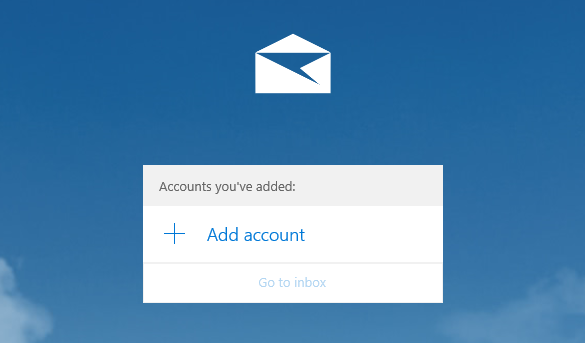
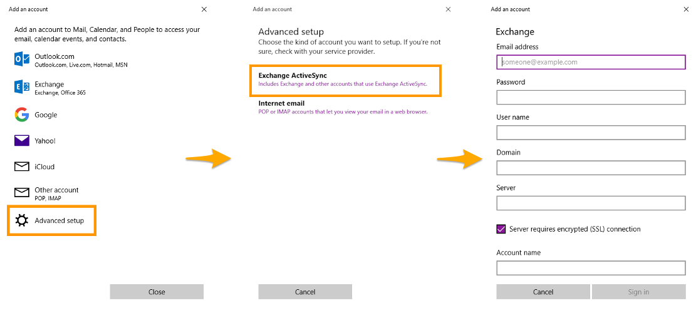

## Objetivo

As contas Exchange podem ser configuradas em vários softwares de e-mail compatíveis. Isto permite-lhe utilizar o seu endereço de e-mail no dispositivo que preferir.

**Aprenda a configurar uma conta Exchange sobre a aplicação Correio para Windows.**

> [!warning]
>
> A OVHcloud disponibiliza serviços cuja configuração, gestão e responsabilidade lhe incumbem. Assim, deverá certificar-se de que estes funcionam corretamente.
> 
> Este manual fornece as instruções necessárias para realizar as operações mais habituais. No entanto, se encontrar dificuldades, recomendamos que recorra a um [fornecedor especializado](/links/partner) e/ou que contacte o editor do serviço. Não poderemos proporcionar-lhe assistência técnica. Para mais informações, aceda à secção deste manual intitulada: "Quer saber mais?"
> 

## Requisitos

- Dispor de uma oferta [Exchange](/links/web/emails-exchange) .
- Dispor da aplicação Correio instalada no seu dispositivo.
- Ter acesso às credenciais do endereço de e-mail que pretende configurar.

<!-- CP-NAV-START:web-exchange -->
---

### Acesso à Área de Cliente OVHcloud

- **Ligação direta:** [Exchange](/links/control-panel/web-exchange)
- **Caminho de navegação:** `Web Cloud`{.action} > `Exchange`{.action} > Selecione a sua plataforma

---
<!-- CP-NAV-END:web-exchange -->

## Instruções

### Fase 1: adicionar a conta

Uma vez lançada a aplicação Correio no seu dispositivo, a adição de uma conta pode ser efetuada de duas formas diferentes.

- ** No primeiro início da aplicação**: através de uma janela, poderá clicar em `Adicionar uma conta`{.action}.

- **Se uma conta já tiver sido parametrizada**: clique em `Contas`{.action} na barra de menu à esquerda da aplicação e depois em `Adicionar um conta`{.action} no menu que aparece à direita.

{.thumbnail}

Na nova janela, clique em `Configuração avançada`{.action} e selecione `Exchange AtiveSync`{.action} em tipo de conta.

Introduza as informações solicitadas:

|Informação| Descrição|
|---|---|
|Endereço de correio | Introduza o endereço de e-mail completo.|
|Password | Indique a password do endereço de e-mail.|
|Nome de utilizador | Introduza o endereço de e-mail completo.|
|Domínio | Não preencher nada.|
|Servidor | Indique o servidor no qual está alojado o seu serviço Exchange. Clique [neste link](/links/control-panel/web-exchange) para aceder à secção `Exchange`{.action}. O nome do servidor é apresentado na zona **Ligação** do separador `Informações gerais`{.action}.|
|O servidor necessita de uma ligação encriptada (SSL) | Deixe imperativamente esta opção selecionada.|
|Nome da conta | Indique um nome que lhe permita reconhecer esta conta entre outras presentes na sua aplicação Correio.|

Depois de preencher as informações, clique em `Se connecter`{.action}. Se estas estiverem corretas, a ligação à conta será concluída.

Surge então uma janela perguntando-lhe se deseja adicionar a conta; ela informa-o sobre as alterações relativas a certas funcionalidades inerentes ao seu dispositivo. Saiba tudo e confirme a adição da conta.

Pode efetuar um teste de envio para verificar se a conta está corretamente configurada.

{.thumbnail}

### Fase 2: utilizar o endereço de e-mail

Depois de configurar o endereço de e-mail, só falta utilizá-lo! Pode desde já enviar e receber mensagens.

A OVHcloud também disponibiliza uma aplicação web com [funções colaborativas](/links/web/emails) . Este endereço está disponível em [Webmail](/links/web/email). Para aceder, só precisa dos dados de acesso do seu endereço de e-mail.

## Quer saber mais?

> [!primary]
>
> Para obter mais informações sobre a configuração de um endereço de e-mail a partir do cliente de e-mail Correio no Windows, consulte [Centro de Ajuda da Microsoft](https://support.microsoft.com/pt-pt/office/configurar-o-e-mail-na-aplica%C3%A7%C3%A3o-correio-7ff79e8b-439b-4b47-8ff9-3f9a33166c60).

[Configurar um endereço de e-mail no serviço MX Plan ou num serviço de alojamento web na aplicação Correio para Windows](/pages/web_cloud/email_and_collaborative_solutions/mx_plan/how_to_configure_windows_10) 

[Configurar uma conta E-mail Pro na aplicação Correio para Windows](/pages/web_cloud/email_and_collaborative_solutions/email_pro/how_to_configure_windows_10) 

Fale com nossa [comunidade de utilizadores](/links/community).