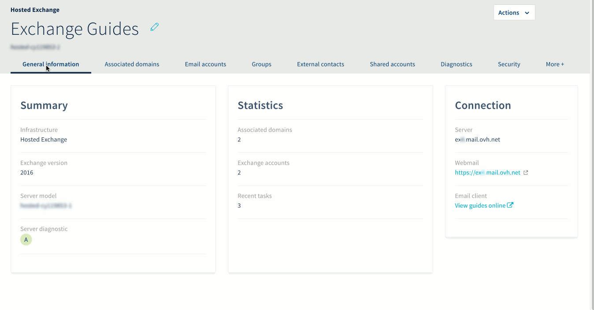
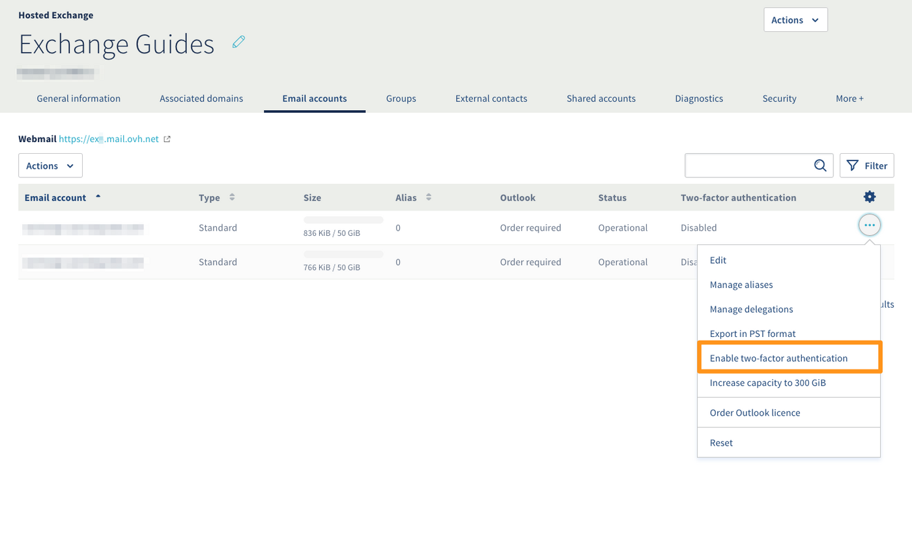
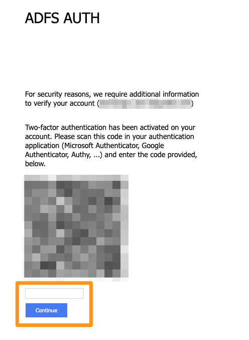
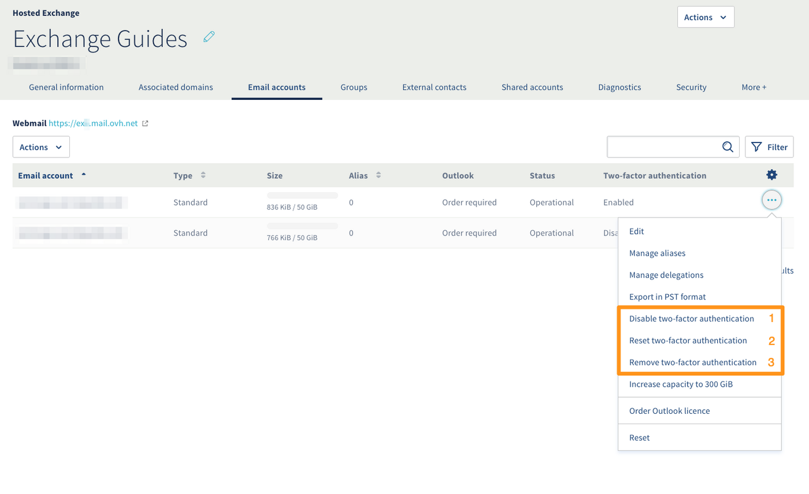

## Objetivo

Si desea optimizar la seguridad de su cuenta Exchange, puede activar la doble autenticación (2FA). Esta genera un código que deberá introducir cada vez que inicie sesión, además de su contraseña. El código se genera mediante una aplicación de *contraseña de un solo uso* (OTP) que deberá instalar en su teléfono inteligente o tableta.

**Cómo activar la autenticación de dos factores en su cuenta Exchange**

## Requisitos

- Tener un plan [Exchange de OVHcloud](/links/web/emails).
- Haber instalado una aplicación OTP en un teléfono inteligente o en una tableta con sistema operativo Android o iOS.

<!-- CP-NAV-START:web-exchange -->
---

### Acceso al área de cliente de OVHcloud

- **Enlace directo:** [Exchange](/links/control-panel/web-exchange)
- **Ruta de navegación:** `Web Cloud`{.action} > `Exchange`{.action} > Seleccione su plataforma

---
<!-- CP-NAV-END:web-exchange -->

> [!primary]
> **Las aplicaciones móviles OTP**
>
> Existen numerosas aplicaciones OTP. Dos de estas aplicaciones son gratuitas:
> 
> - Para Android: Free OTP
> - Para iOS: OTP Auth
> 

## Procedimiento

### Primera configuración:

#### Paso 1: activar la doble autenticación en la plataforma

Al momento de realizar la primera configuración, es necesario activar la doble autenticación en la plataforma antes de activarla en una cuenta.

1. Acceda a la pestaña `Seguridad`{.action} de la plataforma.
1. Debajo de la opción "Doble autenticación", haga clic en `Activar`{.action}.
1. Para terminar, desplácese hasta el final de la página y haga clic en `Guardar los cambios`{.action}.

{.thumbnail}

#### Paso 2: activar la doble autenticación en una cuenta

Una vez activada la doble autenticación en la plataforma, puede activarla en una de sus cuentas.

Desde su plataforma Exchange, acceda a la pestaña `Cuentas de correo`{.action}. Haga clic en `...`{.action} a la derecha de la cuenta en la que desea activar la doble autenticación y, seguidamente, en `Activar la doble autenticación`{.action}.

{.thumbnail}

Para asociar su cuenta a su aplicación OTP, inicie sesión en su [correo electrónico basado en la web](/links/web/email).

Al conectarse por primera vez, aparece un código QR. Utilice la aplicación OTP para escanearlo e introduzca el código que la aplicación generó para conectarse.

{.thumbnail}

Las próximas veces que se conecte, solo se le solicitará el código que generó la aplicación.

### Desactivar la doble autenticación

La doble autenticación de su cuenta puede desactivarse de tres maneras diferentes.

{.thumbnail}

Seleccione la opción que corresponde a sus necesidades según la siguiente tabla:

| N.°| Función| Descripción
|----------------------------------|------------------|------------------|
| 1. | «Desactivar la doble autenticación» | Permite eliminar la doble autenticación durante un periodo de tiempo determinado en horas. Una vez superado el plazo, la doble autenticación se reactivará.   *Ejemplo: un usuario ha olvidado su teléfono inteligente y no puede autenticarse con la aplicación OTP.*   |
| 2. | «Restablecer la doble autenticación» | Permite restablecer el código QR solicitado al conectarse por primera vez al correo electrónico basado en la web.  *Ejemplo: un usuario ha cambiado de teléfono inteligente y debe volver a configurar su aplicación OTP.* |
| 3. | «Eliminar la doble autenticación» | Elimina por completo la doble autenticación de la cuenta. | 

## Más información 

Interactúe con nuestra [comunidad de usuarios](/links/community).
