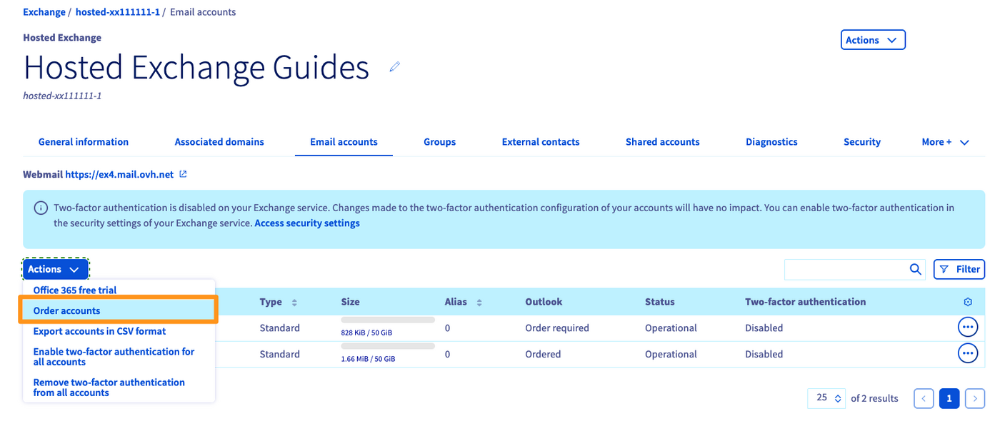
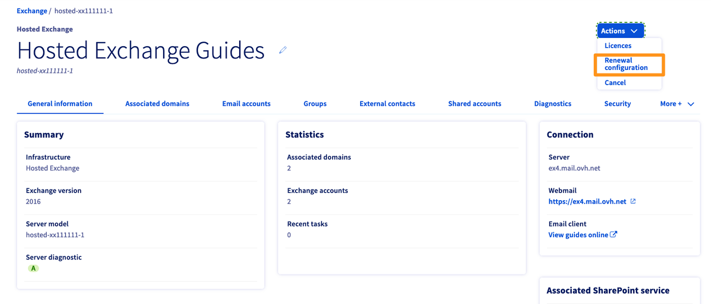
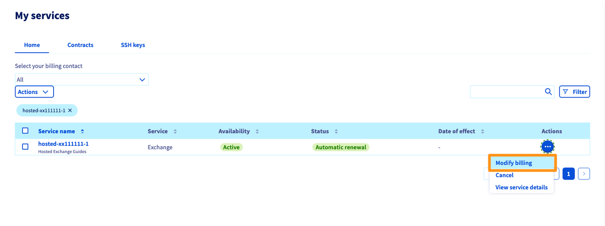
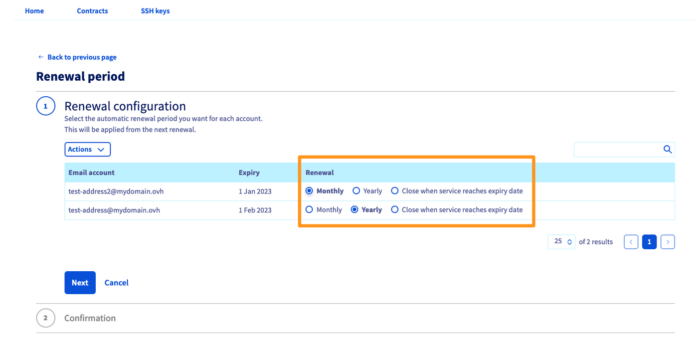
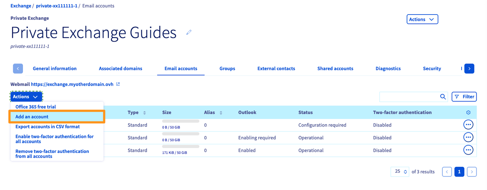
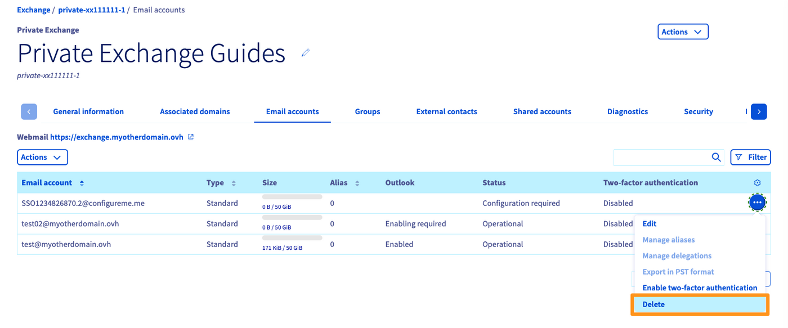

## Objetivo

Los servicios Hosted Exchange y Private Exchange permiten una gestión flexible de la facturación de las cuentas. Esta guía explica cómo configurarla.

**Descubra cómo gestionar las suscripciones de sus cuentas Exchange.**

## Requisitos

- Haber iniciado sesión en el [área de cliente de OVHcloud](/links/manager).
- Tener contratado un plan [Exchange](/links/web/emails-hosted-exchange).

## Procedimiento

Inicie sesión en el [área de cliente de OVHcloud](/links/manager) y acceda al apartado `Webcloud`{.action}. Haga clic en `Microsoft`{.action}, luego en `Exchange`{.action} y, por último, seleccione la plataforma Exchange correspondiente.

### Hosted Exchange

Acceda a la pestaña `Cuentas de correo`{.action}, haga clic en el botón `Acciones`{.action} en la parte superior derecha y, luego, en `Contratar cuentas`{.action}

{.thumbnail}

#### Cambiar la periodicidad de sus cuentas 

En la ventana de gestión de su plataforma Exchange, haga clic en el botón `Acciones`{.action} en la parte superior derecha y, luego, en `Configuración de la renovación`{.action}.

{.thumbnail}

Acceda a la sección «Mis servicios» del área de cliente. Comprobará que se ha aplicado un filtro que solo muestra la plataforma Exchange que se va a modificar.

Haga clic en `...`{.action} en la parte superior derecha de la plataforma Exchange y luego en `«Modificar la facturación`{.action}.

{.thumbnail}

En esta nueva ventana, podrá ver y cambiar la facturación de cada una de sus cuentas. La columna «**Renovación**» permite realizar cambios en una o varias cuentas simultáneamente. Cada cambio en una cuenta se aplicará en la fecha indicada en la columna «**Expiración**».

En el ejemplo a continuación, se indican las acciones que se deben realizar para cambiar la renovación de una cuenta a mensual:

> En el primer paso, haga clic en «**Mensual**» a la derecha de la cuenta de su elección y luego en `Siguiente`{.action}, más adelante y a la izquierda.
>
> En el segundo paso, un resumen muestra el cambio aplicado. Haga clic en `Enviar`{.action} en la parte inferior izquierda.
>
> {.thumbnail}

#### Eliminar cuentas

Para eliminar una cuenta de su plataforma Hosted, primero la debe dar de baja estableciendo su configuración de renovación en «**Expira al término**». Para hacer esto, consulte el paso [«cambiar la periodicidad de sus cuentas»](#periodicity).

Una vez dada de baja la cuenta, se suspenderá en su fecha de expiración. Si quiere eliminar la dirección de correo electrónico alojada por la cuenta antes de su fecha de expiración, reiníciela.

Acceda a la pestaña `Cuentas de correo electrónico`{.action} de su plataforma, haga clic en el botón `...`{.action} delante de la cuenta correspondiente y luego en `Reiniciar`{.action}. Una vez reiniciada, la cuenta permanecerá en blanco hasta su expiración.

### Private Exchange

> [!primary]
>
> En una plataforma Private Exchange, las cuentas solo admiten la renovación mensual. No se puede configurar la periodicidad.

#### Contratar cuentas adicionales

Acceda a la pestaña `Cuentas de correo`{.action}, haga clic en el botón `Acciones`{.action} en la parte superior derecha y luego en `Añadir una cuenta`{.action} La cuenta se facturará para el mes en curso.

{.thumbnail}

#### Eliminar cuentas

> [!warning]
>
> Para poder eliminar una cuenta de correo en una plataforma Private Exchange, **es necesario que esta haya sido creada** (asociada al dominio de su plataforma Exchange). No se puede eliminar una cuenta no configurada.

En la pestaña `Cuentas de correo electrónico`{.action}, haga clic en `...`{.action} a la derecha de la cuenta correspondiente y luego en `Eliminar`{.action}. La cuenta se eliminará de la plataforma de inmediato, por lo que no será necesario darla de baja.

{.thumbnail}

## Más información 

Para servicios especializados (posicionamiento, desarrollo, etc.), contacte con [partners de OVHcloud](/links/partner).

Si quiere disfrutar de ayuda para utilizar y configurar sus soluciones de OVHcloud, puede consultar nuestras distintas soluciones [pestañas de soporte](/links/support).

Interactúe con nuestra [comunidad de usuarios](/links/community).