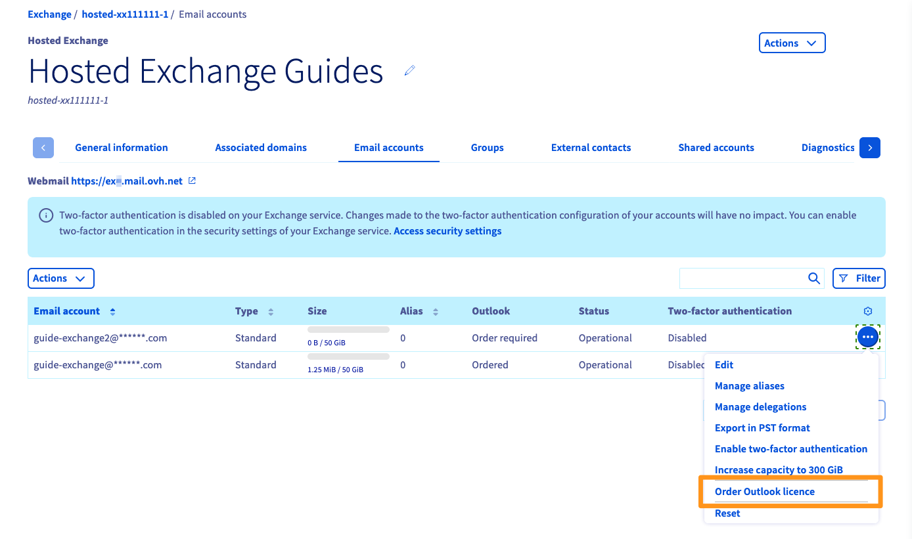
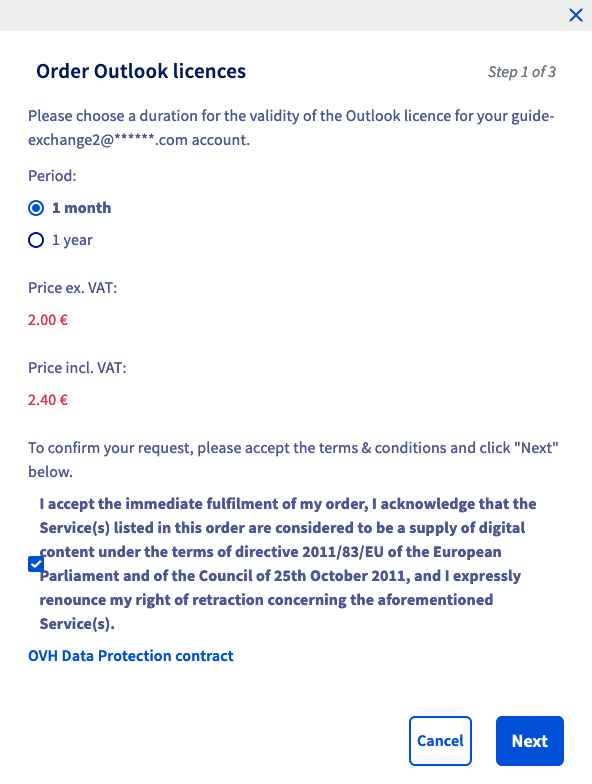
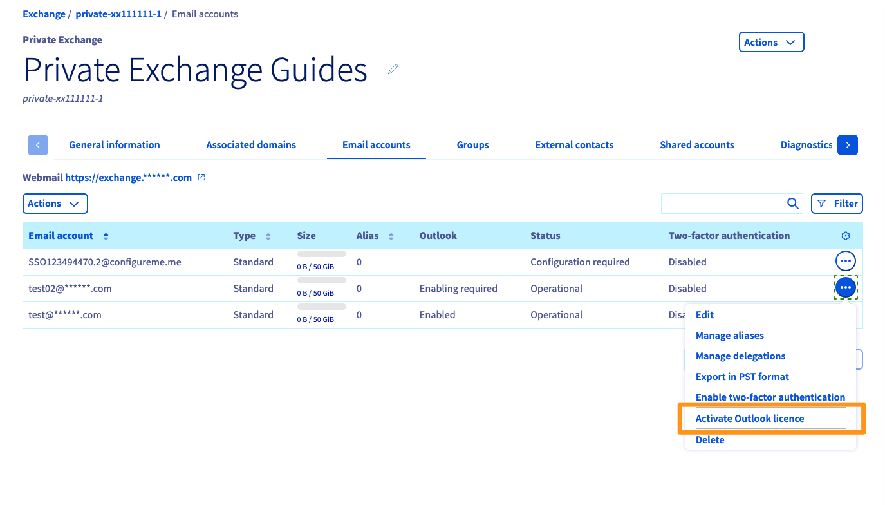
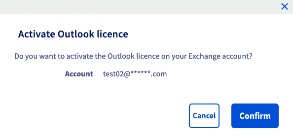
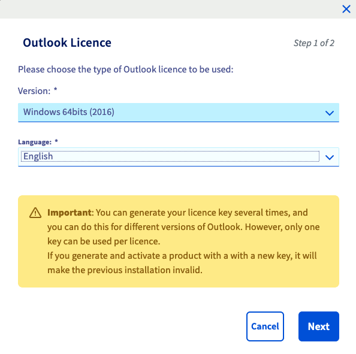
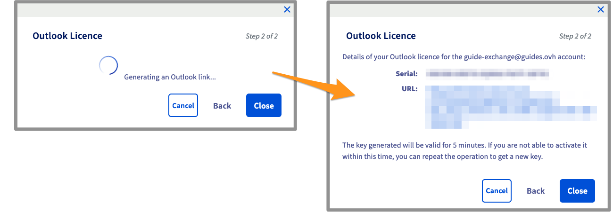
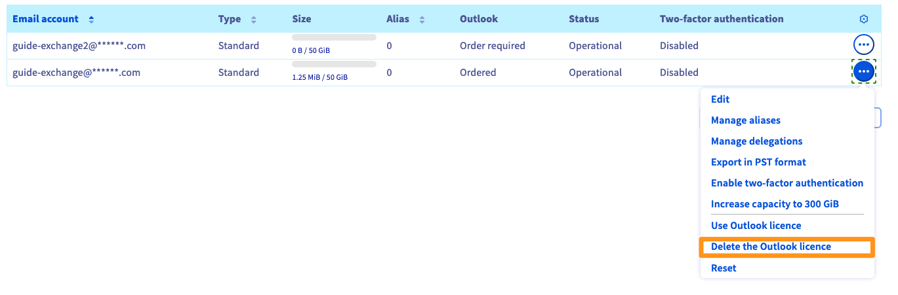

## Objetivo

Deseja beneficiar de uma licença Outlook para consultar e gerir os seus e-mails na sua conta Exchange.

A OVHcloud oferece-lhe o cliente de e-mails Outlook ao preço de 2€ s/IVA por mês. Será associado a uma conta Exchange OVHcloud cuja gestão tem.

Após a subscrição, pode descarregar o Outlook entre as 3 versões seguintes:

- Outlook para Windows 32 bits.
- Outlook para Windows 64 bits.
- Outlook para MAC 64 bits.

**Saiba como subscrever e instalar uma licença Outlook a partir da plataforma Exchange OVHcloud.**

<!-- CP-NAV-START:web-exchange -->
---

### Acesso à Área de Cliente OVHcloud

- **Ligação direta:** [Exchange](/links/control-panel/web-exchange)
- **Caminho de navegação:** `Web Cloud`{.action} > `Exchange`{.action} > Selecione a sua plataforma

---
<!-- CP-NAV-END:web-exchange -->

## Instruções

### Encomendar uma licença Outlook

#### Para uma conta Hosted Exchange

{.thumbnail}

Defina a frequência de renovação da sua licença Outlook e valide as condições e clique em `Seguinte`{.action}.

{.thumbnail}

Após o resumo da sua encomenda, utilize o botão `Pagar`{.action} para gerar a nota de encomenda. Será reencaminhado para uma nova página que lhe permitirá pagar a sua encomenda através dos métodos de pagamento à sua disposição.

Aguarde alguns instantes até a sua licença Outlook estar disponível na Área de Cliente.

#### Para uma conta Private Exchange

{.thumbnail}

Uma janela lhe pergunta se deseja ativar a licença Outlook na sua conta Exchange. Clique em `Validar`{.action} para ativar a licença na conta em causa.

{.thumbnail}

Aguarde alguns instantes até a sua licença Outlook estar disponível na Área de Cliente.

> [!primary]
>
> A faturação da sua licença Outlook será integrada na faturação da sua plataforma Private Exchange, todos os meses.
>

### Descarregar e instalar o Outlook

Agora tem que descarregar o ficheiro de instalação do Outlook para a sua máquina.

A partir da interface de gestão da sua plataforma Exchange, clique no ícone `...`{.action} à direita da conta em causa e, a seguir, em `Utilizar a licença Outlook`{.action}

Escolha a versão no menu pendente em função do seu sistema operativo e a língua, e clique em `Seguinte`{.action}

{.thumbnail}

Depois de alguns instantes, será gerada uma ligação de download, assim como uma chave de licença a utilizar aquando da instalação na sua máquina.

{.thumbnail}

O ficheiro descarregado está no formato .ISO, ou seja, uma imagem em disco. Execute a instalação e introduza a chave da licença quando ela lhe for solicitada.

### Eliminar a licença Outlook da sua conta

{.thumbnail}

Após a validação, recorde-se que a licença será definitivamente eliminada na sua data de expiração.

## Quer saber mais? 
 
Fale com nossa [comunidade de utilizadores](/links/community).
