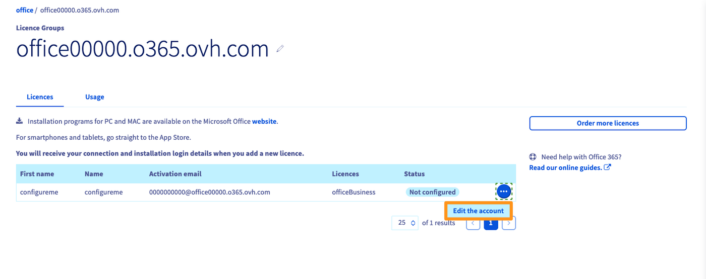
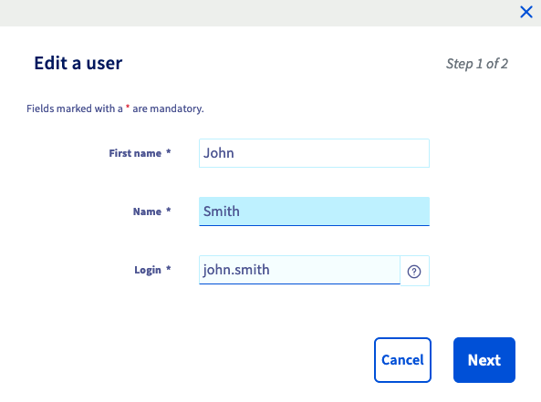
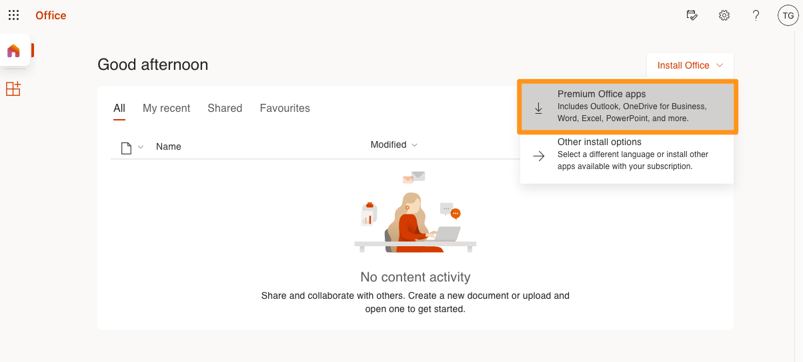
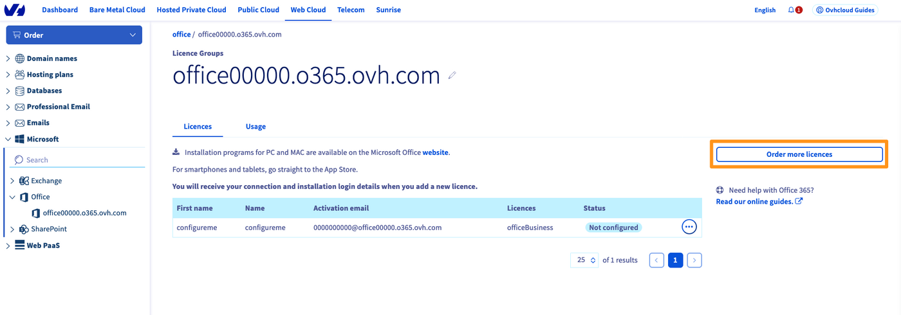

> [!primary]
> Diese Übersetzung wurde durch unseren Partner SYSTRAN automatisch erstellt. In manchen Fällen können ungenaue Formulierungen verwendet worden sein, z.B. bei der Beschriftung von Schaltflächen oder technischen Details. Bitte ziehen Sie im Zweifelsfall die englische oder französische Fassung der Anleitung zu Rate. Möchten Sie mithelfen, diese Übersetzung zu verbessern? Dann nutzen Sie dazu bitte den Button "Beitragen" auf dieser Seite.
>

## Ziel

Die OVHcloud Angebote für **Microsoft 365 Apps for Business** und **Microsoft 365 Apps for Enterprise** bieten mehrere Vorteile. Die Abrechnung erfolgt monatlich und Sie können eine Lizenz für 5 PCs/Macs, 5 Tablets und 5 Smartphones verwenden.

Ihre Microsoft 365 Lizenzen werden zu einer Gruppe zusammengefasst, auch "Service" genannt. Eine Apps for Business Lizenzgruppe kann maximal 300 Lizenzen enthalten, eine Lizenzgruppe Apps for Enterprise ist unbegrenzt.

Die Lizenzen gelten für folgende Software:

- Apps for Business: Excel, Word, PowerPoint, Outlook, Note, Publisher.
- Apps for Enterprise: Excel, Word, PowerPoint, Outlook, Note, Publisher, Access.

**Diese Anleitung erklärt, wie Sie eine Microsoft 365 Lizenz bestellen und in Ihrem OVHcloud Kundencenter verwalten.**

## Voraussetzungen

- Sie haben Zugriff auf Ihr [OVHcloud Kundencenter](/links/manager).

## In der praktischen Anwendung

### Lizenz bestellen

Gehen Sie zur Angebotsseite [OVHcloud Microsoft 365](https://www.ovhcloud.com/de/collaborative-tools/microsoft-365/){.external} und klicken Sie auf den Button `Bestellen`{.action}.

Vom [OVHcloud Kundencenter](/links/manager) aus wählen Sie oben `Web Cloud`{.action} aus und klicken Sie auf `Bestellen`{.action} und dann `O365`{.action}.

- Wählen Sie aus den verfügbaren Angeboten "Apps for Business" oder "Apps for Enterprise".
- Legen Sie das Verlängerungsintervall Ihrer Lizenzgruppe fest.
- Geben Sie die gewünschte Anzahl an Lizenzen ein und klicken Sie auf `Bestellen`{.action}.

Sie werden zur Bestellseite weitergeleitet und können die Bestellung überprüfen und zahlen.

### Lizenz aktivieren

Nachdem Sie Ihre Lizenz bestellt haben, aktivieren Sie diese über Ihr [OVHcloud Kundencenter](/links/manager). Klicken Sie im Bereich `Web Cloud`{.action} auf `Microsoft`{.action} und dann auf `Office`{.action} und wählen Sie die betreffende Lizenzgruppe aus.

Klicken Sie auf den Button `...`{.action} neben der Lizenz und dann auf `Account bearbeiten`{.action}.

{.thumbnail}

Tragen Sie die Informationen zum Benutzer der Lizenz ein, klicken Sie auf `Weiter`{.action} und dann auf `Bestätigen`{.action}.

{.thumbnail}

### Microsoft 365 Suite auf Ihrem Gerät installieren 

Sobald die Lizenz aktiviert ist, erhalten Sie eine E-Mail an die Kontakt-Adresse Ihres OVHcloud Kunden-Accounts. Sie können diese E-Mail auch in Ihrem [OVHcloud Kundencenter](/links/manager) einsehen, indem Sie oben rechts auf den Account-Namen klicken und dann im Bereich `Shortcuts` auf `E-Mails von OVHcloud`{.action} klicken.

Diese E-Mail enthält die notwendigen Informationen zum Download und zur Installation Ihrer Microsoft 365 Suite, insbesondere die **E-Mail-Adresse** und das **Passwort** zur Aktivierung.

>
> Wenn Sie das Passwort selbst festlegen möchten, müssen Sie dies über Ihr Kundencenter tun. Klicken Sie im Bereich `Web Cloud`{.action} auf `Microsoft`{.action} und dann auf `Microsoft 365`{.action} und wählen Sie die betreffende Lizenzgruppe aus.
>
> Klicken Sie rechts neben der betreffenden Lizenz auf `...`{.action}. und dann auf `Passwort ändern`{.action}.
>
> {.thumbnail}
>

Geben Sie auf <https://portal.office.com/> die **E-Mail-Adresse** zur Aktivierung und das zuvor konfigurierte **Passwort** ein, um sich einzuloggen. Sie werden zu einer Seite mit Installationsanweisungen weitergeleitet, auf der Sie die Microsoft 365 Suite auf Ihr Gerät herunterladen können.

{.thumbnail}

#### Installation der Suite 365 auf mehreren Maschinen

Mit einer Lizenz kann der Benutzer die Microsoft 365 Suite auf **5 Windows- und macOS-Maschinen**, **5 Tablets** und **5 Smartphones** installieren. Das sind insgesamt **15 Geräte** für eine Lizenz. Alle diese Geräte müssen Eigentum des Lizenznehmers sein.

Um Ihre Lizenz auf mehreren Maschinen zu installieren, müssen Sie einfach [den vorherigen Schritt](#install365) *auf jedem Gerät* wiederholen und sicherstellen, dass jedes Gerät *vom selben Benutzer* verwaltet wird.

### Eine Lizenz zu einer bestehenden Gruppe hinzufügen

Wenn Sie eine oder mehrere Lizenzen zu Ihrer bestehenden Lizenzgruppe hinzufügen möchten, können Sie diese über Ihr [OVHcloud Kundencenter](/links/manager) hinzufügen. Klicken Sie im Bereich `Web Cloud`{.action} auf `Microsoft`{.action} und dann auf `Microsoft 365`{.action} und wählen Sie die betreffende Lizenzgruppe aus.

Klicken Sie rechts auf den Button `Weitere Lizenzen bestellen`{.action}. Geben Sie die Anzahl und den Typ der Lizenzen an, die Sie hinzufügen möchten.

{.thumbnail}

#### Ihre Abonnements verwalten 

##### Eine Lizenz aus einer Lizenzgruppe löschen

Klicken Sie im Tab `Lizenzen`{.action} Ihrer Lizenzgruppe rechts neben der zu kündigenden Lizenz auf den Button `...`{.action} und anschließend auf `Account löschen`{.action}.

{.thumbnail}

> [!primary]
>
> Der Verbrauch des laufenden Monats wird am Monatsende abgerechnet.

##### Die Lizenzgruppe kündigen

Um Ihre Microsoft Office 365 CSP1 Lizenzgruppe zu kündigen, klicken Sie oben rechts im OVHcloud Kundencenter auf Ihren Namen und anschließend auf den Button `Dienstverwaltung`{.action}. Klicken Sie dann rechts neben der zu kündigenden Lizenzgruppe auf den Button `...`{.action} und anschließend auf `Kündigen`{.action} .
Geben Sie die Gründe für Ihre Kündigungsanfrage an und klicken Sie auf `Bestätigen`{.action}.

> [!primary]
>
> Der Verbrauch des laufenden Monats wird am Monatsende abgerechnet.

## Weiterführende Informationen

[Remote Desktop mit Microsoft 365 Apps verwenden](/pages/web_cloud/email_and_collaborative_solutions/microsoft_office/office_proplus)

Für den Austausch mit unserer User Community gehen Sie auf <https://community.ovh.com/en/>.
