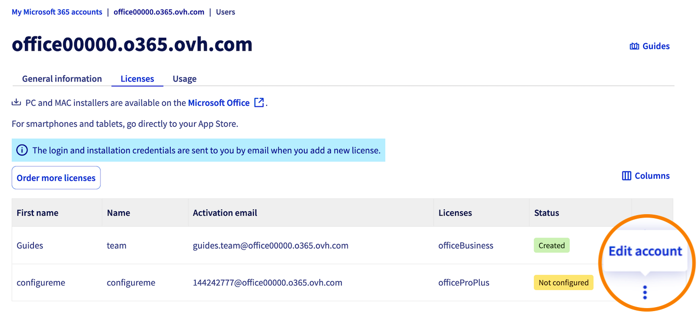
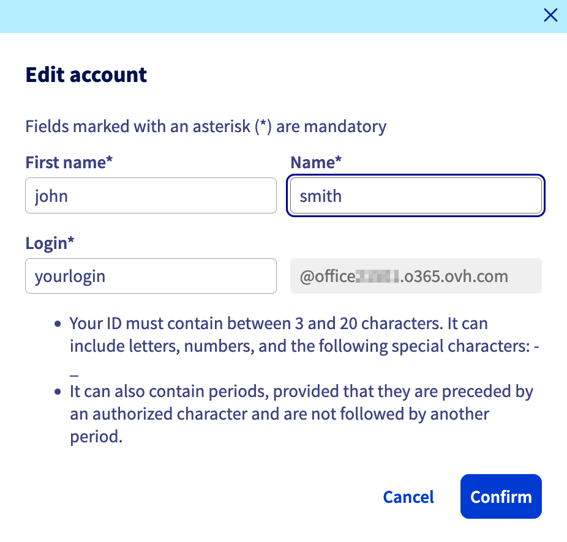
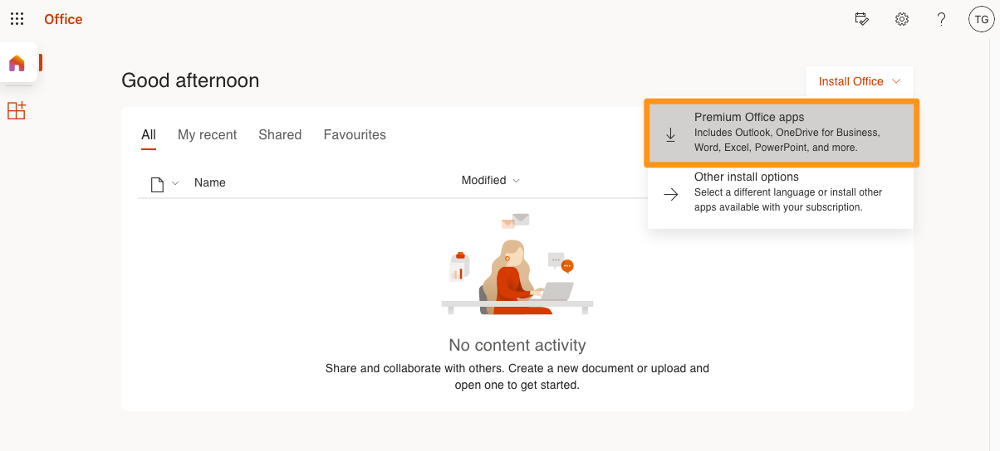
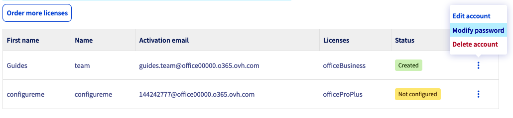
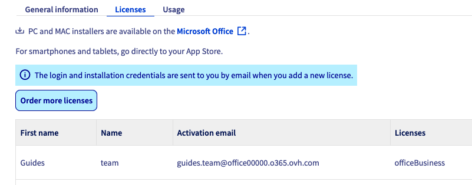
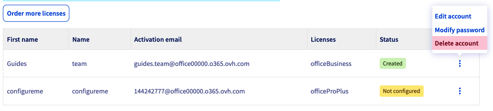

## Ziel

Die OVHcloud Angebote für **Microsoft 365 Apps for Business** und **Microsoft 365 Apps for Enterprise** bieten mehrere Vorteile. Die Abrechnung erfolgt monatlich und Sie können eine Lizenz für 5 PCs/Macs, 5 Tablets und 5 Smartphones verwenden.

Ihre Microsoft 365 Lizenzen werden zu einer Gruppe zusammengefasst, auch "Service" genannt. Eine *Apps for Business* Lizenzgruppe kann maximal 300 Lizenzen enthalten, eine Lizenzgruppe *Apps for Enterprise* ist unbegrenzt.

Die Lizenzen gelten für folgende Software:

- Apps for Business: Excel, Word, PowerPoint, Outlook, OneNote, Publisher.
- Apps for Enterprise: Excel, Word, PowerPoint, Outlook, OneNote, Publisher, Access.

**Diese Anleitung erklärt, wie Sie eine Microsoft 365 Lizenz bestellen und in Ihrem OVHcloud Kundencenter verwalten.**

## Voraussetzungen

<!-- CP-NAV-START:web-microsoft-365 -->
---

### Zugriff auf das OVHcloud Kundencenter

- **Direkter Link:** [Microsoft 365](/links/control-panel/web-microsoft-365)
- **Navigationspfad:** `Web Cloud`{.action} > `Microsoft 365`{.action}

---
<!-- CP-NAV-END:web-microsoft-365 -->

## In der praktischen Anwendung

### Lizenz bestellen

1. Wählen Sie aus unseren verfügbaren Angeboten *Apps for Business* und *Apps for Enterprise*.
1. Legen Sie das Erneuerungsintervall für Ihre Lizenzgruppe fest.
1. Legen Sie die Anzahl der gewünschten Lizenzen fest und schließen Sie Ihre Bestellung ab.

### Lizenz aktivieren

So aktivieren Sie die bestellte Lizenz:

    {.thumbnail .w-500}

Geben Sie die Lizenz-Daten ein, und klicken Sie auf `Bestätigen`{.action}.

    {.thumbnail .w-500}

### Installieren von Microsoft 365 Suite 

Sobald die Lizenz aktiviert ist, erhalten Sie eine E-Mail an die Kontakt-E-Mail-Adresse Ihres OVHcloud Kunden-Accounts. Sie finden diese E-Mail auch in Ihrem [OVHcloud Kundencenter](/links/manager), indem Sie in Ihrem Profil oben rechts auf `Meine Kommunikation`{.action} im Bereich `Empfangene E-Mails` klicken.

Diese E-Mail enthält die zum Herunterladen und Installieren Ihrer Microsoft 365 Suite erforderlichen Informationen, nämlich **die E-Mail-Adresse für die Aktivierung** und das **Kennwort**.

Gehen Sie auf <https://portal.office.com/> und melden Sie sich mit der zuvor erhaltenen **E-Mail-Adresse** und dem **Passwort** an. Sie werden zu einem Fenster weitergeleitet, in dem Sie die Microsoft 365 Suite auf Ihren Computer herunterladen können, mit Installationsanweisungen.

{.thumbnail .w-500}

#### Installation von Microsoft 365 Suite auf mehreren Geräten

Mit einer Lizenz kann der Benutzer die Microsoft 365 Suite auf **5x Windows oder macOS**, **5 Tablets** und **5 Smartphones** installieren. Das sind insgesamt **15 Geräte** für eine Lizenz. Alle diese Geräte müssen Eigentum des Lizenznehmers sein.

Um Ihre Lizenz auf mehreren Geräten zu installieren, wiederholen Sie [den vorherigen Schritt](#install365) **auf jedem Gerät**. Jedes Gerät muss **vom selben Benutzer** verwaltet werden.

### Passwort einer Lizenz ändern

Wenn Sie das Passwort Ihrer Lizenz selbst festlegen möchten:

{.thumbnail .w-500}

### Lizenz zu einer bestehenden Gruppe hinzufügen

Wenn Sie Ihrer vorhandenen Lizenzgruppe eine oder mehrere Lizenzen hinzufügen möchten:

{.thumbnail .w-500}

### Abonnements verwalten 

#### Lizenz aus einer Lizenzgruppe entfernen

Klicken Sie im Tab `Lizenzen`{.action} Ihrer Lizenzgruppe auf den Button `⁝`{.action} rechts neben der Lizenz, die Sie kündigen möchten, und klicken Sie dann auf `Account löschen`{.action}.

{.thumbnail .w-500}

> [!primary]
>
> Der Verbrauch des laufenden Monats wird am Ende des laufenden Monats abgerechnet.

### Lizenzgruppe kündigen

So kündigen Sie Ihre Microsoft Office 365 CSP1-Lizenzgruppe:

1. Klicken Sie auf Ihren Namen oben rechts im OVHcloud Kundencenter.
1. Klicken Sie auf `Meine Angebote und Dienstleistungen`{.action}.
1. Identifizieren Sie Ihre Lizenzgruppe in der Tabelle.
1. Klicken Sie auf die Schaltfläche `...`{.action} rechts neben der Lizenzgruppe, die Sie kündigen möchten, und klicken Sie dann auf `Kündigen`{.action}.
1. Geben Sie die Gründe für Ihre Kündigungsanfrage an und klicken Sie auf `Bestätigen`{.action}.

> [!primary]
>
> Der Verbrauch des laufenden Monats wird am Ende des laufenden Monats abgerechnet.

## Weiterführende Informationen 

[Remote Desktop mit Microsoft 365 Apps verwenden](/pages/web_cloud/email_and_collaborative_solutions/microsoft_office/office_proplus)

Kontaktieren Sie für spezialisierte Dienstleistungen (SEO, Web-Entwicklung etc.) die [OVHcloud Partner](/links/partner).

Wenn Sie Hilfe bei der Nutzung und Konfiguration Ihrer OVHcloud Lösungen benötigen, beachten Sie unsere [Support-Angebote](/links/support).

Treten Sie unserer [User Community](/links/community) bei.
