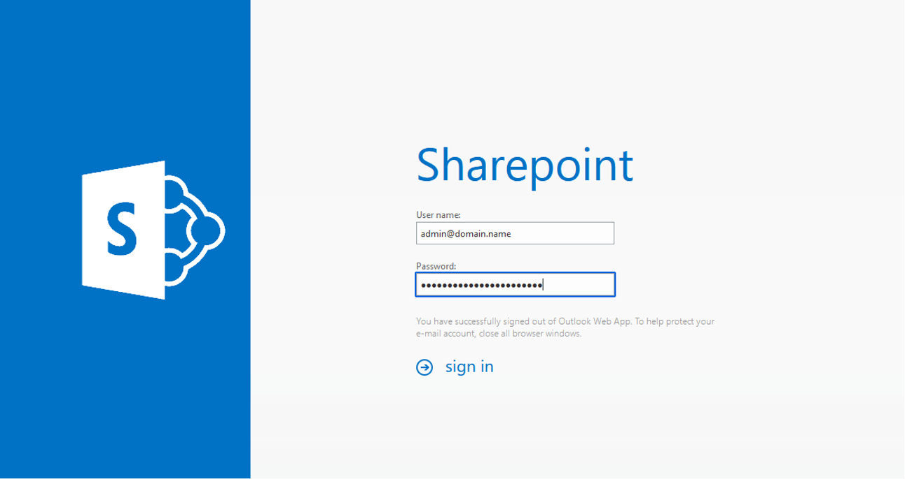
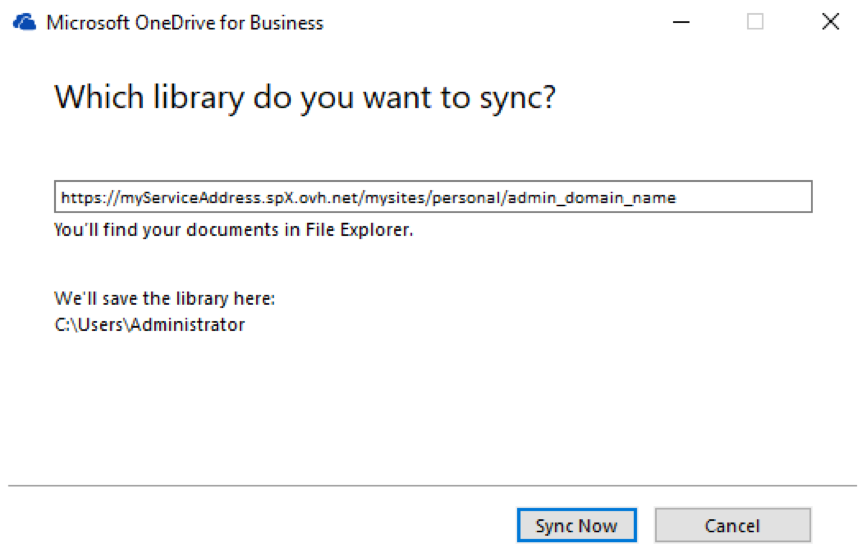

## Ziel

Wenn Sie die Daten Ihrer OVHcloud SharePoint-Plattform abrufen oder migrieren möchten, finden Sie in dieser Anleitung die notwendigen Schritte, um alle Daten in den lokalen Speicher Ihres Computers zu extrahieren.

**Hier erfahren Sie, wie Sie die Daten Ihres OVHcloud SharePoint auf Ihrem Computer sichern.**

## Voraussetzungen

- Sie sind in Ihrem [OVHcloud Kundencenter](https://www.ovh.com/auth/?action=gotomanager&from=https://www.ovh.de/&ovhSubsidiary=de) angemeldet.
- Sie verfügen über eine [OVHcloud SharePoint-Lösung](https://www.ovhcloud.com/de/collaborative-tools/sharepoint/)
- Sie verfügen über einen Computer, der das Betriebssystem Microsoft Windows für die Durchführung der Migrationsschritte verwendet.

## In der praktischen Anwendung

Diese Anleitung gliedert sich in 4 Schritte:

- [Schritt 1 - OneDrive for Business installieren](#installonedrive) : Mit OneDrive for Business können Sie Daten von Ihrem SharePoint auf Ihren Computer übertragen
- [Schritt 2 - Migration über das OVHcloud Kundencenter vorbereiten](#controlpanelconfig) : Konfigurieren Sie Ihre SharePoint-Plattform mit einem einzigen Administrator-Account, der den Inhalt des OneDrive jedes SharePoint-Accounts übertragen kann.
- [Schritt 3 - Starten Sie die Migration über Ihr SharePoint-Interface](#migrationignition) : Melden Sie sich mit dem in Schritt 2 angegebenen Konto an, um den Inhalt auf Ihren Computer zu übertragen.
- [Schritt 4 - Inhalte anderer SharePoint-Konten migrieren](#migrationother) : Führen Sie den Vorgang aus, um den OneDrive-Speicherplatz jedes Kontos auf Ihrer SharePoint-Plattform anzuzeigen und zu synchronisieren.

### Schritt 1 - OneDrive for Business installieren 

Um die Daten Ihres OVHcloud SharePoint-Dienstes zu migrieren, müssen Sie die OneDrive for Business-App verwenden, deren technischer Name „Groove.exe“ lautet.

Befolgen Sie die folgenden Anweisungen, um das Programm zu installieren:

1. ISO-Datei über den Link herunterladen <https://download.mail.ovh.net/sharepoint/onedrive.iso>
2. Klicken Sie auf Ihrem Computer mit der rechten Maustaste auf die Datei `onedrive.iso`, öffnen Sie deren `Eigenschaften`{.action}, aktivieren Sie das Kontrollkästchen `Entsperren`{.action}, klicken Sie auf `Übernehmen`{.action} und dann auf `OK`{.action}.
3. Doppelklicken Sie auf `onedrive.iso`, um es zu öffnen.
4. Doppelklicken Sie auf die Datei `setup.bat`, um die Installation zu starten.
5. Bitte warten Sie, da dies einige Minuten dauern kann. Warten **Sie, bis das Fenster geschlossen** ist, um die Installation abzuschließen.

> [!warning]
>
> Wenn die Datei `setup.bat` nicht korrekt gestartet wird (in Schritt 4), können Sie den Inhalt der Datei `onedrive.iso` in einen Ordner auf dem Desktop Ihres Computers kopieren und Schritt 4 wiederholen.

{.thumbnail}

> [!primary]
>
> Wenn diese Methode auf Ihrem Computer nicht funktioniert, können Sie OneDrive for Business gemäß [der offiziellen Microsoft-Vorgehensweise installieren](https://learn.microsoft.com/sharepoint/install-previous-sync-app#install-groove-exe-with-office-2016).

### Schritt 2 - Migration über das OVHcloud Kundencenter vorbereiten 

Um auf alle OneDrive-Bereiche Ihres SharePoint-Dienstes zuzugreifen, müssen Sie das Administratorrecht für alle Benutzer über Ihr [OVHcloud-Kundencenter entfernen](https://www.ovh.com/auth/?action=gotomanager&from=https://www.ovh.de/&ovhSubsidiary=de).

Gehen Sie in Ihrem Kundencenter in den Bereich `Web Cloud`{.action}. Klicken Sie auf `Microsoft`{.action}, klicken Sie auf `SharePoint`{.action}, und wählen Sie die gewünschte SharePoint-Plattform aus.

Greifen Sie über den Tab `Benutzer`{.action} auf die SharePoint-Kontoführung Ihrer Plattform zu. Klicken Sie für jedes Konto auf den Button `...`{.action} rechts und dann auf `Administratorrechte-Rechte entziehen`{.action}.

{.thumbnail}

Sobald die Administratorrechte für alle SharePoint-Konten entzogen wurden, müssen Sie ein Konto festlegen, das Zugriff auf alle OneDrive-Bereiche der Plattform hat.

Aktivieren Sie die Administratorberechtigung für den angegebenen Account.

Bleiben Sie im Tab `Benutzer`{.action} Ihrer SharePoint-Plattform und klicken Sie auf den Button `...`{.action} rechts neben dem angegebenen Konto und danach auf `Administratorrechte-Rechte aktivieren`{.action}.

{.thumbnail}

Sie können jetzt alle OneDrive-Bereiche Ihrer SharePoint-Plattform über dieses Konto synchronisieren.

### Schritt 3 - Migration über Ihr SharePoint-Interface starten 

Greifen Sie auf das Online-Interface Ihres SharePoint-Dienstes zu. Die Zugangs-URL finden Sie in Ihrem OVHcloud Kundencenter im Tab Allgemeine `Allgemeine Informationen`{.action} unter `URL`.

{.thumbnail}

Melden Sie sich mit den Anmeldeinformationen des Benutzers an, der über Administratorrechte verfügt.

{.thumbnail}

Um zum OneDrive-Abschnitt zu gelangen, klicken Sie auf das Symbol oben links in der SharePoint-Oberfläche und dann auf das `OneDrive`{.action}-Symbol.

{.thumbnail}

Um OneDrive-Inhalte mit Ihrem Computer zu synchronisieren, klicken Sie auf die Schaltfläche `Synchronisieren`{.action} und dann auf Jetzt `synchronisieren`{.action}.

{.thumbnail}

Es wird ein Fenster angezeigt, in dem der Site die Berechtigung zum Öffnen des **grvopen**-Links erteilt wird. Um dies zu erlauben, markieren Sie den Vermerk "Always allow **https://myServiceAddress.spX.ovh.net** to open **grvopen** links" und klicken Sie dann auf `Open Link`{.action}.

{.thumbnail}

Geben Sie die Anmeldeinformationen für das SharePoint-Administratorkonto ein. Bitte verwenden Sie den Benutzer mit Administratorrechten (konfiguriert in [Schritt 2](#controlpanelconfig)).

{.thumbnail}

Klicken Sie auf `Sync Now`{.action}.

{.thumbnail}

Wählen Sie die Bibliotheksvorlage „**Form Templates**“ aus dem Fenster "Select the library you want to sync". Klicken Sie dann auf `Sync selected`{.action}.

{.thumbnail}

Nach Abschluss der Synchronisierung auf dem Computer werden nur die Daten des SharePoint-Kontos, mit dem Sie verbunden sind, auf den Computer übertragen.

**Um den Inhalt der OneDrive-Konten jedes Kontos auf Ihrer SharePoint-Plattform zu übertragen, folgen Sie Schritt 4 unten.**

### Schritt 4 - Inhalte anderer SharePoint-Konten migrieren 

Um auf den OneDrive-Bereich anderer Benutzer Ihrer Plattform zuzugreifen und die zugehörigen Daten zu synchronisieren, müssen Sie die Zugriffs-URL (über Ihren Browser) ändern, wenn Sie beim OneDrive des Administratorkontos angemeldet sind.

Ersetzen Sie hierzu in der angezeigten URL den „Abschnitt“ (für den Benutzer) zwischen den Abschnitten `/personal/` und `/Documents/`.

- **Beispiel 1**: Für einen Benutzer **user@domain.name** müssen die Zeichen „**@**“ und „**.**“ durch „**_**“ ersetzt werden. So erhalten Sie „user_domain_name“. Daher sieht der Link folgendermaßen aus:

{.thumbnail}

- **Beispiel 2**: Für einen Benutzer **john.smith@example.com** wird „john_smith_example_com“ angezeigt. Ihr Link sieht folgendermaßen aus:

{.thumbnail}

> [!warning]
>
> Die obigen URLs dienen nur als Beispiel. Achten Sie darauf, die von Ihrer SharePoint-Plattform generierte URL zu verwenden.

Sie können die folgenden Konten synchronisieren, indem Sie diesen Schritt wiederholen.

## Weiterführende Informationen

[OVHcloud SharePoint aktivieren und verwalten](/pages/web_cloud/email_and_collaborative_solutions/microsoft_sharepoint/sharepoint_manage)

Für spezialisierte Dienstleistungen (Referenzierung, Entwicklung etc.) kontaktieren Sie bitte die [OVHcloud Partner](https://partner.ovhcloud.com/de/directory/).
Wenn Sie Hilfe bei der Verwendung und Konfiguration Ihrer OVHcloud Lösungen benötigen, empfehlen wir Ihnen unsere verschiedenen [Support-Angebote](https://www.ovhcloud.com/de/support-levels/)

Für den Austausch mit unserer User Community gehen Sie auf <https://community.ovh.com/en/>.