**Ultimo aggiornamento: 27/10/2020**

> [!primary]
> Questa traduzione è stata generata automaticamente dal nostro partner SYSTRAN. I contenuti potrebbero presentare imprecisioni, ad esempio la nomenclatura dei pulsanti o alcuni dettagli tecnici. In caso di dubbi consigliamo di fare riferimento alla versione inglese o francese della guida. Per aiutarci a migliorare questa traduzione, utilizza il pulsante "Contribuisci" di questa pagina.
>

## Obiettivo

[La migrazione automatica](/pages/web_cloud/email_and_collaborative_solutions/migrating/migration_omm){.external} di un indirizzo email è possibile tramite il nostro tool [OVH Mail Migrator](https://omm.ovh.net/){.external}. Inoltre, è possibile migrare manualmente il tuo indirizzo email tramite client di posta.

**Questa guida ti mostra come migrare manualmente il tuo indirizzo email.**

> [!warning]
>
> OVHcloud mette a tua disposizione servizi di cui tu sei responsabile per la configurazione e la gestione. Garantirne quotidianamente il corretto funzionamento è quindi responsabilità dell’utente.
>
> Questa guida ti aiuta a eseguire le operazioni necessarie alla configurazione del tuo account. Tuttavia, in caso di difficoltà o dubbi, ti consigliamo di contattare un fornitore specializzato o l’amministratore del servizio. OVHcloud non potrà fornirti alcuna assistenza. Per maggiori informazioni, consulta la sezione "Per saperne di più" di questa guida.
>

## Prerequisiti

- Disporre di un servizio email OVHcloud, come [Exchange](https://www.ovhcloud.com/it/emails/){.external}, [Email Pro](https://www.ovhcloud.com/it/emails/email-pro/){.external} o MX Plan (tramite l'offerta MX Plan o inclusa in un'offerta di [hosting Web OVHcloud](https://www.ovhcloud.com/it/web-hosting/){.external})
- Disporre delle credenziali relative agli account email da migrare
- Disporre delle credenziali relative agli account e-mail OVHcloud che ricevono i dati migrati (gli account di destinazione).

## Procedura

> [!primary]
> Per prima cosa, verifica che la migrazione automatica sia possibile utilizzando il nostro tool [OVH Mail Migrator](https://omm.ovh.net/){.external}. Per effettuare questa operazione, consulta la guida [Migrare account email via OVH Mail Migrator](/pages/web_cloud/email_and_collaborative_solutions/migrating/migration_omm){.external}.

In questa guida abbiamo eseguito le operazioni sui 3 client di posta più utilizzati, **Outlook**, **Mail** su Mac OS e **Thunderbird**.

Le seguenti istruzioni sono suddivise in due parti:

- **L'esportazione**. per estrarre un backup completo del tuo account email e trasferirlo verso un'altra postazione, un client di posta o un altro account. Se è necessario spostare gli elementi da un indirizzo email verso un altro indirizzo configurato sullo stesso client di posta, è possibile copiare/incollare o trascinare/depositare l'uno verso l'altro. Ti consigliamo comunque di utilizzare il sistema di esportazione del software utilizzato.

- **Importazione**. per permetterti di applicare un backup realizzato sulla tua nuova postazione o software. Verifica che il file di backup da importare sia compatibile con il client di posta utilizzato.

### Outlook

Se disponi di un account email [Exchange OVHcloud](https://www.ovhcloud.com/it/emails/hosted-exchange/), è possibile esportarlo direttamente in formato PST dallo Spazio Cliente.

Accedi al tuo [Spazio Cliente OVHcloud](https://www.ovh.com/auth/?action=gotomanager&from=https://www.ovh.it/&ovhSubsidiary=it){.external} e clicca sulla sezione `Web Cloud`{.action}. Seleziona `Microsoft`{.action} e poi `Exchange`{.action}. Clicca sul nome del servizio Hosted Exchange interessato.

Nella scheda `Account email`{.action}, clicca sul pulsante `...`{.action} a destra dell'account da esportare e poi su `Esporta in formato PST`{.action}.

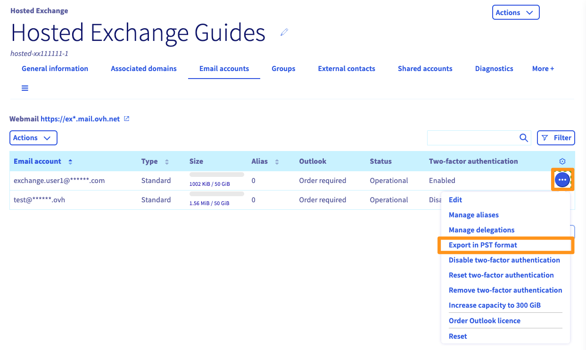{.thumbnail}

Attendi il completamento dell'operazione, che potrebbe richiedere da qualche minuto a diverse ore, in base alla dimensione dell'esportazione. Al termine di questo processo, sarà sufficiente tornare al pulsante `Esporta in formato PST`{.action} per recuperare un link per scaricare il file.

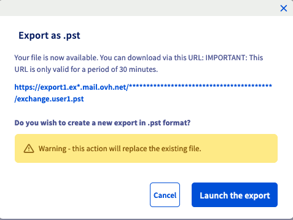{.thumbnail}

#### Esporta da Windows

- Clicca su `file` in alto a sinistra, poi su `Aprire ed esportare` e infine su `importare/esportare`.

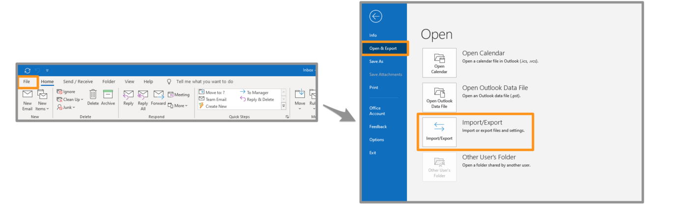{.thumbnail}

- Seleziona `Esporta dati verso un file` e clicca su `Seguente`.

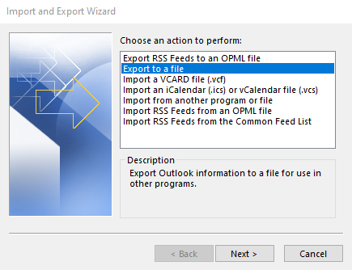{.thumbnail}

- Seleziona `File dati Outlook (.pst)` e clicca su `Seguente`.

{.thumbnail}

- Seleziona il nome dell'account email da esportare.

> [!primary]
> Potete esportare un solo account per volta.

Seleziona `Includi le sottocartelle` e clicca su `Seguente`.

{.thumbnail}

- Scegli la cartella di destinazione del tuo backup e inserisci un nome per quest'ultimo cliccando su `Percorrere`. Seleziona l'opzione che preferisci e clicca su `Terminare`.

{.thumbnail}

L'esportazione del tuo file inizia. Durante la creazione di un file, ti verrà chiesto di definire una password. che è facoltativo.

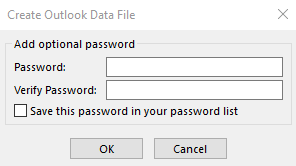{.thumbnail}

#### Importa da Windows

- Clicca su `file` in alto a sinistra, poi su `Aprire ed esportare` e infine su `importare/esportare`.

{.thumbnail}

- Seleziona `Importa da un altro programma o file` e clicca su `Seguente`.

{.thumbnail}

- Seleziona `File dati Outlook (.pst)` e clicca su `Seguente`.

{.thumbnail}

- Seleziona il file di backup cliccando su `Percorri`. Seleziona l'opzione che preferisci e clicca su `Terminare`.

{.thumbnail}

- Se hai impostato una password sul tuo file di backup, inseriscilo e clicca su `OK`.

- Seleziona `Importa gli elementi nella cartella attiva` e clicca su `Terminer`.

L'importazione del tuo backup inizia

#### Esporta da Mac OS

Nella scheda `Strumenti` della tua finestra Outlook, clicca su `Esporta`.

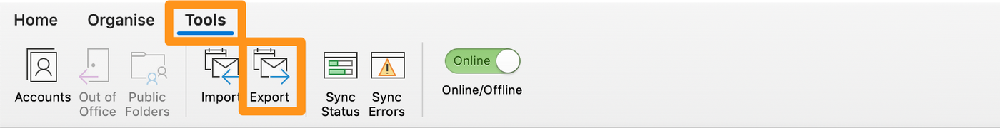{.thumbnail}

Dalla finestra "Esporta verso un file archivio (.olm)", seleziona gli elementi che vuoi aggiungere al tuo file di backup e clicca su `Continua`.

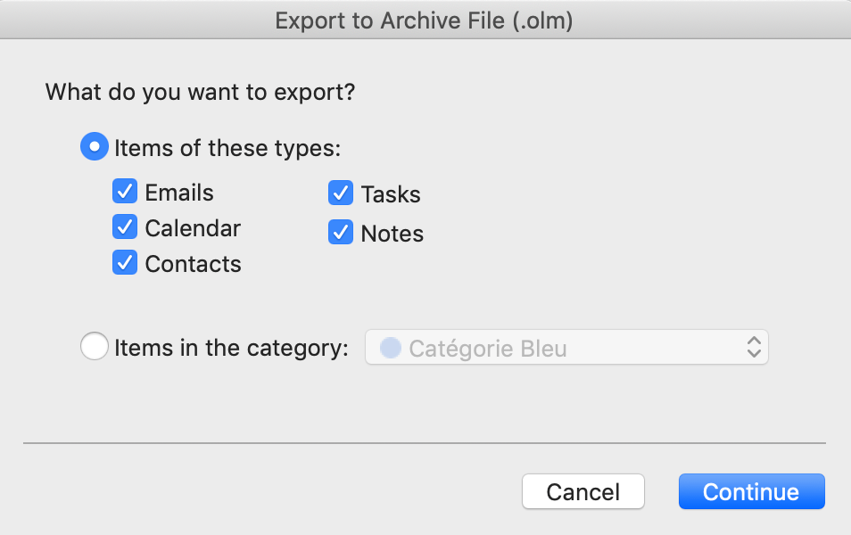{.thumbnail}

Seleziona la cartella di destinazione per il tuo backup e clicca su `Salva`.

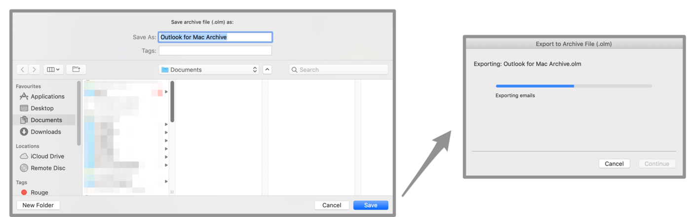{.thumbnail}

Visualizzi una finestra di progressione, clicca su Continua` ` alla fine dell'operazione. Il file di backup è disponibile nella cartella selezionata precedentemente.

#### Importa da Mac OS

Nella scheda `Strumenti` della tua finestra Outlook, clicca su `Importa`.

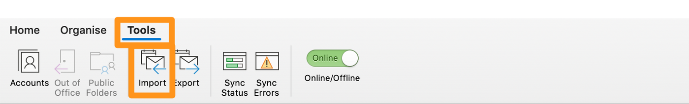{.thumbnail}

Scegli il formato di backup che vuoi importare e clicca su `Continua`.

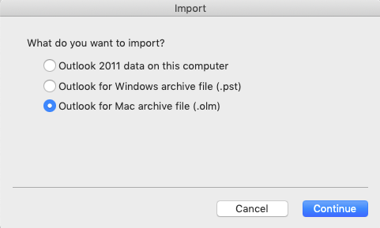{.thumbnail}

Seleziona il file di backup e clicca su `Importa`.

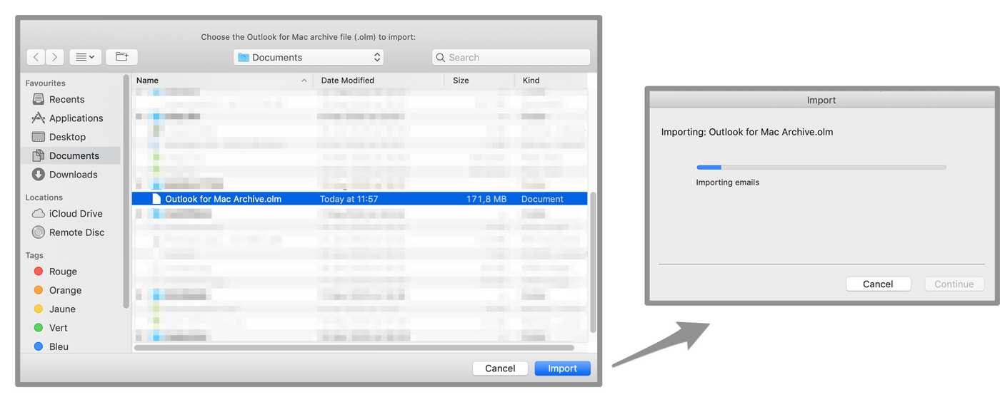{.thumbnail}

Visualizzi una finestra di progressione, clicca su Continua` ` alla fine dell'operazione. Il backup viene poi implementato sul tuo Outlook.

### Email su Mac OS

#### Esportare

Nella colonna di sinistra, seleziona uno o più account email. Clicca sulla `Casella lettere` nel menu orizzontale e poi su `Esporta la cassetta delle lettere`.

{.thumbnail}

Seleziona la cartella scelta o creane una nuova, poi clicca su `Scegli`.

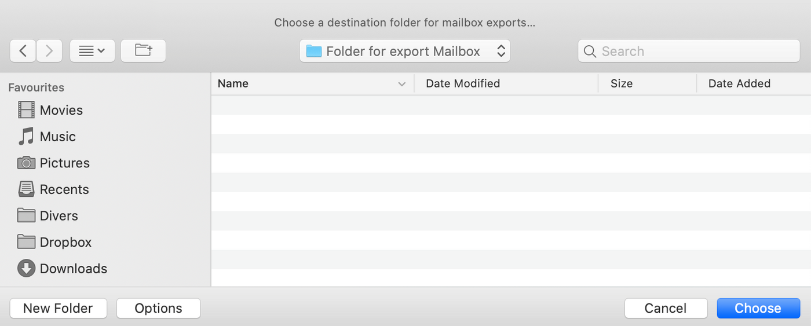{.thumbnail}

La tua esportazione è un file ".mbox".

#### Importare

Clicca su `File` nel menu orizzontale e poi su `Importa cassette delle lettere`.

{.thumbnail}

Seleziona il file di backup in formato ".mbox" e clicca su `Continua`.

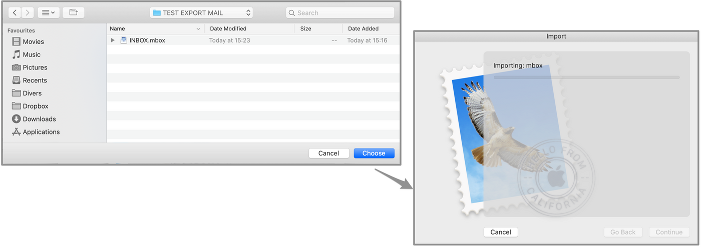{.thumbnail}

Nella colonna di sinistra, le email importate sono contenute in un nuovo account email chiamato "Importazione". Le cartelle e i messaggi possono essere spostati dall'account "Importazione" verso i tuoi account email già configurati. Una volta terminati i trasferimenti, potrai eliminare l'account "Importazione".

### Thunderbird

Al momento non esistono funzionalità native per esportare o importare un account email da Thunderbird. È comunque possibile salvare un profilo Thunderbird. che contiene tutti gli account e le email in locale sul tuo computer. Questa guida ti mostra come salvare un profilo Thunderbird e reinserirlo su una nuova istanza di Thunderbird.

#### Esportare

Dalla finestra principale, clicca sul menu in alto a destra, poi su `Aiuto` e infine su `Informazioni di soccorso`.

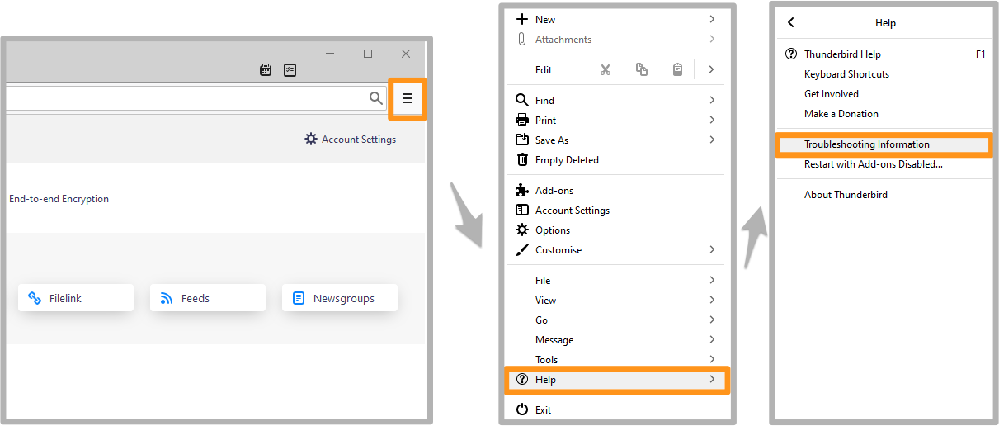{.thumbnail}

Visualizzi una tabella Identifica la linea `Directory del profilo` e clicca sul pulsante `Apri la cartella corrispondente`.

{.thumbnail}

Verrai diretto nella cartella del profilo. Ricollegatevi a una cartella nell'arborescenza.

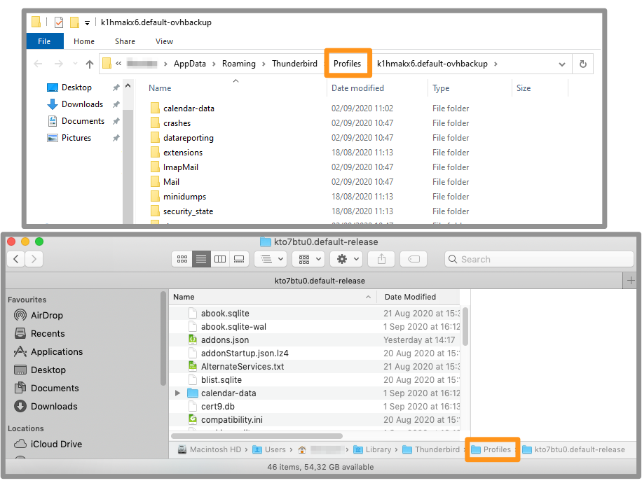{.thumbnail}

Copia la cartella del profilo tramite un click con il tasto destro sul profilo e incolla la cartella nella cartella o supporto di tua scelta.

{.thumbnail}

#### Importare

Anziché importare, si tratterà di un carico di profilo.
Se sull'istanza Thunderbird di destinazione sono già stati configurati account email, questi saranno presenti sul profilo A.
Quando Thunderbird caricerà un nuovo profilo (profilo B), potrà caricare **solo** gli elementi di questo profilo B.
Per questo ti consigliamo di caricare il nuovo profilo (profilo B) e configurare gli account email provenienti dal profilo A.

Per prima cosa è necessario avviare Thunderbird tramite il provider.

- Su Windows, clicca sul menu `Inizia` e poi sul programma `Esegui`. Clicca su `thunderbird.exe -ProfileManager` e clicca su `OK`.

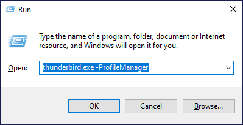{.thumbnail}

- Su Mac OS, avvia l'applicazione Terminal e inserisci la tua applicazione Thunderbird nella finestra del Terminal, aggiungendo alla linea `/Contents/MacOS/thunderbird-bin-ProfileManager`. Clicca sul tasto `Invio` (⏎) per confermare.

{.thumbnail}

Visualizzi una tabella con tutti i profili disponibili. Clicca su `Crea un profilo` e poi su `Seguente` quando visualizzi il messaggio informativo.

{.thumbnail}

Allo step successivo, assegna un nome al tuo profilo e identifica la cartella in cui verrà creato il profilo, sotto la frase "I tuoi parametri utente, preferenze e tutti i tuoi dati personali saranno registrati in":

{.thumbnail}

> [!primary]
> Ti consigliamo di copiare il backup del tuo profilo Thunderbird nella cartella dei profili di Thunderbird.

Clicca su `Seleziona una cartella...` per selezionare la cartella contenente il tuo backup. Clicca su `Terminer` per creare il profilo con il tuo backup.

Puoi trovare la finestra di scelta del tuo profilo con il tuo nuovo profilo selezionato. Clicca su `Avvia Thunderbird`, Thunderbird verrà lanciato con tutti gli elementi presenti nel tuo backup.

### Verifica l'importazione sul nuovo indirizzo email

Verifica che i tuoi elementi siano presenti sul server quando hai effettuato l'operazione giusta seguendo le istruzioni d'importazione.

Accedi alla [Webmail](https://www.ovh.it/mail/).

Nella casella di ricezione e nella colonna di sinistra, troverai le cartelle e le email del tuo indirizzo email salvato.

> [!primary]
> Ti ricordiamo che il tempo di caricamento degli elementi presenti sul tuo computer è limitato al server di posta. L'operazione potrebbe richiedere diversi minuti o diverse ore, in base alla connessione a Internet.

## Per saperne di più

[Migrare un account email con OVH Mail Migrator](/pages/web_cloud/email_and_collaborative_solutions/migrating/migration_omm){.external}

Contatta la nostra Community di utenti all’indirizzo <https://community.ovh.com/en/>.
