## Wprowadzenie

[Automatyczna](/pages/web_cloud/email_and_collaborative_solutions/migrating/migration_omm) migracja konta e-mail jest możliwa przy użyciu narzędzia [OVHcloud Mail Migrator](/links/web/omm). Możesz również ręcznie przenieść Twoje konto e-mail za pomocą programu pocztowego.

**Dowiedz się, jak przenieść ręcznie Twoje konto e-mail.**

> [!warning]
>
> OVHcloud udostępnia różnorodne usługi, jednak to Ty odpowiadasz za ich konfigurację i zarządzanie nimi. Ponosisz więc odpowiedzialność za ich prawidłowe funkcjonowanie.
>
> Oddajemy w Twoje ręce niniejszy przewodnik, którego celem jest pomoc w wykonywaniu bieżących zadań. W przypadku trudności zalecamy skorzystanie z pomocy wyspecjalizowanego webmastera lub kontakt z producentem oprogramowania. Niestety firma OVH nie będzie mogła udzielić wsparcia w tym zakresie. Więcej informacji znajduje się w sekcji "Sprawdź również" niniejszego przewodnika.
>

## Wymagania początkowe

- Posiadanie usługi e-mail w OVHcloud, takiej jak oferta [Exchange](/links/web/emails-exchange), [E-mail Pro](/links/web/email-pro), [Zimbra](/links/web/zimbra) lub MX Plan (w postaci pakietu MX Plan lub w postaci pakietu [hostingowego OVHcloud](/links/web/hosting))
- Posiadanie danych dostępowych do kont e-mail, które chcesz przenieść (konta źródłowe)
- Posiadanie danych dostępowych do kont e-mail OVHcloud, na które przeniesione zostaną dane (konta docelowe)

<!-- CP-NAV-START:web-mx-plan -->
<!-- CP-NAV-START:web-email-pro -->
<!-- CP-NAV-START:web-exchange -->
---

### Dostęp do Panelu klienta OVHcloud

**MX Plan:**

- **Link bezpośredni:** [MX Plan](/links/control-panel/web-mx-plan)
- **Ścieżka nawigacji:** `Web Cloud`{.action} > `MX Plan`{.action} > Wybierz usługę MX Plan

**E-mail Pro:**

- **Link bezpośredni:** [E-mail Pro](/links/control-panel/web-email-pro)
- **Ścieżka nawigacji:** `Web Cloud`{.action} > `E-mail Pro`{.action} > Wybierz platformę

**Exchange:**

- **Link bezpośredni:** [Exchange](/links/control-panel/web-exchange)
- **Ścieżka nawigacji:** `Web Cloud`{.action} > `Exchange`{.action} > Wybierz platformę

---
<!-- CP-NAV-END:web-exchange -->
<!-- CP-NAV-END:web-email-pro -->
<!-- CP-NAV-END:web-mx-plan -->

## W praktyce

> [!primary]
> Sprawdź najpierw, czy automatyczna migracja jest możliwa przy użyciu narzędzia [OVHcloud Mail Migrator](/links/web/omm). W tym celu skorzystaj z przewodnika [Migracja kont e-mail przez OVHcloud Mail Migrator](/pages/web_cloud/email_and_collaborative_solutions/migrating/migration_omm).

W tym przewodniku przeprowadziliśmy operacje na 3 najczęściej używanych programach pocztowych, **Outlook**, **Mail** na Mac OS i **Thunderbird**.

Poniższe instrukcje są podzielone na dwie części:

- **Eksport**. Dzięki temu możesz pobrać kompletną kopię zapasową Twojego konta e-mail, aby przenieść ją na inne konto, program pocztowy lub na inne konto. Jeśli musisz przenieść elementy z jednego konta e-mail na inny adres skonfigurowany w tym samym programie pocztowym, możesz skopiować/wkleić lub przeciągnąć/upuścić jedno do drugiego. Zalecamy użycie systemu eksportu oprogramowania, którego używasz.

- **Import**. Dzięki temu możesz zastosować kopię zapasową utworzoną na Twoim nowym komputerze lub nowym oprogramowaniu. Sprawdź, czy plik kopii zapasowej, który chcesz importować jest kompatybilny z używanym przez Ciebie oprogramowaniem poczty elektronicznej.

### Outlook

Jeśli posiadasz konto e-mail [Exchange OVHcloud](/links/web/emails-hosted-exchange), możesz je wyeksportować bezpośrednio w formacie PST w Panelu klienta.

Po przejściu do strony usługi Exchange, w karcie `Konta e-mail`{.action} kliknij przycisk `...`{.action} po prawej stronie konta e-mail, które chcesz wyeksportować, a następnie wybierz opcję `Eksportuj w formacie PST`{.action}.

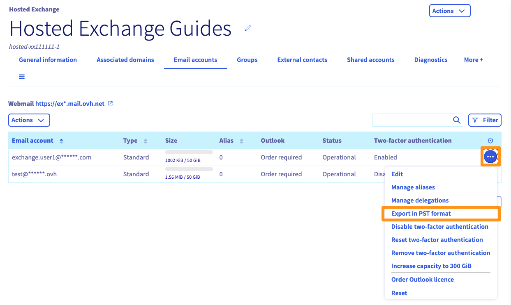{.thumbnail .w-640}

Następnie należy poczekać na eksport, który może trwać od kilku minut do kilku godzin, w zależności od wielkości eksportu. Po zakończeniu operacji wystarczy powrócić do przycisku `Eksportuj w formacie PST`{.action}, aby pobrać link do pobrania pliku.

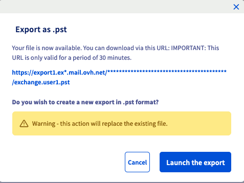{.thumbnail .w-640}

#### Windows

> [!tabs]
> **Eksport**
>>
>> - Kliknij `Plik`{.action} w lewym górnym rogu, a następnie `Otwórz i wyeksportuj`{.action}, a następnie wybierz `Import/Eksport`{.action}.
>>
>> 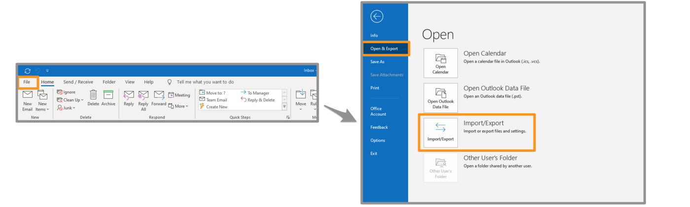{.thumbnail .w-640}
>>
>> - Wybierz `Eksportuj dane do pliku`{.action}, po czym kliknij `Dalej`{.action}.
>>
>> 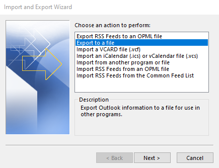{.thumbnail .w-640}
>>
>> - Wybierz `Plik danych Outlook (.pst)`{.action} i kliknij `Dalej`{.action}.
>>
>> 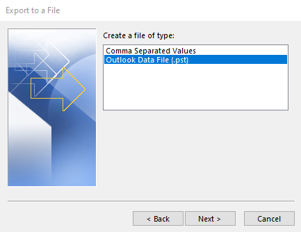{.thumbnail .w-640}
>>
>> - Wybierz nazwę konta e-mail, które chcesz wyeksportować.
>>
>> > [!primary]
>> > Możesz wyeksportować tylko jedno konto jednocześnie.
>>
>> Zaznacz dobrze `Dodaj podkatalogi`{.action}, a następnie kliknij `Dalej`{.action}.
>>
>> 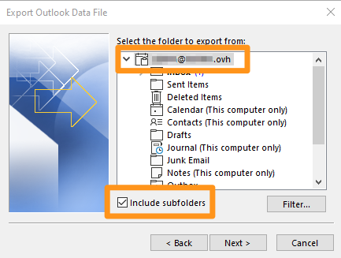{.thumbnail .w-640}
>>
>> - Wybierz docelowy folder kopii zapasowej i podaj nazwę kopii zapasowej klikając `Przeglądaj`{.action}. Wybierz odpowiednią opcję i kliknij `Zakończ`{.action}.
>>
>> 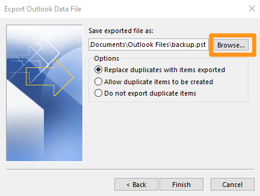{.thumbnail .w-640}
>>
>> Rozpoczyna się eksport pliku. Podczas tworzenia pliku zostaniesz poproszony o określenie hasła. Jest on opcjonalny.
>>
>> 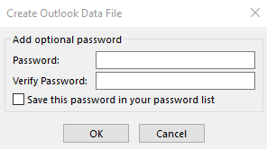{.thumbnail .w-640}
>>
> **Import**
>>
>> - Kliknij `Plik`{.action} w lewym górnym rogu, a następnie `Otwórz i wyeksportuj`{.action}, a następnie wybierz `Import/Eksport`{.action}.
>>
>> {.thumbnail .w-640}
>>
>> - Wybierz `Importuj z innego programu lub pliku`{.action}, a następnie kliknij `Dalej`{.action}.
>>
>> 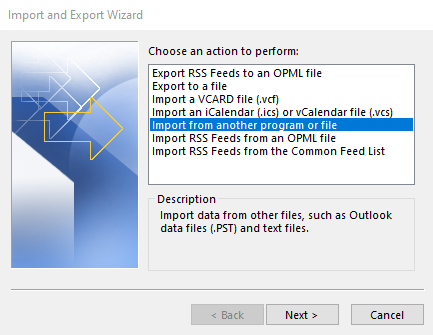{.thumbnail .w-640}
>>
>> - Wybierz `Plik danych Outlook (.pst)`{.action} i kliknij `Dalej`{.action}.
>>
>> 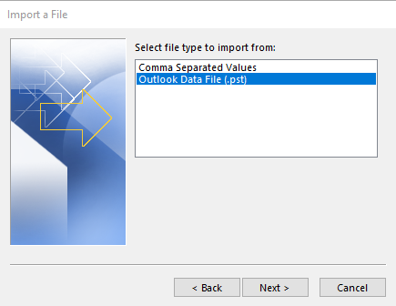{.thumbnail .w-640}
>>
>> - Wybierz plik kopii zapasowej, klikając `Przeglądaj`{.action}. Wybierz odpowiednią opcję i kliknij `Zakończ`{.action}.
>>
>> 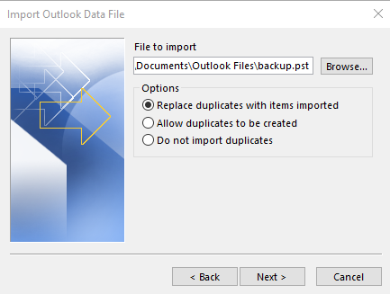{.thumbnail .w-640}
>>
>> - Jeśli ustaliłeś hasło do pliku kopii zapasowej, wprowadź je i kliknij `OK`{.action}.
>>
>> - Wybierz `Importuj elementy do aktywnego folderu`{.action}, a następnie kliknij `Zakończ`{.action}.
>>
>> Rozpoczyna się import kopii zapasowej.

#### Mac OS

> [!tabs]
> **Eksport**
>>
>> W zakładce `Narzędzia`{.action} w oknie Outlook kliknij `Eksportuj`{.action}.
>>
>> 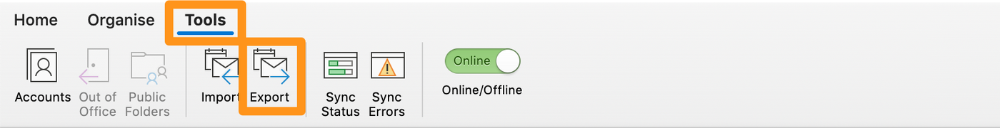{.thumbnail .w-640}
>>
>> W oknie "Eksport do pliku archiwum (.olm)" zaznacz elementy, które chcesz dodać do pliku kopii zapasowej, następnie kliknij `Dalej`{.action}.
>>
>> 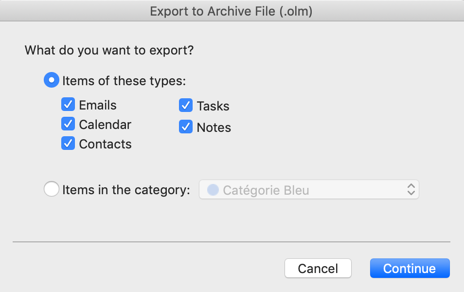{.thumbnail .w-640}
>>
>> Następnie wybierz docelowy folder dla kopii zapasowej, a następnie kliknij `Zapisz`{.action}.
>>
>> 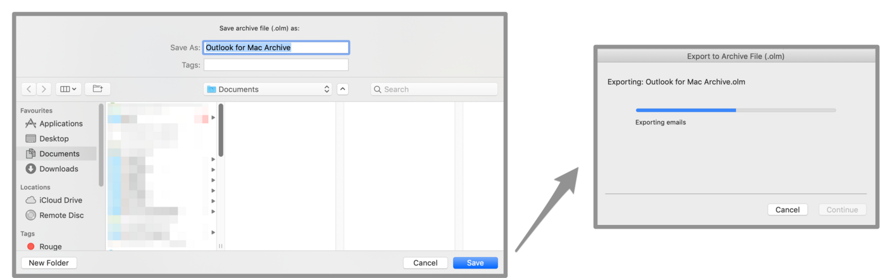{.thumbnail .w-640}
>>
>> Pojawi się okno postępu, kliknij `Dalej`{.action} po zakończeniu operacji. Twój plik kopii zapasowej znajdziesz w wybranym wcześniej katalogu.
>>
> **Import**
>>
>> W zakładce `Narzędzia`{.action} w oknie Outlook kliknij `Importuj`{.action}.
>>
>> 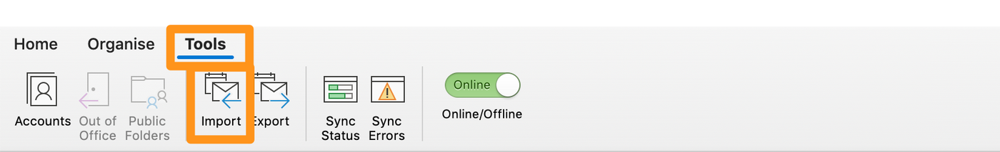{.thumbnail .w-640}
>>
>> Wybierz format kopii zapasowej, którą chcesz importować, a następnie kliknij `Dalej`{.action}.
>>
>> 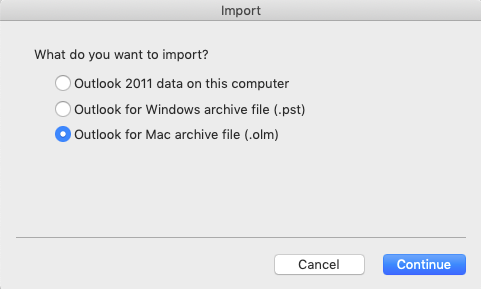{.thumbnail .w-640}
>>
>> Wybierz Twój plik kopii zapasowej, po czym kliknij `Importuj`{.action}.
>>
>> 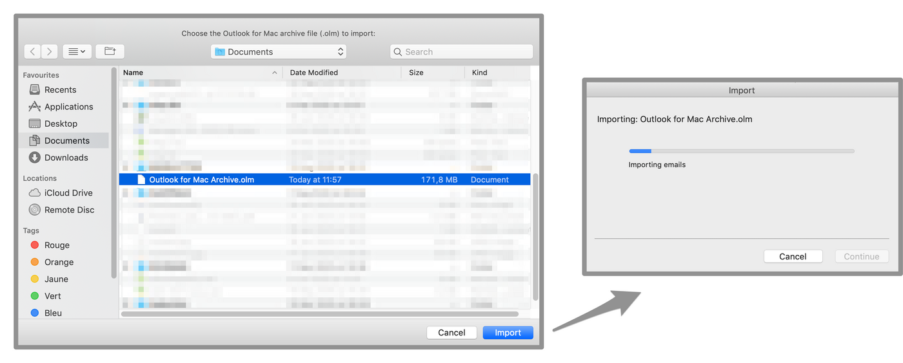{.thumbnail .w-640}
>>
>> Pojawi się okno postępu, kliknij `Dalej`{.action} po zakończeniu operacji. Twoja kopia zapasowa jest wdrażana w programie Outlook.

### Mail na Mac OS

> [!tabs]
> **Eksport**
>>
>> W kolumnie z lewej strony wybierz jedno lub kilka kont e-mail. Kliknij `Skrzynka na listy`{.action} w menu poziomym, a następnie kliknij `Eksportuj skrzynkę na listy`{.action}.
>>
>> 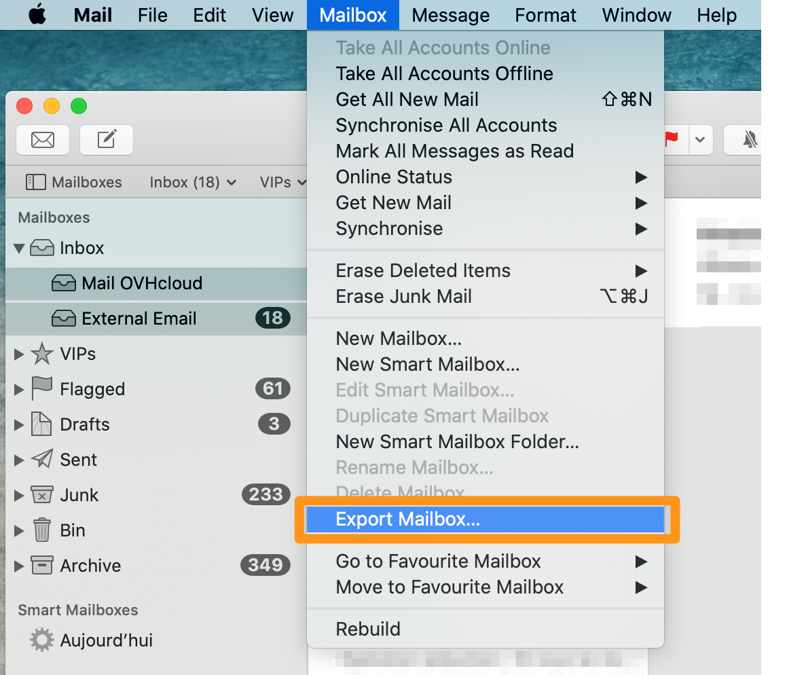{.thumbnail .w-640}
>>
>> Wybierz lub utwórz nowy folder, następnie kliknij `Wybierz`{.action}.
>>
>> 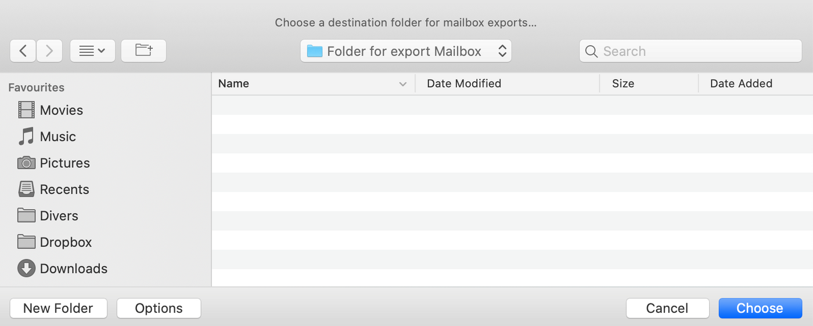{.thumbnail .w-640}
>>
>> Twój eksport to plik ".mbox".
>>
> **Import**
>>
>> Kliknij `Plik`{.action} w menu poziomym, a następnie kliknij `Importuj skrzynki na listy`{.action}.
>>
>> 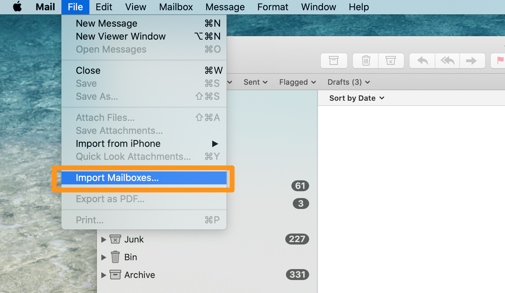{.thumbnail .w-640}
>>
>> Wybierz plik kopii zapasowej w formacie.mbox, po czym kliknij `Dalej`{.action}.
>>
>> 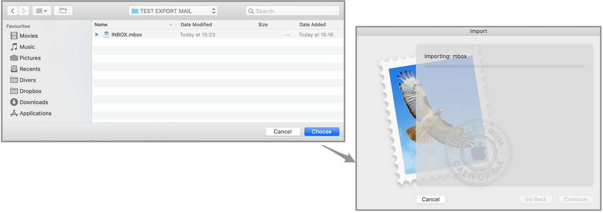{.thumbnail .w-640}
>>
>> Z lewej strony, importowane e-maile znajdują się na nowym koncie e-mail o nazwie "Import". Możesz przeciągnąć foldery i wiadomości z konta "Import" na Twoje skonfigurowane konta e-mail. Po zakończeniu transferu będziesz mógł usunąć konto "Import".

### Thunderbird

Aktualnie nie istnieje funkcjonalność umożliwiająca eksportowanie lub importowanie konta e-mail z Thunderbird. Można jednak zapisać profil Thunderbirda. Zawiera ona wszystkie konta i e-maile znajdujące się lokalnie na Twoim komputerze. Zobaczymy, jak zapisać profil Thunderbird i ponownie włączyć go do nowej instancji Thunderbird.

> [!tabs]
> **Eksport**
>>
>> W oknie głównym kliknij menu w prawym górnym rogu, następnie `Pomoc`{.action}, a następnie `Informacje dotyczące rozwiązywania problemów`{.action}.
>>
>> 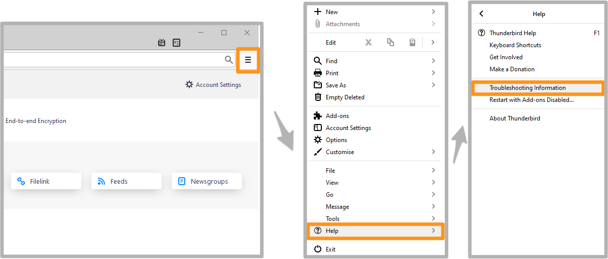{.thumbnail .w-640}
>>
>> Pojawi się tabela. Wyszukaj linię `Katalog Profilowy`{.action} i kliknij przycisk `Otwórz odpowiedni katalog`{.action}.
>>
>> 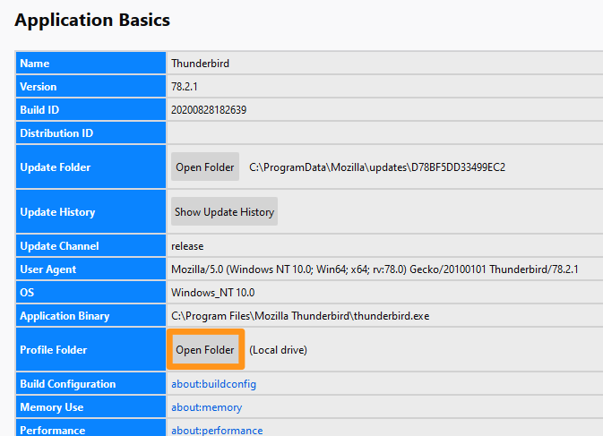{.thumbnail .w-640}
>>
>> Zostaniesz przekierowany do folderu profilu. Przejdź z folderu do drzewa.
>>
>> 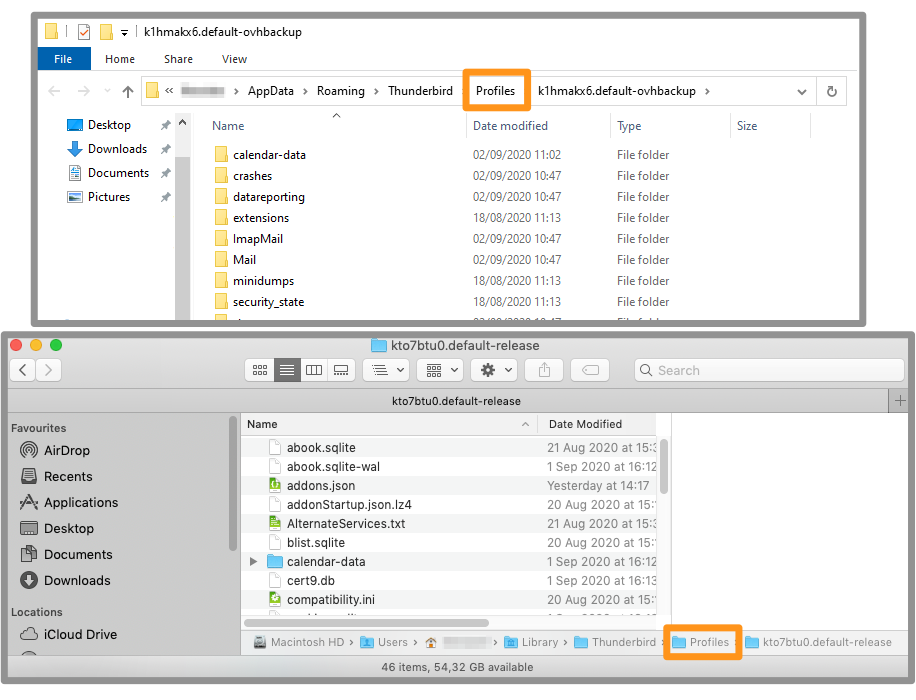{.thumbnail .w-640}
>>
>> Skopiuj folder profilu za pomocą prawego przycisku myszy, a następnie wklej ten folder do wybranego folderu lub pomocy.
>>
>> 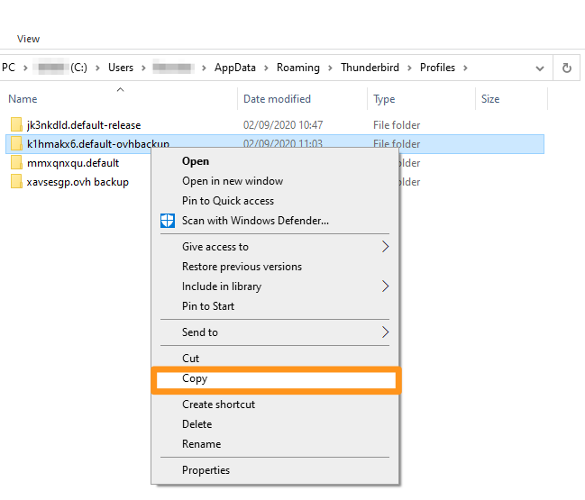{.thumbnail .w-640}
>>
> **Import**
>>
>> Zamiast importowania, będzie tu o ładowanie profilu.
>> Jeśli konta e-mail zostały już skonfigurowane w docelowej instancji Thunderbird, zostaną one wyświetlone w profilu A.
>> Gdy Thunderbird załaduje nowy profil (profil B), może załadować **tylko** elementy tego profilu B.
>> Dlatego zalecamy załadowanie najpierw nowego profilu (profil B), a następnie skonfigurowanie kont e-mail pochodzących z profilu A.
>>
>> Najpierw należy uruchomić Thunderbird za pomocą menedżera profili.
>>
>> - W systemie Windows przejdź do menu `Start`{.action}, a następnie do programu `Uruchom`{.action}. Wpisz `thunderbird.exe -ProfileManager` i kliknij `OK`{.action}.
>>
>> 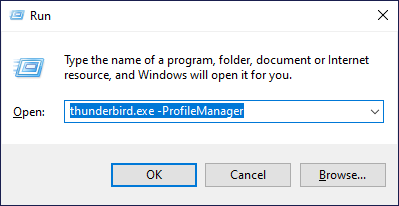{.thumbnail .w-640}
>>
>> - W systemie Mac OS uruchom aplikację Terminal i przeciągnij i upuść aplikację Thunderbird w oknie terminala, dodając ją do linii `/Contents/MacOS/thunderbird-bin -ProfileManager`. Wpisz przycisk `Enter` (⏎), aby zatwierdzić.
>>
>> 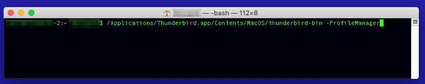{.thumbnail .w-640}
>>
>> W następnym oknie wyświetlą się istniejące profile. Kliknij `Utwórz profil`{.action}, a następnie `Dalej`{.action}, gdy pojawi się komunikat informacyjny.
>>
>> 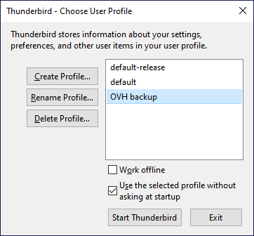{.thumbnail .w-640}
>>
>> Na następnym etapie nadaj nazwę profilowi i podaj folder, w którym utworzony zostanie profil, poniżej zdania "Twoje ustawienia użytkownika, preferencje i wszystkie dane osobowe będą zapisane w":
>>
>> 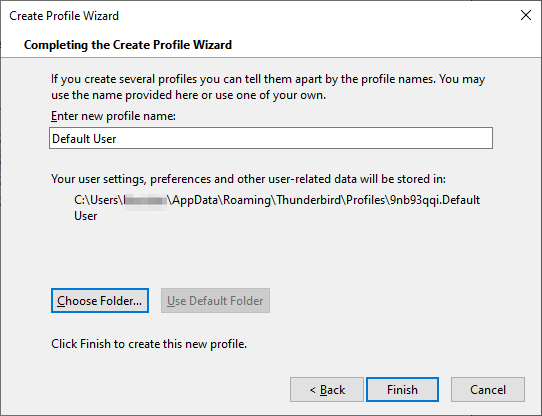{.thumbnail .w-640}
>>
>> > [!primary]
>> > Zalecamy skopiowanie kopii zapasowej Twojego profilu Thunderbird do folderu z profilami Thunderbirda.
>>
>> Kliknij `Wybierz katalog...`{.action} aby wybrać folder z kopią zapasową. Kliknij `Zakończ`{.action}, aby utworzyć profil z kopii zapasowej.
>>
>> Okno wyboru profilu znajdziesz w nowym, wybranym profilu. Kliknij `Uruchom Thunderbird`{.action}, Thunderbird zostanie uruchomiony z wszystkimi elementami, które posiadasz w kopii zapasowej.

### Sprawdź import na nowy adres e-mail

Po wykonaniu czynności zgodnie z instrukcjami dotyczącymi importu sprawdź, czy Twoje dane są zainstalowane na serwerze.

Zaloguj się do [interfejsu Webmail](/links/web/email).

foldery i e-maile zapisane adresu e-mail znajdziesz w skrzynce odbiorczej oraz w kolumnie z lewej strony.

> [!primary]
> Pamiętaj, że po upływie tego czasu elementy zainstalowane na Twoim komputerze muszą zostać przesłane na serwer e-mail. Może to potrwać kilka minut lub godzin, w zależności od połączenia z Internetem.

## Sprawdź również

[Przeniesienie kont e-mail za pomocą OVHcloud Mail Migrator](/pages/web_cloud/email_and_collaborative_solutions/migrating/migration_omm)

Dołącz do [grona naszych użytkowników](/links/community).
