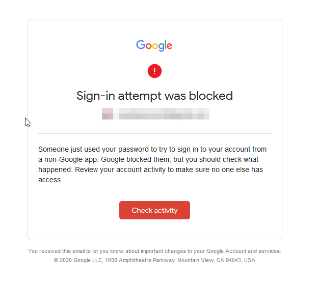
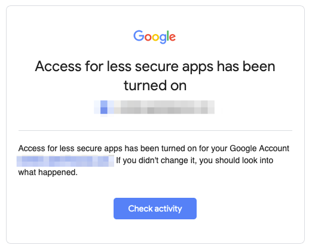
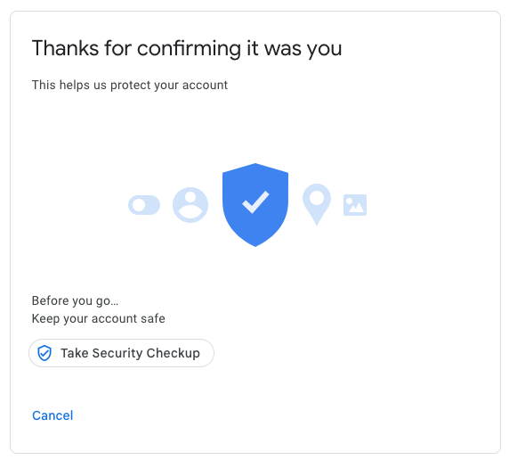

## Objectif

Ce guide vous détaille comment activer l'option "autoriser les applications moins sécurisées" sur votre compte Gmail.

> [!primary]
> 
> Cette documentation est une étape liée au guide [«Migrer un compte Gmail vers une adresse e-mail OVHcloud via OVH Mail Migrator»](/pages/web_cloud/email_and_collaborative_solutions/migrating/migrate_gmail_to_ovhcloud_by_omm){.external}
> 

## En pratique

Si vous avez reçu l'e-mail ci-dessous avec l'objet **«Alerte de sécurité critique»**. Cliquez sur `Consulter l'activité`{.action}.

{.thumbnail}

Le message ci-dessous apparaît et mentionne les détails sur la tentative d'utilisation d'un protocole hors application Google. Cliquez sur `Oui, c'était moi`{.action}

{.thumbnail}

La fenêtre suivante vous informe que, malgré cette validation, un blocage est actif. Cliquez directement sur le lien suivant : [myaccount.google.com/lesssecureapps](https://myaccount.google.com/lesssecureapps){.external}

{.thumbnail}

Cliquez sur le bouton à droite de la mention «Paramètre "Autoriser les applications moins sécurisées" désactivé» (voir ci-dessous).

{.thumbnail}

Un nouvel e-mail vous sera envoyé avec le même objet «Alerte de sécurité critique». Cliquez sur `Consulter l'activité`{.action}.

{.thumbnail}

Ce message a pour but de vérifier que vous êtes bien à l'initiative de cette activation. Cliquez sur `Oui, c'était moi`{.action}.

{.thumbnail}

Après validation, le message ci-dessous indique que votre choix a bien été pris en compte. Vous pouvez à présent vous connecter à votre compte Gmail en dehors des applications Google.

{.thumbnail}

> [!warning]
>
> Le mot de passe de votre compte Gmail doit comporter un minimum de 16 caractères, et ainsi être considéré comme un « mot de passe d'application ». En effet, lorsque vous « autorisez les applications moins sécurisées », il est nécessaire qu'un mot de passe fort soit appliqué sur votre compte Gmail.
>
> {.thumbnail}
>

## Aller plus loin

[«Migrer une adresse Gmail vers une adresse e-mail OVHcloud via OVH Mail Migrator »](/pages/web_cloud/email_and_collaborative_solutions/migrating/migrate_gmail_to_ovhcloud_by_omm){.external}

