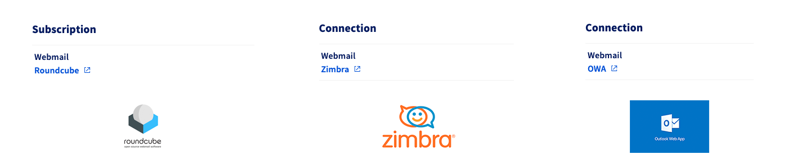
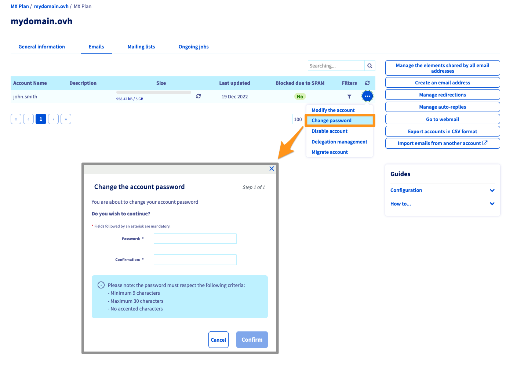
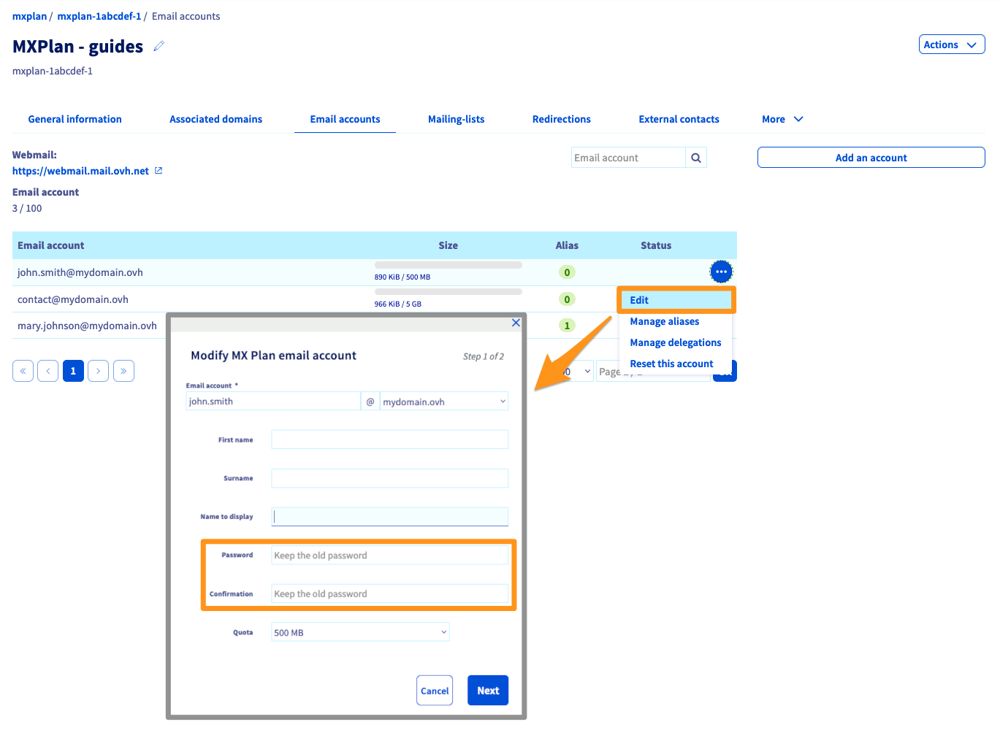
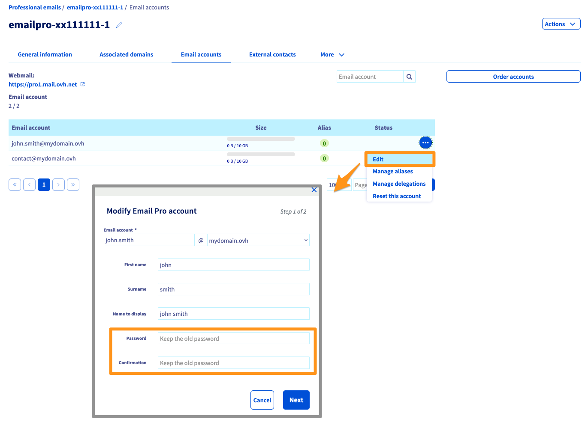
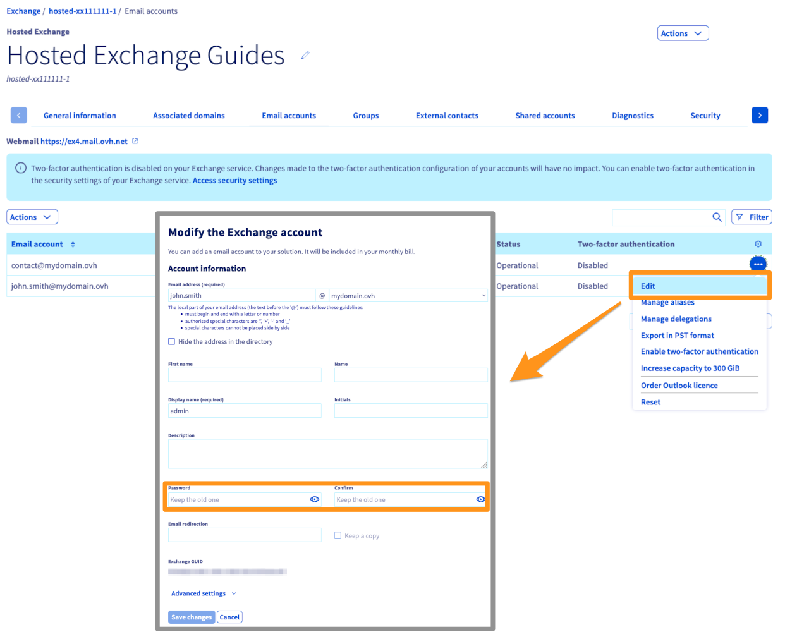
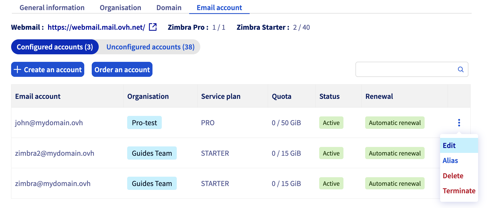
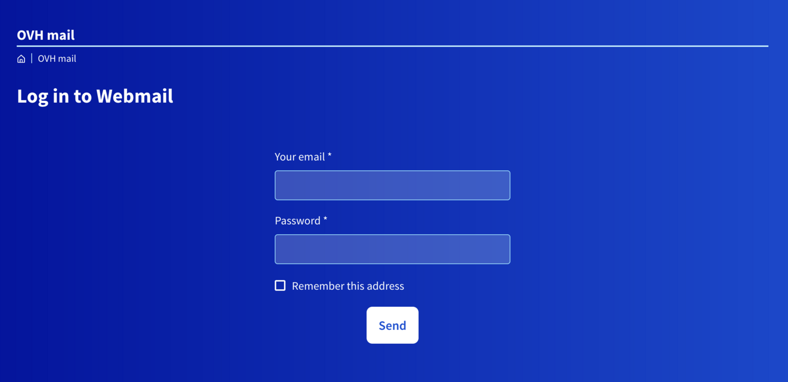
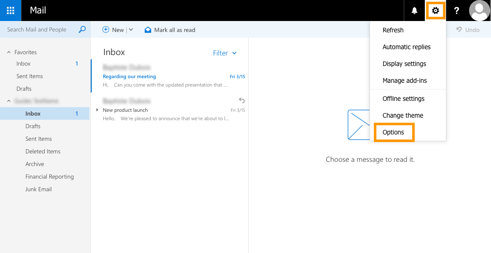
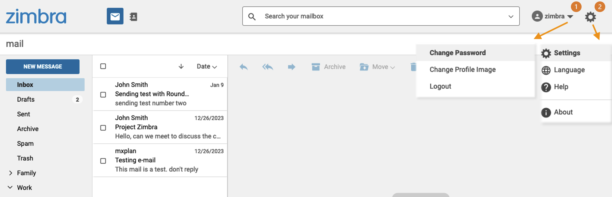

## Obiettivo

Gli account email del servizio OVHcloud sono accessibili tramite la password associata. La modifica può essere effettuata in 2 modi diversi a seconda del servizio di posta:

- Dalla Webmail
- Dallo Spazio Cliente

**Questa guida ti mostra come modificare la password di un indirizzo email OVHcloud.**

## Prerequisiti

- Disporre di una soluzione email OVHcloud precedentemente configurata, tra le seguenti:
    - **MX Plan** proposta con le nostre [offerte di hosting Web](/links/web/hosting) o inclusa in un [hosting gratuito 100M](/links/web/domains-free-hosting).
    - [Exchange](/links/web/emails-exchange).
    - [Email Pro](/links/web/email-pro).
    - [Zimbra](/links/web/emails-zimbra).

<!-- CP-NAV-START:web-mx-plan -->
<!-- CP-NAV-START:web-zimbra -->
<!-- CP-NAV-START:web-email-pro -->
<!-- CP-NAV-START:web-exchange -->
---

### Accesso allo Spazio Cliente OVHcloud

**MX Plan:**

- **Link diretto:** [MX Plan](/links/control-panel/web-mx-plan)
- **Percorso di navigazione:** `Web Cloud`{.action} > `MX Plan`{.action} > Seleziona il tuo servizio MX Plan

**Zimbra:**

- **Link diretto:** [Zimbra](/links/control-panel/web-zimbra)
- **Percorso di navigazione:** `Web Cloud`{.action} > `Zimbra Mail`{.action} > Seleziona il tuo servizio Zimbra

**Email Pro:**

- **Link diretto:** [Email Pro](/links/control-panel/web-email-pro)
- **Percorso di navigazione:** `Web Cloud`{.action} > `Email Pro`{.action} > Seleziona la tua piattaforma

**Exchange:**

- **Link diretto:** [Exchange](/links/control-panel/web-exchange)
- **Percorso di navigazione:** `Web Cloud`{.action} > `Exchange`{.action} > Seleziona la tua piattaforma

---
<!-- CP-NAV-END:web-exchange -->
<!-- CP-NAV-END:web-email-pro -->
<!-- CP-NAV-END:web-zimbra -->
<!-- CP-NAV-END:web-mx-plan -->

## Procedura

> [!primary]
>
> Quando modifichi la password del tuo indirizzo email, sarà necessario apportare la stessa modifica su tutti i dispositivi su cui è stato configurato l'indirizzo email. Consulta le nostre guide di configurazione per il tuo client di posta dalla homepage del tuo servizio di posta.

### Modifica la password dallo Spazio Cliente OVH 

> [!warning]
>
> Per motivi di sicurezza, ti consigliamo di non utilizzare due volte la stessa password, sceglierne una che non ha alcun rapporto con le tue informazioni personali (ad esempio, eviti le indicazioni del tuo cognome, nome e data di nascita) e rinnovarla regolarmente.

> [!primary]
>
> **Identificare la tecnologia di posta elettronica della soluzione MX Plan.**
>
> In base alla data di attivazione del servizio MX Plan o a una migrazione recente, la tecnologia di posta associata potrebbe variare. Questa versione è caratterizzata dall'interfaccia della sua Webmail. Per identificarlo:
>
> - Nella scheda `Informazioni generali`{.action}, rileggi la tecnologia utilizzata sotto la dicitura **Webmail** presente nel riquadro `Abbonamento`{.action} o `Webmail`{.action}.
>
> {.thumbnail .w-500}

Segui le indicazioni fornite:

> [!tabs]
> **Email MX Plan (versione storica)**
>>
>> Se non ricordi il tipo di offerta MX Plan, consulta il paragrafo [Identifica la tua offerta MX Plan](#whichmxplan). 
>> Clicca su `MX Plan`{.action} e poi seleziona il nome del servizio MX Plan. Clicca sulla scheda `Email`{.action}. Visualizzi una finestra con tutti gli account email esistenti.  
>> Clicca sul pulsante `...`{.action} e poi su `Modifica la password`{.action}.  
>>{.thumbnail} 
>>
> **Email MX Plan (nuova versione)**
>>
>> Se non ricordi il tipo di offerta MX Plan, consulta il paragrafo [Identifica la tua offerta MX Plan](#whichmxplan). 
>> Clicca su `MX Plan`{.action} e poi seleziona il nome del servizio MX Plan. Clicca sulla scheda `Email`{.action}. Visualizzi una finestra con tutti gli account email esistenti.  
>> Clicca sul pulsante `...`{.action} e poi su `Modifica`{.action}.  
>>{.thumbnail} 
>>
> **Email Pro**
>>
>> Clicca su `Email Pro`{.action} e seleziona il nome della piattaforma. Clicca sulla scheda `Account email`{.action}. Visualizzi una finestra con tutti gli account email esistenti. 
>> Clicca sul pulsante `...`{.action} e poi su `Modifica`{.action}.  
>>{.thumbnail} 
>>
> **Exchange**
>>
>> Clicca su `Microsoft`{.action} / `Exchange`{.action} e poi seleziona il nome della piattaforma. Clicca sulla scheda `Account email`{.action}. Visualizzi una finestra con tutti gli account email esistenti. 
>> Clicca sul pulsante `...`{.action} e poi su `Modifica`{.action}.  
>>{.thumbnail} 
>>
> **Zimbra**
>>
>> Clicca su `Zimbra Mail`{.action} e clicca sulla scheda `Account email`{.action}. Visualizzi una finestra con tutti gli account email esistenti.  
>> Clicca sul pulsante `...`{.action} e poi su `Modifica`{.action}.  
>>{.thumbnail} 
>>

### Modifica la password dalla Webmail

La modifica della password tramite la Webmail è disponibile per le soluzioni email OVHcloud che utilizzano **OWA** (**O**utlook **W**eb **A**pp):

- MX Plan OWA
- Email Pro
- Exchange
- MX Plan Zimbra
- Zimbra Starter / Pro

> [!warning]
>
> Per l'offerta **MX Plan Roundcube**, la modifica della password avviene esclusivamente [dallo Spazio Cliente](#controlpanel).
>

#### OWA

<iframe class="video" width="560" height="315" src="https://www.youtube-nocookie.com/embed/msmUN7cLSNI" title="YouTube video player" frameborder="0" allow="accelerometer; autoplay; clipboard-write; encrypted-media; gyroscope; picture-in-picture" allowfullscreen></iframe>

Accedi alla pagina [Webmail](/links/web/email), inserisci le tue credenziali e clicca sul pulsante `Connessione`{.action}.

{.thumbnail}

Clicca sul pulsante <i class="icons-gear-concept icons-masterbrand-blue"></i>in alto e poi su `Opzioni`{.action}.

{.thumbnail}

Apri la sezione “Generale” nella colonna di sinistra, clicca su Il `mio account`{.action} e seleziona ` Modifica la password`{.action}.

{.thumbnail}

Si apre una finestra: inserisci prima la password corrente e poi quella nuova, confermala e infine clicca su `Salva`{.action}.

> [!primary]
>
> Se imposti una nuova password per il tuo account, sarà necessario apportare la stessa modifica su tutti i dispositivi su cui l’account email è stato configurato.
>

{.thumbnail}

#### Zimbra

Accedi alla pagina [Webmail](/links/web/email). Inserisci il tuo indirizzo e-mail e la password, poi clicca su `Connessione`{.action}.

Clicca sul nome del tuo account email nell’angolo in alto a destra. Da questo menu è possibile `Modificare la password`{.action}.

{.thumbnail}

### Recupera una password

Per motivi di sicurezza e riservatezza non è possibile **recuperare** una password. Come descritto nei passaggi precedenti, è necessario reimpostare la password nel caso in cui non sia più nota.

> [!primary]
>
> Se vuoi salvare una password, ti consigliamo di utilizzare un gestore di password come **Keepass** ad esempio.

## Per saperne di più 

[Iniziare a utilizzare la soluzione MX Plan](/pages/web_cloud/email_and_collaborative_solutions/mx_plan/email_generalities)

[Iniziare a utilizzare la soluzione Email Pro](/pages/web_cloud/email_and_collaborative_solutions/email_pro/first_config)

[Iniziare a utilizzare la soluzione Hosted Exchange](/pages/web_cloud/email_and_collaborative_solutions/microsoft_exchange/exchange_starting_hosted)

[Iniziare a utilizzare la soluzione Zimbra](/pages/web_cloud/email_and_collaborative_solutions/mx_plan/email_zimbra)

Per usufruire di un supporto per l'utilizzo e la configurazione delle soluzioni OVHcloud, consulta le nostre [soluzioni di supporto](/links/support).

Contatta la nostra [Community di utenti](/links/community).
