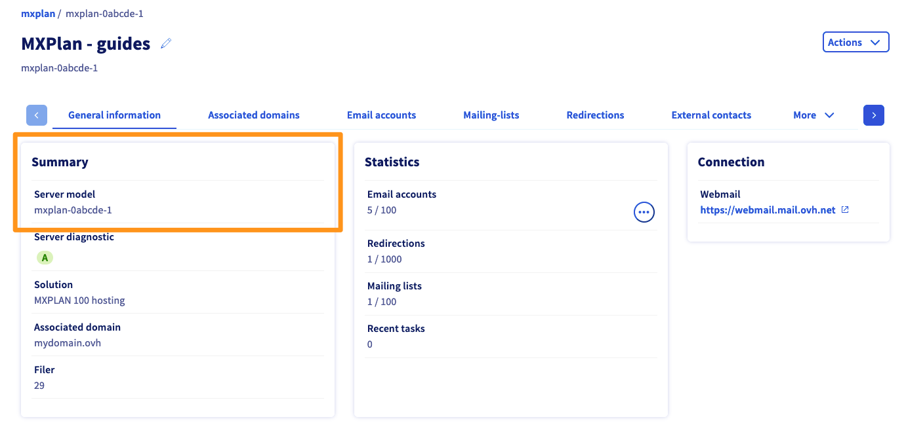
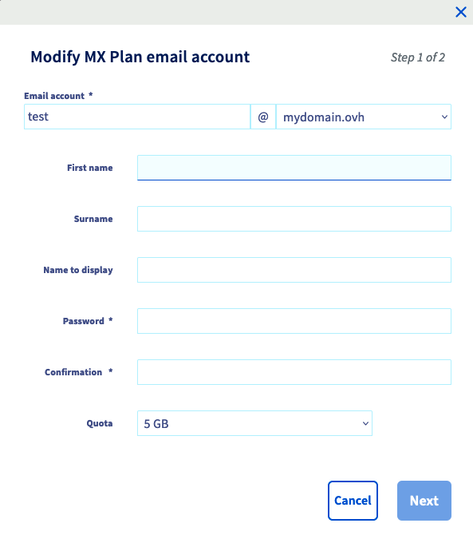
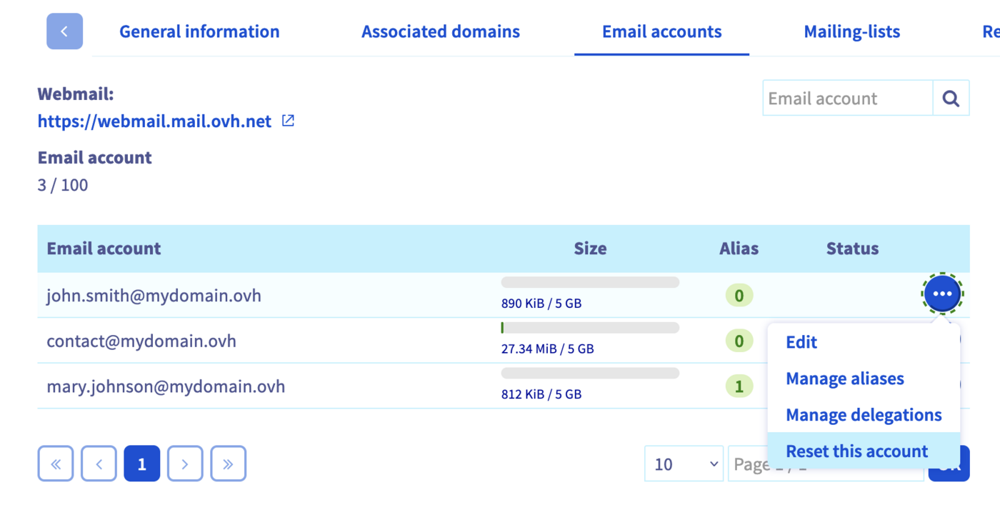

> [!primary]
> Esta traducción ha sido generada de forma automática por nuestro partner SYSTRAN. En algunos casos puede contener términos imprecisos, como en las etiquetas de los botones o los detalles técnicos. En caso de duda, le recomendamos que consulte la versión inglesa o francesa de la guía. Si quiere ayudarnos a mejorar esta traducción, por favor, utilice el botón «Contribuir» de esta página.
>

**Última actualización: 07/10/2022**

## Objetivo

La solución MX Plan le permite disfrutar de direcciones de correo asociadas a un dominio.

**Esta guía explica cómo crear una dirección de correo electrónico en un MX Plan.**

## Requisitos

- Tener una solución MX Plan (incluida en un [plan de hosting de OVHcloud](https://www.ovhcloud.com/es/web-hosting/){.external}).
- Estar conectado al [área de cliente de OVHcloud](https://ca.ovh.com/auth/?action=gotomanager&from=https://www.ovh.com/world/&ovhSubsidiary=ws){.external}, en la sección `Web Cloud`{.action}.

## Procedimiento 

Para ello, conéctese al [área de cliente de OVHcloud](https://ca.ovh.com/auth/?action=gotomanager&from=https://www.ovh.com/world/&ovhSubsidiary=ws){.external}, en la sección `Web Cloud`{.action}. Haga clic en `Correo electrónico`{.action}.

### Acceder a la gestión del servicio de correo

Si dispone de la nueva versión de la solución MX Plan, la pestaña Información general del servicio debería tener la distribución que se muestra en la imagen de abajo. De lo contrario, [vuelva al apartado anterior](#instructions) y asegúrese de que esta es su versión de la solución.  

{.thumbnail}

### Crear una cuenta de correo

Para crear una dirección de correo electrónico, abra la pestaña `Cuentas de correo`{.action}. Se mostrarán las cuentas de correo ya creadas y el número de cuentas que puede crear. Para crear una nueva, haga clic en el botón `Añadir una cuenta`{.action}.

{.thumbnail}

A continuación, introduzca la información solicitada:

- **Cuenta de correo**: Un nombre temporal se autocompletará en el cuadro de texto. Sustituya por el que quiera para su dirección de correo electrónico (por ejemplo, nombre.apellido). El dominio que formará la dirección de correo completa aparecerá preseleccionado en la lista.
- **Nombre**: Introduzca un nombre.
- **Nombre**: Introduzca los apellidos.
- **Nombre mostrado**: Introduzca el nombre que quiera que figure como remitente cuando envíe mensajes de correo desde esa dirección.
- **Contraseña**: Introduzca una contraseña y luego confírmela en el último campo. Por motivos de seguridad, le recomendamos que no utilice dos veces la misma contraseña, que la contraseña no guarde ninguna relación con sus datos personales (evite mencionar su nombre, apellidos o fecha de nacimiento, por ejemplo) y que la cambie periódicamente.

Una vez que haya completado todos los campos, haga clic en `Siguiente`{.action}. 

{.thumbnail}

Compruebe que la información indicada en el resumen es correcta. Si lo es, haga clic en `Aceptar`{.action}. La cuenta que acaba de crear aparecerá en la tabla. Espere a que la cuenta esté disponible.

Repita el procedimiento descrito en este apartado para crear las cuentas que desee, en función del número de cuentas a su disposición.

### Consultar los mensajes de correo

Vaya a la [página de conexión al webmail](https://www.ovhcloud.com/es/mail/){.external} e introduzca su dirección de correo y contraseña. Haga clic en el botón `Conexión`{.action}.

La primera vez que se conecte al webmail, deberá seleccionar el idioma de la interfaz y la zona horaria en la que se encuentra. A continuación se abrirá la bandeja de entrada. Para más información, consulte nuestra guía "[Utilizar una dirección de correo desde Outlook Web App (OWA)"](/pages/web_cloud/email_and_collaborative_solutions/using_the_outlook_web_app_webmail/email_owa){.external}.

{.thumbnail}

Para consultar su correo desde un cliente de correo, consulte la sección "[Consultar una cuenta de correo desde un dispositivo](#configdevices)".

### Eliminar una cuenta de correo

Desde la nueva versión MXplan, cuando debe eliminarla, se habla de *reinicialización de la cuenta*.

> [!warning]
>
> Antes de eliminar las cuentas de correo, asegúrese de que no se utilizan. Es posible que necesite guardar estas cuentas. Si lo necesita, consulte la guía [Migrar manualmente su dirección de correo electrónico](/pages/web_cloud/email_and_collaborative_solutions/migrating/manual_email_migration), en la que se explica cómo exportar los datos de una cuenta desde el área de cliente o desde un cliente de correo.

En la pestaña `Cuentas de correo`{.action}, haga clic en el botón `...`{.action} a la derecha de la cuenta que desea eliminar y luego en `Restaurar la cuenta`{.action}.

{.thumbnail}

### Consultar una cuenta de correo desde un dispositivo 

Puede configurar su dirección de correo en el dispositivo que desee (smartphone o tablet, por ejemplo). Si lo necesita, consulte la guía correspondiente:

> [!tabs]
> **Windows**
>>
>> - [Correo en Windows 10](/pages/web_cloud/email_and_collaborative_solutions/mx_plan/how_to_configure_windows_10)
>> - [Outlook](/pages/web_cloud/email_and_collaborative_solutions/mx_plan/how_to_configure_outlook_2016)
>> - [Thunderbird](/pages/web_cloud/email_and_collaborative_solutions/mx_plan/how_to_configure_thunderbird_windows)
>>
> **Apple**
>>
>> - [Mail de macOS](/pages/web_cloud/email_and_collaborative_solutions/mx_plan/how_to_configure_mail_macos)
>> - [Correo electrónico para iPhone o iPad](/pages/web_cloud/email_and_collaborative_solutions/mx_plan/how_to_configure_ios)
>> - [Outlook Mac OS](/pages/web_cloud/email_and_collaborative_solutions/mx_plan/how_to_configure_outlook_2016_mac)
>> - [Thunderbird](/pages/web_cloud/email_and_collaborative_solutions/mx_plan/how_to_configure_thunderbird_mac)
>>
> **Android**
>>
>> - [Android](/pages/web_cloud/email_and_collaborative_solutions/mx_plan/how_to_configure_android)
>>
> **Otros**
>>
>> - [Interfaz Gmail](/pages/web_cloud/email_and_collaborative_solutions/mx_plan/how_to_configure_gmail)
>>

A continuación se indican los parámetros necesarios para configurar una cuenta MX Plan:

> [!tabs]
> **Configuración en IMAP (recomendada)**
>>
>> |Tipo de servidor|Nombre del servidor|Puerto (con SSL)|Puerto (sin SSL)|
>> |---|---|---|---|
>> |Entrante|imap.mail.ovh.ca|993|143|
>> |Saliente|smtp.mail.ovh.ca|465|587|
>>
> **Configuración en POP**
>>
>> |Tipo de servidor|Nombre del servidor|Puerto (con SSL)|Puerto (sin SSL)|
>> |---|---|---|---|
>> |Entrante|pop.mail.ovh.ca|995|110|
>> |Saliente|smtp.mail.ovh.ca|465|587|
>>

> [!warning]
>
> Si necesita ayuda para configurar la dirección de correo en su dispositivo, consulte nuestras [guías de configuración](/products/web-cloud-email-collaborative-solutions-mx-plan) o contacte con el editor de la aplicación que utilice.
>

## Más información
  
Interactúe con nuestra comunidad de usuarios en <https://community.ovh.com/en/>.