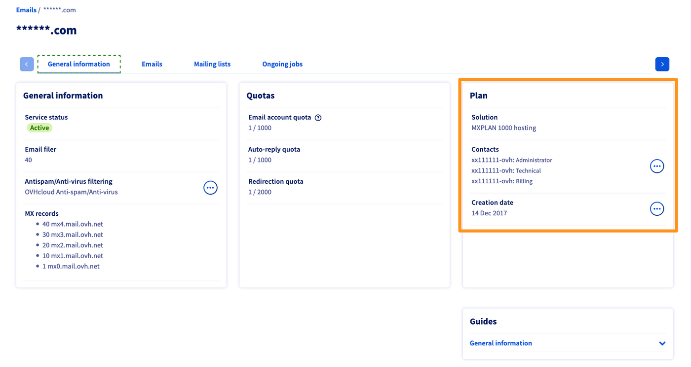
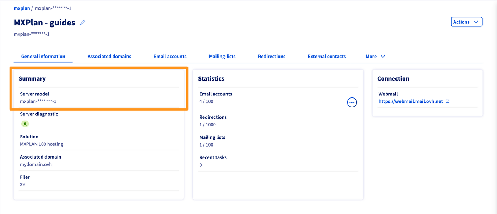
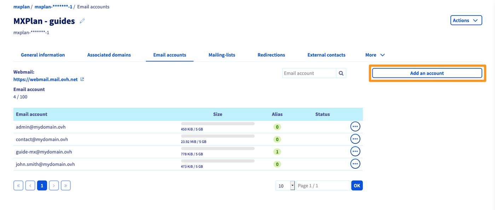
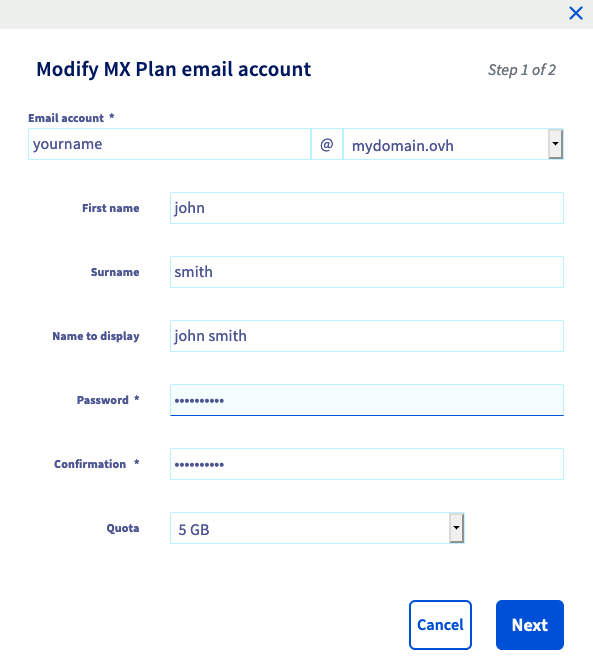
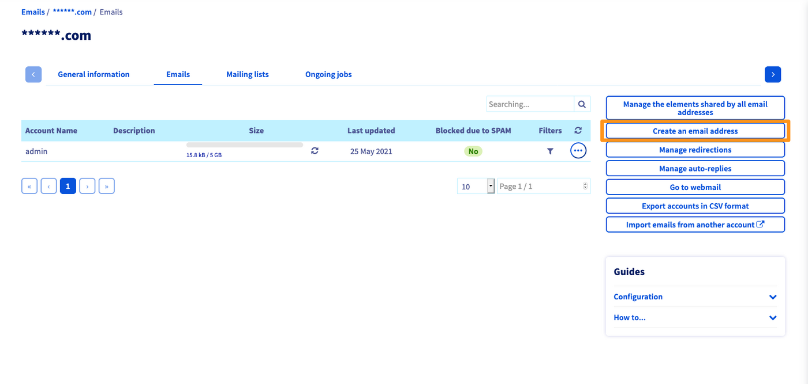
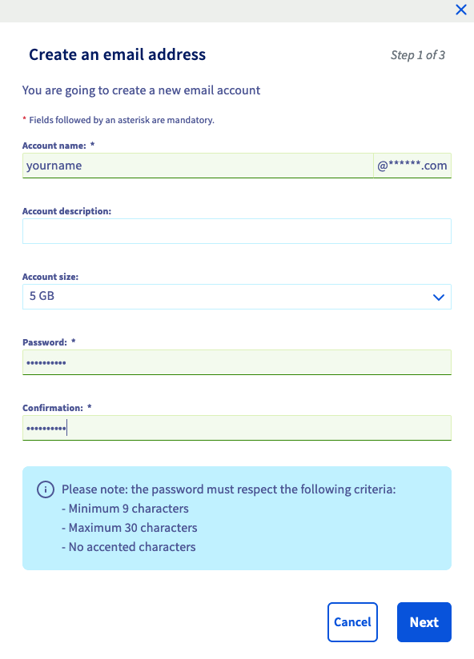
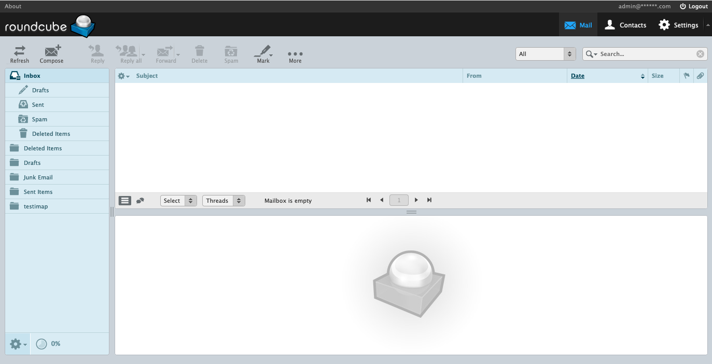

## Objectif

Vous venez d'acquérir une solution MX Plan. Celle-ci vous permet de bénéficier d'adresses e-mail, avec lesquelles vous pourrez envoyer et recevoir des messages depuis l’appareil de votre choix.

**Découvrez comment bien débuter avec votre offre MX Plan.**

## Prérequis

- Posséder une offre MX Plan. Celle-ci est disponible via : une offre d’[hébergement web](https://www.ovhcloud.com/fr/web-hosting/), l'[hébergement gratuit 100M](https://www.ovhcloud.com/fr/domains/free-web-hosting/) ou l'offre MX Plan seule.
- Être connecté à l'[espace client OVHcloud](https://www.ovh.com/auth/?action=gotomanager&from=https://www.ovh.com/fr/&ovhSubsidiary=fr), partie `Web Cloud`{.action}.

## En pratique

Une fois l'offre MX Plan créée et disponible, vous avez la possibilité de la gérer depuis votre [espace client OVHcloud](https://www.ovh.com/auth/?action=gotomanager&from=https://www.ovh.com/fr/&ovhSubsidiary=fr). Selon sa date d'activation ou si [celle-ci a été récemment migrée](https://www.ovh.com/fr/mxplan-migration/), il est possible que vous disposiez de la version historique ou de la nouvelle version de l'offre. Avant de poursuivre, vous devez identifier celle-ci.

Pour cela, connectez-vous à votre [espace client OVHcloud](https://www.ovh.com/auth/?action=gotomanager&from=https://www.ovh.com/fr/&ovhSubsidiary=fr), partie `Web Cloud`{.action}. Cliquez sur `Emails`{.action}, puis choisissez le nom de l'offre concernée. Poursuivez selon la version que vous possédez.

|Version historique de l'offre MX Plan|Nouvelle version de l'offre MX Plan|
|---|---|
|{.thumbnail}  Repérez l'offre dans le cadre « Abonnement »|{.thumbnail} Repérez la « Référence serveur » dans le cadre « Résumé »|
|Poursuivre vers « [Version historique de l'offre MX Plan](#oldmxplan) »|Poursuivre vers « [Nouvelle version de l'offre MX Plan](#newmxplan) »|

Les deux versions vous seront détaillées dans ce qui suit, en commençant par la version la plus récente. 

### Nouvelle version de l'offre MX Plan 

#### Accéder à la gestion de votre offre

Vous possédez la nouvelle version de l'offre MX Plan. Si vous n'obtenez pas l'affichage suivant, reportez-vous aux [informations précédentes](./#en-pratique).  

{.thumbnail}

#### Ajouter un compte e-mail

Pour créer une adresse e-mail, positionnez-vous sur l'onglet `Comptes e-mail`{.action}. La fenêtre qui apparaît liste les comptes déjà disponibles, ainsi que ceux que vous pouvez encore créer. Pour ajouter un nouveau compte e-mail, cliquez sur le bouton `Ajouter un compte`{.action}.

{.thumbnail}

Dans la fenêtre qui s'affiche, renseignez les informations demandées :

|Information|Description|
|---|---|
|Compte e-mail|Un nom temporaire est déjà prérempli dans la zone de texte : supprimez-le et indiquez votre nouvelle adresse e-mail (votre prénom.nom, par exemple). Le nom de domaine composant l'adresse e-mail est déjà présélectionné dans la liste.|
|Prénom|Renseignez un prénom.|
|Nom|Renseignez un nom.|
|Nom à afficher|Indiquez le nom qui s'affichera en tant qu'expéditeur lorsque des e-mails seront envoyés avec cette adresse.|
|Mot de passe|[Définissez un mot de passe](/pages/account_and_service_management/account_information/manage-ovh-password#en-pratique) et confirmez-le. Pour des raisons de sécurité, nous vous recommandons de ne pas utiliser deux fois le même mot de passe, d'en choisir un qui n'a aucun rapport avec vos informations personnelles (évitez les mentions à vos nom, prénom et date de naissance, par exemple) et de le renouveler régulièrement.|

Une fois les champs complétés, cliquez sur `Suivant`{.action} puis vérifiez les informations qui s'affichent dans le récapitulatif. Si celles-ci sont correctes, cliquez sur `Valider`{.action}. Réalisez cette étape autant de fois que nécessaire, selon le nombre de comptes à votre disposition.

{.thumbnail}

#### Utiliser vos adresses e-mail

Une fois vos adresses e-mail créées, il ne vous reste plus qu’à les utiliser. Pour cela, vous disposez de deux possibilités, utiliser le webmail Outlook Web App (OWA) ou utiliser le logiciel de votre choix.

##### **1. Utiliser le webmail Outlook Web App (OWA)**

Accédez à la page « [Connexion au webmail](https://www.ovh.com/fr/mail/) », puis renseignez l'adresse e-mail concernée ainsi que son mot de passe. Cliquez ensuite sur le bouton `Connexion`{.action}.

Lors d'une première connexion au webmail, vous êtes invité à définir la langue de l'interface ainsi que le fuseau horaire sur lequel vous vous trouvez. Votre boîte de réception s'affiche ensuite. Pour découvrir comment utiliser votre adresse e-mail depuis le webmail OWA, aidez-vous de notre guide « [Utiliser son adresse e-mail depuis le webmail Outlook Web App (OWA)](/pages/web_cloud/email_and_collaborative_solutions/using_the_outlook_web_app_webmail/email_owa) ».

{.thumbnail}

##### **2. Utiliser le logiciel de votre choix**

Pour utiliser votre adresse e-mail sur un logiciel tiers, vous devez configurer cette adresse e-mail sur l'appareil souhaité (PC, Mac, smartphone ou tablette). Pour cela, vous pouvez vous aider de nos guides de configuration :

|Windows|Outlook|Apple|Android|
|---|---|---|---|
|[Windows 10](/pages/web_cloud/email_and_collaborative_solutions/mx_plan/how_to_configure_windows_10)|[Outlook Windows](/pages/web_cloud/email_and_collaborative_solutions/mx_plan/how_to_configure_outlook_2016)|[Mail de macOS (dernière version)](/pages/web_cloud/email_and_collaborative_solutions/mx_plan/how_to_configure_mail_macos)|[Android (dernière version)](/pages/web_cloud/email_and_collaborative_solutions/mx_plan/how_to_configure_android)|
|[Thunderbird sur Windows](/pages/web_cloud/email_and_collaborative_solutions/mx_plan/how_to_configure_thunderbird_windows)|[Outlook Mac OS](/pages/web_cloud/email_and_collaborative_solutions/mx_plan/how_to_configure_outlook_2016_mac)|[Mail pour iPhone ou iPad](/pages/web_cloud/email_and_collaborative_solutions/mx_plan/how_to_configure_ios)|
|||[Thunderbird sur Mac](/pages/web_cloud/email_and_collaborative_solutions/mx_plan/how_to_configure_thunderbird_mac)|

Si vous désirez simplement obtenir les éléments nécessaires pour configurer votre adresse e-mail, retrouvez ci-dessous les paramètres à utiliser :

- **Pour une configuration en IMAP (recommandée)**

|Type du serveur|Nom du serveur|Port (avec SSL)|Port (sans SSL)|
|---|---|---|---|
|Entrant|ssl0.ovh.net|993|143|
|Sortant|ssl0.ovh.net|465|587|

- **Pour une configuration en POP**

|Type du serveur|Nom du serveur|Port (avec SSL)|Port (sans SSL)|
|---|---|---|---|
|Entrant|ssl0.ovh.net|995|110|
|Sortant|ssl0.ovh.net|465|587|

> [!warning]
>
> Si vous éprouvez des difficultés dans la configuration de votre adresse e-mail sur votre appareil, [aidez-vous de nos guides de configuration](/products/web-cloud-email-collaborative-solutions-mx-plan) ou rapprochez-vous de l'éditeur de l'application que vous utilisez, la manipulation étant inhérente à cette dernière.
>

#### Fonctionnalités avancées

##### **Politique de sécurité**

Vous souhaitez renforcer la sécurité d'accès à vos adresses e-mail.

Vous pouvez le faire en paramétrant la politique de sécurité de votre solution MX Plan.

Nous vous invitons à suivre notre guide « [Gérer la politique de sécurité d’un service e-mail](/pages/web_cloud/email_and_collaborative_solutions/common_email_features/security-policy) ».

##### **Redirections**

Vous souhaitez rediriger vos e-mails vers un autre destinataire, créer un alias ou encore mettre systématiquement en copie une autre adresse e-mail.

Pour cela, il vous faut créer une redirection.

Vous pouvez procéder de deux manières :

- créer votre redirection depuis le webmail, via les règles de boite de réception. Pour cela, nous vous invitons à suivre notre guide « [Règles de boîte de réception depuis l’interface OWA](/pages/web_cloud/email_and_collaborative_solutions/using_the_outlook_web_app_webmail/creating-inbox-rules-in-owa-mx-plan#exemple-1-rediriger-des-e-mails-vers-une-autre-adresse) ».

- créer votre redirection depuis votre [espace client OVHcloud](https://www.ovh.com/auth/?action=gotomanager&from=https://www.ovh.com/fr/&ovhSubsidiary=fr). Cette méthode vous permet par exemple de créer un alias, c'est à dire rediriger une adresse e-mail qui n'existe pas vers une adresse e-mail existante. Pour cela, nous vous invitons à suivre notre guide « [Utiliser les redirections e-mail](/pages/web_cloud/email_and_collaborative_solutions/common_email_features/feature_redirections#nouvelle-version-de-loffre-mx-plan) ».

##### **Répondeur**

Vous devez partir en congé ou vous n'aurez pas accès à votre adresse e-mail durant une certaine période.

Vous pouvez alors créer un répondeur automatique. Nous vous invitons à suivre notre guide « [Mettre en place un répondeur automatique depuis l’interface OWA](/pages/web_cloud/email_and_collaborative_solutions/using_the_outlook_web_app_webmail/owa_automatic_replies) ».

##### **Délégations**

Vous souhaitez envoyer un e-mail depuis votre adresse e-mail personnelle, **à la place** ou **de la part** d'une autre adresse e-mail de votre nom de domaine.

Pour cela, vous devez configurer la délégation de l'adresse e-mail concernée. Nous vous invitons à suivre notre guide « [Déléguer des droits sur un compte](/pages/web_cloud/email_and_collaborative_solutions/microsoft_exchange/feature_delegation) ».

##### **Mailing-lists**

Vous souhaitez envoyer régulièrement une newsletter à vos contacts.

Pour cela, vous pouvez créer une mailing list. Nous vous invitons à suivre notre guide « [Gérer et utiliser les mailing lists](/pages/web_cloud/email_and_collaborative_solutions/mx_plan/feature_mailing_list) ».

##### **Pied de page**

Vous souhaitez appliquer une signature globale à l'ensemble des adresses e-mail de votre nom de domaine.

Le « pied de page » vous le permet, il est configurable depuis votre espace client. Nous vous invitons à suivre notre guide « [Ajouter un pied de page sur vos e-mails](/pages/web_cloud/email_and_collaborative_solutions/microsoft_exchange/feature_footers) ».

### Version historique de l'offre MX Plan 

#### Accéder à la gestion de votre offre

Vous possédez la version historique de l'offre MX Plan. Si vous n'obtenez pas l'affichage suivant, reportez-vous aux [informations précédentes](./#en-pratique).

{.thumbnail}

#### Ajouter un compte e-mail

Pour créer une adresse e-mail, positionnez-vous sur l'onglet `Comptes emails`{.action}. Le tableau qui s'affiche contient toutes les adresses e-mail créées dans le cadre de votre offre. Cliquez alors sur le bouton `Créer une adresse E-mail`{.action}.

{.thumbnail}

Dans la fenêtre qui s'affiche, renseignez les informations demandées :

|Information|Description|  
|---|---|  
|Nom du compte|Renseignez le nom que portera votre adresse e-mail (votre prénom.nom, par exemple). Le nom de domaine concerné est déjà complété par défaut.|  
|Description du compte|Indiquez une courte description vous permettant de reconnaître ce compte parmi d'autres affichés dans votre espace client OVHcloud.|  
|Taille du compte|Sélectionnez la taille du compte souhaitée. Il s'agit de l'espace dont bénéficiera votre adresse pour stocker les messages.|  
|Mot de passe|Définissez un mot de passe et confirmez-le. Pour des raisons de sécurité, nous vous recommandons de ne pas utiliser deux fois le même mot de passe, d'en choisir un qui n'a aucun rapport avec vos informations personnelles (évitez les mentions à vos nom, prénom et date de naissance, par exemple) et de le renouveler régulièrement.|

Une fois les champs complétés, cliquez sur `Suivant`{.action} puis vérifiez les informations qui s'affichent dans le récapitulatif. Si celles-ci sont correctes, cliquez sur `Valider`{.action}. Réalisez cette étape autant de fois que nécessaire, selon le nombre de comptes à votre disposition.

{.thumbnail}

#### Utiliser vos adresses e-mail

Une fois vos adresses e-mail créées, il ne vous reste plus qu’à les utiliser. Pour cela, vous disposez de deux possibilités, utiliser le webmail RoundCube ou utiliser le logiciel de votre choix.

##### **1. Utiliser le webmail RoundCube**

Accédez à la page « [Connexion au webmail](https://www.ovh.com/fr/mail/) », puis renseignez l'adresse e-mail concernée ainsi que son mot de passe. Cliquez ensuite sur le bouton `Connexion`{.action}.

Votre boîte de réception s'affiche alors. Pour découvrir comment utiliser votre adresse e-mail depuis le webmail RoundCube, aidez-vous de notre guide « [Utiliser son adresse e-mail depuis le webmail RoundCube](/pages/web_cloud/email_and_collaborative_solutions/mx_plan/email_roundcube) ».

{.thumbnail}

##### **2. Utiliser le logiciel de votre choix**

Pour utiliser votre adresse e-mail sur un logiciel tiers, vous devez configurer cette adresse e-mail sur l'appareil souhaité (PC, Mac, smartphone ou tablette). Pour cela, vous pouvez vous aider de nos guides de configuration :

|Windows|Outlook|Apple|Android|
|---|---|---|---|
|[Windows 10](/pages/web_cloud/email_and_collaborative_solutions/mx_plan/how_to_configure_windows_10)|[Outlook Windows](/pages/web_cloud/email_and_collaborative_solutions/mx_plan/how_to_configure_outlook_2016)|[Mail de macOS (dernière version)](/pages/web_cloud/email_and_collaborative_solutions/mx_plan/how_to_configure_mail_macos)|[Android (dernière version)](/pages/web_cloud/email_and_collaborative_solutions/mx_plan/how_to_configure_android)|
|[Thunderbird sur Windows](/pages/web_cloud/email_and_collaborative_solutions/mx_plan/how_to_configure_thunderbird_windows)|[Outlook Mac OS](/pages/web_cloud/email_and_collaborative_solutions/mx_plan/how_to_configure_outlook_2016_mac)|[Mail pour iPhone ou iPad](/pages/web_cloud/email_and_collaborative_solutions/mx_plan/how_to_configure_ios)||
|||[Thunderbird sur Mac](/pages/web_cloud/email_and_collaborative_solutions/mx_plan/how_to_configure_thunderbird_mac)|| |

Si vous désirez simplement obtenir les éléments nécessaires pour configurer votre adresse e-mail, retrouvez ci-dessous les paramètres à utiliser :

- **Pour une configuration en IMAP (recommandée)**

|Type du serveur|Nom du serveur|Port (avec SSL)|Port (sans SSL)|
|---|---|---|---|
|Entrant|ssl0.ovh.net|993|143|
|Sortant|ssl0.ovh.net|465|587|

- **Pour une configuration en POP**

|Type du serveur|Nom du serveur|Port (avec SSL)|Port (sans SSL)|
|---|---|---|---|
|Entrant|ssl0.ovh.net|995|110|
|Sortant|ssl0.ovh.net|465|587|

> [!warning]
>
> Si vous éprouvez des difficultés dans la configuration de votre adresse e-mail sur votre appareil, [aidez-vous de nos guides de configuration](/products/web-cloud-email-collaborative-solutions-mx-plan) ou rapprochez-vous de l'éditeur de l'application que vous utilisez, la manipulation étant inhérente à cette dernière.

#### Fonctionnalités avancées

##### **Redirection**

Vous souhaitez rediriger vos e-mails vers un autre destinataire, créer un alias ou encore mettre systématiquement en copie une autre adresse e-mail.

Pour cela il vous faut créer une redirection. Nous vous invitons à suivre notre guide « [Utiliser les redirections e-mail](/pages/web_cloud/email_and_collaborative_solutions/common_email_features/feature_redirections#version-historique-de-loffre-mx-plan) ».

##### **Répondeur**

Vous devez partir en congé ou vous n'aurez pas accès à votre adresse e-mail durant une certaine période.

Vous pouvez alors utiliser le répondeur automatique sur votre adresse e-mail. Nous vous invitons à suivre notre guide « [Créer un répondeur pour son adresse e-mail](/pages/web_cloud/email_and_collaborative_solutions/mx_plan/feature_auto_responses) ».

##### **Délégations**

Vous souhaitez **déléguer tout le service email d’un nom de domaine à un autre compte OVHcloud** ou **déléguer un ou plusieurs comptes emails à un autre compte OVHcloud**, pour, par exemple, permettre au titulaire de cet autre compte OVHcloud de modifier le mot de passe d'une adresse e-mail.

Nous vous invitons à suivre notre guide « [Déléguer la gestion de vos e-mails à une autre personne](/pages/web_cloud/email_and_collaborative_solutions/mx_plan/feature_delegation) ».

##### **Mailing-lists**

Vous souhaitez envoyer régulièrement une newsletter à vos contacts.

Pour cela, vous pouvez créer une mailing list. Nous vous invitons à suivre notre guide « [Gérer et utiliser les mailing lists](/pages/web_cloud/email_and_collaborative_solutions/mx_plan/feature_mailing_list) ».

## Aller plus loin

Si vos besoins évoluent et que vous souhaitez bénéficier de fonctionnalités supplémentaires, vous pouvez également [migrer une adresse e-mail MX Plan vers un compte E-mail Pro ou Exchange](/pages/web_cloud/email_and_collaborative_solutions/migrating/migration_control_panel).

Échangez avec notre communauté d'utilisateurs sur <https://community.ovh.com>.
