## Objetivo

Con la solución MX Plan de OVHcloud, puede enviar y recibir correos electrónicos desde un programa de terceros o a través de un webmail. OVHcloud ofrece un servicio de mensajería en línea llamado Roundcube que permite, mediante un navegador web, acceder a una cuenta de correo electrónico.

**Descubra cómo utilizar el webmail Roundcube para sus direcciones de correo electrónico de OVHcloud.**

## Requisitos

- Disponer de una solución de correo **MX Plan** de OVHcloud, propuesta entre nuestras [ofertas de alojamiento web](/links/web/hosting), incluida en un [alojamiento gratuito 100M](/links/web/domains-free-hosting), o contratada por separado como solución autónoma.
- Disponer de los datos de conexión a la dirección de correo electrónico MX Plan que desea consultar. Para más información, consulte nuestra guía [Primeros pasos con la solución MX Plan](/pages/web_cloud/email_and_collaborative_solutions/mx_plan/email_generalities).
- Su solución de correo electrónico **MX Plan** de OVHcloud debe utilizar la tecnología de webmail **Roundcube**. Para identificarla, siga las siguientes instrucciones.

> [!primary]
> 
> **¿Cómo identificar la tecnología utilizada en mi solución MX Plan?**
>
> La tecnología de correo electrónico utilizada para su solución MX Plan se caracteriza por la interfaz de su webmail. Para identificarla desde su área de cliente, siga la siguiente ruta:
>
> 1. Conéctese a su [área de cliente de OVHcloud](/links/manager).
> 1. Acceda al apartado `Web Cloud`{.action}.
> 1. Haga clic en `MX Plan`{.action}.
> 1. Seleccione el dominio correspondiente.
> 1. En la pestaña `Información general`{.action} (seleccionada por defecto), revise la tecnología utilizada bajo la indicación **Webmail**.
>
> {.thumbnail .w-500}

<!-- CP-NAV-START:web-mx-plan -->
---

### Acceso al área de cliente de OVHcloud

- **Enlace directo:** [MX Plan](/links/control-panel/web-mx-plan)
- **Para acceder a sus servicios:** `Web Cloud`{.action} > `MX Plan`{.action} > Seleccione su servicio MX Plan

---
<!-- CP-NAV-END:web-mx-plan -->

## Procedimiento

**Sumario**

- [Conectarse al webmail Roundcube](#roundcube-connexion)
- [Interfaz general del webmail Roundcube](#general-interface)
    - [Gestión de carpetas (columna izquierda)](#leftcolumn)
    - [Lista de correos electrónicos recibidos / enviados (ventana superior)](#topwindow)
        - [Tipo de visualización](#topwindow-display)
        - [Acción sobre un correo electrónico seleccionado](#topwindow-action)
        - [Buscar un correo electrónico](#topwindow-search)
    - [Contenido de un correo electrónico (ventana inferior)](#lowerwindow)
- [Configurar las preferencias de la interfaz Roundcube](#roundcube-settings)
    - [Interfaz de usuario](#user-interface-settings)
    - [Vista del buzón de correo](#mail-view-settings)
    - [Visualización de los correos electrónicos](#mail-display-settings)
    - [Redacción de correos electrónicos](#mail-writing-settings)
    - [Contactos](#contacts-settings)
    - [Carpetas especiales](#special-folder-settings)
    - [Parámetros del servidor](#server-settings)
    - [Cifrado](#encryption)
- [Gestionar las identidades y su firma](#identity-signature)
    - [Identidad](#identity)
    - [Firma](#signature)
- [Agenda de contactos](#contact-book)
    - [Grupos](#group)
    - [Contactos](#contacts)
    - [Importar contactos](#import-contacts)
    - [Exportar los contactos](#export-contacts)
- [Respuestas (plantillas)](#responses)
- [Añadir un contestador o respuesta automática](#automatic-respond)
- [Cambiar la contraseña de su dirección de correo electrónico](#password)
- [Redacción de un correo electrónico](#email-writing)
- [Casos de uso](#usecase)

### Conectarse al webmail Roundcube <a name="roundcube-connexion"></a>

Acceda a la página [Webmail](/links/web/email). Introduzca una dirección de correo electrónico y la contraseña, y haga clic en `Conexión`{.action}. 

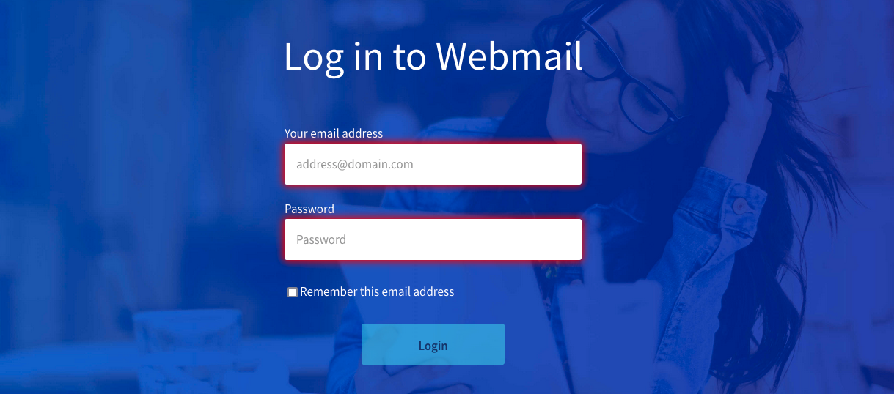{.thumbnail}

El sistema le redirigirá a la interfaz Roundcube.

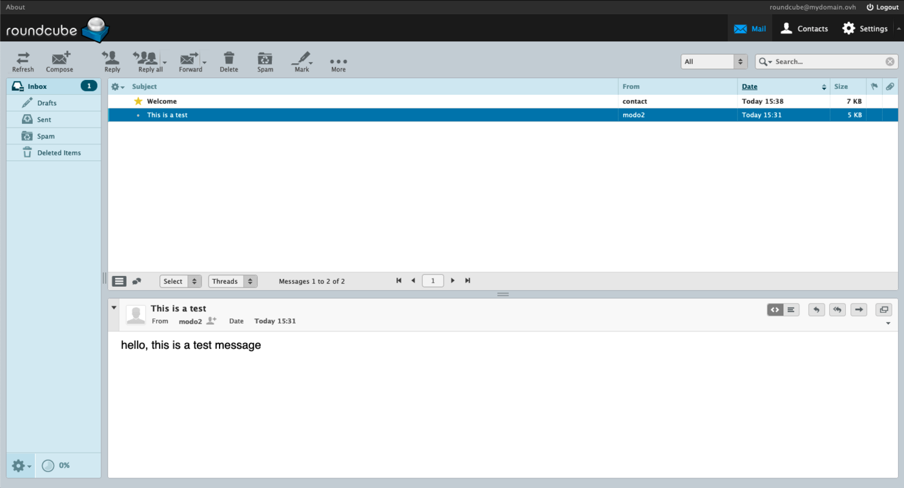{.thumbnail}

> [!primary]
> 
> Cuando se conecte por primera vez a la interfaz Roundcube, su apariencia puede ser diferente de la que verá en esta documentación. Esto significa que se ha definido la apariencia "clásica" en su interfaz. Para cambiarla, siga el apartado "[Interfaz de usuario](#user-interface-settings)" y seleccione la visualización "Larry".
> La apariencia de la interfaz no afectará a las explicaciones que siguen en esta documentación.

> [!warning]
> 
> Si es redirigido a una interfaz **O**utlook **W**eb **A**pp (OWA), significa que se encuentra en la última versión de la solución MX Plan. Para más información sobre su solución MX Plan, consulte nuestra página [Primeros pasos con la solución MX Plan](/pages/web_cloud/email_and_collaborative_solutions/mx_plan/email_generalities).
>
> Para familiarizarse con la interfaz **OWA**, consulte nuestra guía [Consultar su cuenta de correo electrónico desde la interfaz OWA](/pages/web_cloud/email_and_collaborative_solutions/using_the_outlook_web_app_webmail/email_owa).

### Interfaz general del webmail Roundcube <a name="general-interface"></a>

Una vez conectado a su cuenta de correo electrónico, accederá a la ventana principal de Roundcube, que se compone de 3 zonas:

- [**Columna izquierda**](#leftcolumn): el árbol de su cuenta de correo electrónico, compuesto de carpetas y subcarpetas. La carpeta principal es la `Bandeja de entrada`.

- [**Ventana superior**](#topwindow): la lista de correos electrónicos contenidos en la carpeta seleccionada en la columna izquierda.

- [**Ventana inferior**](#lowerwindow): el contenido del correo electrónico seleccionado en la ventana superior.

#### Gestión de carpetas (columna izquierda) <a name="leftcolumn"></a>

En esta zona aparecen las carpetas presentes en su cuenta de correo electrónico.

Para gestionar las carpetas con mayor precisión, haga clic en la rueda dentada situada en la parte inferior de la columna y, a continuación, en `Administrar carpetas`{.action}.

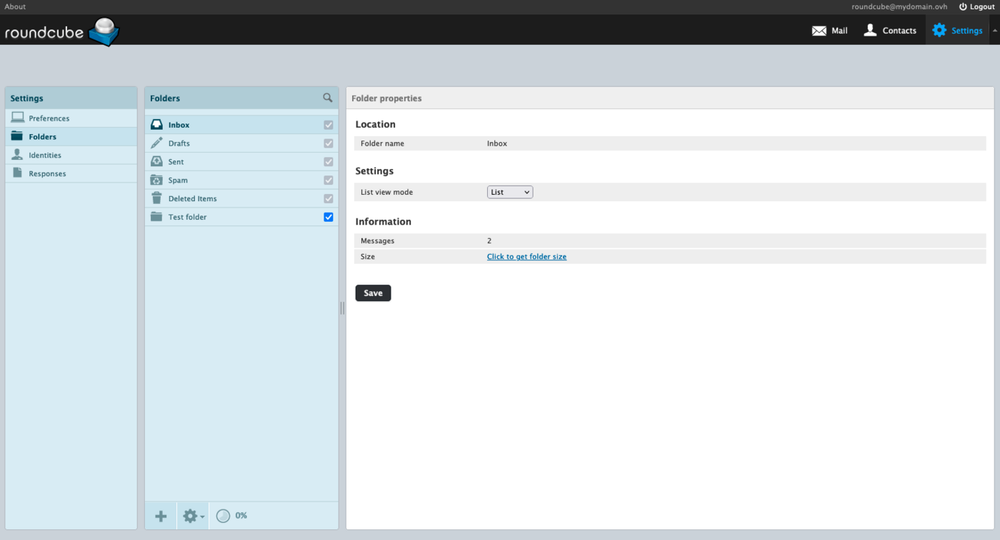{.thumbnail}

Para crear una carpeta, haga clic en el botón `+`{.action} en la parte inferior de la columna `Carpetas`.

Para eliminar una carpeta, seleccione la carpeta correspondiente, haga clic en la rueda dentada situada en la parte inferior de la columna `Carpetas` y, a continuación, en `Eliminar`{.action}. Para borrar el contenido pero conservar la carpeta, haga clic en `Vaciar`{.action}.

Las casillas de verificación de las carpetas corresponden a las "suscripciones". La suscripción determina si la carpeta debe mostrarse o no en la interfaz del webmail o del cliente de correo electrónico, conservando el contenido de la carpeta. El objetivo es únicamente ocultar o mostrar una carpeta en la cuenta de correo electrónico.

> [!primary]
>
> Las carpetas que presentan una casilla de verificación gris son carpetas especiales. No es posible eliminarlas ni anular su suscripción.

#### Lista de correos electrónicos recibidos / enviados (ventana superior) <a name="topwindow"></a>

Esta ventana muestra el contenido de la carpeta seleccionada en la columna izquierda. 

##### Tipo de visualización <a name="topwindow-display"></a>

Esta ventana se presenta de una forma que se puede personalizar. Para ello, haga clic en la rueda dentada situada en la parte superior izquierda de esta ventana.

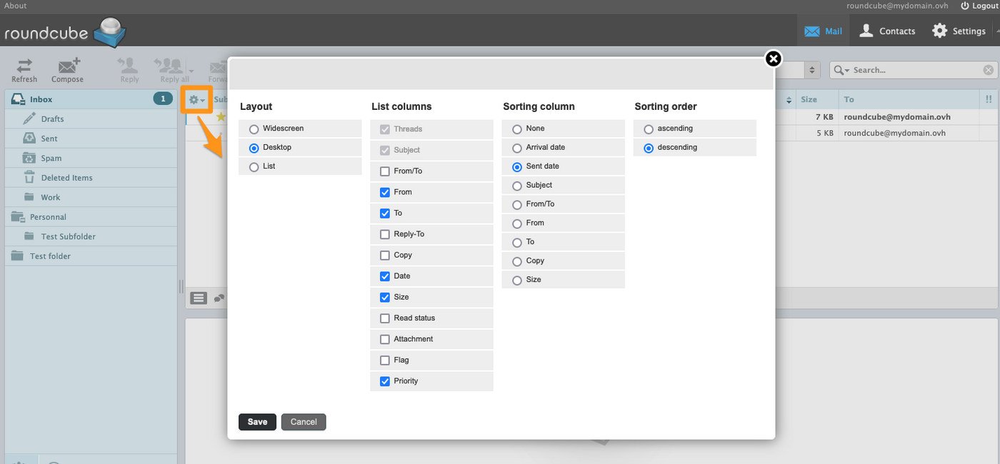{.thumbnail}

Pueden configurarse cuatro parámetros:

- **Disposición**: define la organización de las ventanas de gestión de una cuenta de correo electrónico. Tres opciones:
    - `Pantalla ancha`{.action} (*Widescreen*): tres paneles uno al lado del otro — carpetas, lista de correos electrónicos y panel de lectura alineados horizontalmente;
    - `Escritorio`{.action} (*Desktop*): lista de correos electrónicos en la parte superior, panel de lectura debajo (disposición clásica);
    - `Lista`{.action} (*List*): sin panel de lectura — los correos electrónicos se abren en pantalla completa al hacer clic.

- **Columnas de la lista**: casillas de verificación que determinan las columnas mostradas en la lista de correos electrónicos. Las columnas **Asunto** e **Hilos de discusión** siempre están visibles. Columnas opcionales disponibles: `De`{.action}, `Para`{.action}, `De/Para`{.action}, `Responder a`{.action}, `Copia`{.action}, `Fecha`{.action}, `Tamaño`{.action}, `Estado leído`{.action}, `Adjuntos`{.action}, `Indicador`{.action}, `Prioridad`{.action}.

- **Columna de ordenación**: permite elegir la columna de ordenación predeterminada. Opciones disponibles: `Ninguno`{.action}, `Fecha de llegada`{.action}, `Fecha de envío`{.action}, `Asunto`{.action}, `De`{.action}, `Para`{.action}, `De/Para`{.action}, `Copia`{.action} o `Tamaño`{.action}.

- **Orden de clasificación**: ascendente o descendente.

Haga clic en `Guardar`{.action} para aplicar sus elecciones.

> [!primary]
>
> También puede **ordenar dinámicamente la lista** haciendo clic directamente en el encabezado de una columna mostrada (por ejemplo **Fecha**, **Asunto** o **Tamaño**). Un segundo clic en la misma columna invierte el orden.

##### Acción sobre un correo electrónico seleccionado <a name="topwindow-action"></a>

Cuando se selecciona un correo electrónico, es posible actuar sobre el mismo. Estas son las acciones posibles:

- `Responder`{.action}: responder directamente al remitente.
- `Responder a todos`{.action}: responder directamente a todos los destinatarios presentes en los campos "Para" y "Copia".
- `Reenviar`{.action}: reenviar el correo electrónico seleccionado a uno o varios destinatarios.
- `Eliminar`{.action}: enviar el correo electrónico seleccionado a la "Papelera".
- `SPAM`{.action}: colocar el correo electrónico seleccionado directamente en la bandeja de correo no deseado (Junk), calificarlo como **spam**.
- `Marcar`{.action}: determinar manualmente el estado de un correo electrónico.
- `Más`{.action} 
    - `Imprimir este correo electrónico`{.action}.
    - `Descargar (.eml)`{.action}: recuperar el encabezado del correo electrónico y su contenido.
    - `Editar como nuevo`{.action}: crear un nuevo correo electrónico basándose en el correo electrónico seleccionado.
    - `Mostrar código`{.action}: mostrar el correo electrónico en su forma sin procesar con el encabezado.
    - `Mover a`{.action}: mover el correo electrónico a una carpeta.
    - `Copiar a`{.action}: copiar el correo electrónico en una carpeta.
    - `Abrir en una nueva ventana`{.action}.

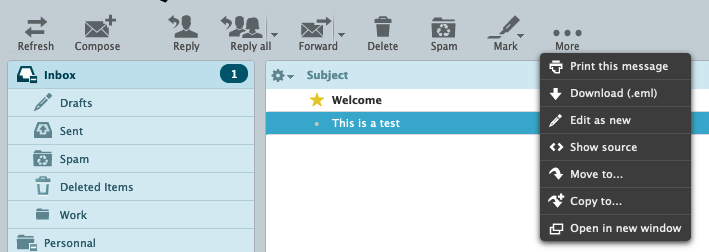{.thumbnail}

> [!primary]
>
> Si uno de sus interlocutores solicita un acuse de lectura cuando lea su correo electrónico, recibirá el siguiente mensaje: `el remitente de este mensaje ha solicitado ser notificado cuando lea este mensaje. ¿Desea avisar al remitente?`.
>

##### Buscar un correo electrónico <a name="topwindow-search"></a>

Hay una herramienta de búsqueda disponible en la parte superior derecha de la interfaz.

Introduzca un término en el campo de búsqueda y valide con la tecla `Intro`{.action}: Roundcube efectúa por defecto la búsqueda en toda la carpeta actual.

Haga clic en la flecha situada a la derecha de la lupa para mostrar los filtros de búsqueda: puede restringir la búsqueda a determinados campos (asunto, cuerpo del mensaje, remitente, destinatarios, etc.) o ampliar su alcance a todas las carpetas.

#### Contenido de un correo electrónico (ventana inferior) <a name="lowerwindow"></a>

Cuando se selecciona un correo electrónico en la lista, este se muestra en la ventana inferior.

A la derecha encontrará los atajos de las siguientes funciones:

- `Mostrar en formato HTML`{.action} (por defecto)
- `Mostrar en formato de texto sin formato`{.action}
- `Responder`{.action}
- `Responder a todos`{.action}
- `Reenviar`{.action}
- `Mostrar en una nueva ventana`{.action}

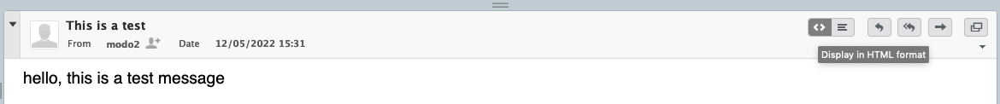{.thumbnail}

### Configurar las preferencias de la interfaz Roundcube <a name="roundcube-settings"></a>

Los siguientes capítulos de esta guía corresponden a las pestañas que componen la sección `Preferencias`{.action} de la `Configuración`{.action} de Roundcube. Su descripción no es exhaustiva.

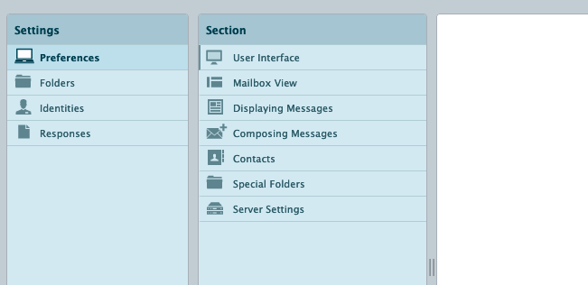{.thumbnail}

#### Interfaz de usuario <a name="user-interface-settings"></a>

Defina aquí el `idioma` de uso de la interfaz Roundcube, la `zona horaria`, el `formato horario` y el `formato de fecha`.

La opción `Fechas amigables` permite mostrar la fecha de recepción/envío con términos relativos como "Hoy", "Ayer", etc.<br>
**Por ejemplo**: estamos a **19/05/2022**, un correo electrónico enviado/recibido el **17/05/2022** a las **17:38** se mostrará como **Mar 17:38**, ya que el correo electrónico corresponde al martes anterior.

La casilla `Mostrar la siguiente entrada de la lista tras eliminar o mover` significa que, tras una acción de eliminación o movimiento sobre un correo electrónico, se seleccionará sistemáticamente el elemento de la línea inferior, sea cual sea el orden de clasificación.

Puede elegir la estética de visualización de su interfaz. Puede elegir entre la visualización **Classic** o la visualización **Larry**.

#### Vista del buzón de correo <a name="mail-view-settings"></a>

Defina aquí la ergonomía para visualizar y actuar sobre los correos electrónicos. La opción `Disposición` permite organizar las 3 ventanas descritas en el apartado [Lista de correos electrónicos recibidos / enviados](#topwindow).

#### Visualización de los correos electrónicos <a name="mail-display-settings"></a>

Defina la forma en que se muestran los correos electrónicos.<br>
Es recomendable tener marcada la casilla `Mostrar en HTML`, para asegurarse de que los correos electrónicos formateados por el remitente se muestren correctamente.<br>
También se recomienda mantener la opción `Permitir recursos remotos (imágenes, estilos)` en `nunca`. Así se evita cargar los elementos de un correo electrónico que parezca malicioso.

#### Redacción de correos electrónicos <a name="mail-writing-settings"></a>

Defina la forma predeterminada al redactar un correo electrónico o una respuesta.<br>
Se recomienda configurar la opción `Redactar correos electrónicos en HTML` en `siempre`, para beneficiarse por defecto de las herramientas de edición HTML y no alterar una firma HTML.

#### Contactos <a name="contacts-settings"></a>

Personalice aquí la organización de los datos en su libreta de direcciones.

#### Carpetas especiales <a name="special-folder-settings"></a>

Roundcube dispone de 4 carpetas especiales: `Borradores`, `Enviados`, `Correo no deseado`, `Papelera`.

No recomendamos modificarlas, pero es posible asignar el comportamiento de una carpeta especial a otra carpeta creada posteriormente, gracias a los menús desplegables.<br>

**Por ejemplo**, puede asignar el comportamiento "Borradores" a otra carpeta que haya creado, haciendo clic en la lista desplegable y eligiendo dicha carpeta. Si no se le asigna ninguna carpeta, se establecerá automáticamente en la opción "Drafts". Los correos electrónicos guardados en ella se considerarán borradores hasta su envío efectivo.

> En la práctica, creo una subcarpeta "Borradores correos clientes". Voy a `Mis preferencias`{.action} / `Carpetas especiales`{.action} y elijo la opción "Borradores". En el menú desplegable, selecciono la carpeta "Borradores correos clientes" para reemplazar "Drafts". Los correos electrónicos redactados en esta carpeta se considerarán borradores.

#### Parámetros del servidor <a name="server-settings"></a>

En esta pestaña, puede optimizar el espacio ocupado en una cuenta de correo electrónico. La opción `Vaciar la papelera al cerrar sesión` permite evitar la acumulación de elementos eliminados. La opción `Eliminar directamente el correo no deseado` eliminará automáticamente todos los correos electrónicos considerados como spam.

> [!warning]
> 
> No se recomienda activar la opción `Eliminar directamente el correo no deseado`, en el caso de que un falso positivo (correo electrónico declarado erróneamente como "spam") se identifique como spam por el servidor de recepción. De hecho, cuando un correo electrónico se coloca en la carpeta "Correo no deseado", aún es posible verificar si el correo electrónico es legítimo.

#### Cifrado <a name="encryption"></a>

Si su navegador se lo permite, puede instalar y activar la extensión "Mailvelope". Se trata de una extensión de navegador que integra el PGP (**P**retty **G**ood **P**rivacy) en su mensajería web. El sistema de cifrado PGP y, por consiguiente, la extensión "Mailvelope" permiten:

- Cifrar y descifrar correos electrónicos en su navegador.
- Mantener el contenido de sus correos electrónicos privado frente a su proveedor de mensajería.

De este modo, solo usted podrá leer sus correos electrónicos. Esta extensión es una manera de proteger su webmail si recibe correos electrónicos de naturaleza confidencial.

Para más información, consulte la FAQ de "Mailvelope" en la dirección <https://mailvelope.com/es/faq>.

### Gestionar las identidades y su firma <a name="identity-signature"></a>

Desde Roundcube, haga clic en `Configuración`{.action} en la barra superior y, a continuación, en `Identidades`{.action} en la columna izquierda. "La identidad" permite personalizar los datos enviados a los destinatarios como, por ejemplo, el nombre de visualización o la firma.

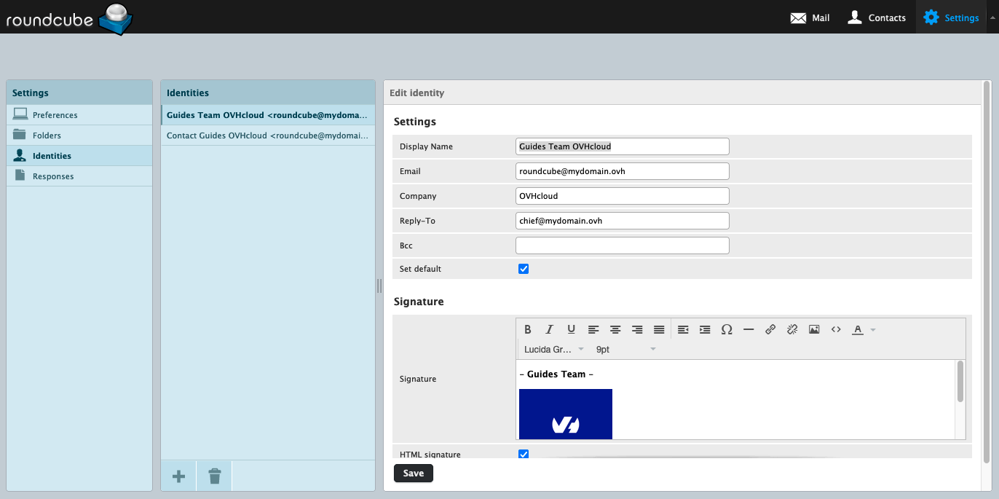{.thumbnail}

#### Configurar los atributos de una identidad <a name="identity"></a>

- **Nombre de visualización**: este nombre aparecerá en la sección "remitente" del destinatario.
- **Correo electrónico**: corresponde a la dirección desde la cual se envía el correo electrónico.
- **Responder a**: asignar otra dirección de correo electrónico de respuesta distinta a la del remitente.
- **Organización**: campo destinado al nombre de empresa, asociación u otra entidad.
- **Cco**: poner en copia oculta una dirección de correo electrónico al enviar.
- **Establecer como predeterminado**: cuando hay varias identidades (firmas), asigna esta por defecto.
- **Firma**: personalizar el pie de página de un correo electrónico al redactarlo (nombre, apellidos, cargo, frases, imágenes...).
- **Firma HTML**: activa el formato HTML en la firma.

> [!alert]
>
> Completar la casilla **Correo electrónico** con una dirección de correo electrónico distinta de aquella con la que está conectado se considera una usurpación de identidad electrónica (*spoofing*). La dirección IP utilizada para el envío puede ser "vetada" y/o considerada como "spam" por sus destinatarios.

#### Añadir una firma <a name="signature"></a>

Por defecto, la casilla `firma` está en "texto sin formato". Este formato no permite una edición avanzada ni insertar una imagen en su firma. Para beneficiarse de las opciones de edición avanzada para una firma, se recomienda activar el modo HTML haciendo clic en **Firma HTML** debajo del cuadro de entrada.

> [!warning]
>
> Por consiguiente, si la firma está en formato HTML, será necesario pasar al modo HTML para la redacción de un correo electrónico. Puede activar esta opción por defecto para cada redacción de correo electrónico, desde la sección `Configuración`{.action} de la interfaz Roundcube.
> Haga clic en `Preferencias`{.action} en la columna izquierda y, a continuación, en `Redacción de correos electrónicos`{.action}. Para la indicación **Redactar correos electrónicos en HTML**, seleccione `Siempre`.
>

Para insertar una imagen en una firma, la imagen debe estar alojada en un servidor (un alojamiento OVHcloud u otro).<br>
**Cargar una imagen desde un ordenador no permitirá su visualización**.

Haga clic en el botón `< >`{.action} de la barra de herramientas HTML y, a continuación, inserte el siguiente código, sustituyendo `your-image-url` por la dirección (URL) de la imagen y `text-if-image-is-not-displayed` por un texto que sustituya la imagen si esta no puede mostrarse.

```html

```

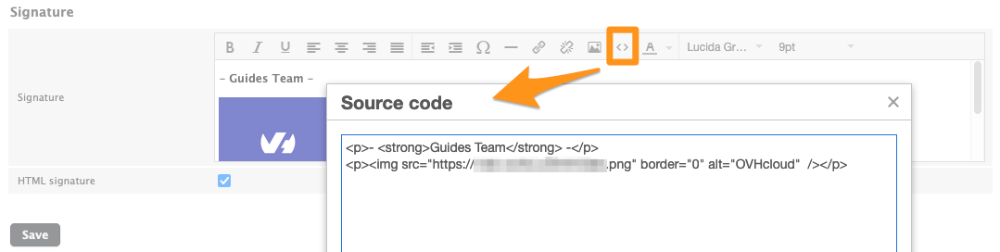{.thumbnail}

### Agenda de contactos <a name="contact-book"></a>

Haga clic en `Contactos`{.action} en la barra superior, para acceder a la agenda de contactos. Esta se divide en **3 columnas**:

- **Grupos**: en la libreta de direcciones, puede crear grupos para clasificar los contactos.
- **Contactos**: visualice los contactos de la libreta de direcciones o del grupo seleccionado.
- **Propiedades del contacto** o **Añadir un contacto**: esta ventana aparece cuando se selecciona un contacto o cuando se está creando. Puede leer o modificar la información de un contacto.

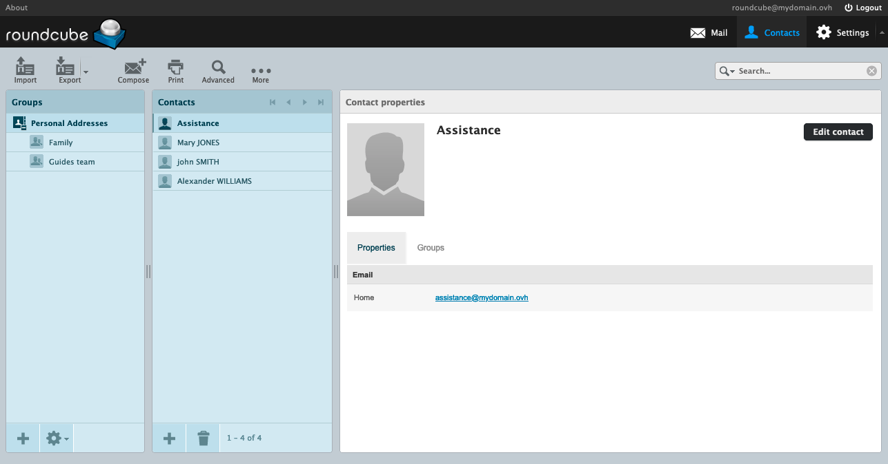{.thumbnail}

#### Grupos <a name="group"></a>

Los grupos son subcategorías de la libreta de direcciones. Permiten clasificar los contactos en subconjuntos. Por ejemplo, encontrará más fácilmente un contacto en un grupo que haya creado que en el conjunto de su libreta de direcciones. Esto también le permite enviar un correo electrónico añadiendo un grupo como destinatario, en lugar de añadir uno por uno los contactos del grupo.

Para crear un grupo, haga clic en el botón `+`{.action} en la parte inferior de la columna `Grupos`. Defina el nombre del grupo y haga clic en `Guardar`{.action} para validar.

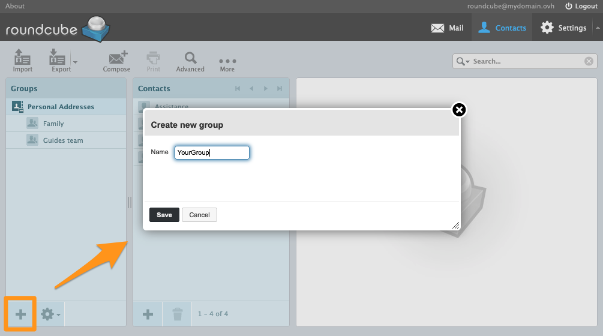{.thumbnail}

Para asignar un contacto a uno de los grupos, seleccione un contacto en la columna `Contactos` y, en la ventana que aparece, haga clic en la pestaña `Grupos`{.action}. Marque el grupo que desee asignar al contacto.

#### Contactos <a name="contacts"></a>

En la columna `Grupos`, seleccione la libreta de direcciones o uno de los grupos.

> [!primary]
>
> Cuando crea un contacto desde un grupo seleccionado, el contacto se añadirá automáticamente al grupo.

Haga clic en el botón `+`{.action} en la parte inferior de la columna `Contactos` para crear un contacto.

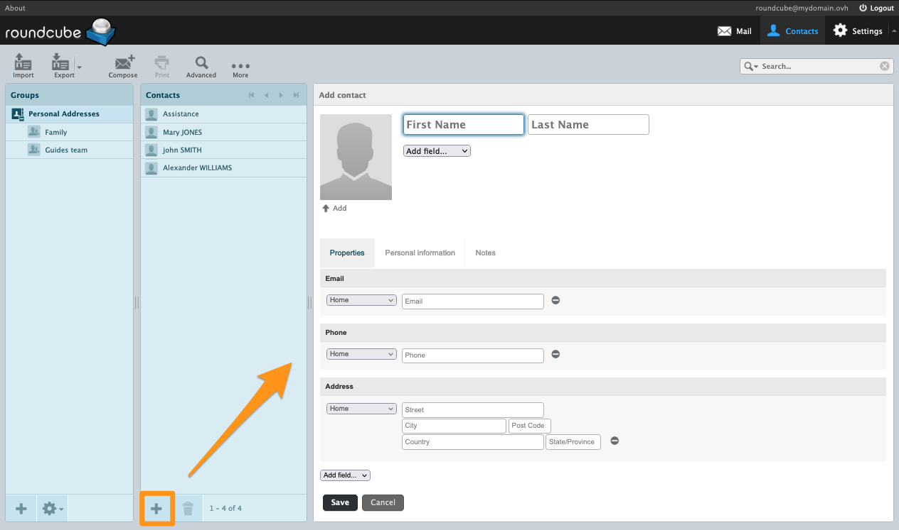{.thumbnail}

A continuación, complete la información del contacto.

> [!primary]
> Puede añadir campos adicionales mediante el menú desplegable `Añadir un campo...`{.action}, situado bajo los campos `Nombre` y `Dirección`.

#### Importar contactos <a name="import-contacts"></a>

Desde la ventana `Contactos`{.action}, en la barra superior, haga clic en `importar`{.action} para abrir la ventana de importación.

- `Importar desde un archivo`: seleccione un archivo CSV o un archivo vCard en su ordenador. Los contactos en un archivo CSV deben estar separados por comas. El archivo no debe pesar más de 20 MB.
- `Importar las asignaciones de grupo`: si los contactos de su archivo están repartidos por grupos, puede activar esta opción para conservar esta organización o dejar esta opción en `ninguna` para que no se asigne ningún grupo a los contactos.
- `Reemplazar toda la libreta de direcciones`: si ya tiene configurada una libreta, le recomendamos exportarla antes de marcar esta opción o estar seguro de querer reemplazarla definitivamente.

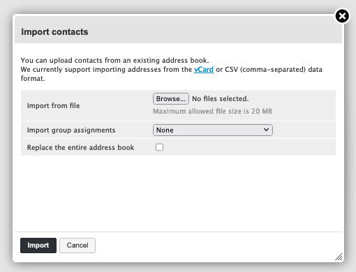{.thumbnail}

#### Exportar los contactos <a name="export-contacts"></a>

Desde la ventana `Contactos`{.action}, en la barra superior, haga clic en la flecha apuntando hacia abajo a la derecha del botón `Exportar`{.action}.

Puede elegir entre:

- `Exportar todo`{.action} y todos los contactos se exportarán en un archivo **.vcf**.
- `Exportar la selección`{.action} para exportar únicamente los elementos que haya seleccionado en la columna `Contactos`{.action}.

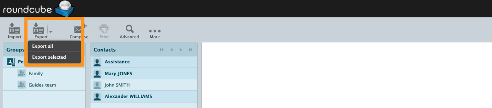{.thumbnail}

### Respuestas (plantillas) <a name="responses"></a>

Esta función permite crear plantillas de respuesta al redactar un correo electrónico.

Desde Roundcube, haga clic en `Configuración`{.action} en la barra superior y, a continuación, en `Respuestas`{.action} en la columna izquierda.

Para añadir una respuesta, haga clic en el botón `+`{.action} en la parte inferior de la columna `Respuestas`.

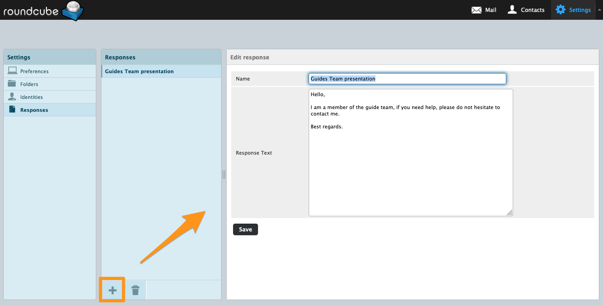{.thumbnail}

> [!primary]
>
> Las "respuestas" se redactan en formato "texto sin formato".

### Añadir un contestador o respuesta automática <a name="automatic-respond"></a>

Si desea añadir una respuesta automática a su dirección de correo electrónico cuando esté ausente o no disponible, esta función no puede activarse desde el webmail, sino desde su [área de cliente de OVHcloud](/links/manager), en la interfaz de gestión de sus direcciones de correo electrónico. Consulte nuestra guía "[Crear un contestador para su dirección de correo electrónico](/pages/web_cloud/email_and_collaborative_solutions/mx_plan/feature_auto_responses/)".

### Cambiar la contraseña de su dirección de correo electrónico <a name="password"></a>

Para cambiar la contraseña de su dirección de correo electrónico, debe conectarse a su [área de cliente de OVHcloud](/links/manager), en la interfaz de gestión de sus direcciones de correo electrónico. Consulte nuestra guía "[Cambiar la contraseña de una dirección de correo electrónico](/pages/web_cloud/email_and_collaborative_solutions/mx_plan/email_change_password/)".

### Redacción de un correo electrónico <a name="email-writing"></a>

Desde la pestaña `Correo electrónico`{.action} en la barra superior, haga clic en `Redactar`{.action}.

En la ventana de redacción de un correo electrónico, encontrará los siguientes campos:

- **De**: elegir una [identidad](#identity) para definir el remitente.
- **Para**: añadir destinatarios y/o un [grupo de destinatarios](#group). El botón `+`{.action} a la derecha del campo permite introducir varias direcciones.

> [!primary]
>
> El campo **"Para"** no debe superar los 100 destinatarios, lo que incluye los contactos contenidos en un [grupo](#group).

- **Cc**: a través del botón `Añadir Cc`{.action}, añadir destinatarios en copia simple.
- **Cco**: a través del botón `Añadir Cco`{.action}, añadir destinatarios en copia oculta. Los demás destinatarios del correo electrónico no verán a los que están en Cco.
- **Reenviar a**: a través del botón `Añadir Reenviar a`{.action}, reenviar el correo electrónico a destinatarios.
- **Tipo de editor**:
    - `Texto sin formato`: únicamente texto sin formato.
    - `HTML`: texto con formato. Aparece una barra de herramientas HTML sobre la ventana de entrada.
- **Prioridad** del correo electrónico.
- **Aviso de apertura del correo electrónico**: se solicita un acuse de recibo al destinatario.
- **Notificación del estado de entrega** cuando el correo electrónico haya sido transmitido correctamente al destinatario.
- **Guardar el correo electrónico enviado en**: elegir la carpeta en la que se almacenará una copia del correo electrónico.

En la barra superior, están disponibles las siguientes acciones:

- `Cancelar`{.action} la redacción de un correo electrónico con una solicitud de confirmación.
- `Enviar`{.action} un correo electrónico.
- `Guardar`{.action} un correo electrónico en la carpeta especial "borrador".
- `Ortografía`{.action}, para verificar el texto, con un menú que permite elegir el idioma.
- `Adjuntar`{.action} un archivo a un correo electrónico.
- `Firma`{.action}: añade la firma asociada a [la identidad](#identity) seleccionada.
- `Respuestas`{.action}: añade una plantilla preregistrada en la sección [Respuestas](#responses).

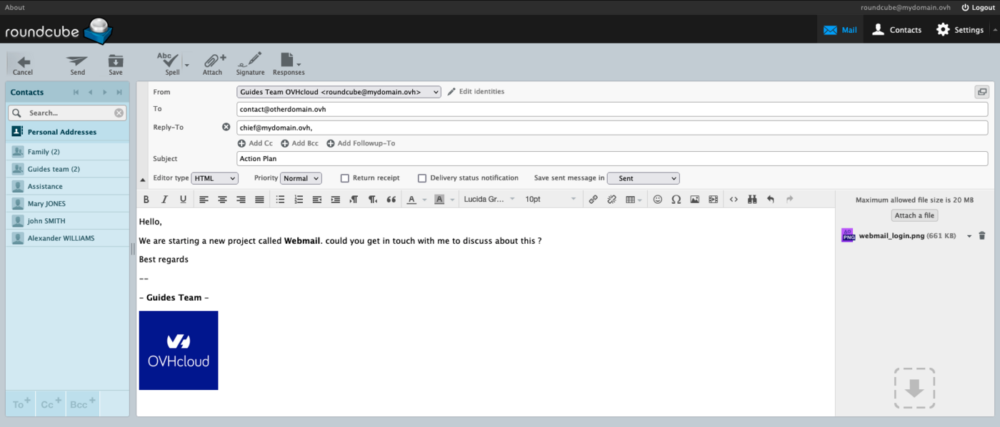{.thumbnail}

### Casos de uso <a name="usecase"></a>

#### Error de comprobación de la solicitud

Recibe el siguiente mensaje cuando intenta acceder a su webmail Roundcube:

```console
ERROR DE VERIFICACIÓN DE LA SOLICITUD
Para su protección, el acceso a este recurso está protegido contra los ataques CSRF.
Si ve este mensaje, probablemente no se haya desconectado antes de salir de la aplicación web.
Ahora se requiere una interacción humana para continuar.
Póngase en contacto con el administrador de su servidor.
```

Como se indica en el mensaje, su cuenta de correo electrónico se considera ya conectada. Aquí hablamos de "sesión". Esto significa que su cuenta de correo electrónico ya está en uso a ojos del servidor de correo electrónico y que esta sesión anterior debe cerrarse. Compruebe que su cuenta de correo electrónico no está ya abierta en Roundcube. Vacíe también los datos en caché de su navegador de Internet.

## Más información

[Primeros pasos con la solución MX Plan](/pages/web_cloud/email_and_collaborative_solutions/mx_plan/email_generalities)

[Cambiar la contraseña de una dirección de correo electrónico MX Plan](/pages/web_cloud/email_and_collaborative_solutions/mx_plan/email_change_password)

[Crear un contestador para su dirección de correo electrónico](/pages/web_cloud/email_and_collaborative_solutions/mx_plan/feature_auto_responses/)

[Crear filtros para sus direcciones de correo electrónico](/pages/web_cloud/email_and_collaborative_solutions/mx_plan/feature_filters)

[Utilizar las redirecciones de correo electrónico](/pages/web_cloud/email_and_collaborative_solutions/common_email_features/feature_redirections)

Interactúe con nuestra [comunidad de usuarios](/links/community).
