> [!primary]
> Esta tradução foi automaticamente gerada pelo nosso parceiro SYSTRAN. Em certos casos, poderão ocorrer formulações imprecisas, como por exemplo nomes de botões ou detalhes técnicos. Recomendamos que consulte a versão inglesa ou francesa do manual, caso tenha alguma dúvida. Se nos quiser ajudar a melhorar esta tradução, clique em "Contribuir" nesta página.
>

## Objetivo

Com a oferta MX Plan OVHcloud, pode enviar e-mails a partir de um software de terceiros ou através de um webmail. A OVHcloud oferece um serviço de e-mail online chamado Roundcube que permite o acesso a uma conta de e-mail através de um browser web.

**Saiba como utilizar o webmail Roundcube para os seus endereços de e-mail OVHcloud**

## Requisitos

- Dispor de uma solução de e-mail OVHcloud **MX Plan**, proposta entre as nossas [ofertas de alojamento web](/links/web/hosting), incluída num [Alojamento gratuito 100M](/links/web/domains-free-hosting), ou encomendada separadamente como solução autónoma.
- Ter acesso às informações de acesso ao endereço de e-mail MX Plan que pretende consultar. Para mais informações, consulte o nosso guia [Primeiros passos com a oferta MX Plan](/pages/web_cloud/email_and_collaborative_solutions/mx_plan/email_generalities).

## Instruções

**Índice**

- [Aceder ao webmail Roundcube](#roundcube-connexion)
- [Interface geral do webmail Roundcube](#general-interface)
    - [Gestão das pastas (coluna da esquerda)](#leftcolumn)
    - [Lista de e-mails recebidos/enviados (parte superior)](#topwindow)
        - [Tipo de visualização](#topwindow-display)
        - [Ação sobre um e-mail selecionado](#topwindow-action)
        - [Procurar um e-mail](#topwindow-search)
    - [Conteúdo de mensagem de correio eletrónico (janela inferior)](#lowerwindow)
- [Configurar as preferências da interface Roundcube](#roundcube-settings)
    - [Interface de Utilizador](#user-interface-settings)
    - [Vista da caixa de correio](#mail-view-settings)
    - [Ver mensagens de correio eletrónico](#mail-display-settings)
    - [Correio eletrónico](#mail-writing-settings)
    - [Contactos](#contacts-settings)
    - [Pastas especiais (predefinidas)](#special-folder-settings)
    - [Definições do servidor](#server-settings)
    - [Encriptação](#encryption)
- [Gerir identidades e respetivas assinaturas](#identity-signature)
    - [Identity](#identity)
    - [Assinatura](#signature)
- [Livro de contactos](#contact-book)
    - [Grupos](#group)
    - [Contactos](#contacts)
    - [Importar Contactos](#import-contacts)
    - [Exportar os Contactos Roundcube](#export-contacts)
- [Respostas (templates)](#responses)
- [Adicionar uma resposta automática ou resposta automática](#automatic-respond)
- [Alterar a palavra-passe do seu endereço de e-mail](#password)
- [Escrevendo um e-mail](#email-writing)
- [Casos práticos](#usecase)


### Aceder ao webmail Roundcube <a name="roundcube-connexion"></a>

Aceda à página <https://www.ovh.com/pt/mail/>. Introduza um endereço de e-mail e a password, e depois clique em `Ligação`{.action}. 

{.thumbnail}

Será então redirecionado para a interface Roundcube.

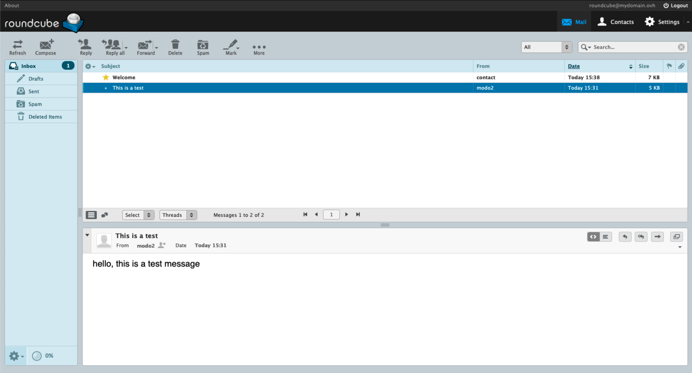{.thumbnail}

> [!primary]
> 
> Ao fazer login pela primeira vez na interface Roundcube, o aspeto pode ser diferente daquele que você verá neste manual. Isto significa que a aparência "clássica" foi definida na sua interface. Para alterar esta informação, vá à secção "[Interface do Utilizador](#user-interface-settings)" e selecione a visualização "Larry".
> O aspeto da interface não irá afetar as seguintes explicações neste manual.

> [!warning]
> 
> Se for redirecionado para uma interface **O**utlook **W**eb **A**pp (OWA), isto significa que está na última versão da oferta MX Plan. Para mais informações sobre a sua oferta MX Plan, consulte a nossa página [Primeiros passos com a oferta MX Plan](/pages/web_cloud/email_and_collaborative_solutions/mx_plan/email_generalities).
>
> Para se familiarizar com a interface **OWA**, consulte o nosso guia [Consultar a sua conta de e-mail a partir da interface OWA](/pages/web_cloud/email_and_collaborative_solutions/using_the_outlook_web_app_webmail/email_owa).

### Interface geral do webmail Roundcube <a name="general-interface"></a>

Depois de aceder à sua conta de e-mail, terá acesso à janela principal de Roundcube, que é composta por 3 zonas:

- [**Coluna da esquerda**](#leftcolumn): a arborescência da sua conta de e-mail, composta por pastas e sub-pastas. A pasta principal é a `caixa de entrada`.

- [**Janela superior**](#topwindow): a lista dos e-mails contidos na pasta selecionada na coluna da esquerda.

- [**Janela inferior**](#lowerwindow): o conteúdo do e-mail selecionado na janela superior.

#### Gestão das pastas (coluna da esquerda) <a name="leftcolumn"></a>

Nesta zona, aparecem as pastas presentes na sua conta de e-mail.

Para gerir com mais precisão as pastas, clique na roda dentada na parte inferior da coluna e, a seguir, em `Gerir pastas.`{.action}

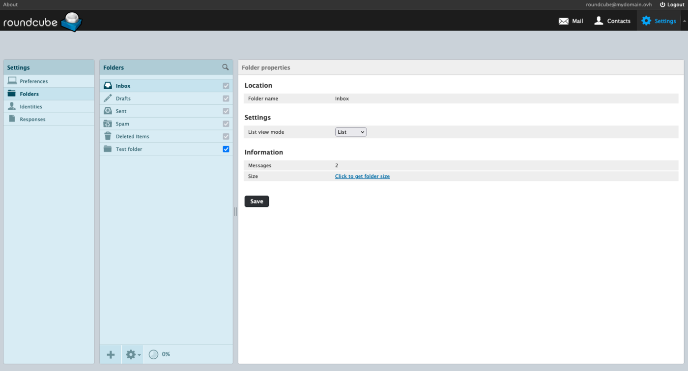{.thumbnail}

Para criar uma pasta, clique no botão `+`{.action} no fundo da coluna `Pastas`.

Para eliminar uma pasta, selecione a pasta em causa, clique na roda dentada no fundo da coluna `Pastas` e, a seguir, em `Eliminar`{.action}. Para apagar o conteúdo mas guardar a pasta, clique em `Esvaziar`{.action}.

As casas a assinalar ao nível dos dossiers correspondem às "assinaturas". A subscrição determina se a pasta deve ou não ser apresentada na interface webmail ou no software de correio, conservando o conteúdo da pasta. O objetivo é apenas ocultar ou apresentar uma pasta na conta de e-mail.

> [!primary]
>
> As pastas com uma opção cinzenta são pastas especiais. Não é possível eliminá-los ou retirá-los.

#### Lista dos e-mails recebidos/enviados (janela superior) <a name="topwindow"></a>

Esta janela apresenta o conteúdo da pasta selecionada na coluna da esquerda. 

##### Tipo de visualização <a name="topwindow-display"></a>

Esta janela é apresentada de forma personalizada. Para isso, clique na roda dentada situada no canto superior esquerdo desta janela.

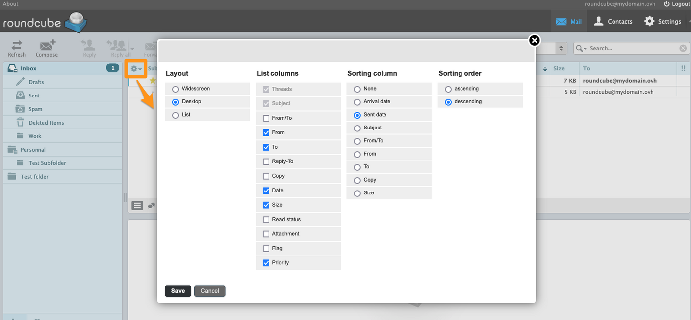{.thumbnail}

É possível configurar os seguintes elementos:

- **Disposição**: permite determinar a disposição das janelas de gestão de uma conta de e-mail.
- **Colunas da lista**: permite adicionar colunas a apresentar (prioridades dos e-mails, etc.).
- **Coluna de triagem**: permite escolher a coluna na qual a triagem predefinida será efetuada.
- **Ordem de triagem**: permite escolher a ordem de triagem ascendente ou descendente, em função da coluna de triagem.

##### Ação sobre um e-mail selecionado <a name="topwindow-action"></a>

Quando um e-mail é selecionado, pode alterar o sistema. Veja as ações possíveis:

- `Responder`{.action}: responder diretamente ao expedidor.
- `Responder a todos`{.action}: responder diretamente a todos os destinatários presentes nos campos "A" e "Cópia".
- `Reencaminhar`{.action}: transferir o e-mail selecionado para um ou vários destinatários.
- `Eliminar`{.action}: colocar o e-mail selecionado no "Corbeille".
- `Spam`{.action}: colocar o e-mail selecionado diretamente na caixa de correio indesejável (Junk), qualificá-lo como **spam**.
- `Marcar`{.action}: determinar manualmente o estado de um e-mail.
- `Mais`{.action} 
    - `Imprimir`{.action}.
    - `Guardar como (.eml)`{.action}: recuperar o cabeçalho do e-mail e o seu conteúdo.
    - `Editar como novo`{.action}: criar um novo e-mail com base no e-mail selecionado.
    - `Mostrar código fonte`{.action}: mostrar o e-mail na sua forma bruta com o cabeçalho.
    - `Migrar para`{.action}: mover o e-mail para uma pasta.
    - `Copiar para`{.action}: copiar o e-mail para uma pasta.
    - `Abrir numa nova janela`{.action}.

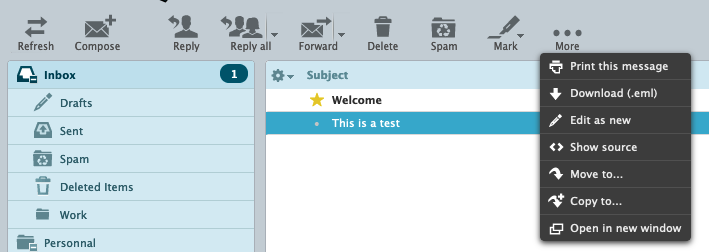{.thumbnail}

> [!primary]
>
> Se um dos seus correspondentes solicitar que lhe seja enviado um aviso de leitura ao ler o seu e-mail, receberá a seguinte mensagem: `o remetente desta mensagem pediu para ser avisado quando ler esta mensagem. Deseja avisar o remetente?`.
> 

##### Procurar um e-mail <a name="topwindow-search"></a>

Uma ferramenta de pesquisa está disponível na parte superior direita da interface.

Clique na seta situada à direita da lupa para apresentar os filtros de pesquisa.

#### Conteúdo de um e-mail (janela inferior) <a name="lowerwindow"></a>

Quando um e-mail é selecionado na lista, aparece na janela inferior.

Encontre os atalhos, à direita, das seguintes funções:

- Apresentar em formato HTML (predefinido)
- Apresentar em formato texto claro
- Responder
- Responder a todos
- Reencaminhar
- Abrir numa nova janela 

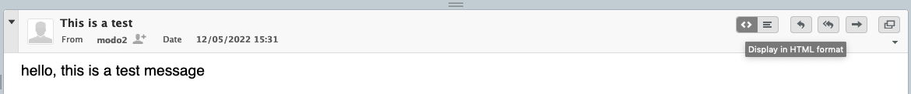{.thumbnail}

### Configurar as preferências da interface Roundcube <a name="roundcube-settings"></a>

Os capítulos seguintes deste guia correspondem aos separadores que compõem a parte `Preferências`{.action} dos `Definições`{.action} de Roundcube. A sua descrição não é exaustiva.

{.thumbnail}

#### Interface do utilizador <a name="user-interface-settings"></a>

Defina aqui a `Idioma` de utilização da interface Roundcube, o `fuso horário`, o `formato da hora` e o `formato de data`.

A opção `Formatar datas` permite apresentar a data de receção/envio com termos relativos como "Hoje", "Ontem", etc.<br>
**Por exemplo**: somos a **19/05/2022**, um e-mail enviado/recebido a **17/05/2022** às **17:38** será apresentado **Ter 17:38**, pois o email corresponde à terça-feira anterior.

A casa `Mostrar próxima entrada da lista após eliminar/mover` significa que, após uma ação de supressão ou migração para um e-mail, o elemento da linha inferior será sistematicamente selecionado, seja qual for a ordem de escolha. 

Pode escolher a estética de afixação da sua interface. Pode escolher entre exibir **Classic** ou **Larry**.

#### Visualização da Caixa de Entrada <a name="mail-view-settings"></a>

Defina aqui a ergonomia para visualizar e agir sobre os e-mails. A opção `Modelo` permite organizar as 3 janelas descritas na parte [Interface geral do webmail Roundcube](#topwindow).

#### Visualização de mensagens <a name="mail-display-settings"></a>

Defina a forma como os e-mails são apresentados.<br>
Para assegurar que os e-mails formatados pelo remetente se apresentam corretamente, é aconselhável ter a opção `Mostrar mensagens em HTML` selecionado.<br>
Também é aconselhável manter a opção `Permitir recursos remotos (imagens, estilos)` para `nunca`. Isto evita carregar os elementos de um e-mail que parece malicioso.

#### Composição de mensagens <a name="mail-writing-settings"></a>

Defina a forma padrão aquando da redação de um e-mail ou de uma resposta.<br>
É aconselhável passar a opção `Escrever mensagens em HTML` sempre de forma `sempre`, para beneficiar por defeito das ferramentas de edição HTML e não alterar uma assinatura HTML.

#### Contactos <a name="contacts-settings"></a>

Personalize aqui a disposição das informações no seu diretório de endereços.

#### Pastas especiais (predefinidas) <a name="special-folder-settings"></a>

Roundcube dispõe de 4 dossiers especiais: `Rascunhos`, `Itens Enviados`, `Spam`, `Reciclagem`.

Não aconselhamos a sua alteração, mas é possível atribuir o comportamento de uma pasta especial a outra criada posteriormente, graças aos menus confusos.<br>

**Por exemplo**, você pode atribuir o comportamento « Rascunhos » a outra pasta que você criou clicando na lista suspensa e selecionando essa pasta. Se nenhuma pasta for atribuída a ele, ele será automaticamente colocado na opção « Drafts ». Os e-mails que forem registados serão considerados como rascunhos até que sejam enviados.

> Na prática, eu crio uma sub-pasta « Rascunhos de e-mails de clientes ». Vou a `As minhas preferências`{.action} / `Pastas especiais`{.action} e escolho a opção "Rascunhos". No menu suspenso, seleciono a pasta "Rascunhos de e-mails de clientes" para substituir "Drafts". Os e-mails redigidos nesta pasta serão considerados rascunhos.

#### Definições do servidor <a name="server-settings"></a>

Neste separador, pode otimizar o espaço ocupado numa conta de e-mail. Com efeito, a opção `Esvaziar a Reciclagem ao sair` permite evitar a acumulação dos elementos que foram suprimidos. A opção `Eliminar diretamente as mensagens no Spam` eliminará automaticamente todos os e-mails considerados como SPAM.

> [!warning]
> 
> Não é aconselhável ativar a opção `Eliminar diretamente as mensagens no Spam` eletrónico quando um falso positivo (e-mail erradamente declarado como "SPAM") for declarado como spam para o servidor de receção. Com efeito, quando um e-mail é colocado na pasta "Por correio eletrónico", é ainda possível verificar se o e-mail é legítimo.

#### Encriptação <a name="encryption"></a>

Se o seu browser lhe permitir, pode instalar e ativar a extensão "Mailvelope". Trata-se de uma extensão do browser que integra o PGP (**P**retty **G**ood **P**rivacy) no seu serviço de mensagens web. O sistema de encriptação PGP e, por conseguinte, a extensão "Mailvelope" permitem:

- Encriptar e desencriptar os e-mails no seu browser.
- Guardar o conteúdo do seu e-mail privado para o seu fornecedor de e-mail.

Só você poderá ler os seus e-mails. Esta extensão é um meio de proteger o seu webmail se receber e-mails de natureza confidencial.

Para mais informações, consulte a FAQ da "Maildeve" em <https://mailvelope.com/faq>.

### Gerir as identidades e a sua assinatura <a name="identity-signature"></a>

A partir do Roundcube, clique em `Definições`{.action} na barra superior e, a seguir, em `Identidades`{.action} na coluna da esquerda. A "identidade" permite personalizar as informações enviadas aos destinatários como, por exemplo, o nome do ecrã ou a assinatura.

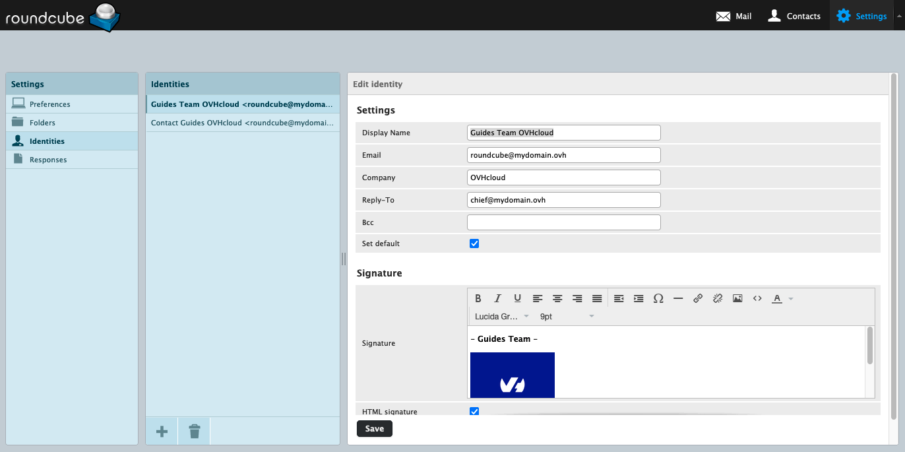{.thumbnail}

#### Parametrizar os atributos de uma identidade <a name="identity"></a>

- **Nome completo**: este nome aparecerá na parte "expedidor" do destinatário
- **E-mail**: corresponde ao endereço a partir do qual é enviado o e-mail.
- **Organização**: campo destinado ao nome de uma sociedade, associação ou outra entidade.
- **Responder a**: atribuir um endereço de e-mail de resposta diferente do do remetente.
- **Bcc**: colocar em cópia oculta um endereço de e-mail aquando de um envio.
- **Marcar como predefinido**: quando houver várias identidades (assinaturas), atribuí-la-á por predefinição.
- **Assinatura**: personalizar o pé de página de um e-mail aquando da sua redação (apelido, nome próprio, cargo ocupado, frases, imagens..).
- **Assinatura HTML**: Ativar o formato HTML na assinatura. 

> [!alert]
> 
> Preencher a caixa de **E-mail** com um endereço de e-mail diferente daquele em que está ligado é considerado um usurpação de identidade eletrónica (*spoofing*). O endereço IP utilizado para o envio pode ser "banido" e/ou considerado "SPAM" junto dos seus destinatários. 

#### Adicionar uma assinatura <a name="signature"></a>

Por predefinição, a casa `assinatura` é em "texto em claro". Este formato não permite uma edição avançada ou a inserção de uma imagem na sua assinatura. Para beneficiar das opções de edição avançada para uma assinatura, aconselhamos que ative o modo HTML ao clicar em **Assinatura HTML** no quadro de introdução.

> [!warning]
> 
> Assim, se a assinatura estiver em formato HTML, será necessário passar para HTML para a redação de um e-mail. Pode ativar esta opção por predefinição para cada redação de e-mail, a partir da secção `Definições`{.action} da interface Roundcube.
> Clique em `Preferências`{.action} na coluna da esquerda e, a seguir, em `Composição de mensagens`{.action}. Para a menção **Redigir e-mails HTML**, selecione `Sempre`.
>

Para inserir uma imagem numa assinatura, a imagem deve ser alojada num servidor (alojamento OVHcloud ou outro).<br>
**A transmissão de uma imagem a partir de um computador não permitirá a sua visualização**.

Clique no botão `< >`{.action} na barra de ferramentas HTML e insira o seguinte código, substituindo `your-image-url` pelo endereço (URL) da imagem e `text-if-image-is-not-displayed` por um texto que substitui a imagem se esta não puder ser apresentada.

```bash

```

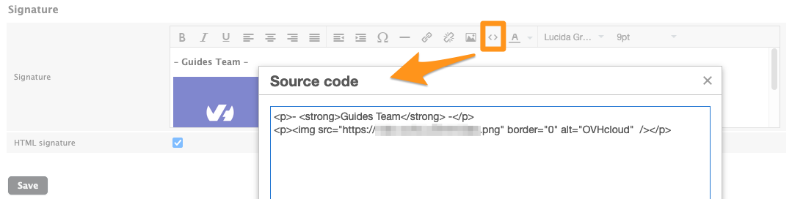{.thumbnail}

### Diretório de contactos <a name="contact-book"></a>

Clique em `Contactos`{.action}, na barra superior, para aceder ao diretório de contactos. Esta é dividida em **3 colunas**:

- **Grupos**: no diretório de endereços, pode criar grupos para classificar os contactos.
- **Contactos**: visualize os contactos do diretório de endereços ou do grupo selecionado.
- **Propriedades do contacto** ou **Adicionar um contacto**: esta janela surge quando um contacto é selecionado ou quando está em criação. Pode ler ou alterar as informações de um contacto.

{.thumbnail}

#### Grupos <a name="group"></a>

Os grupos são subcategorias do diretório de endereços. Permitem classificar os contactos em subconjuntos. Por exemplo, poderá encontrar mais facilmente um contacto num grupo que criou do que no conjunto do seu diretório de endereços. Isto também permite-lhe enviar um e-mail adicionando um grupo ao destinatário, em vez de adicionar um a um os contactos do grupo.

Para criar um grupo, clique no botão `+`{.action} no fundo da coluna `Grupos`. Defina o nome do grupo e clique em `Guardar`{.action} para validar.

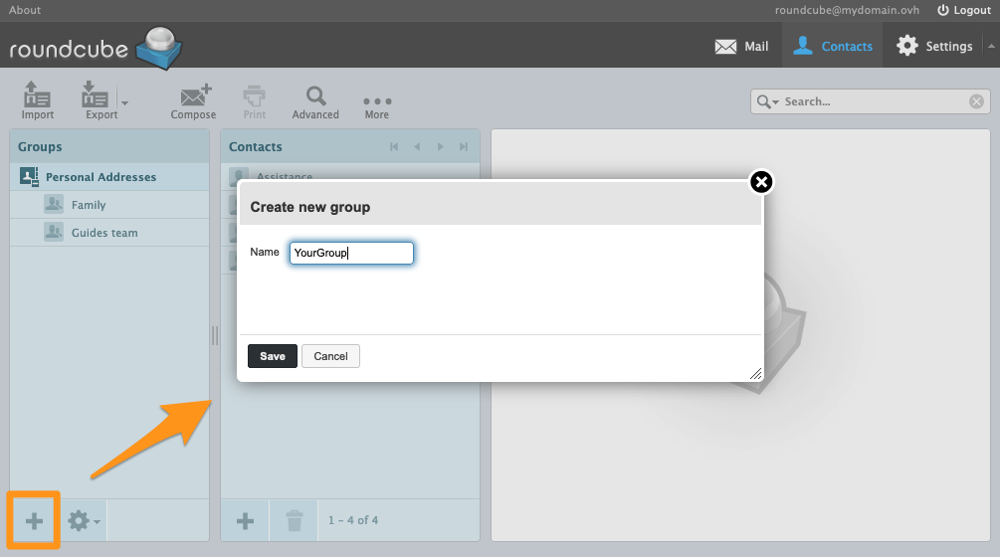{.thumbnail}

Para afetar um contacto a um dos grupos, selecione um contacto na coluna `Contactos` e, na janela que aparecer, clique no separador `Grupos`{.action}. Selecione o grupo que deseja atribuir ao contacto.

#### Contactos <a name="contacts"></a>

Na coluna `Grupos`, selecione o diretório de endereços ou um dos grupos.

> [!primary]
> 
> Quando criar um contacto a partir de um grupo selecionado, o contacto será automaticamente adicionado ao grupo.

Clique no botão `+`{.action} no fundo da coluna `Contactos` para criar um contacto.

{.thumbnail}

De seguida, introduza as informações do contacto.

> [!primary]
> Pode adicionar campos adicionais através do menu pendente `Adicionar campo...`{.action}, situado sob os campos `Primeiro nome` e `Endereço`.

#### Importar Contatos <a name="import-contacts"></a>

Na janela `Contatos`{.action}, na barra superior, clique em `importar`{.action} para abrir a janela de importação.

- `Importar do arquivo`: selecione um ficheiro CSV ou um ficheiro vCard no seu computador. Os contactos no seio de um ficheiro CSV devem ser separados por vírgulas. O ficheiro não deve ter mais de 20MB.
- `Importar atribuições do grupo`: Se os contactos do seu ficheiro estão repartidos por grupos, pode ativar esta opção para encontrar esta organização ou deixar esta opção em `nenhuma` para que nenhum grupo seja afetado aos contactos.
- `Substituir o catálogo de endereços atual`: Se o diretório já estiver configurado, recomendamos que o exporte antes de selecionar esta opção ou de ter a certeza de que quer substituí-lo definitivamente.

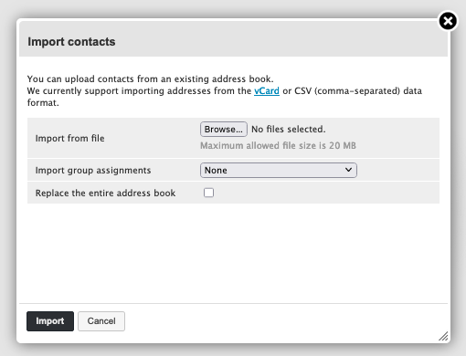{.thumbnail}

#### Exportar os Contactos Roundcube <a name="export-contacts"></a>

Na janela `Contatos`{.action}, no canto superior direito, clique no botão `Exportar`{.action}, no botão virado para baixo.

Pode escolher entre:

- `Exportar todos`{.action} e o conjunto dos contactos será então exportado num ficheiro **.vcf**.
- `Exportar a selecionados`{.action} para exportar unicamente os elementos que escolheu na coluna `Contatos`{.action}.

{.thumbnail}

### Respostas (templates) <a name="responses"></a>

Esta função permite criar templates de resposta aquando da redação de um e-mail.

No Roundcube, clique em `Definiçõe`{.action} na barra superior e, a seguir, em `Respostas`{.action} na coluna da esquerda.

Para adicionar uma resposta, clique no botão `+`{.action} no fundo da coluna `Respostas`.

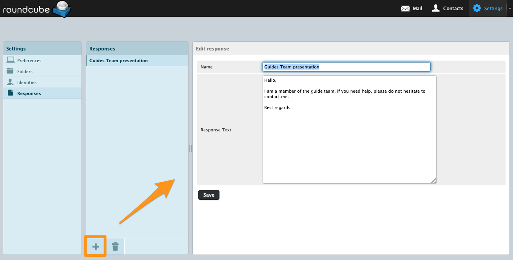{.thumbnail}

> [!primary]
> 
> As "respostas" são redigidas no formato de "texto em branco".

### Adicionar uma resposta automática ou resposta automática <a name="automatic-respond"></a>

Deseja adicionar uma resposta automática ao seu endereço de e-mail quando estiver ausente ou indisponível. Esta função não pode ser ativada a partir do webmail, mas sim a partir da [Área de Cliente OVHcloud](/links/manager), na interface de gestão dos seus endereços de e-mail. Consulte o guia "[Criar uma resposta automática para o endereço de e-mail](/pages/web_cloud/email_and_collaborative_solutions/mx_plan/feature_auto_responses)".

### Alterar a palavra-passe do endereço de e-mail <a name="password"></a>

Para alterar a palavra-passe do seu endereço de e-mail, deve ligar-se à [Área de Cliente OVHcloud](/links/manager), na interface de gestão dos seus endereços de e-mail. Consulte o guia "[Alterar a palavra-passe de um endereço de e-mail](/pages/web_cloud/email_and_collaborative_solutions/mx_plan/email_change_password)".

### Redação de um e-mail <a name="email-writing"></a>

No separador `E-mail`{.action} na barra superior, clique em `Ediger`{.action}.

Na janela de redação de um e-mail, encontram-se os seguintes campos: 

- **Remetente**: escolher uma [identidade](#identity) para definir o remetente.
- **Para+**: adicionar destinatários e/ou um [grupo de destinatários](#group).

> [!primary]
> 
> O campo **"A"** não deve exceder os 100 destinatários, incluindo os contactos contidos num [grupo](#group).

- **Adicionar Cc+**: adicionar destinatários em cópia simples.
- **Adicionar Bcc+**: adicionar destinatários em cópia oculta. Os outros destinatários do e-mail não verão estes no Cci.
- **Adicionar Responder para**: enviar o e-mail aos destinatários.
- **Tipo de editor**:  
    - `Texto claro`: apenas do texto sem qualquer forma.
    - `HTML`: texto com forma. Aparecerá uma barra de ferramentas HTML acima da janela de introdução.
- **Prioridade** do e-mail.
- **Recibo de leitura**: é pedido ao destinatário um aviso de receção.
- **Recibo de entrega** quando o e-mail foi enviado ao destinatário.
- **Guardar mensagem enviada em**: escolher a pasta na qual uma cópia do e-mail será armazenada.

Na barra superior, estão disponíveis as seguintes ações:

- `Cancelar`{.action} a redação de um e-mail com um pedido de confirmação.
- `Enviar`{.action} um e-mail.
- `Guardar`{.action} um e-mail na pasta especial "rascunho"
- ` Corretor ortográfico`{.action}, para verificar o texto, com um menu que permite a escolha da língua.
- `Anexar`{.action} um ficheiro a um e-mail.
- `Assinatura`{.action}: adiciona a assinatura associada [à identidade](#identity) selecionada.
- `Respostas`{.action}: adiciona um template pré-registado na parte [Respostas](#responses).

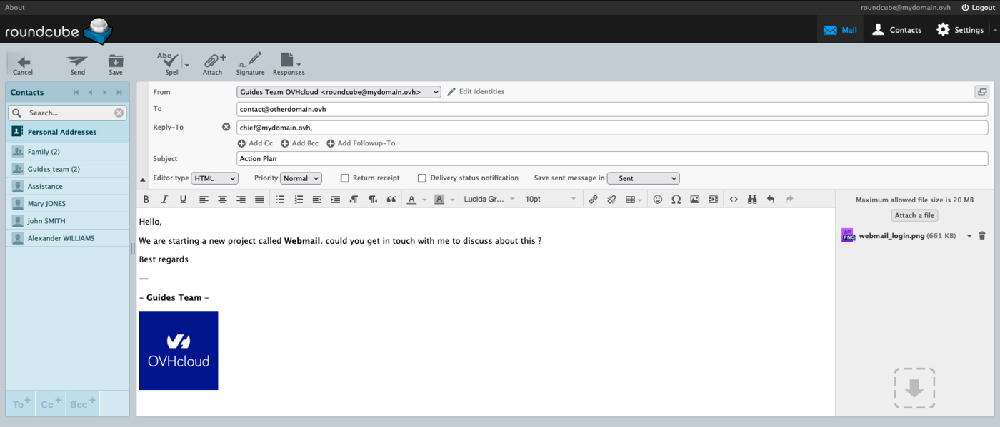{.thumbnail}

### Casos de utilização <a name="usecase"></a>

#### Falha na verificação do pedido

Ao tentar acessar seu webmail Roundcube, você encontrará a seguinte mensagem:

```console
FALHA NA VERIFICAÇÃO DO PEDIDO
Para sua proteção, o acesso a este recurso está protegido contra ataques CSFR.
Se você ver isso, provavelmente você não se desconectou antes de sair do aplicativo da Web.
A interação humana é agora necessária para continuar.
Contacte o administrador do seu servidor.
```

Como indicado nesta mensagem, a sua conta de e-mail já se encontra online. Esta secção descreve "sessão", o que significa que a sua conta de e-mail já se encontra em curso de utilização aos olhos do servidor de e-mail e que esta sessão anterior deve ser encerrada Certifique-se de que a sua conta de e-mail ainda não foi aberta no roundcube. Esvazie igualmente os dados em cache no seu browser.

## Quer saber mais?

[Primeiros passos com a oferta MX Plan](/pages/web_cloud/email_and_collaborative_solutions/mx_plan/email_generalities)

[Alterar a palavra-passe de um endereço de e-mail MX Plan](/pages/web_cloud/email_and_collaborative_solutions/mx_plan/email_change_password)

[Criar uma resposta automática para o endereço de e-mail](/pages/web_cloud/email_and_collaborative_solutions/mx_plan/feature_auto_responses)

[Criar filtros para os seus endereços de e-mail](/pages/web_cloud/email_and_collaborative_solutions/mx_plan/feature_filters)

[Utilizar os reencaminhamentos de e-mail](/pages/web_cloud/email_and_collaborative_solutions/common_email_features/feature_redirections)
 
Fale com nossa comunidade de utilizadores: <https://community.ovh.com/en/>.