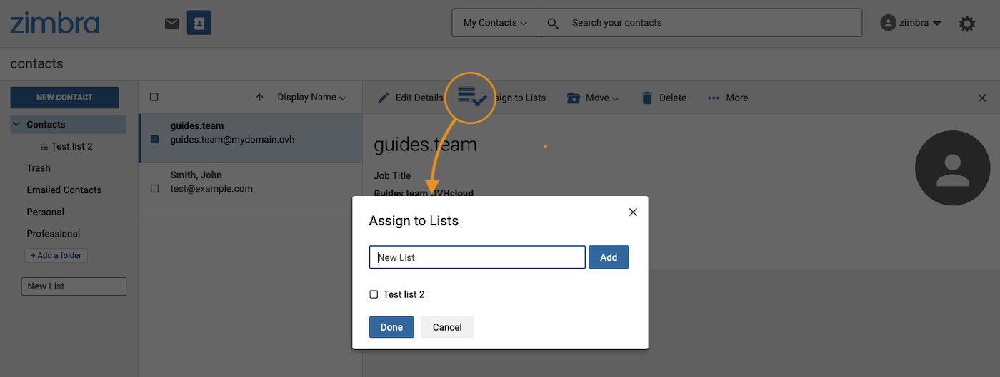

> [!primary]
>
> **Information**
>
> Zimbra est un produit en cours de déploiement. Actuellement, il est uniquement disponible dans le cadre de migrations concernant l'évolution de notre offre MXplan. Cette migration est automatique, un e-mail vous sera transmis lorsque vous serez concerné.

## Objectif

Avec l'offre MX Plan OVHcloud, vous pouvez envoyer et recevoir des e-mails depuis un client de messagerie (Thunderbird, Outlook, Mail de Mac) ou via un webmail directement sur le navigateur internet de votre appareil. OVHcloud fournit un service de webmail appelé Zimbra pour accéder à un compte e-mail de type MXplan. Sur cette page, nous allons aborder les fonctions indispensables à l'utilisation de ce webmail.

**Découvrez comment utiliser le webmail Zimbra pour vos adresses e-mail MXplan OVHcloud**

## Prérequis

- Disposer d'une solution e-mail OVHcloud **MX Plan**, proposée parmi nos [offres d’hébergement web](https://www.ovhcloud.com/fr/web-hosting/), incluse dans un [hébergement gratuit 100M](https://www.ovhcloud.com/fr/domains/free-web-hosting/), ou commandée séparément comme solution autonome.
- Disposer des informations de connexion à l’adresse e-mail MX Plan que vous souhaitez consulter. Pour plus d'informations, consultez notre guide [Premiers pas avec l'offre MX Plan](/pages/web_cloud/email_and_collaborative_solutions/mx_plan/email_generalities).

## En pratique

**Sommaire**

- [Se connecter au webmail Zimbra](#login)
- [Interface générale du webmail Zimbra](#general-interface)
- [Gestion des dossiers de votre compte e-mail](#folders-management)
    - [Les dossiers spéciaux](#folders-specials)
    - [Créer ses dossiers](#folders-created)
 - [Traitement des e-mails](#email-management)
    - [Action sur un e-mail sélectionné](#email-action)
    - [Rechercher un e-mail](#email-search)
- [Rédiger un e-mail](#email-writing)
- [Configurer les préférences de l'interface Zimbra](#settings)
- [Contacts](#contacts)
    - [Gestion des dossiers](#contacts-folders)
    - [Gestion des listes](#contacts-list)
    - [Importer des Contacts](#import-contacts)
    - [Exporter les Contacts Zimbra](#export-contact)
- [Filtres](#filters)
    - [Comprendre comment paramètrer ses filtres](#filters-howto)
    - [Créer un filtres](#filters-creation)
- [Délégations](#delegations)
- [Identités](#identities)
- [Signatures](#signatures)
- [Réponses automatique / Répondeur](#responder)

### Se connecter au webmail Zimbra 

Rendez-vous sur la page <https://www.ovh.com/fr/mail/>. Saisissez votre adresse e-mail et le mot de passe, puis cliquez sur `Connexion`{.action}.

{.thumbnail}

Vous serez alors redirigé vers l'interface Zimbra.

{.thumbnail}

### Interface générale du webmail Zimbra 

Une fois connecté à votre compte e-mail, vous avez accès à la fenêtre principale de Zimbra qui se compose de 3 zones :

> [!tabs]
> **Menu supérieur**
>>
>> **(1)** Cette zone de l'interface vous permet de choisir une des fonctionnalités disponibles sur votre compte e-mail, `messagerie` ou `contacts`. Par défaut, vous êtes sur l'onglet `messagerie`. **(2)** Une barre de recherche vous permet de retrouver les éléments associés à la fonctionnalité sélectionnée. **(3)** le Menu de gestion du profil de votre compte e-mail et  **(4)** le bouton d'accès aux réglages.
>>
>> {.thumbnail}
>>
> **Colonne de gauche**
>>
>> Par défaut, c'est l'arborescence de votre compte de messagerie, composée de dossiers et sous-dossiers. Le dossier principal étant `Réception`.
>>
>> {.thumbnail}
>>
> **Fenêtre centrale**
>>
>> Par défaut, vos e-mails sont affichés dans cette zone décomposée en deux parties:
>>
>> - **(1)** la liste des éléments
>> - **(2)** le contenu de l'élément sélectionné
>>
>> {.thumbnail}
>>

### Gestion des dossiers de votre compte e-mail (colonne de gauche) 

Dans cette zone apparaissent les dossiers présents sur votre compte e-mail. Vous y trouverez les dossiers **spéciaux** déjà présent (en orange) , et les dossiers que vous aurez **créés** (en vert).

{.thumbnail}

#### Les dossiers spéciaux 

Les dossiers spéciaux sont automatiquement créés par le serveur e-mail, ils composent l'essentiel d'un compte e-mail.

- **Réception** : les e-mails sont délivrés par défaut dans ce dossier (hors filtres appliqués)
- **Brouillons** : les e-mails rédigés mais non-expédiés sont sauvegardés dans ce dossier
- **Envoyé** : les e-mails envoyés sont automatiquement stockés dans ce dossier
- **Archiver** : dossier par défaut pour classer les e-mails traités
- **SPAM** : dossier où les e-mails considérés comme malveillant
- **Corbeille** : Les e-mails supprimés sont stockés dans ce dossier avant d'être définitivement supprimés

> [!warning]
>
> Les dossiers spéciaux ne peuvent pas être supprimés.

#### Créer ses dossiers 

Pour classer vos e-mails selon vos besoins, vous avez la possibilité de créer vos propres dossiers.

Pour créer un dossier, cliquez sur le bouton `+ Ajouter un dossier`{.action} en bas de la colonne.

Vous pouvez également créer un sous-dossier en effectuant un clique droit sur le dossier de votre choix, puis en cliquant sur `Créer un sous-dossier`{.action}. Néanmoins, les dossiers « Brouillons », « SPAM » et « Corbeille » ne permettent pas la création de sous-dossiers.

### Traitement des e-mails 

Lorsque vous sélectionnez un dossier ou sous-dossier dans la colonne de gauche, la liste des e-mails contenus dans celui-ci s'affiche dans la colonne au centre. Cliquez ensuite sur l'e-mail de votre choix pour afficher son contenu dans la fenêtre de droite.

> [!primary]
>
> **Type d'affichage**
>
> L'affichage de vos e-mails se présente sous une forme qui peut être modifiée. Pour cela, cliquez le bouton `Afficher`{.action} situé en haut à droite de cette fenêtre.

#### **Action sur un e-mail sélectionné** 

Lorsqu'un e-mail est sélectionné, il est possible d'agir sur celui-ci. Voici les actions possibles :

- 1.`Répondre`{.action} : répondre directement à l'expéditeur
- 2.`Répondre à tous`{.action} : répondre directement à tous les destinataires présents dans les champs « A » et « Copie »
- 3.`Transférer`{.action} : transférer l'e-mail sélectionné à un ou plusieurs destinataires
- 4.`Archiver`{.action} : déplacer l'e-mail vers le dossier « Archive » de votre compte e-mail
- 5.`Déplacer`{.action} : déplacer l'e-mail d'un des dossiers du compte e-mail
- 6.`Supprimer`{.action} : placer l'e-mail sélectionné dans la « Corbeille »
- 7.`SPAM`{.action} : placer l'e-mail sélectionné directement dans la boîte du courrier indésirable (SPAM)
- 8.`Plus`{.action}
    - `Marquer comme lu`{.action}.
    - `Marquer comme non lu`{.action}.
    - `Étoile`{.action} : attribuer une étoile à votre e-mail pour le mettre en valeur et l'identifier plus facilement
    - `Supprimer l'étoile`{.action} : retirer l'étoile attribuée à cet e-mail
    - `Bloquer`{.action} : afficher l'e-mail sous sa forme brute avec l'en-tête
    - `Afficher l'original`{.action} : Afficher le message dans son intégralité, corps et en-tête
    - `Nouveau filtre`{.action} : créer un filtre à partir de l'expéditeur et de l'objet du message sélectionné
    - `imprimer`{.action} : imprimer la conversation ou l'e-mail sélectionné
- 9.`Afficher`{.action} : sélectionner l'une des 3 dispositions pour visualiser vos dossiers et e-mails

{.thumbnail}

Il est possible d'accéder à ces options en réalisant un clique droit sur chacun des e-mails de la colonne centrale.

> [!primary]
>
> Si l'un de vos correspondants demande à ce qu'un accusé de lecture lui soit adressé lorsque vous lisez son e-mail, vous obtiendrez ce type message suivant : `John a demandé un accusé de lecture pour ce mail. Envoyer un accusé de lecture`.
>

#### **Rechercher un e-mail** 

Si vous souhaitez retrouver un e-mail, vous trouverez une barre de recherche dans la partie supérieure de votre interface. Il est possible d'effectuer une **recherche simple** ou une **recherche avancée**, comme décrite dans les  onglets ci-dessous :

> [!tabs]
> **Recherche simple**
>>
>> Saisissez le ou les mots clés que vous souhaitez retrouvez dans la barre de recherche et taper sur la touche `Entrée` pour valider votre recherche. Le ou les mots apparaîtront en surbrillance dans vos résultats.
>>
>> {.thumbnail}
>>
> **Recherche avancée**
>>
>> Pour une recherche plus précise, cliquez sur le chevron dans la partie droite de votre barre de recherche. Vous pourrez ainsi restreindre, votre recherche sur un dossier, une plage horaire, dans l'objet ou le corps du message, etc.
>>
>> {.thumbnail}
>>

### Rediger un e-mail

Pour rédiger un nouvel e-mail, cliquez sur le bouton `Nouveau Message`{.action} (1) dans la partie supérieure gauche de votre fenêtre Zimbra.

{.thumbnail}

> [!tabs]
> **En-tête**
>>
>> Dans la partie en-tête, vous pourrez compléter les champs suivant: 
>>
>> - **De** : L'adresse depuis laquelle vous envoyez votre e-mail. Par défaut, c'est votre adresse e-mail, si et seulement si une [délégation](#delegation) a été mise en place, vous pouvez la changer votre adresse d'expéditeur en cliquant sur le chevron à droite de votre adresse e-mail 
>> - **À** : le destinataire de votre e-mail, en cliquant sur `À`{.action}, vous accédez à votre [carnet d'adresses], pour sélectionner vos destinataires 
>> - **Cc** : Cliquez sur `Cc/Cci`{.action} à droite du champ `À`{.action} pour afficher ce champ. La copie carbone est un champ destinataire qui permet d'envoyer votre e-mail en copie à des personnes que vous souhaitez intégrer dans une boucle sans pour autant qu'ils soient considérés comme destinataire direct de l'e-mail comme peut l'être le champ « **De** » 
>> - **CCi** : Cliquez sur `Cc/Cci`{.action} à droite du champ `À`{.action} pour afficher ce champ. La copie carbone invisible est un champ destinataire qui permet de transmettre un e-mail sans que les autres destinataires voient la ou les personnes en « **Cci** » 
>> - **Objet** : Titre de l'e-mail , premier élément visible à la réception avant d'ouvrir l'e-mail 
>> - `...`{.action} : situé à droite du champ `De`{.action}, il vous donne accès à 3 options. 
>>    - Vous pouvez qualifié votre e-mail comme prioritaire en cochant `Haute priorité`. 
>>    - Cliquez sur `Demander un accusé de lecture` pour demander une confirmation de lecture du destinataire. 
>>    - La fonction `Texte brut` désactivera les fonctions de mise en page HTML de votre e-mail.  
>>
>> {.thumbnail}
>>
> **Corps de l'e-mail**
>>
>> Pour rédiger le corps de votre e-mail, vous disposerez d'une barre d'outils HTML dans la partie inférieure de votre fenêtre. Cela vous permettra une rédaction de vos e-mails avec mise en page, directement via votre navigateur. De plus, le bouton `< >`{.action}, tout à droite dans votre barre d'outils vous ouvre une fenêtre dans laquelle vous pouvez coller un e-mail que vous aurez pré-rédiger depuis un outil externe.
>>
>> {.thumbnail}
>>

Après avoir rédigé votre e-mail, avant de cliquez sur `Envoyez`{.action}, vous pouvez y joindre une pièce en cliquant sur l'icône de trombone situé à côté du bouton `Envoyez`{.action}.

{.thumbnail}
   
> [!primary]
> 
> Si vous avez activé l'option `Annuler l'envoi` dans la rubrique « **Écrire un mail** » des préférences Zimbra, vous pouvez cliquez sur `DEFAIRE`{.action} pour annuler l'envoi, cette fenêtre apparaît environ 5 secondes.
>
> {.thumbnail .w-400}

### Configurer les préférences de l'interface Zimbra 

Vous trouverez 2 menu de configuration pour votre interface Zimbra :

{.thumbnail}

- (1) **Profil** : Cliquez sur le nom de votre compte e-mail dans la partie supérieure gauche de votre interface. Depuis ce menu, vous pourrez « **Changer le mot de passe** » de votre adresse e-mail, « **Changer l'image du profil** » ou vous déconnecter en cliquant sur« **Déconnexion** ».

- (2) **Réglages** : En cliquant sur la roue crantée en haut à droite de votre interface, vous aurez accès aux changements de « **Langue** » de votre interface. Une rubrique « **Aidez-moi** » vous permet de consulter la documentation officielle de Zimbra. Dans « **Paramètres** » vous trouverez l'ensemble des éléments de configurations décrits dans les onglets suivant :

> [!tabs]
> **Général**
>>
>> Depuis cet onglet vous retrouvez l'espace occupé sur votre compte e-mail et la possibilité de définir le format d'affichage de la date et l'heure de vos e-mails.
>>
> **Afficher le mail**
>>
>> Retrouvez ici les éléments liés à l'affichage de vos éléments sur votre compte e-mail
>>
>>  - `Lorsque je consulte des listes de mails` : ces options vous permettent d'organiser la liste de vos e-mails par groupe de conversation et afficher plus de détails en aperçu
>> - `Panneau d'aperçu` :  Sélectionner l'une des 3 dispostions pour visualiser vos dossiers et e-mails. Cette option reprend les choix que l'on retrouve sur bouton `Afficher`{.action} lorsqu'on visualise ses e-mails
>> - `Densité des listes de mails`
>> - `Marquer comme lu` : Vous pouvez temporiser le changement d'état de votre e-mail en « lu » lorsque vous cliquez sur celui-ci ou décider de ne rien faire et le laisser en « non-lu » sans action de votre part.
>> - `Vérifier la présence de nouveaux mails` : définir la fréquence de synchronisation des e-mails reçus depuis votre interface Zimbra
>> - `Accusés de lecture` : définir le comportement de Zimbra lorsque vous ouvrez un e-mail avec accusé de lecture.
>> - `Nouvelles notifications de courrier` : activer les notications lorsqu'un message est reçu
>> - `Afficher les photos dans les mails` : afficher ou non les photos à l'ouverture d'un e-mail
>> - `Afficher les e-mails en texte brut` : cette option affiche l'e-mail sous un format brut, sans mise en page
>> - `Afficher les images par défaut dans les e-mails de ces adresses ou domaines de confiance` : définissez les adresses e-mail de confiance pour lesquelleès les images peuvent s'afficher à l'ouverture
>>
> **Écrire un mail**
>>
>> `Annuler l'envoi` : fonction permettant d'afficher une bannière, pendant 5 secondes, permettant d'annuler l'envoi d'un e-mail
>> `Demander des accusés de lecture` : cette option transmet une demande d'accusé de lecture à vos destinataires lorsque vous leur envoyez un e-mail.
>> `Enregistrer une copie dans le dossier Envoyé` : coché par défaut, cette option enregistre les e-mails envoyés dans le dossier «*Envoyé » de votre compte e-mail
>>
>> `Délégués`: Consulter la rubrique [Délegations](#delegation) de ce guide pour comprendre son utilisation.
>>
>> `Paramètres d'envoi du délégué` : Consulter la rubrique [Délegations](#delegation) de ce guide pour comprendre son utilisation.
>>
>> `Compositeur` : Vous pouvez définir votre style d'écriture par défaut lorsque vous lancez la rédaction d'un e-mail.
>>
> **Comptes**
>>
>> Cette section vous permet de créer des identités . Consulter la rubrique [Identités](#identity) de ce guide pour comprendre son utilisation.
>>
> **Signatures**
>>
>> Cette espace vous permet de créer vos signatures. 
>>
>> - **Compte**: sélectionner l'[identités](#identity) sur laquelle vous souhaitez créer votre signature. 
>> - **Signature standard**: saisissez la signature qui apparaîtra lorsque vous rédigez un nouvel e-mail.
>> - **Signature de réponse ou transmission**: saisissez une signature différente lorsque vous répondez ou transmettez un e-mail.
>> - **Signatures supplémentaires**: cliquez sur `+ Ajouter une signature`{.action} pour ajouter une signature additionel qui elle n'est pas attachée à un compte (identité) et peut être invoquée manuellement lorsque vous rédigez un e-mail.
>>
> **Absent du bureau**
>>
>> Cette onglet désigne ce que l'on appelle le répondeur. Pour configurer vos répondeurs, consulter la section « [Réponses automatique / Répondeur](#responder) » de cette documentation.
>>
> **Filtres**
>>
>> Pour configurer vos filtres, consulter la section « [Filtres](#filters) » de cette documentation
>>
> **Expéditeurs bloqués et autorisés**
>>
>> Vous disposez de 2 fenêtres. 
>>
>> - **Expéditeurs et domaines bloqués**: permet d'ajouter les adresses e-mails et nom de domaines que vous souhaitez bloquer
>> - **Expéd et domaines autorisés**: permet de lister les adresses e-mails et nom de domaines que vous souhaitez autoriser, évitant l'éventualité qu'ils soient bloqués pour SPAM.

> Lorsque vous avez effectué l'ensemble de vos réglages dans le menu « **Paramètres** », cliquez sur `Enregistrer`{.action} pour valider vos choix, ou cliquez sur `Annuler`{.action} pour ignorer les changements.

### Contacts 

Cliquez sur `Contacts`, dans la barre supérieure, pour accéder au carnet de contacts. Celui-ci est divisé en **3 parties**:

- (1) **Dossiers** (à gauche) : dans le carnet d'adresses, vous pouvez créer des dossiers pour classer et regrouper les contacts.
- (2) **Liste des contacts** (au centre) : visualisez les contacts du carnet d'adresses ou du dossier sélectionné.
- (3) **Propriétés du contact** ou **Nouveau contact** (à droite) : cette fenêtre s'affiche lorsqu'un contact est sélectionné ou lorsqu'il est en création. Vous pouvez y lire ou modifier les informations d'un contact.

{.thumbnail}

pour créer un contact, cliquez sur le bouton `Nouveau contact`{.action} en haut de la colonne de gauche.

Complétez les champs selon les informations que vous possédez sur votre contact. Vous pouvez y ajouter une image en cliquant sur l'icône de profile dans la partie supérieure droite du formulaire.

Cliquez ensuite sur `Enregistrer`{.action}

{.thumbnail}

#### **Gestion des dossiers de contacts** 

Comme pour les e-mails, les dossiers de contacts spéciaux sont automatiquement créés par le serveur e-mail.

- **Contacts** : les contacts sont stockés par défaut dans ce dossier.
- **Corbeille** : Les contacts supprimés sont stockés dans ce dossier avant d'être définitvement supprimés.
- **Contacts par e-mail** : les contacts avec lesquels vous avez échangé sont sauvegardés dans ce dossier.

Vous pouvez créer des dosssiers et des sous-dossiers. Ils permettent de classer les contacts en sous-ensembles. Par exemple, vous retrouverez plus facilement un contact dans un dossier que vous aurez créé plutôt que l'ensemble de votre carnet d'adresses.

Pour créer un dossier, cliquez sur le bouton `+ Ajouter un dossier`{.action} en bas de la colonne de gauche.

Vous pouvez également créer un sous-dossier en effectuant un clique droit sur le dossier de votre choix, puis en cliquant sur `Créer un sous-dossier`{.action}. Néanmoins, les dossiers « Contacts par e-mail » et « Corbeille » ne permettent pas la création de sous-dossiers.

Pour affecter un contact à l'un des dossiers, sélectionnez un contact dans la colonne du milieu puis, dans la fenêtre du contact qui apparaît à droite, cliquez sur le bouton `Déplacer`{.action}. Sélectionnez le dossier que vous souhaitez attribuer au contact.

{.thumbnail}

> [!primary]
>
> Lorsque vous créez un contact à partir d'un dossier sélectionné, le contact sera alors automatiquement ajouté à ce dossier.

#### **Gestion des listes** 

Vous pouvez associer un contact à une ou plusieurs listes. Les listes permettent de grouper les contacts qui lui ont été associés. Par exemple, pour envoyer un e-mail a un grand nombre de destinataires réguliers, il vous suffira d'ajouter simplement le nom de votre liste en destinataires, au lieu d'ajouter un à un les contacts d'une liste.

Pour créer une liste, cliquez dans l'encadré avec la mention `Nouvelle liste` en bas de la colonne de gauche et saisissez un nom pour votre liste.

Pour affecter un contact à l'une de vos listes, sélectionnez un contact dans la colonne du milieu puis, dans la fenêtre qui apparaît à droite, cliquez sur `Affecter à des listes`{.action}. Cochez la ou les listes que vous souhaitez attribuer au contact. Vous pouvez également saisir le nom d'une nouvelle liste et cliquer sur `Ajouter`{.action}.

{.thumbnail}

#### **Importer / Exporter des Contacts**

Sélectionnez l'un des deux onglets suivant :

> [!tabs]
> **Importer les Contacts**
>>
>> Depuis la fenêtre `Contacts`, réalisez un clique droit sur le dossier de contacts de votre choix, à l'exception des dossiers « Contacts par e-mail » et « Corbeille » qui ne permettent pas l'import et l'export de contacts. 
>>
>> Cliquez ensuite sur `importer`{.action} pour ouvrir la fenêtre d'importation. Le bouton `Browse...` vous permet d'aller récupérer le fichier contenant vos contacts au format « .csv » ou « .vcf ».   
>> {.thumbnail}
>>
> **Exporter les Contacts**
>>
>> Depuis la fenêtre `Contacts`, réalisez un clique droit sur le dossier de contacts de votre choix, à l'exception des dossiers « Contacts par e-mail » et « Corbeille » qui ne permettent pas l'import et l'export de contacts.
>>
>> Cliquez ensuite sur `importer`{.action} pour ouvrir la fenêtre d'importation. Le bouton `Browse...` vous permet d'aller récupérer le fichier contenant vos contacts au format « .csv » ou « .vcf ».  
>> {.thumbnail}
>>

### Filtres 

#### Comprendre comment paramètrer ses filtres 

La mise en place de filtres sur votre compte e-mail est un paramètre important qui vous permettra de mettre en place un système de triage automatique à la réception de vos e-mails.

##### **Champ de comparaison**

Le champ de comparaison désigne la section de l'e-mail à vérifier pour l'opérateur de comparaison. Les champs de comparaison peuvent inclure les champs suivants:

- **De** : Spécifier un expéditeur dans le champ « De » de l'e-mail.
- **À** : Rechercher les noms de destinataires dans le champ « To ».
- **Cc** : Recherche les noms de destinataires en copies dans le champ « Cc ».
- **Objet** : Spécifier des éléments dans l'objet de l'e-mail.
- **En-tête nommé** : Lorsque cette option est sélectionnée, un champ de saisie supplémentaire apparaît avant l'opérateur de comparaison. Ce champ vous permet de saisir n'importe quels éléments de l'en-tête d'un e-mail. Vous pouvez spécifier les champs standard « De », « À », « Objet », ou d'autres champs pouvant être présent dans l'en-tête de l'e-mail. Par exemple, certains serveurs e-mail peuvent ajouter dans l'entête des champs particuliers que vous pouvez intégrer dans votre règle de filtrage, à l'aide de ce champ de comparaison.
- **Corps du texte** Désigne les mots contenus ou non dans le corps de l'e-mail.

##### **Opérateur de comparaison**

L'opérateur de comparaison indique au filtre ce qu'il doit rechercher dans le champ de comparaison désigné précédemment.

> [!primary]
>
> Les opérateurs de comparaison disponibles varient en fonction du champ de comparaison que vous avez sélectionné.

- **Correspond exactement / Ne correspond pas exactement** : Ce que vous allez saisir doit correspondre exactement. 
    *Exemple*, en indiquant que l'objet de l'e-mail correspond exactement à « maison », la correspondance se fera uniquement avec « maison » et non avec « maisons » ou « une maison bleue».

- **Contient / Ne contient pas** : Ce que vous allez saisir doit être présent. 
    *Exemple*, en indiquant que l'objet de l'e-mail doit contenir « maison », la correspondance se fera avec « maison », « maisons » et aussi « une maison bleue».

- **Correspond aux caractères joker / Ne correspond pas aux caractères joker** : Spécifie que le sujet doit correspondre à la chaîne spécifiée, qui inclut des caractères génériques.

- **Existe / N'existe pas** : Spécifie que le champ de comparaison spécifié doit exister ou ne doit pas exister dans le message. Cet opérateur de comparaison est utilisé avec les champs de comparaison « En-tête nommé ».

> **Utilisation de caractères joker dans les filtres**
>
> Les caractères joker, caractères générique ou encore appelés « wildcard » peuvent être utilisés dans le champ de saisie pour la comparaison qui utilisent l’opérateur de comparaison « **Correspond aux caractères joker / Ne correspond pas aux caractères joker** ». Les deux caractères génériques sont `\*` et `?`.
>
> - L'astérisque `\*` est un espace réservé pour zéro ou plusieurs caractères de n'importe quel type.   Par exemple, pour la chaîne de recherche « maison*bleue », elle renverrait les correspondances « maison bleue », « maisons » ou encore « maison en bois bleue ». Cependant, il ne renverrait pas « super-maison en bois bleue ».    Autre exemple de chaîne de recherche « p\*maison » qui renverrait les correspondances « petite maison » , « partir de sa maison ». Cependant, il ne renverrait pas « prêter sa maison à un ami »
>
> - Le point d'interrogation `?` est un espace réservé pour un caractère exactement.  Par exemple, pour la chaîne de recherche « maison\*bleue », elle renverrait les correspondances « maison bleue », « maison-bleue », « maison_bleue ».
>

##### **Actions du filtre**

Le champ `Alors` définit l'action à lancer lorsqu'un e-mail remplit les conditions du filtre.  Les actions de filtrage peuvent inclure la suppression, le tri et même le marquage du courrier entrant.

- **Garder dans le dossier Réception** : Enregistre les e-mails dans votre boîte de réception. Si aucune des règles de filtrage ne correspond à un email, cette action a lieu par défaut.
- **Activer le dossier** : Déplace l'e-mail vers un dossier spécifié.
- **Supprimer Définitivement** : Supprime le message électronique sans le remettre. Le message ne se trouve dans aucun de vos dossiers, y compris la corbeille.
- **Transférer à** : Transfère l'e-mail à l'adresse que vous spécifiez.
- **Marquer comme lu**
- **Étoile** : Marque votre e-mail avec une étoile.

#### Créer un filtre 

Pour accèder à la création de filtres, cliquez sur la roue crantée en haut à droite de votre interface Zimbra, puis sur `Paramètres`{.action} et enfin sur `Filtres`{.action} dans la colonne de gauche.

{.thumbnail}

Si des filtres existent, vous retrouverez la liste selon leur ordre d'application:

- (1) Vous pouvez afficher un aperçu de chaque filtre en cliquant sur le bouton `...`{.action} à droite du filtre, puis sur `Détails`{.action} . Le bouton `Appliquer`{.action} permet de lancer l'action paramétrée pour ce filtre.

- (2) Ce bouton s'utilise comme une poignée, il vous permet de déplacer le filtre dans la liste pour lui attribuer un ordre d'application. En effet, chaque filtre est appliqué selon l'ordre qui est défini dans la liste.

Cliquez sur le bouton `+ Ajouter un filtre`{.action} pour lancer sa création. La fenêtre du mode simple s'affiche par défaut. Vous pouvez passer en mode avancé en cliquant sur `Passer à avancé`{.action} pour disposer de tout les opérateurs de comparaison. N'hésitez pas à vous aider de la section « [Comprendre comment paramètrer ses filtres](filters-howto) ».

> [!tabs]
> **Mode simple**
>>
>> {.thumbnail}
>>
> **Mode avancé**
>>
>> {.thumbnail}
>>

### Déléguations 

Pour accèder au paramètre de délégation, cliquez sur la roue crantée en haut à droite de votre interface Zimbra, puis sur `Paramètres`{.action} et enfin sur `Ecrire un mail`{.action} dans la colonne de gauche.

Il est possible de déléguer votre compte e-mail pour un autre compte e-mail, celui-ci doit partager la même plateforme e-mail.

> [!primary]
>
> un compte e-mail du même nom de domaine mais sur une autre offre e-mail ne peut pas recevoir la délégation.

{.thumbnail}

**Délégués (1)**, Pour déléguer votre compte e-mail à un autre compte cliquez sur `Ajouter des délégués`{.action}.

- **Envoyer comme »** : La personne déléguée pourra envoyer un e-mail avec votre adresse e-mail, exactement comme si vous l'aviez envoyé. Le destinataire n'aura pas mention de l'adresse e-mail du délégué.
- **Envoyer de la part de** : La personne déléguée pourra envoyer un e-mail avec son adresse e-mail avec une mention « de la part de » votre adresse e-mail. Le destinataire à donc la mention des deux adresses e-mail impliquées dans l'échange

**Paramètres d'envoi du délégué (2)** , lorsque vous déléguez votre adresse e-mail à une autre, il est possible de :

- **Enregistrer les mails envoyés dans mon dossier « Envoyés »** : Si la personne déléguée de votre compte, envoie un e-mail depuis votre adresse e-mail, cet e-mail apparaîtra dans votre dossier « Envoyés » 
- **Enregistrer les mails envoyés dans le dossier « Envoyés » du délégué** : Si la personne déléguée de votre compte, envoie un e-mail depuis votre adresse e-mail, cet e-mail apparaîtra dans son dossier « Envoyés »
- **Enregistrer les mails envoyés dans mon dossier « Envoyés » et dans celui du délégué** : Si la personne déléguée de votre compte, envoie un e-mail depuis votre adresse e-mail, cet e-mail apparaîtra dans votre dossier « Envoyés »  ainsi que son dossier « Envoyés »
- **Ne pas enregistrer de copie des mails envoyés** : Si la personne déléguée de votre compte, envoie un e-mail depuis votre adresse e-mail, il n'y aura aucune copie de faite.

### Identités

Cliquez sur la roue crantée en haut à droite de votre interface Zimbra, puis sur `Paramètres`{.action} et enfin sur `Comptes`{.action} dans la colonne de gauche.

Créer des personnages (persona) vous permet de définir rapidement un profil d'envoi spécifique à vos usages (personel, professionel).

Pour créer un persona, cliquez sur le bouton `+ Ajouter un personnage`{.action}, puis saisissez les informations suivantes: 

- **Nom de la personne** : Ce nom vous sert de référence pour choisir votre persona lors de la rédaction d'un e-mail.
- Depuis Paramètres (Paramètres d'envoi)
   - **Envoyer depuis ce compte** : définissez l'adresse e-mail depuis laquelle l'e-mail est envoyé. Si aucune [délegation](#delegation) n'est attachée à votre compte e-mail, seul votre compte e-mail pourra être sélectionné.
   - **De nom** (nom de l'expéditeur): C'est le nom qui s'affichera chez le destinataire
- Paramètres de réponse 
    - `Activer`{.action}: En l'activant , vous définissez un comportement différent lorsque le destinataire répond à l'e-mail.
    - **Adresse de réponse** : définissez l'adresse e-mail vers laquelle le destinataire de votre persona va pouvoir répondre. Si aucune [délegation](#delegation) n'est attachée à votre compte e-mail, seul votre compte e-mail pourra être sélectionné.
     - **Nom de réponse** (nom de l'expéditeur): C'est le nom qui s'affichera chez le destinataire lors de la réponse
- Utilisez cette Persona
    - `Activer`{.action} **lors de la réponse ou du transfert de messages envoyés à**: En l'activant , vous définissez un comportement différent lorsque répondez ou transférez un e-mail provenant de ou des adresses e-mail saisies.
    - `Activer`{.action} **Lorsque vous rédigez, répondez ou transférez des messages dans des dossiers**: En l'activant , vous définissez un comportement différent lorsque répondez ou transférez un e-mail provenant du ou des dossiers que vous aurez coché

Une fois que vous avez défini tous les paramètres de votre persona, cliquez sur `Ajouter Personna`{.action}.

> [!primary]
>
> Vos personna peuvent être modifiés ou supprimés en cliquant sur le chevron à droite.

### Signature 

Cliquez sur la roue crantée en haut à droite de votre interface Zimbra, puis sur `Paramètres`{.action}, puis sur `Signatures`{.action} dans la colonne de gauche.

Retrouvez les détails de configuration dans la section « [Configurer les préférences de l'interface Zimbra](#settings) » de cette documentation, en sélectionnant l'onglet « **Signatures** ».

### Réponses automatique / Répondeur 

Lorsque vous êtes absent et que vous ne pouvez pas consulter votre compte e-mail, vous pouvez mettre en place un message d'absence qui sera automatiquement envoyé a l'expéditeur. Dans le webmail Zimbra, cette fonctionnalité est nommée « Absent du bureau ».

Pour accèder à la gestion de votre répondeur, cliquez sur la roue crantée en haut à droite de votre interface, puis sur `Paramètres`{.action} et enfin sur `Absent du bureau`{.action}.

Par défaut, l'option `Activer la réponse automatique pendant ces dates (incluses)` est désactivé, cochez cette case pour activer la réponse automatique. Vous avez maintenant la possibilité de saisir le contenu de votre message d'absence dans le champ de saisie.

- Si vous ne savez pas quand vous souhaitez arrêter la réponse automatique, vous pouvez cocher `Pas de date de fin`.
- Le bouton `M'envoyer une copie du message en absence`{.action} vous envoie un aperçu de cette réponse automatique dans votre boite de réception.
- `Expéditeurs externes` : Vous pouvez définir un message différent lorsque l'expéditeur est externe à votre nom de domaine et/ou de votre carnet d'adresses. Par défaut tous les expéditeurs reçoivent le message.

## Aller plus loin

[Premiers pas avec l’offre MX Plan](/pages/web_cloud/email_and_collaborative_solutions/mx_plan/email_generalities)

[Modifier le mot de passe d’une adresse e-mail MX Plan](/pages/web_cloud/email_and_collaborative_solutions/mx_plan/email_change_password)

[Créer des filtres pour vos adresses e-mail](/pages/web_cloud/email_and_collaborative_solutions/mx_plan/feature_filters)

[Utiliser les redirections e-mail](/pages/web_cloud/email_and_collaborative_solutions/common_email_features/feature_redirections)

Échangez avec notre communauté d'utilisateurs sur <https://community.ovh.com>.
