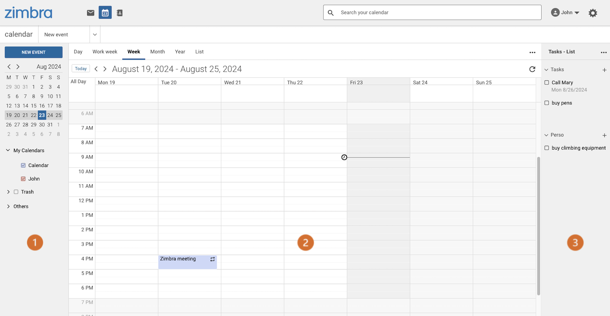
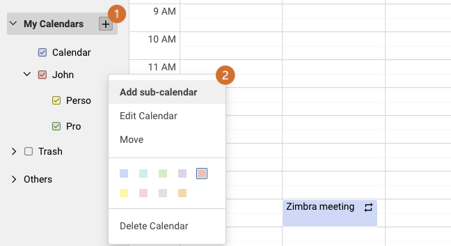
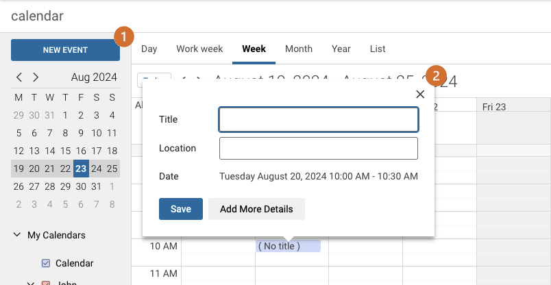
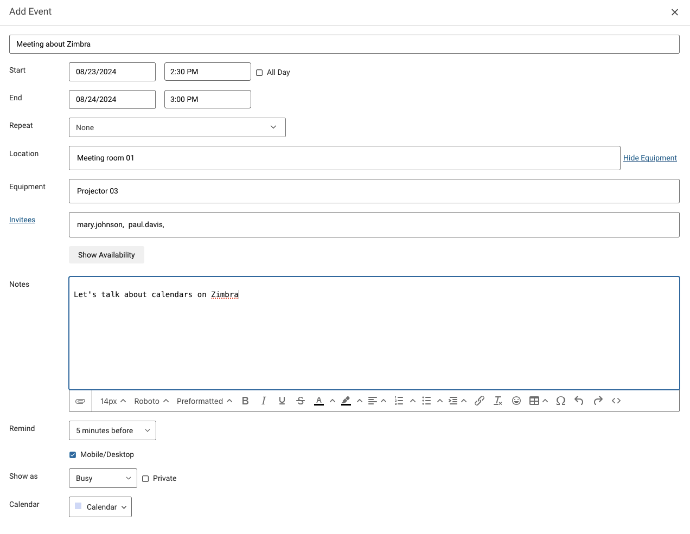
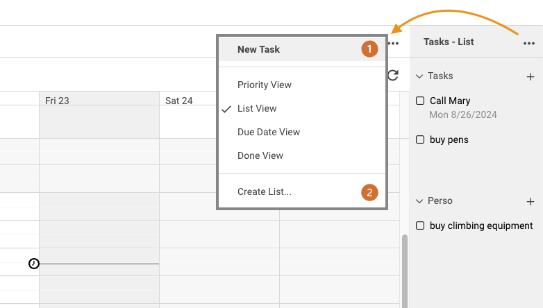
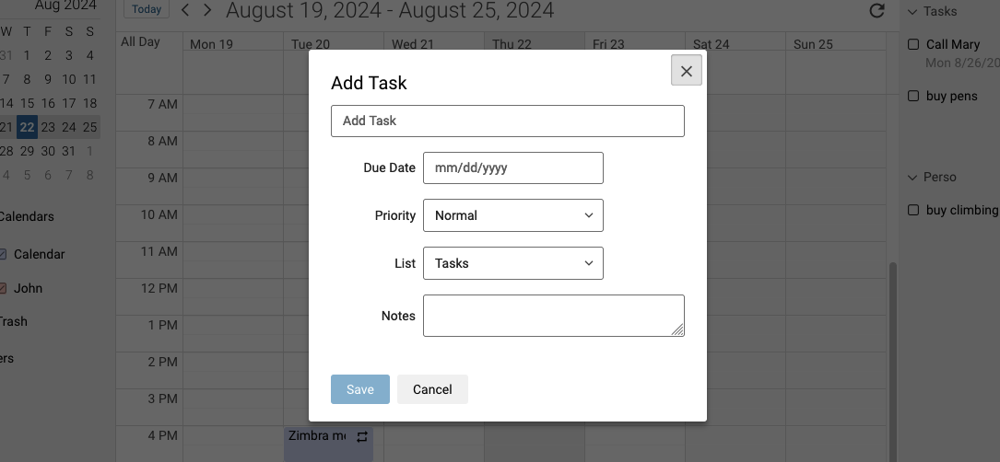

> [!primary]
> Questa traduzione è stata generata automaticamente dal nostro partner SYSTRAN. I contenuti potrebbero presentare imprecisioni, ad esempio la nomenclatura dei pulsanti o alcuni dettagli tecnici. In caso di dubbi consigliamo di fare riferimento alla versione inglese o francese della guida. Per aiutarci a migliorare questa traduzione, utilizza il pulsante "Contribuisci" di questa pagina.
>

> [!primary]
>
> **Importante**
>
> La webmail Zimbra per MX Plan è in fase di distribuzione.
>
> Al momento è disponibile solo nell’ambito di migrazioni legate all’evoluzione della nostra offerta MX Plan. La migrazione è automatica, ti verrà inviata un’email dal nostro team quando sarai interessato.
>
> Per maggiori informazioni, consulta le nostre [FAQ sulla soluzione Zimbra di OVHcloud](/pages/web_cloud/email_and_collaborative_solutions/mx_plan/faq-zimbra).

## Obiettivo

Con il servizio MX Plan di OVHcloud, puoi inviare e ricevere email da un client di posta (Thunderbird, Outlook, Mail di Mac) o tramite una webmail, direttamente dal browser del tuo dispositivo. 
OVHcloud fornisce un servizio di webmail chiamato Zimbra per accedere a un account email di tipo MX Plan. In questa pagina ti spieghiamo le funzionalità necessarie all’utilizzo della Webmail.

**Come utilizzare la Webmail Zimbra per i tuoi indirizzi email MX Plan OVHcloud**

## Prerequisiti

- Disporre di una soluzione email OVHcloud **MX Plan**, disponibile tra le nostre [offerte di hosting Web](https://www.ovhcloud.com/it/web-hosting/), inclusa in un [hosting gratuito 100M](https://www.ovhcloud.com/it/domains/free-web-hosting/), o ordinata separatamente come soluzione autonoma.
- Disporre delle credenziali di accesso all’indirizzo email MX Plan da consultare. Per maggiori informazioni, consulta la nostra guida "[Iniziare a utilizzare il servizio MX Plan](/pages/web_cloud/email_and_collaborative_solutions/mx_plan/email_generalities)".

## Procedura

**Sommario**

- [Accedi alla Webmail Zimbra](#login)
- [Interfaccia generale della Webmail Zimbra](#general-interface)
- [Gestisci le cartelle del tuo account email](#folders-management)
    - [Le cartelle speciali](#folders-specials)
    - [Crea cartelle](#folders-creation)
 - [Gestione delle email](#email-management)
    - [Azione su un’email selezionata](#email-action)
    - [Cerca un'email](#email-search)
- [Scrivi un’email](#email-writing)
- [Configura le preferenze dell’interfaccia Zimbra](#settings)
- [Contatti](#contacts)
    - [Gestione delle cartelle](#contacts-folders)
    - [Gestione degli elenchi](#contacts-lists)
    - [Importa/Esporta contatti](#import-export)
- [Calendario](#calendar)
    - [Gestione calendari](#calendar-management)
    - [Impegni](#tasks)
- [Filtri](#filters)
    - [Come impostare i filtri](#filters-howto)
    - [Crea un filtro](#filters-creation)
- [Deleghe](#delegations)
- [Firme](#signatures)
- [Risposte automatiche/Segreteria](#auto-reply)

### Accedi alla Webmail Zimbra 

Accedi alla pagina <https://www.ovh.com/it/mail/>. Inserisci il tuo indirizzo e-mail e la password e clicca su `Invia`{.action}.

{.thumbnail}

Verrai reindirizzato all'interfaccia Zimbra.

{.thumbnail}

### Interfaccia generale della Webmail Zimbra 

Una volta connesso al tuo account email, avrai accesso alla finestra principale di Zimbra che si compone di 3 zone:

> [!tabs]
> **Menu superiore**
>>
>> - **(1)** Quest'area dell'interfaccia ti permette di scegliere una delle funzionalità disponibili sul tuo account email, `email` o `contatti`. Per impostazione predefinita, ti trovi nella scheda `email`.
>> - **(2)** Una barra di ricerca consente di trovare messaggi o contatti.
>> - **(3)** Il menu di gestione del profilo del tuo account email e il pulsante di accesso alle impostazioni **(4)**.
>>
>> {.thumbnail}
>>
> **Colonna sinistra**
>>
>> Di default, è la struttura dell’account di posta elettronica, composta da cartelle e sottocartelle. La cartella principale è `In arrivo`.
>>
>> {.thumbnail}
>>
> **Finestra centrale**
>>
>> Di default, le tue email sono visualizzate in questa zona che contiene due parti:
>>
>> - **(1)** elenco degli elementi
>> - **(2)** il contenuto dell'elemento selezionato
>>
>> {.thumbnail}
>>

### Gestione delle cartelle dell’account email (colonna di sinistra) 

In questa sezione vengono mostrate le cartelle del tuo account email. In questa interfaccia sono disponibili le cartelle **speciali** già presenti (in arancione) e le cartelle **create** (in verde).

{.thumbnail}

#### Le cartelle speciali 

Le cartelle speciali vengono create automaticamente dal server di posta elettronica e costituiscono la maggior parte di un account email.

- **In arrivo**: le email vengono consegnate per impostazione predefinita in questa cartella (filtri esclusi).
- **Bozze**: le email scritte ma non spedite vengono salvate in questa cartella.
- **Posta inviato** : le email inviate vengono automaticamente archiviate in questa cartella.
- **Archivio**: cartella predefinita per classificare le email elaborate.
- **Spam**: cartella in cui sono archiviate le email considerate indesiderate.
- **Cestino**: Le email eliminate vengono memorizzate in questa cartella prima di essere eliminate definitivamente.

> [!primary]
>
> Impossibile eliminare le cartelle speciali.

#### Crea cartelle 

Per classificare le email in base alle esigenze, è possibile creare cartelle personalizzate.

Per creare una nuova cartella, fare clic sul pulsante `+ Aggiungi una cartella`{.action} nella parte inferiore della colonna.

È inoltre possibile creare una sottocartella facendo clic con il pulsante destro del mouse sulla cartella desiderata e scegliendo `Crea sottocartella`{.action}. 

> [!primary]
>
> Le cartelle Bozze, Spam e Cestino non possono contenere sottocartelle.

### Gestione delle email 

Quando si seleziona una cartella o una sottocartella nella colonna di sinistra, l'elenco dei messaggi di posta elettronica in essa contenuti viene visualizzato nella colonna centrale. Clicca sull’email che preferisci per visualizzarne il contenuto nella finestra di destra.

> [!primary]
>
> **Tipo di visualizzazione**
>
> La visualizzazione dei messaggi di posta elettronica è disponibile in una forma modificabile. Per farlo, clicca sul pulsante `Visualizza`{.action} in alto a destra.

#### Azione su un’email selezionata 

Selezionando un’email sono disponibili numerose azioni:

- 1.**Rispondi** : rispondi direttamente al mittente.
- 2.**Rispondi a tutti** : rispondi direttamente a tutti i destinatari presenti nei campi "A" e "Copia".
- 3.**Inoltra**: trasferisci l’email selezionata a uno o più destinatari.
- 4.**Archivia** : sposta l’email nella cartella "Archive" del tuo account email.
- 5.**Sposta** : sposta l’email in una delle cartelle dell’account email.
- 6.**Elimina** : Inserisci l’email selezionata nel "Cestino".
- 7.**SPAM** : inserire l’email selezionata direttamente nella cartella di posta indesiderata (SPAM).
- 8.**Altro**
    - **Contrassegna come letto**.
    - **Contrassegna come non letto**.
    - **Stella**: assegna una stella alla tua email per evidenziarla e identificarla più facilmente.
    - **Elimina stella** : rimuovi la stella assegnata a questa email.
    - **Mostra originale** : Visualizzare l'intero messaggio, corpo e intestazione.
    - **Nuovo filtro** : crea un filtro dal mittente e dall'oggetto del messaggio selezionato.
    - **Stampa** : stampa la conversazione o l'email selezionata.
- 9.**Visualizza** : selezionare uno dei 3 layout per visualizzare le cartelle e le email.

{.thumbnail}

Per accedere a queste opzioni, clicca con il tasto destro su ogni email presente nella colonna centrale.

> [!primary]
>
> Se uno dei vostri interlocutori chiede che gli venga inviata una conferma di lettura durante la lettura della sua e-mail, otterrete il seguente messaggio-tipo: `John ha chiesto una conferma di lettura per questa email. Invia una conferma di lettura`.
>

#### Cerca un'email 

Per trovare un’email, utilizza la barra di ricerca nella parte superiore dell’interfaccia. È quindi possibile eseguire una **ricerca semplice** o una **ricerca avanzata**, come descritto nelle schede seguenti:

> [!tabs]
> **Ricerca semplice**
>>
>> Digitare la parola o le parole chiave che si desidera trovare nella barra di ricerca e premere `Invio` per confermare la ricerca. La parola o le parole verranno evidenziate nei risultati.
>>
>> > Se si sa dove cercare l'elemento, è possibile immettere parole chiave ( **from**, **to**, **cc**, **subject** e così via) seguite da due punti (`:`) e cercare l'elemento nella casella di testo di ricerca. Ad esempio, se si desidera cercare rapidamente un mittente, è possibile digitare from: prima dell'indirizzo di posta elettronica che si sta cercando. Ad esempio "from: address@example.com".
>>
>> {.thumbnail}
>>
> **Ricerca avanzata**
>>
>> Per una ricerca più precisa, clicca sul pulsante a destra della barra di ricerca. In questo modo è possibile limitare la ricerca a una cartella, un intervallo orario, l'oggetto o il corpo del messaggio e così via.
>>
>> {.thumbnail}
>>

### Scrivi un’email 

Per scrivere una nuova email, clicca sul pulsante `Nuovo Messaggio`{.action} (1) in alto a sinistra della finestra Zimbra.

{.thumbnail}

> [!tabs]
> **Intestazione**
>>
>> L'intestazione consente di completare i campi seguenti:
>>
>> - **Da**: indirizzo da cui vuoi inviare la tua email. Di default, è il tuo indirizzo email. È possibile modificare l’indirizzo del mittente cliccando sul pulsante a destra del proprio indirizzo email, solo se è stata installata una [delega](#delegations). 
>> - **A**:  il/i destinatario/i della tua email. Clicca su `A`{.action} per accedere alla tua [rubrica contatti](#contacts) e selezionare i destinatari. 
>> - **Cc**: fare clic su `Cc/Ccn`{.action} a destra del campo `A`{.action} per visualizzare il campo. La copia in formato cartaceo è un campo di destinazione che consente di inviare la propria e-mail in copia a persone che si desidera includere in un ciclo continuo senza che vengano considerate come destinatari diretti dell'e-mail (a differenza dei destinatari del campo "**A**"). 
>> - **CCn** : clicca su `Cc/Ccn`{.action} in corrispondenza del campo `A`{.action} per visualizzare il campo. La copia in carbonio invisibile è un campo destinatario che permette di trasmettere un’email senza che gli altri destinatari vedano la persona o le persone in "**Ccn**". 
>> - **Oggetto**: titolo dell’email, primo elemento visibile alla ricezione prima di aprire l’email. 
>> - `...`{.action} : situato a destra del campo `Da`{.action}, ti dà accesso a 3 opzioni: 
>>    - Selezionando l’opzione `Priorità alta` puoi definire prioritaria la tua email. 
>>    - Fare clic su `Richiedi conferma di lettura` per richiedere una conferma di lettura al destinatario. 
>>    - La funzione `Testo semplice` disattiverà le funzioni di impaginazione HTML dell'e-mail.  
>>
>> {.thumbnail}
>>
> **Testo dell’email**
>>
>> Per scrivere il corpo dell’email, nella parte inferiore della finestra è disponibile una barra degli strumenti HTML. In questo modo è possibile scrivere le email con il layout di pagina direttamente dal browser. Inoltre, il pulsante `< >`{.action} (all'estrema destra della barra degli strumenti) apre una finestra in cui è possibile incollare un messaggio e-mail prescritto da uno strumento esterno.
>>
>> {.thumbnail}
>>

Dopo aver scritto l’email, prima di cliccare su `Invia`{.action}, puoi allegare un allegato cliccando sull’icona a graffetta accanto al pulsante `Invia`{.action}.

{.thumbnail}

> [!success]
> **Annulla un invio**
> 
> Se è stata selezionata l'opzione `Annulla invio` nella sezione "**Scrittura di email**" delle preferenze Zimbra, è possibile fare clic su `ANNULLA`{.action} per annullare l'invio.
> Questo pulsante rimane disponibile per circa 5 secondi.
>
> {.thumbnail .w-400}

### Configura le preferenze dell’interfaccia Zimbra 

L'interfaccia Zimbra dispone di 2 menu di configurazione:

{.thumbnail}

- **(1) Profilo**: clicca sul nome del tuo account email nell’angolo in alto a destra della tua interfaccia. Da questo menu è possibile "**Cambia password**" dell’indirizzo email, "**Cambia immagine del profilo**" o disconnettersi cliccando su "**Esci**".

- **(2) Impostazioni**: clicca sull’icona a forma di ingranaggio in alto a destra per avere accesso alle modifiche di "**Lingua**" dell’interfaccia. Per consultare la documentazione ufficiale di Zimbra, consulta la sezione "**Aiuto**". In "**Impostazioni**" sono disponibili tutti gli elementi di configurazione descritti nelle schede seguenti:

> [!tabs]
> **Generali**
>>
>> Da questa scheda è possibile visualizzare lo spazio occupato sul tuo account email e definire il formato di visualizzazione della data e dell’ora delle tue email.
>>
> **Visualizzazione email**
>>
>> Qui trovi gli elementi associati alla visualizzazione dei tuoi elementi sul tuo account email.
>>
>> - **Nella visualizzazione degli elenchi di messaggi** : queste opzioni consentono di organizzare l'elenco dei messaggi di posta elettronica in gruppi di conversazioni e di visualizzare più dettagli in anteprima.
>> - **Riquadro anteprima** : selezionare uno dei 3 layout per visualizzare le cartelle e le e-mail. Questa opzione riprende le scelte che trovi sul pulsante `Mostra`{.action} quando visualizzi le tue email.
>> - **Spaziatura elenco messaggi**
>> - **Segna come già letto** : è possibile sospendere la modifica dello stato dell'e-mail in "letto" quando si fa clic su di esso o decidere di non fare nulla e lasciarlo in "non letto" senza alcuna azione da parte vostra.
>> - **Controlla l'arrivo di nuove mail** : definisci la frequenza di sincronizzazione delle email ricevute dalla tua interfaccia Zimbra.
>> - **Conferme di lettura** : definisci il comportamento di Zimbra quando apri un’email con avviso di lettura.
>> - **Nuove notifiche di posta** elettronica: abilitare le notifiche quando si riceve un messaggio.
>> - **Mostra immagini nelle email** : visualizza o meno le foto all'apertura di un'email.
>> - **Visualizza le e-mail come testo semplice** : questa opzione consente di visualizzare i messaggi di posta elettronica in formato normale senza layout.
>> - **Mostra le immagini per impostazione predefinita nella posta di questi indirizzi o domini attendibili**: definisci gli indirizzi email trusted per i quali le immagini possono essere visualizzate all'apertura.
>>
> **Scrittura di email**
>>
>> - **Annulla invio** : questa opzione permette di visualizzare un banner, per 5 secondi, che permette di annullare l'invio di un'email.
>> - **Richiedi conferme di lettura** : questa opzione trasmette una richiesta di conferma di lettura ai destinatari quando viene inviata loro un’email.
>> - **Salva una copia nella cartella Posta inviato**: selezionata per impostazione predefinita, questa opzione salva i messaggi inviati nella cartella "Inviato" del tuo account email.
>> - **Delegati** : per maggiori informazioni sul suo utilizzo, consulta la sezione [Deleghe](#delegations) di questa guida.
>> - **Impostazioni di invio delegato**: per ulteriori informazioni sull'utilizzo di questa guida, vedere l'argomento [Deleghe](#delegations) in questa guida.
>> - **Compositore**: è possibile impostare lo stile di scrittura predefinito quando si inizia a scrivere un messaggio di posta elettronica.
>>
> **Firme**
>>
>> Utilizzare questo spazio per creare le firme. 
>>
>> - **Firma standard**: inserisci la firma che comparirà quando scrivi una nuova email.
>> - **Firma di risposta o inoltro**: consente di aggiungere una firma diversa quando si risponde o si invia un'e-mail.
>>
> **Fuori ufficio**
>>
>> Questa scheda indica la funzionalità di "risposta automatica". Per configurare le risposte automatiche, consulta la sezione "[Risposte automatiche/Segreteria](#auto-reply)" di questa guida.
>>
> **Filtri**
>>
>> Per configurare i filtri, consultate la sezione "[Filtri](#filters)" di questa guida.
>>
> **Agenda e promemoria**
>>
>> Consulta le impostazioni relative ai tuoi [calendari](#calendar).
>>
>> **Impostazioni Agenda generali**
>>
>> - **Agenda predefinita** : impostare il calendario predefinito da utilizzare quando si crea un evento nei calendari.
>> - **Inizio settimana** : il giorno che compare per primo nella griglia del calendario.
>> - **Inizio giorno feriale** : l'ora visualizzata nella parte superiore dell'intervallo orario visualizzato.
>> - **Fine giorno feriale** : l'ora visualizzata nella parte inferiore dell'intervallo orario visualizzato.
>> - **Fuso orario giorni feriali** utilizzato per i calendari.
>> - **Durante la creazione o la modifica di eventi** : visualizzare i fusi orari per le ore di inizio e di fine.
>> - **Condivisione** : `Attiva la delega per i clienti CALDav`. Questa opzione consente di gestire i calendari tramite un software che supporta il protocollo CALdav.
>> - **Eventi rifiutati** : visualizzare un evento nel calendario, anche se è stato rifiutato.
>>
>> **Promemoria eventi**
>>
>> - **Invia promemoria via email a** : inviare promemoria di eventi a un indirizzo e-mail.
>> - **Mostra notifiche del browser** : essere avvisati dal browser per i tuoi eventi.
>> - **Orario promemoria predefinito** : timeout di richiamata predefinito quando viene attivato su un evento.
>> - **Mostra promemoria per gli eventi scaduti** : continua a inviare promemoria dopo un evento.
>>
>> **Autorizzazione orari liberi/occupati**
>>
>> - **Autorizzazione per** : questo parametro riguarda esclusivamente lo stato di disponibilità associato ai calendari dell’indirizzo email. Questo significa che è possibile condividere il proprio stato "Occupato" o "Disponibile" con altri indirizzi email.

### Contatti 

Fare clic su `Contatti` nella barra superiore per accedere alla rubrica. Questo è diviso in **3 parti**:

- **(1) Cartelle** (a sinistra): nella rubrica è possibile creare cartelle per organizzare e raggruppare i contatti.
- **(2) Elenco contatti** (al centro): visualizza i contatti della rubrica o della cartella selezionata.
- **(3) Proprietà contatto** o **Nuovo contatto** (a destra): questa finestra viene visualizzata quando un contatto è selezionato o è in fase di creazione. È possibile leggere o modificare le informazioni relative a un contatto.

{.thumbnail}

Per creare un nuovo contatto, clicca sul pulsante `Nuovo contatto`{.action} in alto nella colonna di sinistra.

Completa i campi con le informazioni relative al contatto. È possibile aggiungere un'immagine facendo clic sull'icona del profilo nell'angolo superiore destro del modulo.

e clicca su `Salva`{.action}.

{.thumbnail}

#### Gestione delle cartelle dei contatti 

Come per le email, le cartelle dei contatti speciali vengono create automaticamente dal server di posta.

- **Contatti**: i contatti vengono archiviati per impostazione predefinita in questa cartella.
- **Cestino**: i contatti eliminati vengono memorizzati in questa cartella prima di essere eliminati definitivamente.
- **Contatti inviati via email** : i contatti con cui ti sei scambiato vengono salvati in questa cartella.

È possibile creare cartelle e sottocartelle. Consentono di suddividere i contatti in sottoinsiemi. In questo modo è più facile trovare un contatto in una cartella creata che nella rubrica indirizzi.

Per creare una nuova cartella, fare clic sul pulsante `+ Aggiungi una cartella`{.action} nella parte inferiore della colonna sinistra.

È inoltre possibile creare una sottocartella facendo clic con il pulsante destro del mouse sulla cartella desiderata e scegliendo `Crea sottocartella`{.action}. Le cartelle "Contatti via e-mail" e "Cestino" non consentono la creazione di sottocartelle.

Per spostare un contatto in una delle cartelle, selezionarlo nella colonna centrale e fare clic sul pulsante `Sposta`{.action} nella finestra del contatto visualizzata a destra. Seleziona la cartella che vuoi assegnare al contatto.

{.thumbnail}

> [!primary]
>
> Quando si crea un nuovo contatto da una cartella selezionata, il contatto viene aggiunto automaticamente a tale cartella.

#### Gestione degli elenchi 

È possibile associare un contatto a uno o più elenchi. Gli elenchi permettono di raggruppare i contatti per facilitare l'invio comune di un'email a tutti i contatti. Ad esempio, per inviare un'e-mail a un numero elevato di destinatari regolari, è sufficiente aggiungere semplicemente il nome dell'elenco dei destinatari anziché aggiungere uno a uno i contatti di un elenco.

Per creare un nuovo elenco, fare clic nel riquadro `Nuovo elenco` nella parte inferiore della colonna di sinistra e digitare un nome per l'elenco.

Per assegnare un contatto a uno degli elenchi, selezionare il contatto nella colonna centrale e quindi nella finestra visualizzata a destra fare clic su `Assegna a elenchi`{.action}. Seleziona la lista o le liste che vuoi assegnare al contatto. In alternativa, digitare il nome di un nuovo elenco e fare clic su `Aggiungi`{.action}.

{.thumbnail}

#### Importare/Esportare Contatti 

Selezionare una delle due schede seguenti:

> [!tabs]
> **Importa i Contatti**
>>
>> Dalla finestra `Contatti`, clicca con il tasto destro sulla cartella dei contatti scelta, ad eccezione delle cartelle "Contatti via email" e "Cestino" che non consentono l'importazione e l'esportazione di contatti. 
>>
>> Fare clic su `Importa`{.action} per aprire la finestra di importazione. Il pulsante `Browse...` ti permette di andare a recuperare il file che contiene i tuoi contatti in formato ".csv" o ".vcf".   
>> {.thumbnail}
>>
> **Esporta i Contatti**
>>
>> Dalla finestra `Contatti`, clicca con il tasto destro sulla cartella dei contatti scelta, ad eccezione delle cartelle "Contatti via email" e "Cestino" che non consentono l'importazione e l'esportazione di contatti.
>>
>> Clicca su `Esporta`{.action} per aprire la finestra di esportazione. Seleziona il tipo di file da esportare e clicca su `Esporta adesso`{.action}.  
>> {.thumbnail}
>>

### Agenda 

Clicca sull’icona `Agenda` nella barra superiore per accedere alla rubrica. Il codice è diviso in **3 parti**:

- **(1) Elenco calendari** (a sinistra): gestisci i diversi calendari e sottocalendari.
- **(2) Contenuto dei calendari** (al centro): visualizza il contenuto dei calendari e dei sottocalendari selezionati.
- **(3) Elenco attività** (a destra): gestisci le attività e gli elenchi attività.

{.thumbnail}

#### Gestione dei calendari 

Per impostazione predefinita, nell’elenco `Mie agende` è presente un `Calendario` creato per impostazione predefinita. Questo calendario predefinito non può essere eliminato, ma sarà comunque possibile creare calendari personalizzati nel paragrafo successivo.

###### 1- Creare un calendario 

- **(1)**: Per creare un calendario, posiziona il cursore su `Mie agende` nella colonna di sinistra e clicca sul pulsante `+`. Inserisci un nome e definisci un colore, poi clicca su `Salva`{.action}

È inoltre possibile creare calendari secondari.

- **(2)**: Per creare un calendario secondario, spostare il cursore sul calendario per il quale si desidera crearne uno, quindi fare clic con il pulsante destro del mouse per visualizzare il menu a discesa. Clicca su `Aggiungi sottocalendario`. Inserisci un nome e definisci un colore, poi clicca su `Salva`{.action}

{.thumbnail .w-400}

###### 2- Aggiungi un evento 

- **(1)**: Clicca su `Nuovo evento`{.action} nell’angolo in alto a sinistra.
- **(2)**: Fare clic sull'intervallo di tempo del calendario in cui si desidera aggiungere un evento. Per un’aggiunta semplificata, è sufficiente definire un titolo per l’evento e un luogo e cliccare su `Salva`{.action}. Per aggiungere maggiori dettagli sul tuo evento, clicca su `Aggiungi altri dettagli`{.action}

{.thumbnail .w-400}

- **Inizio**: data e ora di inizio dell’evento. Se si seleziona `Tutto il giorno`, non sarà necessario inserire l'ora di inizio e di fine, poiché l'intero giorno verrà preso in considerazione.
- **Fine**: data e ora di fine del tuo evento.
- **Ripeti**: se si tratta di un evento ricorrente, definisci la sua frequenza.
- **Luogo**: il luogo in cui si svolgerà l'evento, come ad esempio il nome di una sala riunioni.
- **Attrezzatura**: cliccando su `Mostra l’attrezzatura`{.action}, visualizzi questa linea per definire un’attrezzatura condivisa da utilizzare per il tuo evento.
- **Invitati**: gli indirizzi email dei partecipanti all'evento.
- **Note**: messaggio che verrà inviato agli ospiti dell'evento.
- **Promemoria**: essere avvisati prima dell'inizio dell'evento.
- **Mostra come**: definisci se l'evento rende disponibili o meno i suoi ospiti durante lo svolgimento
- **Agenda**: definire il calendario associato all'evento.

Una volta definito l’evento, clicca su `Registra`{.action}.

{.thumbnail .w-400}

##### 3- Modificare un evento 

#### Impegni 

Le attività sono elementi separati dai calendari. Il loro scopo è quello di elencare le attività da effettuare senza associarvi una data di esecuzione o una data di scadenza. Queste attività sono complementari ai calendari.

L'elenco Attività esiste per impostazione predefinita e non può essere eliminato, ma è possibile creare elenchi di attività personalizzati.

- **(1)**: Per creare un'attività, clicca sul pulsante `...`{.action} e poi su `Nuova impegno`{.action} o semplicemente sul pulsante `+`{.action} accanto alla lista delle attività.

- **(2)**: Per creare una nuova lista di attività, clicca sul pulsante `...`{.action} e poi su `Crea elenco...`{.action}.

{.thumbnail .w-400}

Quando si crea un'attività, è possibile impostare una data di scadenza e una priorità per classificarle in base all'importanza e un menu a discesa per selezionare l'elenco delle attività.

Clicca su `Salva`{.action} per completare la creazione dell’operazione.

{.thumbnail .w-400}

### Filtri 

#### Come impostare i filtri 

L’installazione di filtri sull’account email è un parametro importante che ti permette di impostare un sistema di smistamento automatico alla ricezione delle tue email.

Una regola di filtraggio in Zimbra è composta da 4 elementi:

1 - [Campo di confronto](#filters-comp-field): su quale parte dell’email verrà applicato il filtro. 
2 - [Operatore di confronto](#filters-comp-operator): con quale precisione verrà applicato il filtro. 
3 - [Valore](#filters-value): quali parole/elementi dell'email saranno interessati dal filtro. 
4 - [Azioni filtro](#filters-action): cosa farà il filtro sull’email. 

{.thumbnail}

> Esempio 1: Se il campo **Oggetto (1)** dell'email **contiene (2)** la parola `invoice`**(3)**, allora **trasferisci a (4)** l'indirizzo `billing@example.com`.

Nei seguenti sottocapitoli vengono illustrati i dettagli di ogni elemento di una regola di filtro.

##### 1 - Campo di confronto 

Il campo Confronta indica la sezione dell'e-mail da controllare per l'operatore di confronto. I campi di confronto possono includere:

- **Da** : indica il mittente nel campo "Da" dell’email.
- **A** : cercare i nomi dei destinatari nel campo TB.
- **Cc** : cerca i nomi dei destinatari in copia nel campo Cc.
- **Oggetto** : specificare gli elementi nell'oggetto e-mail.
- **Intestazione denominata** : quando questa opzione è selezionata, prima dell'operatore di confronto viene visualizzato un campo di inserimento aggiuntivo. Questo campo consente di inserire qualsiasi elemento dell'intestazione di un messaggio di posta elettronica. È possibile specificare i campi standard "Da", "A", "Oggetto" o altri campi che possono essere presenti nell'intestazione dell'email. Alcuni server di posta elettronica, ad esempio, possono aggiungere campi specifici nell'intestazione che è possibile includere nella regola di filtro utilizzando questo campo di confronto.
- **Corpo** : Indica le parole contenute o meno nel corpo dell'email.

##### 2 - Operatore di confronto 

In base al campo di confronto specificato in precedenza, l'operatore di confronto determinerà il livello di corrispondenza da applicare al valore.

> [!primary]
>
> Gli operatori di confronto disponibili variano in base al campo di confronto selezionato.

- **Corrisponde esattamente a / Non corrisponde esattamente** : quello che digiterai deve corrispondere esattamente. 
    *Ad esempio*, se si specifica che l'oggetto dell'e-mail corrisponde esattamente a "house", la corrispondenza verrà eseguita solo con "house" e non con "houses" o "a blue house".

- **Contiene / Non contiene** : ciò che si sta immettendo deve essere presente nel campo o nei campi. 
    *Ad esempio*, indicando che l’oggetto dell’email deve contenere "casa", la corrispondenza sarà con "house", "houses" e anche "a blue house".

- **Corrisponde al criterio jolly / Non corrisponde al criterio jolly** : specifica che l'argomento deve corrispondere alla stringa specificata, che include caratteri jolly.

- **Esiste / Non esiste** - Specifica che il campo di confronto specificato deve esistere o non deve esistere nel messaggio. Questo operatore di confronto viene utilizzato con i campi di confronto Intestazione con nome.

> **Utilizzo di caratteri jolly nei filtri**
>
> I caratteri joker, i caratteri jolly o ancora chiamati "wildcard" possono essere utilizzati nel campo di input per il confronto che utilizzano l’operatore di confronto "**Corrisponde al criterio jolly / Non corrisponde al criterio jolly**". I due caratteri jolly sono `*` e `?`.
>
> - L'asterisco `*` è un segnaposto per zero o più caratteri di qualsiasi tipo.   Ad esempio, per la stringa di ricerca "blue\*house", restituisce le corrispondenze "blue house", "houses" o "blue wooden house". Tuttavia, non avrebbe restituito "lightning blue house".    Un altro esempio di stringa di ricerca "w\*house" che restituisce le corrispondenze "white house", "watch TV in your house". Tuttavia, non ha voluto rispedire indietro "watch TV in your house with a friend".
>
> - Il punto interrogativo `?` è un segnaposto per esattamente un carattere.  Ad esempio, per la stringa di ricerca "blue?house", restituisce le corrispondenze "blue house", "blue-house" e "blue_house".
>

##### 3 - Valore 

Dopo aver selezionato il campo e l'operatore di confronto, è necessario immettere il valore corrispondente nella casella corrispondente.

##### 4 - Azioni filtro 

Il campo `allora` definisce l'azione da effettuare sull'email che soddisfa le condizioni del filtro . Le operazioni filtro possono includere l'eliminazione, l'ordinamento e persino il contrassegno della posta in arrivo.

- **Conserva in Posta in arrivo** - Salva i messaggi di posta elettronica nella cartella Posta in arrivo. Se nessuna delle regole di filtro corrisponde a un messaggio di posta elettronica, questa operazione viene eseguita per impostazione predefinita.
- **Sposta nella cartella** : Sposta l'email in una cartella specificata.
- **Elimina definitivamente** : elimina il messaggio di posta elettronica senza recapitarlo. Il messaggio non si trova in nessuna delle cartelle, incluso il cestino.
- **Inoltra a**: inoltra l'email all'indirizzo specificato.
- **Contrassegna come letto**
- **Stella**: segna la tua email con una stella.

#### Crea un filtro 

Per accedere alla creazione dei filtri, clicca sull’icona a forma di ingranaggio in alto a destra e poi su `Impostazioni`{.action} e infine su `Filtri`{.action} nella colonna di sinistra.

{.thumbnail}

Se esistono dei filtri, visualizzerai la lista secondo il loro ordine di applicazione:

- **(1)** Per visualizzare l'anteprima di ogni filtro, clicca sul pulsante `...`{.action} a destra del filtro e seleziona `Dettagli`{.action}. Il pulsante `Esegui`{.action} consente di avviare l'azione impostata per questo filtro.

- **(2)** Questo pulsante viene utilizzato come una maniglia e consente di spostare il filtro nell'elenco per assegnargli un ordine di applicazione. Ogni filtro viene applicato nell'ordine definito nell'elenco.

Clicca sul pulsante `+ Aggiungi un filtro`{.action} per avviare la creazione. Per impostazione predefinita, viene visualizzata la finestra della modalità semplice. È possibile passare alla modalità avanzata facendo clic su `Avanzate`{.action} per disporre di tutti gli operatori di confronto. Per maggiori informazioni, consulta la sezione "[Come configurare i filtri](#filters-howto)".

> [!tabs]
> **Modalità semplice**
>>
>> {.thumbnail}
>>
> **Modalità avanzata**
>>
>> {.thumbnail}
>>

### Delegati 

Per accedere all’impostazione di delega, clicca sull’icona a forma di ingranaggio in alto a destra e poi su `Impostazioni`{.action} e infine su `Scrittura di email`{.action} nella colonna di sinistra.

È possibile delegare l’account email a un altro account. condividere la stessa piattaforma di posta elettronica.

> [!primary]
>
> Un account email con lo stesso dominio ma con un’altra soluzione email non può ricevere la delega.

{.thumbnail}

**(1) Delegati**. Per delegare il tuo account email a un altro account, clicca su `Aggiungi delegati`{.action}.

- **Invia come**: la persona delegata potrà inviare un’email con il tuo indirizzo email, esattamente come se l’avessi inviato. Il destinatario non indicherà l'indirizzo email del delegato.
- **Invia per conto di**: la persona delegata potrà inviare un’email con il suo indirizzo e-mail con una dicitura "per conto di" il tuo indirizzo e-mail. Il destinatario deve quindi indicare i due indirizzi email coinvolti nello scambio.

**(2) Impostazioni di invio delegato**. Quando deleghi il tuo indirizzo email a un altro provider, puoi:

- **Salva messaggi inviati nella mia cartella Inviati** : se la persona delegata sul tuo account invia un’email dal tuo indirizzo email, questa apparirà nella tua cartella "Inviate".
- **Salva messaggi inviati nella cartella Inviati del delegato** : se la persona delegata sul tuo account invia un’email dal tuo indirizzo email, questa apparirà nella sua cartella "Inviate".
- **Salva messaggi inviati nella cartella Inviati del delegato e nella mia cartella Inviati** : se la persona delegata sul tuo account invia un’email dal tuo indirizzo email, questa apparirà nella tua cartella "Inviate" e nella sua cartella "Inviate".
- **Non salvare i messaggi inviati** : se la persona delegata sul tuo account invia un’email dal tuo indirizzo email, non ci sarà alcuna copia di fatto.

### Firma 

Clicca sull’icona a forma di ingranaggio in alto a destra e poi su `Impostazioni`{.action} e infine su `Firme`{.action} nella colonna di sinistra.

Per maggiori informazioni sulla configurazione, consulta la sezione "[Configurare le preferenze dell’interfaccia Zimbra](#settings)" di questa guida (clicca sulla scheda "**Firme**").

### Risposte automatiche / Segreteria 

Quando sei fuori sede e non puoi consultare il tuo account email, puoi impostare un messaggio di assenza che verrà inviato automaticamente al mittente. Nella Webmail Zimbra, questa funzionalità è denominata "Fuori ufficio".

Per accedere alla gestione della tua risposta automatica, clicca sull’icona a forma di ingranaggio in alto a destra e seleziona `Impostazioni`{.action} > `Fuori ufficio`{.action}.

Per impostazione predefinita, l'opzione `Attiva risposta automatica durante queste date (incluse)` è disattivata. Selezionare questa casella per attivare la risposta automatica. È ora possibile inserire il contenuto del messaggio di assenza nel campo di inserimento.

- Se non si conosce l'ora in cui si desidera interrompere la risposta automatica, selezionare la casella di controllo `Nessuna data di fine`.
- Il pulsante `Inviami un messaggio di esempio`{.action} consente di visualizzare in anteprima la risposta automatica nella Posta in arrivo.
- `Mittenti esterni`: è possibile definire un messaggio diverso quando il mittente è esterno al dominio e/o alla rubrica. Per impostazione predefinita, tutti i mittenti ricevono lo stesso messaggio.

## Per saperne di più 

[Iniziare a utilizzare MX Plan](/pages/web_cloud/email_and_collaborative_solutions/mx_plan/email_generalities)

[Modificare la password di un indirizzo email MX Plan](/pages/web_cloud/email_and_collaborative_solutions/mx_plan/email_change_password)

[Crea filtri per i tuoi indirizzi email](/pages/web_cloud/email_and_collaborative_solutions/mx_plan/feature_filters)

[Utilizza i reindirizzamenti email](/pages/web_cloud/email_and_collaborative_solutions/common_email_features/feature_redirections)

Contatta la nostra Community di utenti all’indirizzo <https://community.ovh.com>.
