> [!primary]
> Esta tradução foi automaticamente gerada pelo nosso parceiro SYSTRAN. Em certos casos, poderão ocorrer formulações imprecisas, como por exemplo nomes de botões ou detalhes técnicos. Recomendamos que consulte a versão inglesa ou francesa do manual, caso tenha alguma dúvida. Se nos quiser ajudar a melhorar esta tradução, clique em "Contribuir" nesta página.
>

> [!primary]
>
> **Importante**
>
> O webmail Zimbra para MX Plan é um produto em curso de implementação.
>
> Atualmente, só está disponível no âmbito de migrações ligadas à evolução da nossa oferta MX Plan. Esta migração é automática, e receberá um e-mail das nossas equipas quando for afetado pela migração.
>
> Para mais informações, consulte o [FAQ sobre a solução Zimbra OVHcloud](/pages/web_cloud/email_and_collaborative_solutions/mx_plan/faq-zimbra).

## Objetivo

Com a oferta MX Plan da OVHcloud, pode enviar e receber e-mails a partir de um cliente de e-mail (Thunderbird, Outlook, Mail de Mac) ou através de um webmail diretamente no browser da Internet do seu dispositivo. 
A OVHcloud fornece um serviço de webmail chamado Zimbra para aceder a uma conta de e-mail do tipo MX Plan. Nesta página, abordaremos as funcionalidades indispensáveis à utilização deste webmail.

**Saiba como utilizar o webmail Zimbra para os endereços de e-mail MX Plan**

## Requisitos

- Dispor de uma solução de e-mail OVHcloud **MX Plan**, proposta entre as nossas [ofertas de alojamento web](https://www.ovhcloud.com/pt/web-hosting/), incluída num [alojamento gratuito 100M](https://www.ovhcloud.com/pt/domains/free-web-hosting/), ou encomendada separadamente como solução autónoma.
- Ter acesso às informações de início de sessão do endereço de e-mail MX Plan que pretende consultar. Para mais informações, consulte o nosso guia "[Primeiros passos com a oferta MX Plan](/pages/web_cloud/email_and_collaborative_solutions/mx_plan/email_generalities)".

## Instruções

**Índice**

- [Aceder ao webmail Zimbra](#login)
- [Interface geral do webmail Zimbra](#general-interface)
- [Gestão das pastas da sua conta de e-mail](#folders-management)
    - [As pastas especiais](#folders-specials)
    - [Criar pastas](#folders-creation)
 - [Tratamento dos e-mails](#email-management)
    - [Ação sobre um e-mail selecionado](#email-action)
    - [Procurar um e-mail](#email-search)
- [Redigir um e-mail](#email-writing)
- [Configurar as preferências da interface Zimbra](#settings)
- [Contactos](#contacts)
    - [Gestão das pastas](#contacts-folders)
    - [Gestão das listas](#contacts-lists)
    - [Importar / Exportar contactos](#import-export)
- [Filtros](#filters)
    - [Compreender como configurar os seus filtros](#filters-howto)
    - [Criar um filtro](#filters-creation)
- [Delegações](#delegations)
- [Assinaturas](#signatures)
- [Respostas automáticas/resposta automática](#auto-reply)

### Aceder ao webmail Zimbra 

Aceda à página <https://www.ovh.com/pt/mail/>. Introduza o endereço de correio eletrónico e a palavra-passe e, em seguida, clique em `Enviar`{.action}.

{.thumbnail}

Será redirecionado para a interface Zimbra.

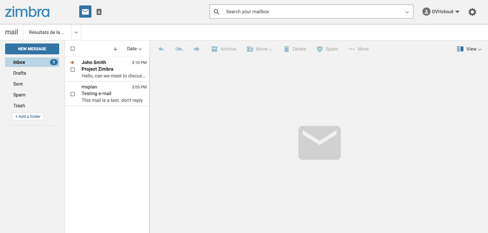{.thumbnail}

### Interface geral do webmail Zimbra 

Uma vez ligado à sua conta de e-mail, terá acesso à janela principal do Zimbra, que é composta por 3 zonas:

> [!tabs]
> **Menu superior**
>>
>> - **(1)** Esta zona da interface permite-lhe escolher uma das funcionalidades disponíveis na sua conta de e-mail, `correio` ou `contactos`. Por predefinição, está no separador `correio`.
>> - **(2)** Poderá encontrar mensagens ou contactos através de uma barra de pesquisa.
>> - **(3)** O menu de gestão do perfil da sua conta de e-mail e o botão de acesso às configurações **(4)**.
>>
>> 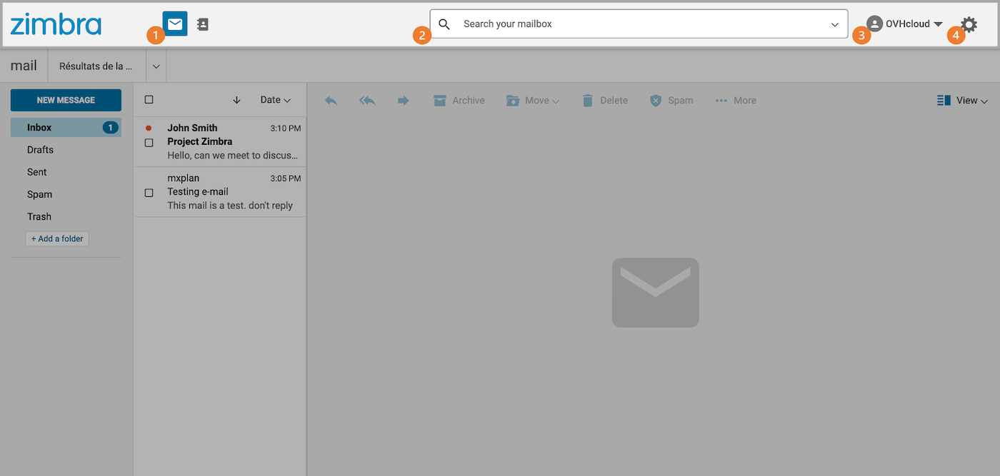{.thumbnail}
>>
> **Coluna da esquerda**
>>
>> Por predefinição, esta é a vista de árvore da sua conta de correio eletrónico, composta por pastas e subpastas. A pasta principal é a `Caixa de entrada`.
>>
>> 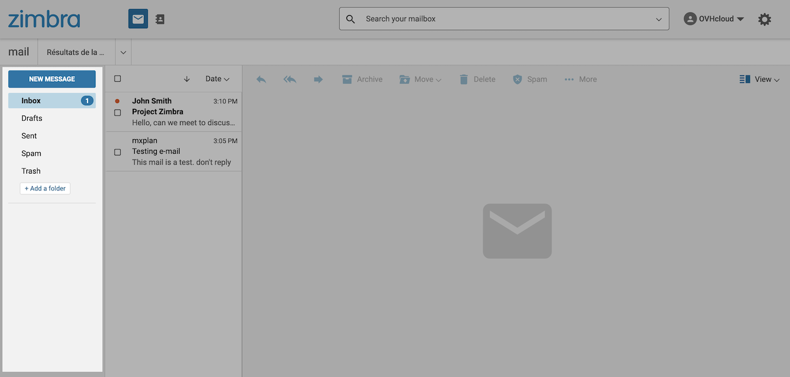{.thumbnail}
>>
> **Janela central**
>>
>> Por predefinição, as mensagens de correio eletrónico são apresentadas nesta caixa contendo duas partes:
>>
>> - **(1)** a lista dos elementos
>> - **(2)** o conteúdo do elemento selecionado
>>
>> 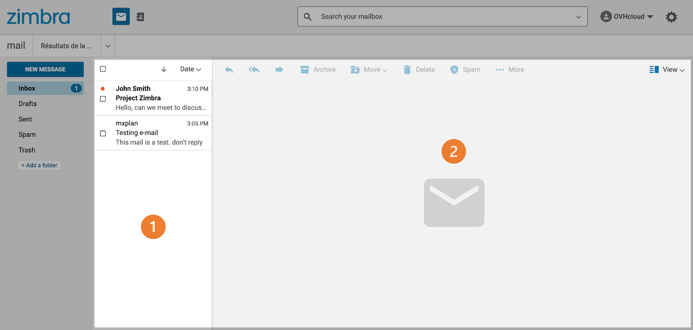{.thumbnail}
>>

### Gestão das pastas da sua conta de e-mail (coluna da esquerda) 

Esta caixa apresenta as pastas presentes na sua conta de e-mail. Nele, encontrará as pastas **especiais** já presentes (em laranja) e as que terá **criado** (em verde).

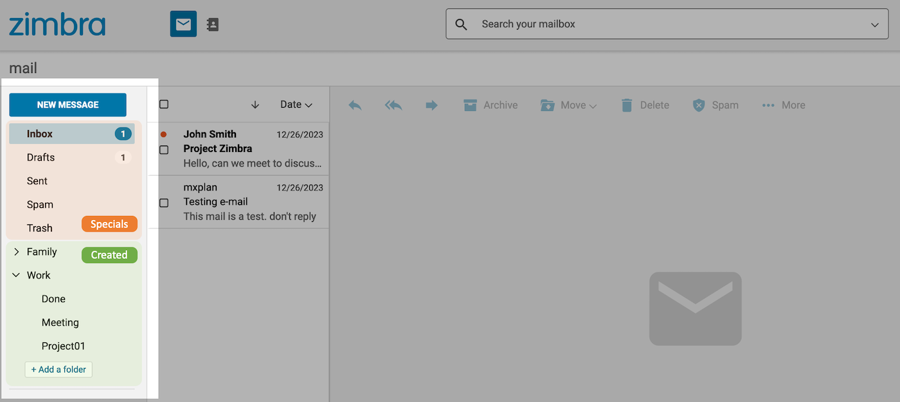{.thumbnail}

#### As pastas especiais 

As pastas especiais são automaticamente criadas pelo servidor de e-mail e constituem o essencial de uma conta de e-mail.

- **Caixa de entrada**: os e-mails são enviados por predefinição para esta pasta (exceto filtros aplicados).
- **Rascunhos**: os e-mails redigidos mas não enviados são guardados nesta pasta.
- **Enviei**: os e-mails enviados são automaticamente armazenados nesta pasta.
- **Arquivo**: pasta padrão para classificar os e-mails processados.
- **Spam**: pasta onde são armazenados os e-mails considerados indesejados.
- **Lixo**: Os e-mails excluídos são armazenados nessa pasta antes de serem excluídos permanentemente.

> [!primary]
>
> As pastas especiais não podem ser eliminadas.

#### Criar pastas 

Poderá criar as suas próprias pastas para organizar os seus e-mails de acordo com as suas necessidades.

Para criar uma pasta, clique no botão `+ Adicionar uma pasta`{.action} na parte inferior da coluna.

Também pode criar uma sub-pasta clicando com o botão direito do rato na pasta à sua escolha e, a seguir, clicando em `Criar subpasta`{.action}. 

> [!primary]
>
> As pastas "Rascunhos", "Spam" e "Lixo" não podem conter subpastas.

### Tratamento dos e-mails 

Quando seleciona uma pasta ou subpasta, na coluna da esquerda, é apresentada uma lista dos e-mails contidos nessa pasta na coluna do centro. A seguir, clique no e-mail que deseja para visualizar o conteúdo na janela à direita.

> [!primary]
>
> **Tipo de visualização**
>
> A apresentação dos e-mails apresenta-se de uma forma que pode ser alterada. Para isso, clique no botão `Visualizar`{.action}, localizado no canto superior direito da janela.

#### Ação sobre um e-mail selecionado 

Quando seleciona um e-mail, muitas ações ficam disponíveis:

- 1.**Responder**: responder diretamente ao remetente.
- 2.**Responder a todos**: responder diretamente a todos os destinatários presentes nos campos "A" e "Cópia".
- 3.**Reencaminhar**: transferir o e-mail selecionado para um ou vários destinatários.
- 4.**Arquivo**: mover o e-mail para a pasta "Arquivo" da sua conta de e-mail.
- 5.**Mover**: mover o e-mail para uma das pastas da conta de e-mail.
- 6.**Delete**: coloque o e-mail selecionado na "Lixeira".
- 7.**Spam**: colocar o e-mail selecionado diretamente na pasta de lixo eletrónico (SPAM).
- 8.**Plus**
    - **Marcar item como lido**.
    - **Marcar item como não lida**.
    - **Marcar com estrela**: Atribuir uma estrela ao seu e-mail para o destacar e identificar mais facilmente.
    - **Limpar estrela**: remover a estrela atribuída a este e-mail.
    - **Mostrar original**: Exibir a mensagem inteira, corpo e cabeçalho.
    - **Novo filtro**: Criar um filtro a partir do remetente e do assumpto da mensagem selecionada.
    - **Imprimir**: imprimir a conversa ou o e-mail selecionado.
- 9.**Visualizar**: selecione um dos 3 layouts para visualizar suas pastas e e-mails.

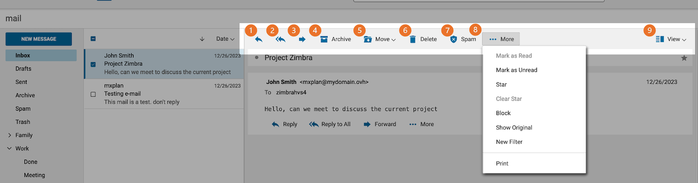{.thumbnail}

É possível aceder a estas opções clicando com o botão direito do rato em cada um dos e-mails da coluna central.

> [!primary]
>
> Se um dos seus contactos pedir a confirmação quando ler o seu e-mail, irá receber a seguinte mensagem típica: `John pediu um aviso de leitura para este e-mail. Enviar um aviso de leitura`.
>

#### Procurar um e-mail 

Se deseja encontrar um e-mail, utilize a barra de pesquisa na parte superior da sua interface. Pode efetuar uma **procura simples** ou uma **procura avançada**, tal como definido nos separadores seguintes:

> [!tabs]
> **Pesquisa simples**
>>
>> Introduza as palavras-chave que pretende encontrar na barra de pesquisa e prima `Enter` para validar a procura. A palavra ou palavras aparecerão realçadas nos resultados.
>>
>> > Se você sabe onde pesquisar por seu item, você pode digitar palavras-chave ( **from**, **to**, **cc**, **subject**, etc.) seguidas de dois pontos (`:`) e pesquisar por ele na caixa de texto de pesquisa. Por exemplo, se você deseja encontrar rapidamente um remetente, você pode digitar "from:" antes do endereço de e-mail que você está procurando. Por exemplo"from: address@exemplo.com".
>>
>> 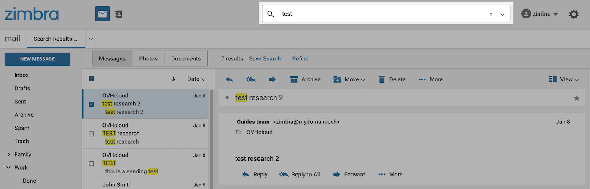{.thumbnail}
>>
> **Pesquisa avançada**
>>
>> Para uma pesquisa mais precisa, clique na barra de pesquisa que pretende pesquisar, na parte direita. Pode restringir a sua procura a uma pasta, intervalo de tempo, assumpto ou corpo da mensagem, etc.
>>
>> 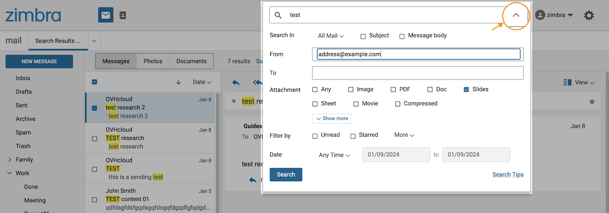{.thumbnail}
>>

### Redigir um e-mail 

Para redigir um novo e-mail, clique no botão `Nova mensagem`{.action} (1) na parte superior esquerda da sua janela Zimbra.

{.thumbnail}

> [!tabs]
> **Cabeçalho**
>>
>> O cabeçalho permite preencher os seguintes campos:
>>
>> - **De** : o endereço a partir do qual envia o seu e-mail. Por predefinição, é o seu endereço de e-mail. Só é possível alterar o endereço de e-mail se clicar na barra à direita do endereço de e-mail, se tiver sido criada uma [delegação](#delegations). 
>> - **Para** : o(s) destinatário(s) do seu e-mail. Clique em `Para`{.action} para aceder ao seu [livro de contactos](#contacts) e selecionar os seus destinatários. 
>> - **CC** : clique em `Cc/Bcc`{.action} à direita do campo `Para`{.action} para ver este campo. A cópia de carbono é um campo de destino que permite enviar o seu e-mail em cópia a pessoas que deseja integrar num loop sem que sejam consideradas como destinatários diretos do e-mail (ao contrário dos destinatários do campo "**Para**"). 
>> - **Bcc** : clique em `Cc/Bcc`{.action} à direita do campo `Para`{.action} para ver este campo. A cópia de carbono invisível é um campo de destino que permite a transmissão de um e-mail sem que os outros destinatários vejam a pessoa ou pessoas "**Bcc**". 
>> - **Assunto**: Título do e-mail, primeiro elemento visível na receção antes de abrir o e-mail. 
>> - `...`{.action} : situado à direita do campo `De`{.action}, dá-lhe acesso a 3 opções :  
>>    - Pode qualificar o seu e-mail como prioritário selecionando `Prioridade máxima`. 
>>    - Clique em `Solicitar recibo de leitura` para pedir uma confirmação de leitura ao destinatário. 
>>    - A funcionalidade `Texto simples` irá desativar as funções de formatação de páginas HTML no correio eletrónico.  
>>
>> 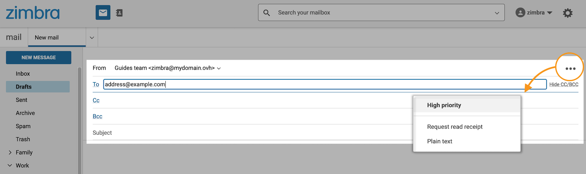{.thumbnail}
>>
> **Corpo do e-mail**
>>
>> Para redigir o corpo do seu e-mail, dispõe de uma barra de ferramentas HTML na parte inferior da sua janela. Isto permitir-lhe-á redigir os seus e-mails com layout, diretamente a partir do seu browser. Além disso, o botão `< >`{.action} (à direita na barra de ferramentas) abre uma janela onde pode colar um e-mail pré-escrito a partir de uma ferramenta externa.
>>
>> 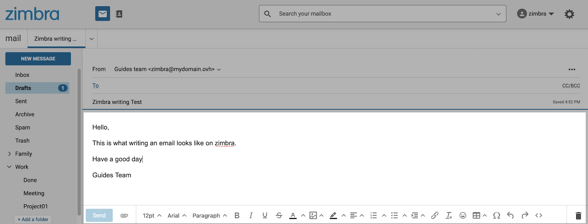{.thumbnail}
>>

Depois de ter redigido o seu e-mail, antes de clicar em `Enviar`{.action}, pode associar-lhe um anexo clicando no ícone de trombone situado ao lado do botão `Enviar`{.action}.

{.thumbnail}

> [!success]
> **Anular um envio**
> 
> "Se ativou a opção `Anular envio` na secção **Escrita de email**" das preferências do Zimbra, pode clicar em `ANULAR`{.action} para cancelar o envio.
> Este botão ficará disponível durante cerca de 5 segundos.
>
> 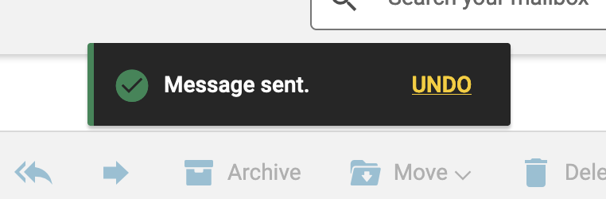{.thumbnail .w-400}

### Configurar as preferências da interface Zimbra 

A sua interface Zimbra dispõe de 2 menus de configuração:

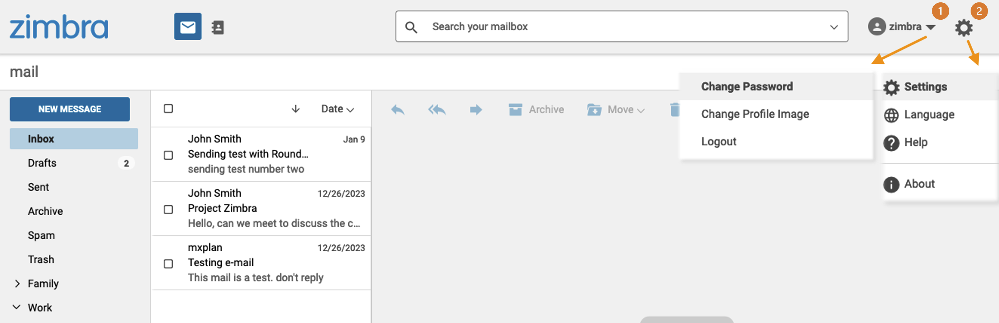{.thumbnail}

- **(1) Perfil** : clique no nome da sua conta de e-mail na parte superior direita da sua interface. A partir deste menu, poderá "**Alterar a palavra-passe**" do seu endereço de e-mail, "**Alterar imagem do perfil**" ou encerrar a sessão clicando "**Terminar sessão**".

- **(2) Definições**: Clique na roda dentada no canto superior direito da sua interface para aceder às alterações "**Idioma**" da sua interface. Uma secção "**Ajuda**" permite consultar a documentação oficial do Zimbra. "**Definições**" encontrará todos os elementos de configuração descritos nos seguintes separadores:

> [!tabs]
> **Geral**
>>
>> A partir deste separador, encontrará o espaço ocupado na sua conta de e-mail e a possibilidade de definir o formato de apresentação da data e da hora dos seus e-mails.
>>
> **Visualização do email**
>>
>> Encontre aqui os elementos ligados à apresentação dos seus elementos na sua conta e-mail.
>>
>> - **Ao visualizar listas de mensagens**: estas opções permitem-lhe organizar a lista dos seus e-mails por grupos de conversas e visualizar mais detalhes.
>> - **Painel de leitura rápida**: selecione uma das 3 disposições para visualizar suas pastas e e-mails. Esta opção retoma as escolhas encontradas no botão `Visualizar`{.action} quando visualiza os seus e-mails.
>> - **Densidade da lista de mensagens**
>> - **Marcar item como lido**: pode temporizar a alteração do estado do seu e-mail "ou" quando clicar no mesmo ou decidir não fazer nada e deixá-lo em "não lido" sem ação da sua parte.
>> - **Verificar se existe novo correio**: defina a frequência da sincronização dos e-mails recebidos a partir da sua interface Zimbra.
>> - **Recibos de leitura**: defina o comportamento do Zimbra quando abrir um e-mail com aviso de leitura.
>> - **Notificações de novos e-mail**: ative as notificações quando uma mensagem é recebida.
>> - **Mostrar imagens nos emails**: mostrar ou não as fotos quando abrir um e-mail.
>> - **Ver e-mails como texto sem formatação**: apresenta a mensagem em formato simples, sem qualquer configuração de página.
>> - **Mostrar imagens por predefinição no correio desses endereços ou domínios de confiança**: defina os endereços de e-mail de confiança para os quais as imagens podem ser apresentadas quando abrem.
>>
> **Escrita de email**
>>
>> - **Anular envio**: esta opção permite apresentar um banner, durante 5 segundos, que permite anular o envio de um e-mail.
>> - **Solicitar recibos de leitura**: esta opção envia um pedido de recibo de leitura aos seus destinatários quando lhes envia um e-mail.
>> - **Salve uma cópia na pasta Enviados**: assinalado por predefinição, esta opção guarda os e-mails enviados para a pasta "*Enviado" da sua conta de e-mail.
>> - **Delegados** : consulte a secção [Delegações](#delegations) deste guia para saber mais sobre a sua utilização.
>> - **Definições de envio dos delegados**: consulte a secção [Delegações](#delegations) deste guia para compreender a sua utilização.
>> - **Compositor**: pode definir o seu estilo de escrita quando iniciar a redação de um e-mail.
>>
> **Assinaturas**
>>
>> Este espaço permite-lhe criar as suas assinaturas. 
>>
>> - **Assinatura padrão**: introduza a assinatura que aparecerá quando redigir um novo e-mail.
>> - **Responder ou encaminhar assinatura**: permite-lhe adicionar uma assinatura diferente quando responder ou enviar um e-mail.
>>
> **Ausência do escritório**
>>
>> Este separador designa a funcionalidade "resposta automática". Para configurar as respostas automáticas, consulte a secção "[Respostas automáticas/respostas](#auto-reply)" deste manual.
>>
> **Filtros**
>>
>> Para configurar os filtros, consulte a secção "[Filtros](#filters)" deste manual.
>>

### Contactos 

Clique em `Contactos` na barra superior para aceder ao livro de contactos. Esta divide-se em **3 partes**:

- **(1) Pastas** (à esquerda): No livro de endereços, você pode criar pastas para organizar e agrupar contactos.
- **(2) Lista de contactos** (no centro): visualize os contactos do livro de endereços ou da pasta selecionada.
- **(3) Propriedades do contacto** ou **Novo contacto** (à direita): esta janela aparece quando um contacto é selecionado ou quando está em curso de criação. Leia ou edite as informações do contacto lá.

{.thumbnail}

Para criar um novo contacto, clique no botão `Novo contacto`{.action}, na parte superior da coluna da esquerda.

Preencha os campos com base nas informações que possui sobre o seu contacto. Pode adicionar uma imagem clicando no ícone de perfil na parte superior direita do formulário.

De seguida, clique em `Guardar`{.action}.

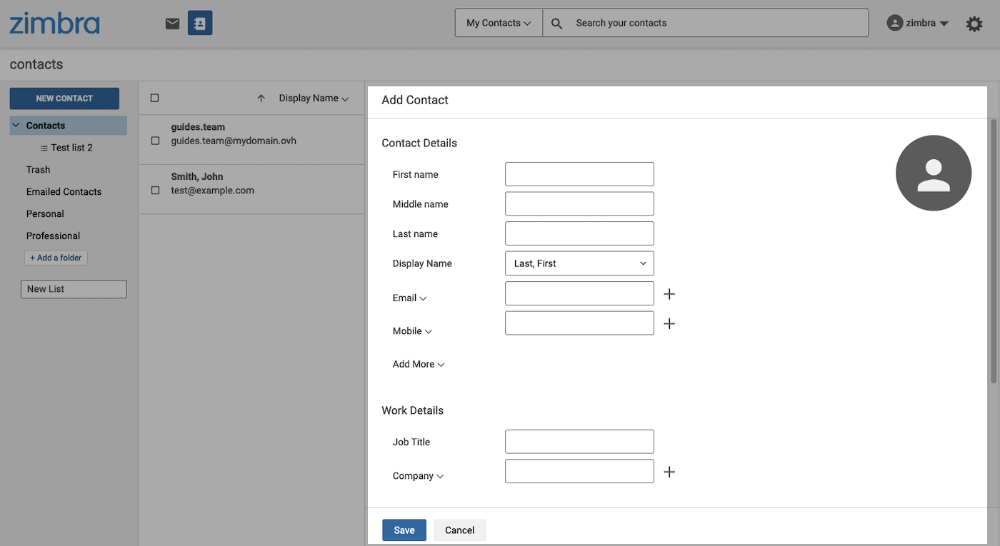{.thumbnail}

#### Gestão das pastas de contactos 

Tal como acontece com os e-mails, as pastas de contactos especiais são automaticamente criadas pelo servidor de e-mail.

- **Contactos**: os contactos são armazenados por predefinição nesta pasta.
- **Lixeira**: os contactos excluídos são armazenados nessa pasta antes de serem excluídos permanentemente.
- **Contactos por e-mail** : os contactos com os quais trocou são guardados nesta pasta.

É possível criar pastas e subpastas. Permitem classificar os contactos em subconjuntos. Assim, encontrará mais facilmente um contacto numa pasta que criou do que em todo o seu livro de endereços.

Para criar uma pasta, clique no botão `+ Adicionar uma pasta`{.action} no fundo da coluna da esquerda.

Também pode criar uma sub-pasta clicando com o botão direito do rato na pasta à sua escolha e, a seguir, clicando em `Adicionar uma sub-pasta`{.action}. As pastas "Contactos por e-mail" e "Lixo" não permitem a criação de subpastas.

Para mover um contacto para uma das pastas, selecione o contacto na coluna do meio e, a seguir, na janela do contacto que aparece à direita, clique no botão `Mover`{.action}. De seguida, selecione a pasta que pretende atribuir ao contacto.

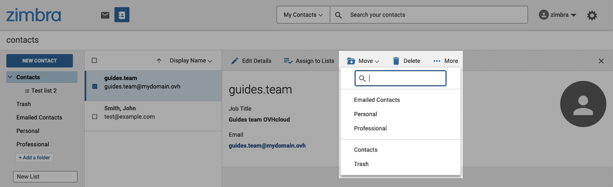{.thumbnail}

> [!primary]
>
> Ao criar um contacto a partir de uma pasta selecionada, o contacto será automaticamente adicionado a essa pasta.

#### Gestão das listas 

Pode associar um contacto a uma ou várias listas. As listas permitem agrupar contactos para facilitar o envio comum de um e-mail a todos os contactos. Por exemplo, para enviar um e-mail a um grande número de destinatários regulares, basta adicionar o nome da sua lista como destinatário, em vez de adicionar um a um os contactos de uma lista.

Para criar uma lista, clique na caixa chamada `Nova lista`, na parte inferior da coluna da esquerda, e insira um nome para a lista.

Para atribuir um contacto a uma das suas listas, selecione o contacto na coluna do meio e, a seguir, na janela que aparece à direita, clique em `Atribuir a listas`{.action}. Selecione a(s) lista(s) que pretende atribuir ao contacto. Ou então, pode introduzir um nome para uma nova lista e clicar em `Adicionar`{.action}.

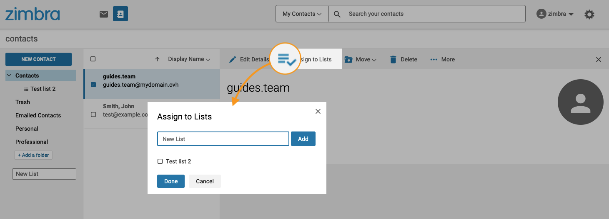{.thumbnail}

#### Importar / Exportar Contactos 

Selecione um dos dois separadores seguintes:

> [!tabs]
> **Importar contactos**
>>
>> A partir da janela `Contactos`, clique com o botão direito do rato na pasta de contactos à sua escolha, exceto nas pastas "Contactos por E-mail" e "Reciclagem", que não permitem a importação ou exportação de contactos. 
>>
>> De seguida, clique em `Importar`{.action} para abrir a janela Importar. O botão `Browse...` permite-lhe ir recuperar o ficheiro que contém os seus contactos no formato ".csv" ou ".vcf".   
>> 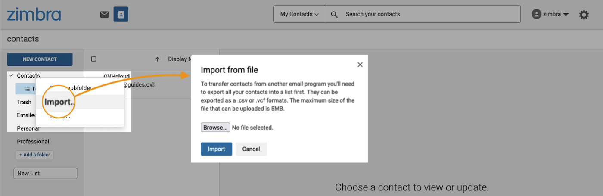{.thumbnail}
>>
> **Exportar os Contactos**
>>
>> A partir da janela `Contactos`, clique com o botão direito do rato na pasta de contactos à sua escolha, exceto nas pastas "Contactos por E-mail" e "Reciclagem", que não permitem a importação ou exportação de contactos.
>>
>> Clique em `Exportar`{.action} para abrir a janela de exportação. Escolha o tipo de ficheiro que deseja exportar e depois clique em `Exportar agora`{.action}.  
>> 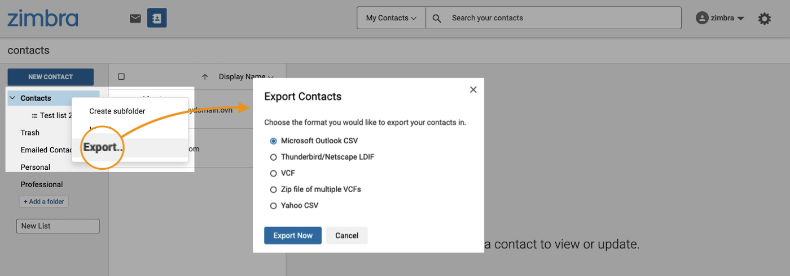{.thumbnail}
>>

### Filtros 

#### Compreender como configurar os seus filtros 

A implementação de filtros na sua conta de e-mail é uma configuração importante que lhe permite implementar um sistema de triagem automática na receção dos seus e-mails.

Uma regra de filtragem em Zimbra é composta por 4 elementos:

1 - [Campo de comparação](#filters-comp-field): parte do correio eletrónico abrangida pelo filtro. 
2 - [Operador de comparação](#filters-comp-operator): a precisão com que o filtro deve ser aplicado. 
3 - [Valor](#filters-value): que palavras/elementos do e-mail serão visados pelo filtro. 
4 - [Ações do filtro](#filters-action): o que o filtro fará no e-mail. 

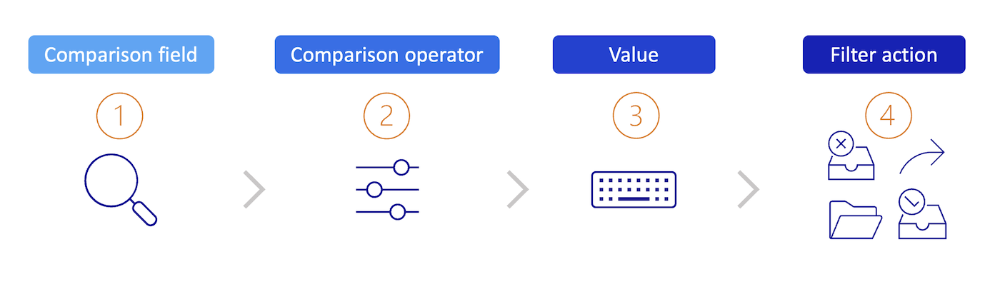{.thumbnail}

> Exemplo: Se o **assumpto (1)** da mensagem de correio eletrónico **contiver (2)** a palavra `invoice`**(3)**, então **reencaminhe para (4)** o endereço `billing@example.com`.

Nos subcapítulos que se seguem, poderá encontrar os detalhes de cada um dos elementos de uma regra de filtragem.

##### 1 - Campo de comparação 

O campo de comparação designa a secção do e-mail a verificar pelo operador de comparação. Os campos de comparação podem incluir:

- **De** : indicar um remetente no campo "De" do e-mail.
- **Para**: procure os nomes de destinatários no campo "Para".
- **Cc** : procurar os nomes dos destinatários em cópia no campo "Cc".
- **Assunto**: Especificar itens no assumpto do e-mail.
- **Cabeçalho nomeado**: Quando esta opção está selecionada, um campo de entrada adicional aparece antes do operador de comparação. Este campo permite introduzir qualquer elemento no cabeçalho de uma mensagem de correio eletrónico. Pode especificar os campos padrão "De", "Para", "Assumpto", ou outros campos que possam estar presentes no cabeçalho da mensagem. Por exemplo, alguns servidores de correio eletrónico podem adicionar campos específicos no cabeçalho que podem ser integrados na regra de filtragem, utilizando este campo de comparação.
- **Corpo**: significa as palavras contidas ou não no corpo do e-mail.

##### 2 - Operador de comparação 

Em função do campo de comparação acima referido, o operador de comparação determinará o nível de correspondência a aplicar ao valor.

> [!primary]
>
> Os operadores de comparação disponíveis variam de acordo com o campo de comparação selecionado.

- **Coincide exatamente / Não coincide exatamente** : o que você vai digitar deve corresponder exatamente. 
    *Por exemplo*, indicando que o assumpto do e-mail corresponde exatamente "house", a correspondência será feita apenas com "house" e não com "houses" ou "a blue house".

- **Contém / Não contém** : o que você digitar deve estar presente no(s) campo(s). 
    *Por exemplo*, indicando que o assumpto do e-mail deve conter "house", a correspondência será feita com "house", "houses" e também "a blue house".

- **Coincide com a condição universal / Não coincide com a condição universal** : Especifica que o tópico deve corresponder à string especificada, que inclui caracteres curinga.

- **Existe / Não existe** : Especifica que o campo de comparação especificado deve existir ou não deve existir na mensagem. Este operador de comparação é utilizado com os campos de comparação "Cabeçalho nomeado".

> **Utilização de caracteres de sincronização nos filtros**
>
> Os caracteres curinga, curinga ou ainda chamados "wildcard" podem ser utilizados no campo de entrada para a comparação que utilizam o operador de comparação "**Coincide com a condição universal / Não coincide com a condição universal**". Os dois caracteres curinga são `*` e `?`.
>
> - O asterisco `*` é um marcador de posição para zero ou mais caracteres de qualquer tipo.   Por exemplo, para a cadeia de procura "blue\*house", devolveria as correspondências "blue house", "houses" ou "blue wooden house". No entanto, não retornaria "lightning blue house".    Outro exemplo de uma sequência de pesquisa "w\*house" que retornaria corresponde a "white house", "watch TV in your house". No entanto, ele não iria enviar de volta "watch TV in your house with a friend".
>
> - O ponto de interrogação `?` é um marcador de posição para exatamente um caráter.  Por exemplo, para a cadeia de procura "blue?house", devolveria as correspondências "blue house", "blue-house" e "blue_house".
>

##### 3 - Valor 

Depois de selecionar o seu campo e o seu operador de comparação, deverá introduzir na caixa correspondente o valor a que devem corresponder.

##### 4 - Ações do filtro 

O campo `Então` define a ação a efetuar no e-mail que preenche as condições do filtro As ações de filtragem podem incluir a remoção, a triagem e até mesmo a marcação do correio recebido.

- **Manter nai caixa de entrada**: guarda as mensagens de correio eletrónico na pasta A receber. Se nenhuma das regras de filtragem corresponder a uma mensagem de correio eletrónico, esta ação realiza-se por predefinição.
- **Mover para a pasta**: move o e-mail para uma pasta especificada.
- **Excluir permanentemente**: Eliminar o correio eletrónico sem o entregar. A mensagem não está em nenhuma das pastas, incluindo a lixeira.
- **Para a frente**: Transfere a mensagem para o endereço que especificar.
- **Marcar como lido**
- **Marcar com estrela**: marca o seu e-mail com uma estrela.

#### Criar um filtro 

Para aceder à criação de filtros, clique na roda dentada no canto superior direito da sua interface Zimbra, depois em `Definições`{.action} e, por fim, em `Filtros`{.action} na coluna da esquerda.

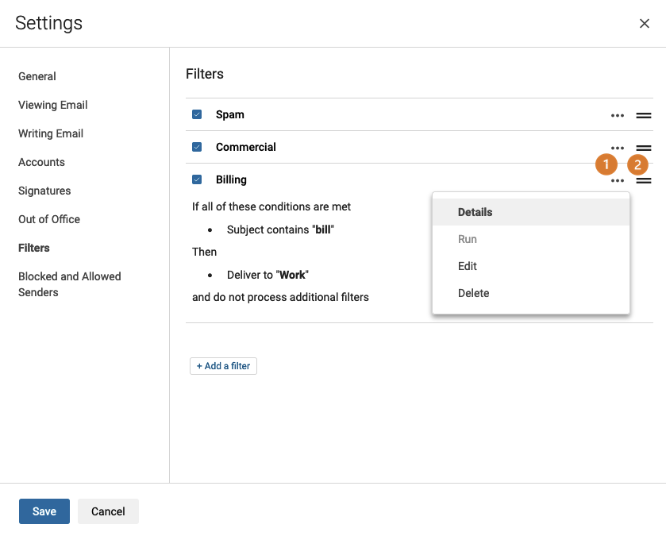{.thumbnail}

Se existirem filtros, encontrará a lista segundo a ordem da aplicação:

- **(1)** Pode pré-visualizar cada filtro clicando no botão `...`{.action} à direita do filtro e, a seguir, em `Detalhes`{.action}. Utilize o botão `Executar`{.action} para iniciar a ação definida para este filtro.

- **(2)** Este botão é usado como uma alça, ele permite que você mova o filtro para a lista para atribuir uma ordem de aplicação. Cada filtro é aplicado de acordo com a ordem indicada na lista.

Clique no botão `+ Adicione um filtro`{.action} para iniciar a criação do filtro. A janela Modo simples é exibida por predefinição. Pode passar para o modo avançado clicando em `Mudar para avançado`{.action} para dispor de todos os operadores de comparação. Consulte a secção "[Compreender como configurar os filtros](#filters-howto)".

> [!tabs]
> **Modo simples**
>>
>> 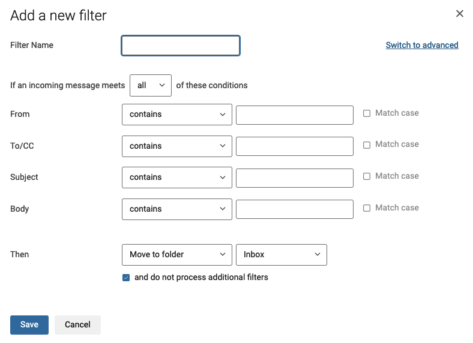{.thumbnail}
>>
> **Modo avançado**
>>
>> 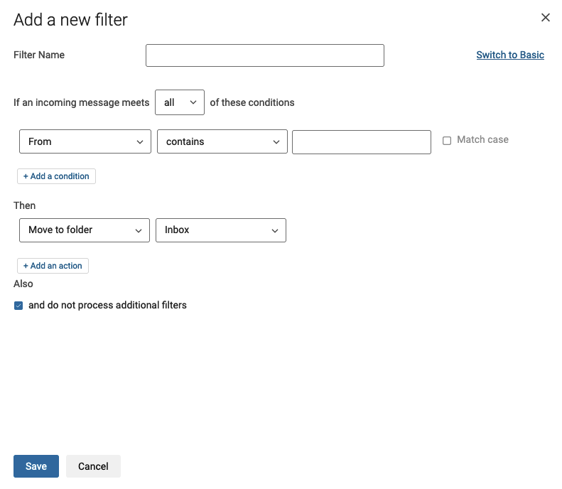{.thumbnail}
>>

### Delegações 

Para aceder ao parâmetro de delegação, clique na roda dentada no canto superior direito da sua interface Zimbra, depois em `Parâmetros`{.action} e, por fim, em `Escrita de email`{.action} na coluna da esquerda.

É possível delegar a sua conta de e-mail a outra conta de e-mail. Este deve imperativamente partilhar a mesma plataforma de e-mail.

> [!primary]
>
> Uma conta de e-mail com o mesmo nome de domínio mas com outra oferta de e-mail não pode receber a delegação.

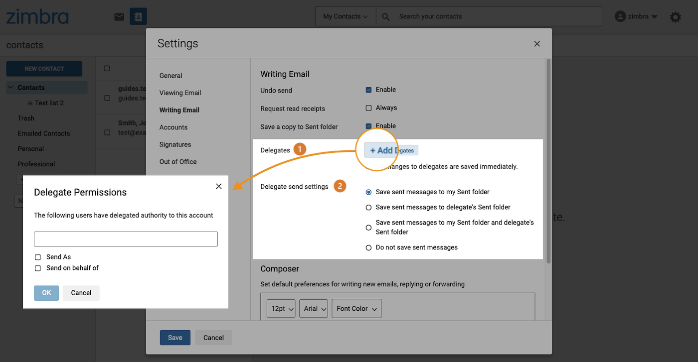{.thumbnail}

**(1) Delegados**. Para delegar sua conta de e-mail a outra conta, clique em `Adicionar delegados`{.action}.

- **Enviar como"** : a pessoa delegada poderá enviar um e-mail com o seu endereço de e-mail, tal como se o tivesse enviado. O destinatário não terá menção do endereço de e-mail do delegado.
- **Enviar em nome de** : a pessoa delegada poderá enviar um e-mail com o seu endereço de e-mail com uma menção "da parte" seu endereço de e-mail. O destinatário recebe a menção dos dois endereços de e-mail implicados na troca.

**(2) Parâmetros de envio do delegado**. Quando delega o seu endereço de e-mail noutro, pode:

- **Guardar as mensagens enviadas na minha pasta Itens "enviados"** : se a pessoa delegada na sua conta enviar um e-mail a partir do seu endereço de e-mail, este e-mail aparecerá na sua pasta "Enviados".
- **Guardar as mensagens enviadas na pasta Itens "enviados" do delegado** : se a pessoa delegada na sua conta enviar um e-mail a partir do seu endereço de e-mail, este e-mail aparecerá na sua pasta "Enviados".
- **Guardar as mensagens enviadas na minha pasta Itens "enviados" e na pasta Itens enviados do delegado** : se a pessoa delegada na sua conta enviar um e-mail a partir do seu endereço de e-mail, este e-mail aparecerá na sua pasta "Enviados" bem como na pasta "Enviados".
- **Não salve as mensagens enviadas** : se a pessoa delegada na sua conta enviar um e-mail a partir do seu endereço de e-mail, não haverá nenhuma cópia de facto.

### Assinatura 

Clique na roda dentada no canto superior direito da sua interface Zimbra, depois em `Configurações`{.action} e, por fim, em `Assinaturas`{.action}, na coluna da esquerda.

Consulte os detalhes de configuração na secção "[Configurar as preferências da interface Zimbra](#settings)" deste manual (clique no separador "**Assinaturas**").

### Respostas automáticas / resposta automática 

Quando estiver em falta e não puder consultar a sua conta de e-mail, poderá criar uma mensagem de ausência que será automaticamente enviada ao remetente. No webmail Zimbra, esta funcionalidade é "Ausente do escritório".

Para aceder à gestão da sua resposta automática, clique na roda dentada no canto superior direito da sua interface, depois em `Definições`{.action} e, por fim, em `Ausente do escritório`{.action}.

A opção predefinida `Ativar resposta automática durante estas datas (inclusive)` está desativada. Selecione esta caixa de verificação para ativar a resposta automática. Agora você tem a opção de digitar o conteúdo da mensagem de ausência no campo de entrada.

- Se não souber quando pretende interromper a resposta automática, selecione a opção `Nenhuma data final`.
- O botão `Enviar texto de amostra para mim`{.action} envia uma descrição geral desta resposta automática na pasta A receber.
- `Remetentes externos` : pode definir uma mensagem diferente quando o remetente é externo ao seu nome de domínio e/ou ao seu livro de endereços. Por predefinição, todos os remetentes recebem a mesma mensagem.

## Quer saber mais?

[Primeiros passos com a oferta MX Plan](/pages/web_cloud/email_and_collaborative_solutions/mx_plan/email_generalities)

[Alterar a palavra-passe de um endereço de e-mail MX Plan](/pages/web_cloud/email_and_collaborative_solutions/mx_plan/email_change_password)

[Criar filtros para os seus endereços de e-mail](/pages/web_cloud/email_and_collaborative_solutions/mx_plan/feature_filters)

[Utilizar os reencaminhamentos de e-mail](/pages/web_cloud/email_and_collaborative_solutions/common_email_features/feature_redirections)

Fale com a nossa comunidade de utilizadores em <https://community.ovh.com>.