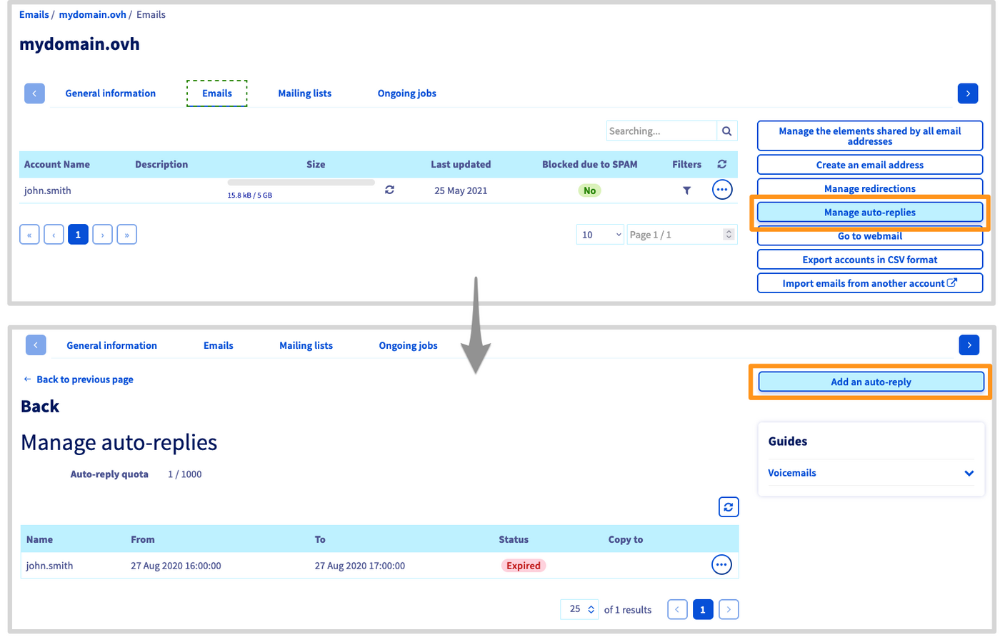
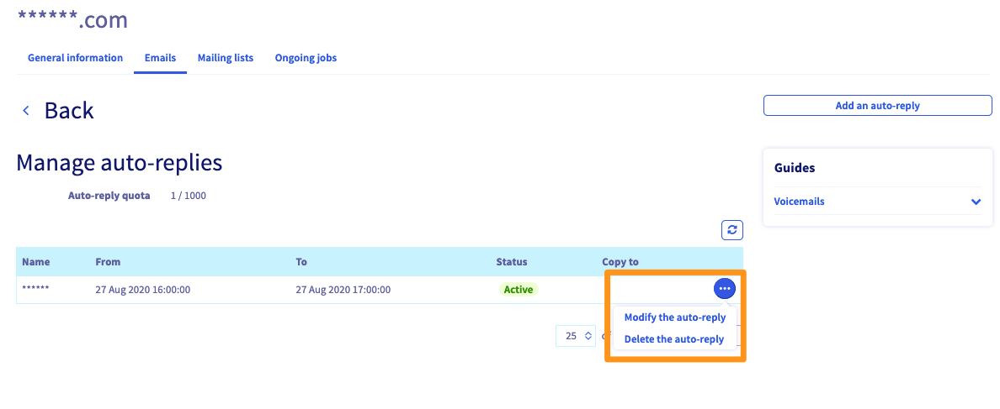

## Objective

This OVHcloud feature allows you to set up an automatic email responder that will leave a message for people trying to contact you by email in your absence.

**This guide explains how to configure automatic replies for your email addresses.**

## Requirements

- a [Web Hosting plan](https://www.ovhcloud.com/en-ca/web-hosting/){.external} 
- access to the [OVHcloud Control Panel](https://ca.ovh.com/auth/?action=gotomanager&from=https://www.ovh.com/ca/en/&ovhSubsidiary=ca)

## Instructions

> [!primary]
>
> If your email account is hosted on [**Exchange**](https://www.ovhcloud.com/en-ca/emails/hosted-exchange/) or if the functionality is not available in your Control Panel, you can instead create responders from your OWA webmail using the guide "[Creating automatic replies in OWA](/pages/web_cloud/email_and_collaborative_solutions/using_the_outlook_web_app_webmail/owa_automatic_replies)".

### Creating autoresponders

Log in to your [OVHcloud Control Panel](https://ca.ovh.com/auth/?action=gotomanager&from=https://www.ovh.com/ca/en/&ovhSubsidiary=ca) and switch to `Web Cloud`{.action}. Select `Emails`{.action}, then choose the domain name concerned. Next, click on the button `Manage auto-replies`{.action} in the tab `Emails`{.action}.

You will be redirected to the `Manage auto-replies` section where all of the email responders for this domain are listed.

To create a new one, click on `Add an auto-reply`{.action}.

{.thumbnail}

In the popup window, fill out the form according to the information below:

#### `Auto-reply type` 

- **Linked to a mailbox**: to be used if it concerns an existing email account of your email solution.
- **Free**: to be used for an alias address. An alias is not linked to an existing account.

#### `Mailbox` or `Auto-reply name` 

- Select the email account concerned by the responder. 
- For "Free" mode, enter the name of your alias address.

#### `Auto-reply duration`

- **Temporary**: Define a start and end date for the responder, for example if you are scheduling an absence.
- **Permanent**: The automatic replies stay active until you delete or modify the responder.

#### `Keep messages on the server` or `Send a copy`

- Choose here whether emails received during your absence will be deleted or kept.
    - **Message**: This will be the reply to incoming mails while the responder is active.
    - **Address on copy** ("Free" mode only): if the receiving address is an alias, you need to select the email account incoming messages will be kept in.

> [!warning]
> If you deselect this option, messages received during your absence will be automatically deleted.

If all the mandatory fields are filled out, you can click on `Confirm`{.action} to create the autoresponder.

### Modifying or deleting autoresponders

Autoresponders are displayed in the table in the `Manage auto-replies` section of your email service. You can delete or modify a responder by clicking on `...`{.action} to the right of it.

{.thumbnail}

## Go further

Join our community of users on https://community.ovh.com/en/
