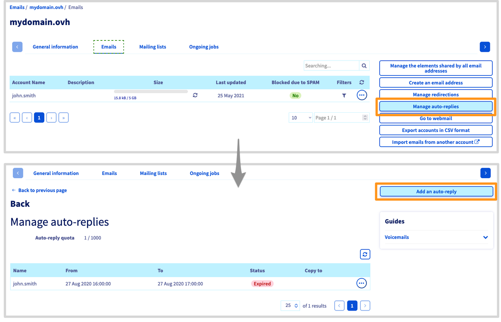
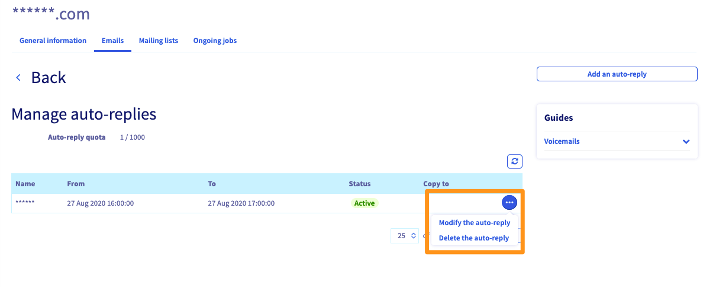

## Objetivo

Quando estiver em falta e não conseguir consultar o seu endereço de e-mail, poderá ativar uma resposta automática (ou resposta automática) que enviará um e-mail aos interlocutores que lhe enviam um e-mail.

**Saiba como ativar uma resposta automática num endereço de e-mail.**

## Requisitos

- Dispor de uma oferta MX Plan. Esta última está disponível através de: uma oferta de [alojamento web](/links/web/hosting), o [alojamento gratuito 100M](/links/web/domains-free-hosting) incluído com um domínio (ativado anteriormente) ou a oferta MX Plan encomendada separadamente.

<!-- CP-NAV-START:web-mx-plan -->
---

### Acesso à Área de Cliente OVHcloud

- **Ligação direta:** [MX Plan](/links/control-panel/web-mx-plan)
- **Caminho de navegação:** `Web Cloud`{.action} > `MX Plan`{.action} > Selecione o seu serviço MX Plan

---
<!-- CP-NAV-END:web-mx-plan -->

## Instruções

> [!warning]
>
> Se o seu endereço de e-mail estiver numa oferta [**Exchange**](/links/web/emails-hosted-exchange), [**E-mail Pro**](/links/web/email-pro) ou se não houver nenhuma secção `Gestão das respostas automáticas`{.action} no seu MX Plan, deverá criar uma resposta automática a partir do seu webmail com a ajuda da documentação [« Configurar uma resposta automática a partir da interface OWA »](/pages/web_cloud/email_and_collaborative_solutions/using_the_outlook_web_app_webmail/owa_automatic_replies).

### Criação de uma resposta automática

Clique no separador `E-mails`{.action} na parte superior e, a seguir, em `Gestão das respostas automáticas`{.action}.

Será redirecionado para a janela `Gestão das respostas automáticas`, onde será apresentado um conjunto de respostas automáticas aos e-mails que foram implementadas no seu serviço.

Clique em `Adicionar uma resposta automática`{.action}

{.thumbnail}

Aparecerá a janela de adição. Pode completá-la de acordo com as informações abaixo.

- `Tipo de resposta automática`:

    - **Associado a uma caixa de e-mail** : a utilizar se se tratar de um endereço de e-mail existente no seu serviço de e-mail.
    - **Livre** : a utilizar no caso de um alias. Por isso, não está associado a um endereço existente.

- `Caixa de e-mail` ou `Nome da resposta automática`: o endereço de e-mail ou o alias afetado pela resposta automática.
- `Duração da resposta automática`:
    - **Temporário** : defina uma data de início e de fim que tenha em conta para o funcionamento da sua resposta automática (útil se estiver de férias, por exemplo).
    - **Permanente** : a resposta automática só funcionará quando a tiver desativado.
- `Enviar uma cópia` ou `Guardar as mensagens no servidor` : permite reenviar as mensagens recebidas durante a sua ausência para o endereço à sua escolha ou conservá-las no endereço de e-mail.

> [!warning]
>
> Se desmarcar esta caixa de verificação, o correio eletrónico recebido durante a ausência será eliminado automaticamente.

- `Endereço em cópia` (apenas em modo livre): no caso de um alias, selecione o endereço de e-mail que receberá os e-mails enviados para o alias.
- `Message` : trata-se da mensagem que os seus correspondentes receberão quando lhe enviarem um e-mail.

De seguida, clique em `Validar`{.action} para concluir a configuração da sua resposta automática.

> [!success]
>
> Se pretender delegar a gestão de uma resposta automática para um endereço de e-mail, consulte o nosso guia [« Delegar a gestão das suas contas de e-mail a outra pessoa »](/pages/web_cloud/email_and_collaborative_solutions/mx_plan/feature_delegation)

### Modificação ou eliminação de uma resposta automática

Depois de criada a sua resposta automática, esta aparecerá na lista visível na secção `Gestão das respostas automáticas`{.action} do seu serviço de e-mail. Pode eliminá-la ou modificá-la clicando em `...`{.action} à direita desta.

{.thumbnail}

## Quer saber mais? 

[FAQ e-mail](/pages/web_cloud/email_and_collaborative_solutions/mx_plan/faq-emails)

Fale com nossa [comunidade de utilizadores](/links/community).
