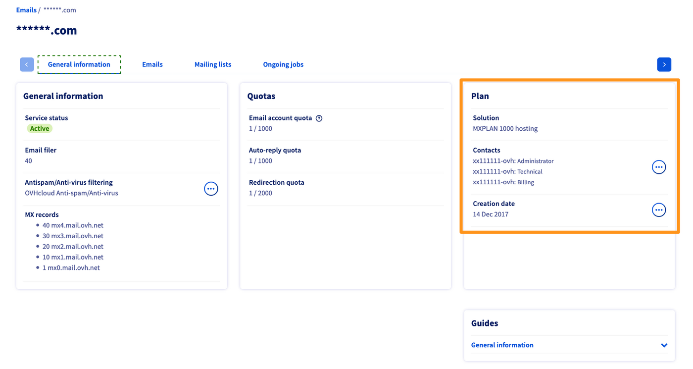
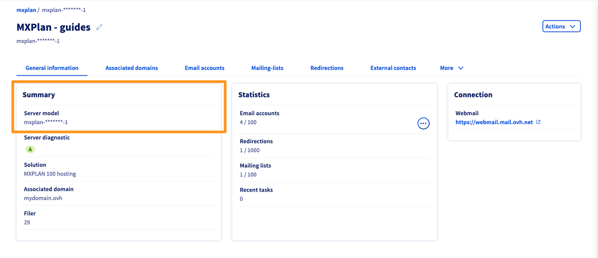
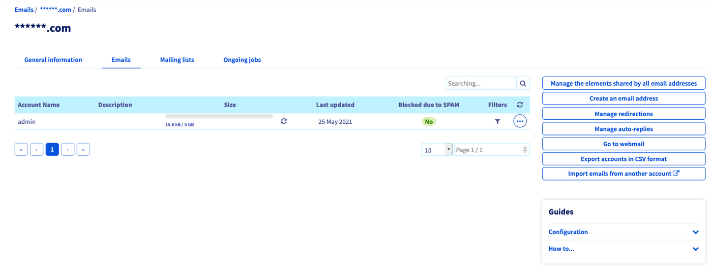
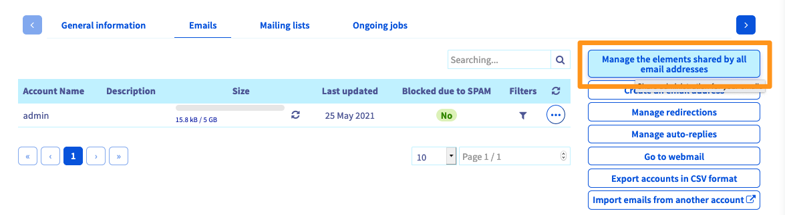
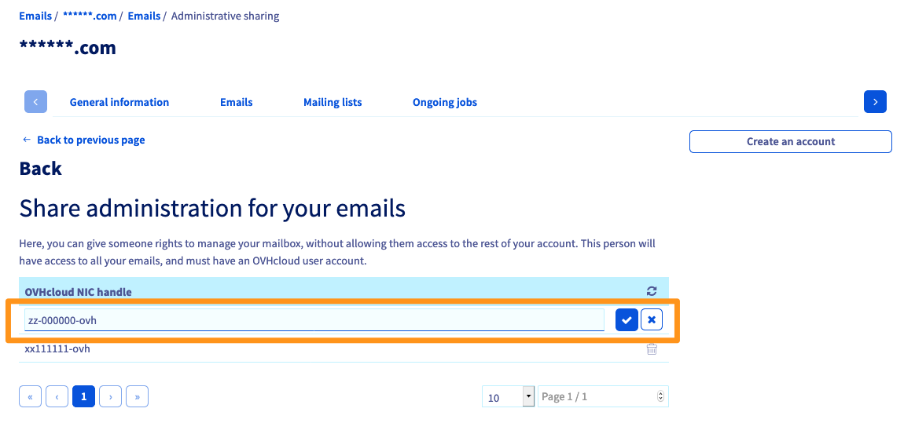
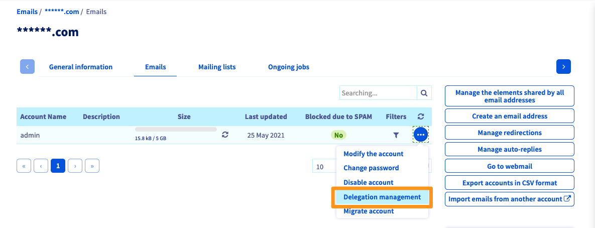
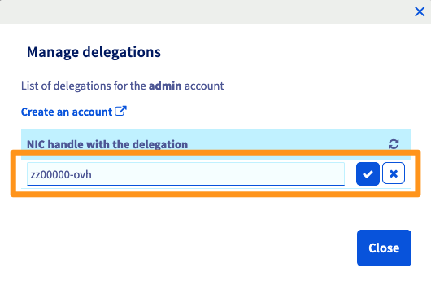

## Obiettivo 

La delega offre all'utente di un account email la possibilità di gestire autonomamente diverse funzionalità (come la modifica della password). Queste funzionalità dipendono dal tipo di delega installato:

- delega **tutti gli account email** a uno o più account OVHcloud. Questo tipo di delega permette agli account cliente beneficiari di gestire filtri, messaggi di risposta automatici, reindirizzamenti/alias e le Mailing List.

- Delegare **uno o più account email** e i filtri a un unico account OVHcloud. Questo tipo di delega non permette ai beneficiari di gestire le risposte automatiche di posta, i reindirizzamenti e le Mailing List. e non permette ai beneficiari di eliminare l'account email, importare le email da un altro account o gestire le deleghe.

**Questa guida ti mostra come delegare gli account email della tua soluzione MX Plan.**

## Prerequisiti

- Disporre di una soluzione MX Plan Puoi effettuare questa operazione tramite: un'[offerta di hosting Web Cloud](/links/web/hosting), un [Hosting gratuito 100M](/links/web/domains-free-hosting) o una soluzione MX Plan ordinata separatamente.

> [!warning]
>
> Questa guida ti mostra come utilizzare il servizio MX Plan storico. Per la nuova offerta non ci sono delegazioni. La modifica della password, i filtri e le risposte automatiche di un indirizzo email possono essere cambiati direttamente tramite la webmail OWA (**O**utlook **W**eb **A**pp). **Utilizza la tabella qui sotto per identificare la tua offerta.**
>

|Vecchia versione della soluzione MX Plan|Nuova versione della soluzione MX Plan|
|---|---|
|{.thumbnail}  Il servizio è indicato nel riquadro “Abbonamento”|{.thumbnail} Nel riquadro "Riepilogo", individua il "Referenza server"|
|Prosegui nella lettura di questa guida nella sezione "[Procedura](#oldmxplan)"|Consulta la nostra guida "[Consulta il tuo account Exchange dall'interfaccia OWA](/pages/web_cloud/email_and_collaborative_solutions/using_the_outlook_web_app_webmail/email_owa#modificare-la-password)"|

<!-- CP-NAV-START:web-mx-plan -->
---

### Accesso allo Spazio Cliente OVHcloud

- **Link diretto:** [MX Plan](/links/control-panel/web-mx-plan)
- **Percorso di navigazione:** `Web Cloud`{.action} > `MX Plan`{.action} > Seleziona il tuo servizio MX Plan

---
<!-- CP-NAV-END:web-mx-plan -->

## Procedura 

> [!primary]
>
> La creazione di una delega su un account email lo mostra nello [Spazio Cliente](/links/manager) interessato. Tuttavia, in questa situazione saranno possibili solo le modifiche indicate nella sezione [Obiettivo](#objective) della guida.
>

Per visualizzare la lista degli account email della tua offerta MX Plan, clicca sulla scheda `Email`{.action}.

{.thumbnail}

### Affida tutti i tuoi account email a uno o più account OVHcloud

Questo tipo di delega permette al beneficiario di gestire password, filtri, risposte automatiche di posta, reindirizzamenti/alias e le Mailing List.

Clicca su `Gestisci le tue condivisioni per tutti gli indirizzi email`{.action}

{.thumbnail}

Si apre una nuova finestra. Clicca sul pulsante `+`{.action} a destra della voce `Aggiungi un identificativo`. Inserisci l'identificativo OVHcloud che usufruirà di questa delega e conferma la tua scelta.

{.thumbnail}

È possibile delegare la gestione del servizio MX Plan a diversi identificativi OVHcloud.

### Delegare uno o più account email a un identificativo

Questa delega ti permette di modificare la password dell'account email interessato e gestire i filtri.

A destra dell'account email che vuoi delegare, clicca sul pulsante `...`{.action} e poi su `Gestisci la delega`{.action}.

{.thumbnail}

Inserisci l'identificativo OVHcloud che usufruirà di questa delega e conferma la tua scelta.

{.thumbnail}

Per gestire ogni account email è possibile aggiungere diverse credenziali OVHcloud.

## Per saperne di più 

[Iniziare a utilizzare la soluzione MX Plan](/pages/web_cloud/email_and_collaborative_solutions/mx_plan/email_generalities)

Contatta la nostra [Community di utenti](/links/community).
