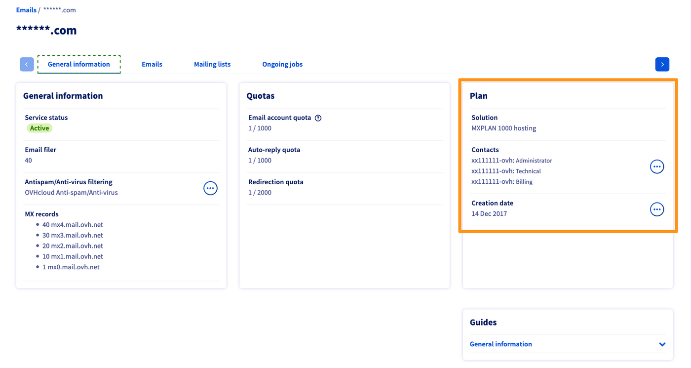
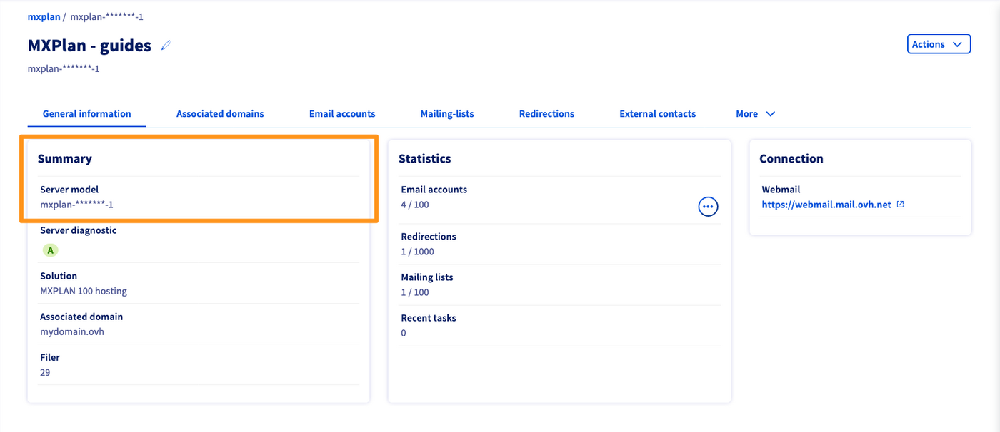
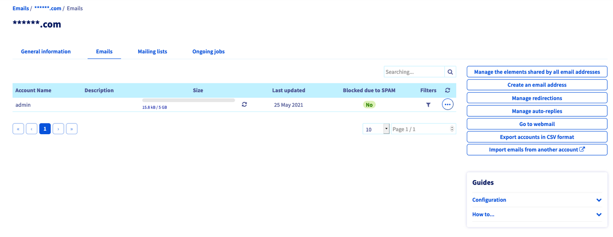
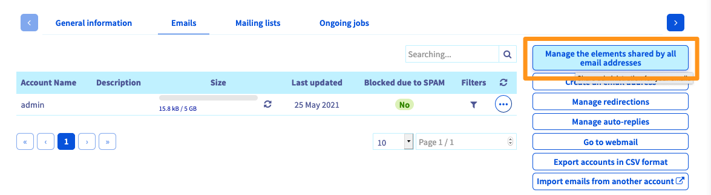
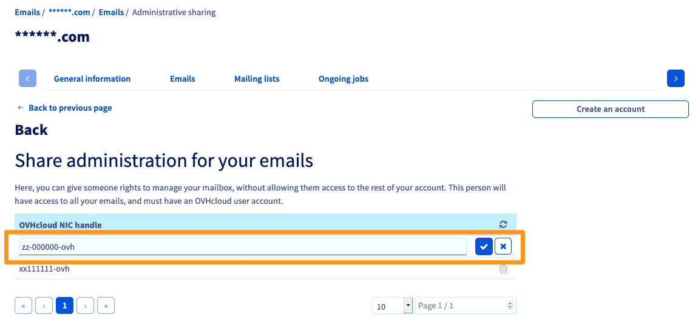

> [!primary]
> Esta tradução foi automaticamente gerada pelo nosso parceiro SYSTRAN. Em certos casos, poderão ocorrer formulações imprecisas, como por exemplo nomes de botões ou detalhes técnicos. Recomendamos que consulte a versão inglesa ou francesa do manual, caso tenha alguma dúvida. Se nos quiser ajudar a melhorar esta tradução, clique em "Contribuir" nesta página.
>

## Objetivo 

A delegação dá ao utilizador de uma conta de e-mail a possibilidade de gerir ele próprio diferentes funcionalidades (a alteração da palavra-passe nomeadamente). Estas funcionalidades dependem do tipo de delegação estabelecida:

- Delegue **o conjunto das suas contas de e-mail** a uma ou várias contas OVHcloud. Este tipo de delegação permite às contas de clientes beneficiárias gerir os filtros, os respondedores de e-mails, os reencaminhamentos/alias, bem como as Mailing Lists.

- Delegar **uma ou várias contas de e-mail** e os seus filtros numa única conta OVHcloud. Este tipo de delegação não permite aos beneficiários gerir os respondedores de e-mails, os reencaminhamentos, nem as Mailing Lists. Também não permite aos beneficiários eliminar as contas de e-mail em causa, importar os e-mails de outra conta ou gerir as delegações.

**Saiba como delegar as contas de e-mail da sua oferta MX Plan.**

## Requisitos

- Dispor de uma oferta MX Plan Está disponível através de: uma [oferta de alojamento Web Cloud](https://www.ovhcloud.com/pt/web-hosting/), um [Alojamento gratuito 100M](https://www.ovhcloud.com/pt/domains/free-web-hosting/) ou uma oferta MX Plan encomendada separadamente.
- Ter acesso à [Área de Cliente OVHcloud](https://www.ovh.com/auth/?action=gotomanager&from=https://www.ovh.pt/&ovhSubsidiary=pt), na secção `Web Cloud`{.action}.

> [!warning]
>
> O seguinte guia é endereçado aos detentores da oferta MX Plan "Histórico". Para a nova oferta, não há delegações. A alteração da password, os filtros e atendedores de um endereço de e-mail podem ser diretamente alterados através do webmail OWA (**O**utlook **W**eb **A**pplication). **Identifique a sua oferta através da tabela abaixo.**
>

|Versão antiga da oferta MX Plan|Nova versão da oferta MX Plan|
|---|---|
|{.thumbnail}  Consulte o tipo de oferta na secção «Subscrição».|{.thumbnail} Consulte a Referência do servidor na secção "Resumo".|
|Consulte este manual a partir da secção "[Instruções](#oldmxplan)".|Consulte o nosso manual "[Consultar a sua conta Exchange a partir da interface OWA](/pages/web_cloud/email_and_collaborative_solutions/using_the_outlook_web_app_webmail/email_owa#alterar-a-palavra-passe)"|

## Instruções 

> [!primary]
>
>A criação de uma delegação numa conta de e-mail indica-o no [espaço de cliente](https://www.ovh.com/auth/?action=gotomanager&from=https://www.ovh.pt/&ovhSubsidiary=pt) em causa. No entanto, nesta situação, apenas serão possíveis as alterações indicadas na secção [Objetivo](#objective) deste guia.
>

Aceda à [Área de Cliente OVHcloud](https://www.ovh.com/auth/?action=gotomanager&from=https://www.ovh.pt/&ovhSubsidiary=pt){.external}, na secção `Web Cloud`.

Clique em `E-mails`{.action} e selecione o serviço MX Plan correspondente.

Para apresentar a lista das contas de e-mail da sua oferta MXplan, clique no separador `Emails`{.action}.

{.thumbnail}

### Delegar o conjunto das suas contas de e-mail a uma ou várias contas OVHcloud

Este tipo de delegação permite ao seu beneficiário gerir as palavras-passe, os filtros, os respondedores de e-mails, os reencaminhamentos/alias, bem como as Mailing Lists.

Clique em `Gerir as suas partilhas para todos os endereços de e-mail`{.action}

{.thumbnail}

Surge uma nova janela. Clique no botão `+`{.action} à direita da linha `Adicionar um identificador`. Introduza o identificador OVHcloud que beneficiará desta delegação e valide a sua escolha.

{.thumbnail}

Pode delegar a gestão do seu serviço MXplan em vários identificadores OVHcloud.

### Delegar uma ou várias contas de e-mail tem um identificador

Esta delegação permite-lhe alterar a palavra-passe da conta de e-mail em causa e gerir os seus filtros.

À direita da conta de e-mail que deseja delegar, clique no botão `...`{.action} e depois em `Gestão da delegação`{.action}.

{.thumbnail}

Introduza o identificador OVHcloud que beneficiará desta delegação e valide a sua escolha.

{.thumbnail}

É possível adicionar vários identificadores OVHcloud para gerir cada endereço de e-mail.

## Saiba mais

[Primeiros passos com a oferta MX Plan](/pages/web_cloud/email_and_collaborative_solutions/mx_plan/email_generalities)

Fale com a nossa comunidade de utilizadores: <https://community.ovh.com/en/>.
