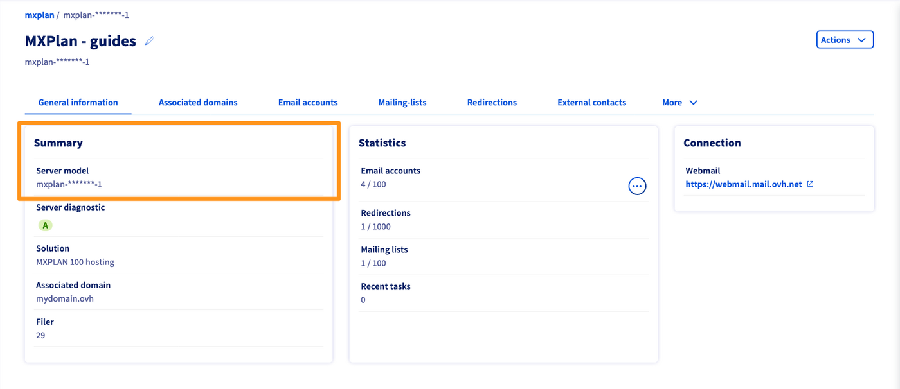
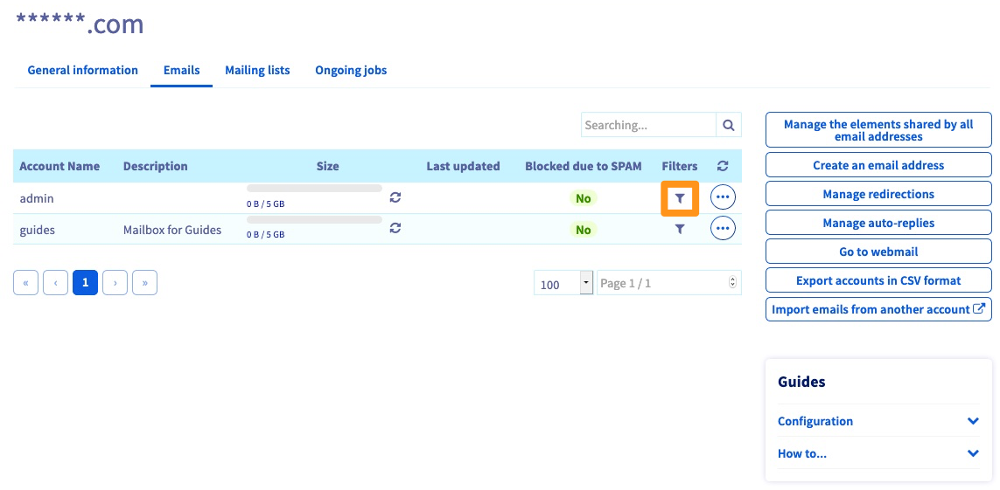
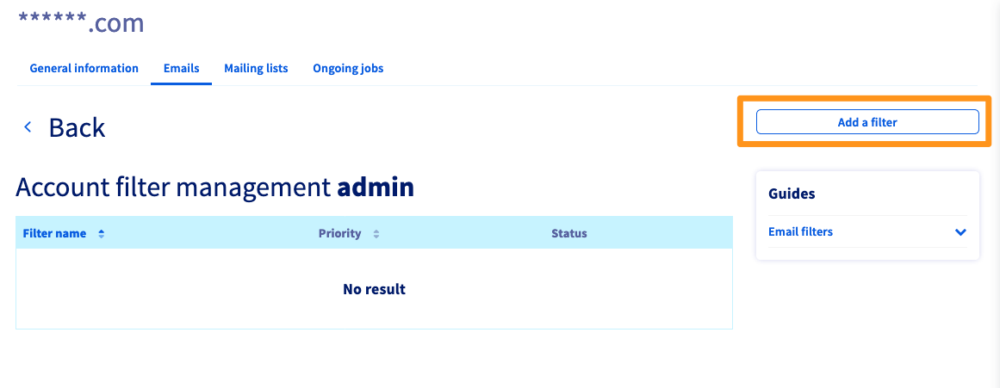
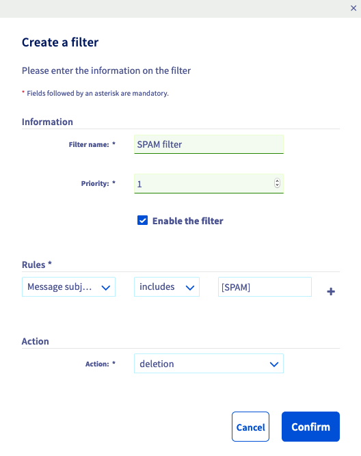

> [!primary]
> Esta tradução foi automaticamente gerada pelo nosso parceiro SYSTRAN. Em certos casos, poderão ocorrer formulações imprecisas, como por exemplo nomes de botões ou detalhes técnicos. Recomendamos que consulte a versão inglesa ou francesa do manual, caso tenha alguma dúvida. Se nos quiser ajudar a melhorar esta tradução, clique em "Contribuir" nesta página.
>

**Última atualização: 27/09/2021**

## Objetivo

Um filtro de e-mail permite-lhe aplicar diferentes tratamentos às mensagens que recebe, de acordo com os critérios à sua escolha.

Por exemplo: deseja que todo o e-mail que contenha "\[SPAM]" no assumpto seja eliminado.

- Critério = o assumpto do e-mail contém *SPAM*
- Tratamento = eliminar o e-mail

**Saiba como criar e configurar um filtro no seu endereço de e-mail.**

## Requisitos

- Ter um serviço de e-mail MX Plan (disponível através de: um plano de [alojamento web](https://www.ovhcloud.com/pt/web-hosting/){.external}, o [Alojamento gratuito 100M](https://www.ovhcloud.com/pt/domains/free-web-hosting/){.external} incluído com um domínio ou a oferta MX Plan (encomendada separadamente).
- Ter acesso à sua [Área de Cliente OVHcloud](	https://www.ovh.com/auth/?action=gotomanager&from=https://www.ovh.pt/&ovhSubsidiary=pt){.external}.

> [!warning]
>
> O seguinte guia é endereçado aos detentores da oferta MX Plan "Histórico". Para a nova oferta, a gestão dos filtros é feita diretamente através do webmail OWA (**O**utlook **W**eb **A**pplication). Identifique a sua oferta através da tabela abaixo.
>

Versão antiga da oferta MX Plan|Nova versão da oferta MX Plan|
|---|---|
|{.thumbnail}  Consulte o tipo de oferta na secção “Subscrição”.|{.thumbnail} Consulte a Referência do servidor na secção "Resumo".|
|Consulte este manual a partir da secção "[Na prática](#oldmxplan)".|Consulte o nosso manual "[Regras da caixa de entrada a partir da interface OWA](/pages/web_cloud/email_and_collaborative_solutions/using_the_outlook_web_app_webmail/creating-inbox-rules-in-owa-mx-plan)".|

## Prática 

Aceda à Área de [Cliente OVHcloud](	https://www.ovh.com/auth/?action=gotomanager&from=https://www.ovh.pt/&ovhSubsidiary=pt){.external}, na secção `Web Cloud`.

Clique em `E-mails`{.action} e selecione o serviço MX Plan correspondente.

No separador `E-mails`{.action} do serviço MXplan, encontrará a lista dos endereços de e-mail. Pode ver uma coluna de `filtros` na tabela de contas de e-mail. Clique no ícone de funil.

{.thumbnail}

Poderá aceder à lista dos filtros atualmente configurados para este endereço de e-mail.

{.thumbnail}

Para adicionar uma regra ao endereço de e-mail, clique no botão `Adicionar um Filtro`{.action}.

- **Nome do filtro:** escolha um nome para o seu filtro.

- **Prioridade:** define a ordem de execução dos seus filtros numa mensagem de entrada. Um filtro de prioridade 1 será executado antes de um filtro de prioridade 2.

- **Ativar o filtro:** desmarque esta opção se deseja aplicar este filtro mais tarde.

### Compreender a configuração dos filtros de e-mails

Quando adicionar um filtro, aparecerá a seguinte janela:

{.thumbnail}

#### Regras

Esta parte permite-lhe definir as mensagens nas quais o filtro será aplicado.

Primeira escolha (em cabeçalho):

- **De:** designa o endereço de e-mail do remetente, por exemplo: "Se o expedidor ..."
- **A:** designa o endereço de e-mail do destinatário, por exemplo: "Se o destinatário ..."
- **Assumpto da mensagem:** significa o conteúdo do assumpto da mensagem, por exemplo: "Se o assumpto da mensagem ... ".
- **Outra:** indique outro elemento no cabeçalho do e-mail.

Segunda escolha (regra):

- **spf:** Indique um valor do [registo SPF](/pages/web_cloud/domains/dns_zone_spf) a ter em conta, por exemplo: ".. sem registo SPF ... ".
- **contém:** exemplo: "... contém ... ".
- **não contém:** exemplo: "... não contém ... ".

Terceira escolha (valor):

- Exemplo: \[SPAM]

Quarta escolha (+):

- Isto permite-lhe adicionar uma ou várias condições para a mesma ação.

#### Ações

Esta parte permite-lhe definir as ações a aplicar.

Pode escolher entre:

- **Aceitar:** os e-mails que preencham as condições serão recebidos normalmente.
- **Reencaminhar para um endereço local:** reencaminha os e-mails que preencham as condições para um dos endereços de e-mail do seu domínio.
- **Eliminação:** os e-mails que preencham as condições serão eliminados.
- **Reencaminhar para um endereço distante:** reencaminha os e-mails que preencham as condições para o endereço de e-mail à sua escolha.

### Exemplos de filtros

#### Eliminar spams

||Cabeçalho|Règle|Valor|Cenários|
|---|---|---|---|---|
|Parâmetros do filtro|Assumpto da mensagem|contém|\[SPAM]|eliminação|
|O que o filtro vai fazer|Se o assumpto da mensagem|contém|a suite "\[SPAM]"|então, eliminar a mensagem.|

#### Reencaminhar os e-mails de um destinatário

||Cabeçalho|Règle|Valor|Cenários|
|---|---|---|---|---|
|Parâmetros do filtro|De|contém|contact@domaintest.ovh|reencaminhar para um endereço remoto: jean@otherdomain.ovh|
|O que o filtro vai fazer|Se o expedidor|é|contact@domaintest.ovh|enviar o e-mail para jean@otherdomain.ovh|

#### Reencaminhar os e-mails enviados a uma Mailing-List

||Cabeçalho|Règle|Valor|Cenários|
|---|---|---|---|---|
|Parâmetros do filtro|A|contém|ml@mailing.com|Reencaminhar para um endereço local: recipient@mypersonaldomain.ovh|
|O que o filtro vai fazer|Se a mensagem foi enviada à Mailing-List|chamada|ml@mailing.com|então, enviar a mensagem para o meu outro endereço: recipient@mypersonaldomain.ovh|

#### Eliminar os e-mails que contenham uma menção indesejável, com exceção de um remetente

Adicionam-se dois filtros:

||Cabeçalho|Règle|Valor|Cenários|
|---|---|---|---|---|
|Parâmetros do filtro 1|Assumpto da mensagem|contém|"money"|eliminação|
|Parâmetros do filtro 2|De|não contém|john@mybank.ovh|eliminação|

Se o assumpto da mensagem contiver a palavra "money" **e o** remetente da mensagem não for "john@mybank.ovh", então a mensagem será suprimida:

{.thumbnail}

## Saiba mais

[Primeiros passos com a oferta MX Plan](/pages/web_cloud/email_and_collaborative_solutions/mx_plan/email_generalities)

[Regras da caixa de entrada a partir da interface OWA](/pages/web_cloud/email_and_collaborative_solutions/using_the_outlook_web_app_webmail/creating-inbox-rules-in-owa-mx-plan)

Fale com a nossa comunidade de utilizadores em <https://community.ovh.com/en/>.
