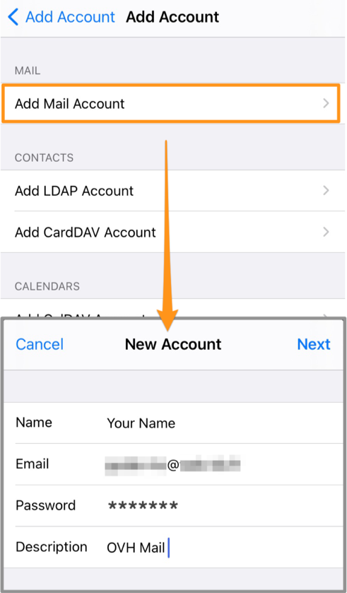

> [!primary]
> Esta tradução foi automaticamente gerada pelo nosso parceiro SYSTRAN. Em certos casos, poderão ocorrer formulações imprecisas, como por exemplo nomes de botões ou detalhes técnicos. Recomendamos que consulte a versão inglesa ou francesa do manual, caso tenha alguma dúvida. Se nos quiser ajudar a melhorar esta tradução, clique em "Contribuir" nesta página.
>

## Objetivo

Os endereços de e-mail do serviço MX Plan podem ser configurados num software ou numa aplicação de e-mail compatíveis. Isto permite-lhe enviar e receber e-mails no dispositivo que preferir.

**Saiba como configurar um endereço de e-mail MX Plan num iPhone ou num iPad através da aplicação Mail.**

> [!warning]
>
> A responsabilidade sobre a configuração e a gestão dos serviços que a OVHcloud disponibiliza recai sobre o utilizador. Assim, deverá certificar-se de que estes funcionam corretamente.
>
> Este guia explica como implementar algumas medidas para otimizar a performance e a segurança do seu sistema. No entanto, se encontrar dificuldades, recomendamos que recorra a um [prestador de serviços especializado](https://partner.ovhcloud.com/pt/directory/) e/ou que contacte o editor do serviço. Não poderemos proporcionar-lhe assistência técnica. Para mais informações, aceda à secção «Quer saber mais?» deste guia.
>

## Requisitos

- Ter um endereço de e-mail MX Plan (incluído no serviço MX Plan ou num serviço de [alojamento web da OVHcloud](https://www.ovhcloud.com/pt/web-hosting/){.external}).
- Estar atualizado em [pagamentos](/pages/account_and_service_management/managing_billing_payments_and_services/invoice_management#pay-bills) e [renovações](/pages/account_and_service_management/managing_billing_payments_and_services/how_to_use_automatic_renewal#renewal-management) dos serviços associados (nome de domínio e alojamento web).
- Ter a aplicação Mail instalada no seu dispositivo iOS.
- Ter acesso às credenciais do endereço de e-mail que pretende configurar.

## Instruções

### Adicionar a conta

No ecrã principal do seu dispositivo, aceda a `Regulações`{.action} (ícone de roda dentada). A adição de uma conta efetua-se de diferentes formas consoante a sua versão do iOS:

- **Para iOS 7, 8, 9 e 10**: aceda a `Mail, Contacts, Calendário`{.action} e depois a `Adicionar uma conta`{.action}. A seguir selecione `Outra`{.action}, depois `Adicionar uma conta de e-mail`{.action}. Passe em seguida à etapa 5 da tabela seguinte.

- **Para iOS 11, 12 e 13**: carregue em `Contas e palavras-passe`{.action} e depois em `Adicionar uma conta`{.action}. A seguir selecione `Outra`{.action}, depois `Adicionar uma conta de e-mail`{.action}. Passe em seguida à etapa 5 da tabela seguinte.

- **Para iOS versões 14 e superiores**: siga as instruções da tabela abaixo.

| | |
|---|---|
|{.thumbnail}|1. Em `Regulações`, aceda ao `Mail`.    2. Carregue em `Contas`.   3. Carregue em `Adicionar uma conta`.   4. Escolha `Outro` no fundo.|
|5. Carregue em `Adicionar uma conta de e-mail`.  6. Introduza o seu **nome**, o seu endereço de **e-mail**, a sua **password** e uma **descrição** da sua conta.  7. Carregue em `Seguinte`.|{.thumbnail}|
|{.thumbnail}|8. Selecione o tipo de servidor de receção `IMAP` (recomendado) ou `POP`.  Nas secções `SERVIDOR DE RECEÇÃO` e `SERVIDOR DE ENVIO`, introduza:  - o nome do host **ssl0.ovh.net**  - o seu **endereço de e-mail completo** no nome de utilizador  - a palavra-passe do seu endereço de e-mail|

No final da configuração, certifique-se de que a opção `Mail`{.action} está selecionada. Para que a aplicação possa utilizar esta conta, clique em `Guardar`{.action}.

Faça um teste de envio para confirmar se a configuração foi bem-sucedida.

Precisa de inserir os dados de forma manual nas preferências da conta? A tabela abaixo tem os dados necessários para configurar a conta de forma correta:

- **para uma configuração em IMAP**

|Tipo de servidor|Nome do servidor|SSL|Porta|
|---|---|---|---|
|Entrada|ssl0.ovh.net|Sim|993|
|Saída|ssl0.ovh.net|Sim|465|

- **para uma configuração em POP**

|Tipo de servidor|Nome do servidor|SSL|Porta|
|---|---|---|---|
|Entrada|ssl0.ovh.net|Sim|995|
|Saída|ssl0.ovh.net|Sim|465|

### Utilizar o endereço de e-mail

Após a configuração, a conta de e-mail está pronta a usar e pode começar a enviar e receber mensagens no seu dispositivo.

A OVHcloud oferece uma aplicação web que permite aceder ao seu endereço de e-mail a partir do seu browser <https://www.ovh.pt/mail/>. Para aceder, só precisa dos dados de acesso relativos ao seu endereço de e-mail.

> [!primary]
>
> Em caso de dificuldade de receção ou de envio de e-mails, consulte a nossa [FAQ sobre os serviços de e-mail da OVHcloud](/pages/web_cloud/email_and_collaborative_solutions/mx_plan/faq-emails).
>

## Quer saber mais?

[Configurar uma conta Exchange num iPhone ou num iPad](/pages/web_cloud/email_and_collaborative_solutions/microsoft_exchange/how_to_configure_ios).

[Configurar a sua conta E-mail Pro num iPhone ou num iPad](/pages/web_cloud/email_and_collaborative_solutions/email_pro/how_to_configure_ios).

[FAQ: e-mails](/pages/web_cloud/email_and_collaborative_solutions/mx_plan/faq-emails).

Fale com a nossa comunidade de utilizadores: <https://community.ovh.com/en/>.