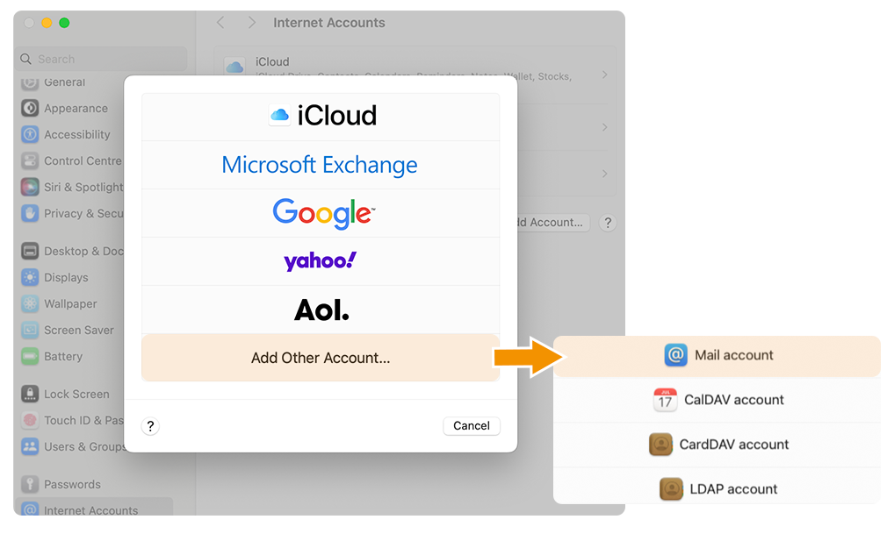
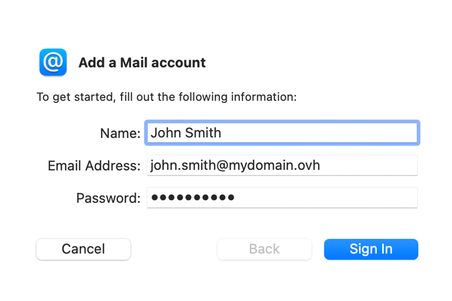
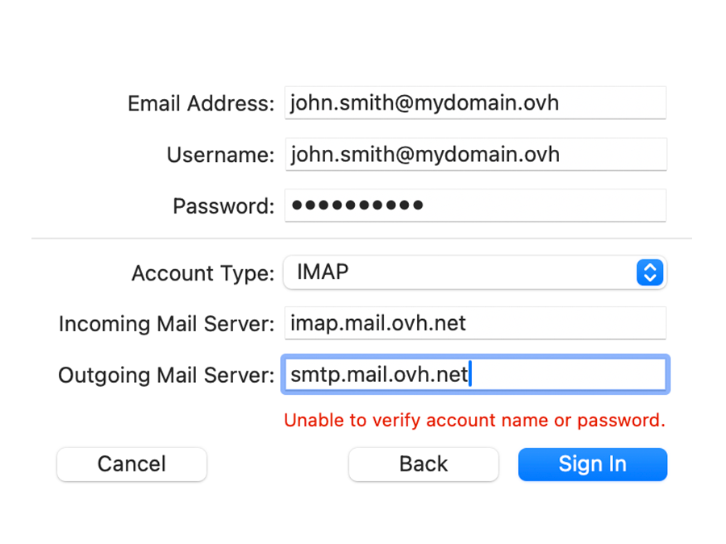
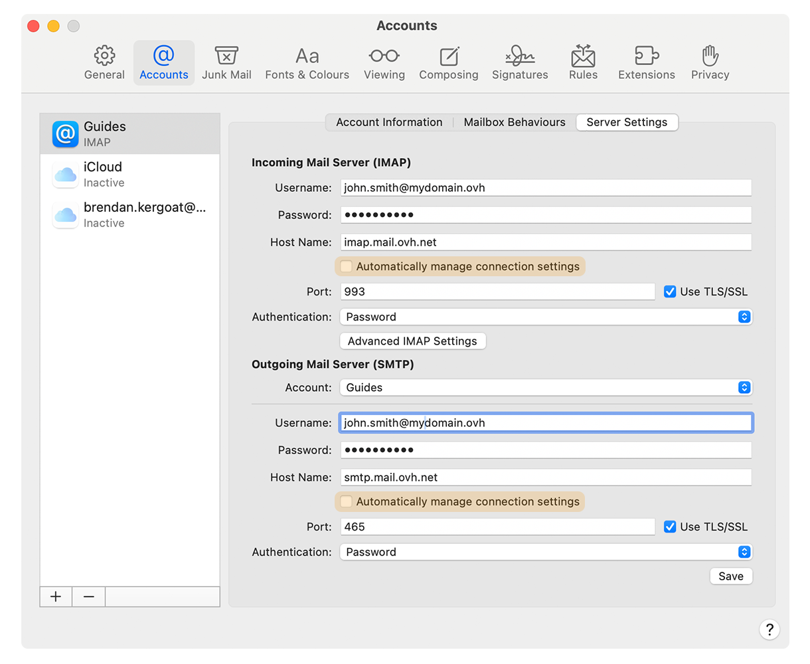
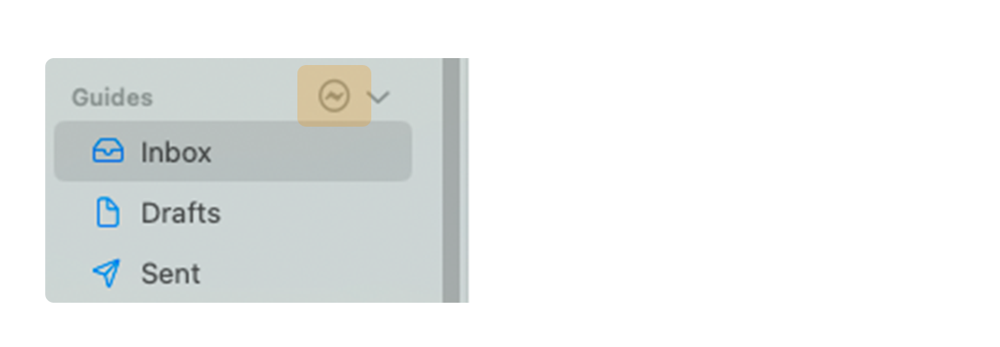
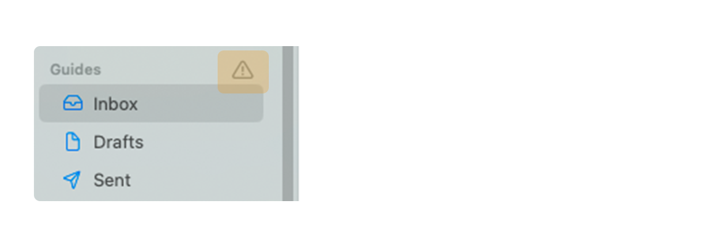

## Objectif

Les comptes MX Plan peuvent être configurés sur différents logiciels de messagerie compatibles. Cela vous permet d’utiliser votre adresse e-mail depuis l’appareil de votre choix. L'application Mail sur macOS est disponible gratuitement sur tous les Mac.

**Découvrez comment configurer votre adresse e-mail MX Plan sur Mail de macOS.**

> [!warning]
>
> OVHcloud met à votre disposition des services dont la configuration, la gestion et la responsabilité vous incombent. Il vous revient de ce fait d'en assurer le bon fonctionnement.
>
> Nous mettons à votre disposition ce guide afin de vous accompagner au mieux sur des tâches courantes. Néanmoins, nous vous recommandons de faire appel à un [partenaire spécialisé](https://marketplace.ovhcloud.com/c/support-collaboration) et/ou de contacter l'éditeur du service si vous éprouvez des difficultés. En effet, nous ne serons pas en mesure de vous fournir une assistance. Plus d'informations dans la section « Aller plus loin » de ce guide.

## Prérequis

- Disposer d’une adresse e-mail MX Plan (comprise dans l’offre MX Plan ou dans une offre d’[hébergement web OVHcloud](/links/web/hosting)).
- Disposer du logiciel Mail installé sur votre Mac.
- Posséder les identifiants relatifs à l'adresse e-mail que vous souhaitez paramétrer.

## En pratique

### Ajouter le compte

- **Lors du premier démarrage de l'application** : un assistant de configuration s'affiche directement et vous invite à choisir votre type de compte.

- **Si un compte a déjà été paramétré** : cliquez sur `Mail`{.action} dans la barre de menu en haut de votre écran, puis sur `Comptes`{.action}.

Suivez les étapes d'installation en cliqueant sur les onglets ci-dessous :

> [!tabs]
> **Etape 1**
>>
>> Sélectionnez `Autre compte Mail`{.action} puis cliquez sur `Compte Mail`{.action}.  
>> {.thumbnail .w-400 .h-600}
>>
> **Etape 2**
>>
>> Saisissez, dans la fenêtre « **Ajouter un compte Mail** », les informations suivantes :   
>> - Un **Nom** pour votre compte e-mail
>> - Votre **Adresse e-mail**
>> - Le **Mot de passe** de votre adresse e-mail 
>> {.thumbnail .w-400 .h-600}
>>
> **Etape 3**
>>
>> Dans la fenêtre suivante, complétez les informations :
>>
>> - **Adresse e-mail**
>> - **Nom d'utilisateur** : Saisissez votre adresse e-mail complète
>> - **Mot de passe**
>> - **Type de compte** : Sélectionnez `IMAP` (recommandé) ou `POP`
>> - **Serveur de réception** : - **EUROPE** : Saisissez `imap.mail.ovh.net` ou `ssl0.ovh.net` - **AMERIQUE/ASIE** : Saisissez `imap.mail.ovh.ca`
>> - **Serveur d'envoi** : - **EUROPE** : Saisissez `smtp.mail.ovh.net` ou `ssl0.ovh.net` - **AMERIQUE/ASIE** : Saisissez `smtp.mail.ovh.ca`
>>
>> Pour finaliser la configuration, cliquez sur `Se connecter`{.action}
>>
>> > [!warning]
>> >
>> > Il est normal de voir apparaître le message en rouge « **impossible de vérifier le nom ou le mot de passe du compte** » lorsque la fenêtre apparaît la première fois. Néanmoins, si ce message persiste après validation, cela signifie que les informations saisies sont erronées.  
>>
>> {.thumbnail .w-400 .h-600}

> [!warning]
>
> Si, après avoir suivi les étapes de configuration ci-dessous, vous rencontrez un défaut d'envoi ou de réception, consultez la rubrique [Modifier les paramètres existants](#modify-settings)

### Utiliser l'adresse e-mail

Une fois l'adresse e-mail configurée, il ne reste plus qu’à l'utiliser ! Vous pouvez dès à présent envoyer et recevoir des messages.

OVHcloud propose aussi une application web permettant d'accéder à votre adresse e-mail depuis un navigateur internet. Celle-ci est accessible à l’adresse [Webmail](/links/web/email). Vous pouvez vous y connecter grâce aux identifiants de votre adresse e-mail. Pour toute question relative à son utilisation, aidez-vous de notre guide [Consulter son compte depuis l’interface OWA](/pages/web_cloud/email_and_collaborative_solutions/using_the_outlook_web_app_webmail/email_owa) ou [Utiliser son adresse e-mail depuis le webmail RoundCube](/pages/web_cloud/email_and_collaborative_solutions/mx_plan/email_roundcube#ou-et-comment-se-connecter-au-webmail-roundcube).

### Récupérer une sauvegarde de votre adresse e-mail

Si vous devez effectuer une manipulation qui risquerait d'entrainer la perte des données de votre compte e-mail, nous vous conseillons d'effectuer une sauvegarde préalable du compte e-mail concerné. Pour ce faire, consultez le paragraphe « **Exporter** » dans la partie « **Mail sur Mac OS** » de notre guide [Migrer manuellement votre adresse e-mail](/pages/web_cloud/email_and_collaborative_solutions/migrating/manual_email_migration#exporter).

### Modifier les paramètres existants 

Si votre compte e-mail est déjà paramétré et que vous devez accéder aux paramètres du compte pour les modifier :

- Cliquez sur `Mail`{.action} dans la barre de menu en haut de votre écran, puis sur `Préférences`{.action}.
- Sélectionnez le compte concerné dans la colonne de gauche puis cliquez sur `Réglages du serveur`{.action}.
- Dans la section `Serveur de réception (POP)` ou `Serveur de réception (IMAP)`, saisissez votre adresse e-mail complète dans la case `Nom d'utilisateur`{.action} ainsi que le `Mot de passe`{.action} associé dans la case prévue à cet effet.
- Dans la section `Serveur de d'envoi (SMTP)` saisissez votre adresse e-mail complète dans la case `Nom d'utilisateur`{.action} ainsi que le `Mot de passe`{.action} associé dans la case prévue à cet effet.
- Décochez les cases `Gérer automatiquement les réglages de connexion`{.action} pour faire apparaitre les paramètres de `Port`{.action} et `Authentification`{.action}.
- Assurez-vous que les cases `Utiliser TLS/SSL`{.action} sont cochées.
- Dans les menus déroulants `Authentification`{.action}, vérifiez que `Mot de passe` est sélectionné.
- Pour les cases `Nom de l'hôte`{.action} et `Port`{.action}, référez-vous aux valeurs de la rubrique « [Rappel des paramètres POP, IMAP et SMTP](#popimap-settings) ». **Vérifiez bien que le type de serveur (IMAP, POP et SMTP) correspond à votre région (Europe ou Asie-Pacifique)**.

Pour finaliser la configuration, cliquez sur `Enregistrer`{.action}.

{.thumbnail .w-400 .h-600}

> [!primary]
>
> **Changer sa configuration**
>
> Si votre adresse e-mail est configurée en **IMAP** et que vous souhaitez changer cette configuration en **POP**, vous devez supprimer le compte sur Mail de MacOS puis le recréer en **POP**.

### Rappel des paramètres POP, IMAP et SMTP 

Pour la réception des e-mails, lors du choix du type de compte, nous vous conseillons une utilisation en **IMAP**. Vous pouvez cependant sélectionner **POP**.

> [!warning]
>
> Il est nécessaire de bien relever la valeur correspondante à votre localisation (**EUROPE** ou **AMERIQUE / ASIE-PACIFIQUE**)

- **Pour une configuration en POP**

|Information|Description|
|---|---|
|Nom d'utilisateur|Renseignez l'adresse e-mail **complète**|
|Mot de passe|Renseignez le mot de passe de l'adresse e-mail|
|Serveur **EUROPE** (entrant)|pop.mail.ovh.net **ou** ssl0.ovh.net|
|Serveur **AMERIQUE / ASIE-PACIFIQUE** (entrant)|pop.mail.ovh.ca|
|Port|995|
|Type de sécurité|SSL/TLS|

- **Pour une configuration en IMAP**

|Information|Description|
|---|---|
|Nom d'utilisateur|Renseignez l'adresse e-mail **complète**|
|Mot de passe|Renseignez le mot de passe de l'adresse e-mail|
|Serveur **EUROPE** (entrant)|imap.mail.ovh.net **ou** ssl0.ovh.net|
|Serveur **AMERIQUE / ASIE-PACIFIQUE** (entrant)|imap.mail.ovh.ca|
|Port|993|
|Type de sécurité|SSL/TLS|

Pour l'envoi des e-mails, si vous devez renseigner manuellement les paramètres **SMTP** dans les préférences du compte, retrouvez ci-dessous les paramètres à utiliser :

- **Configuration SMTP**

|Information|Description|
|---|---|
|Nom d'utilisateur|Renseignez l'adresse e-mail **complète**|
|Mot de passe|Renseignez le mot de passe de l'adresse e-mail|
|Serveur **EUROPE** (sortant)|smtp.mail.ovh.net **ou** ssl0.ovh.net|
|Serveur **AMERIQUE / ASIE-PACIFIQUE** (sotant)|smtp.mail.ovh.ca|
|Port|465|
|Type de sécurité|SSL/TLS|

> [!primary]
>
> **Changer sa configuration**
>
> Si votre adresse e-mail est configurée en **IMAP** et que vous souhaitez changer cette configuration en **POP**, vous devez supprimer le compte sur Mail de MacOS puis le recréer en **POP**.

### Que faire si je ne parviens pas à recevoir/envoyer mes e-mails ?

- Si vous constatez l'apparition de l'icône visible sur la capture ci-dessous, il s'agit d'une déconnexion réseau. Vérifiez que votre connexion à Internet fonctionne correctement.

{.thumbnail .w-400 .h-600}

- Si vous constatez l'apparition de l'icône visible sur la capture ci-dessous, il s'agit d'un défaut de synchronisation. Vérifiez les paramètres de configuration de votre compte e-mail en consultant la rubrique [Modifier les paramètres existants](#modify-settings).

{.thumbnail .w-400 .h-600}

## Aller plus loin

> [!primary]
>
> Pour plus d'informations sur la configuration d'une adresse e-mail depuis l'application Mail sur macOS, consultez [le centre d'aide Apple](https://support.apple.com/fr-fr/guide/mail/mail35803/mac).

[MX Plan - Configurer son compte e-mail sur Mail pour iPhone et iPad](/pages/web_cloud/email_and_collaborative_solutions/mx_plan/how_to_configure_ios)

[E-mail Pro - Configurer son compte e-mail sur Mail pour macOS](/pages/web_cloud/email_and_collaborative_solutions/email_pro/how_to_configure_mail_macos) 
[E-mail Pro - Configurer son compte e-mail sur Mail pour iPhone et iPad](/pages/web_cloud/email_and_collaborative_solutions/email_pro/how_to_configure_ios)

[Exchange - Configurer son compte e-mail sur Mail de macOS](/pages/web_cloud/email_and_collaborative_solutions/microsoft_exchange/how_to_configure_ios) 
[Exchange - Configurer son compte e-mail sur Mail pour iPhone et iPad](pages/web_cloud/email_and_collaborative_solutions/microsoft_exchange/how_to_configure_mail_macos/guide.fr-fr.md)

Pour des prestations spécialisées (référencement, développement, etc), contactez les [partenaires OVHcloud](/links/partner).

Si vous souhaitez bénéficier d'une assistance à l'usage et à la configuration de vos solutions OVHcloud, nous vous proposons de consulter nos différentes [offres de support](/links/support).

Échangez avec notre [communauté d'utilisateurs](/links/community).