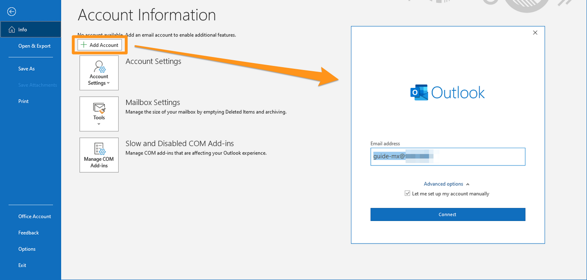
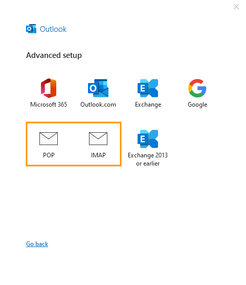
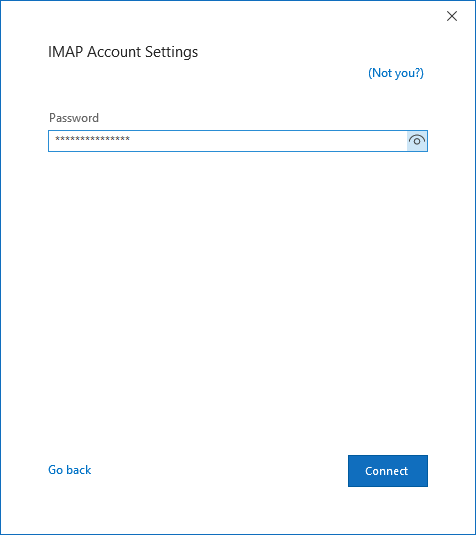
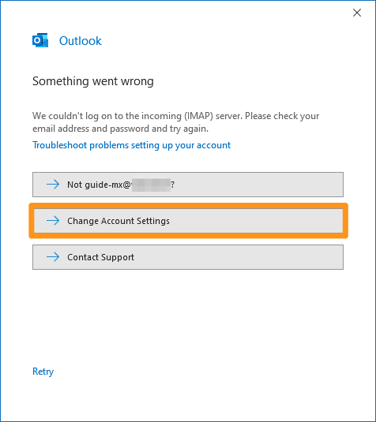
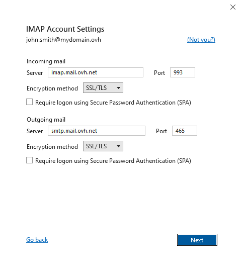
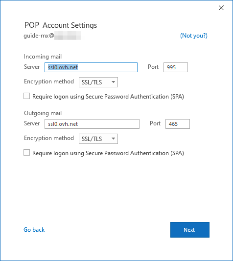
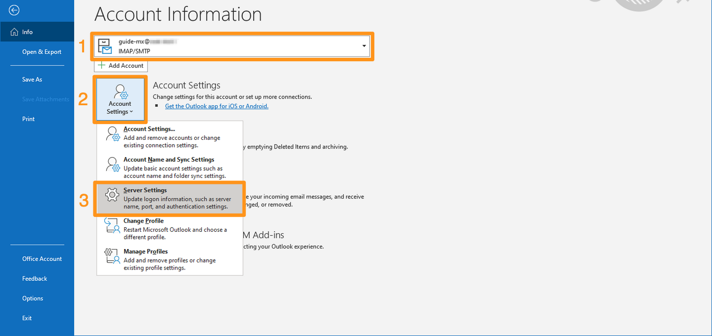
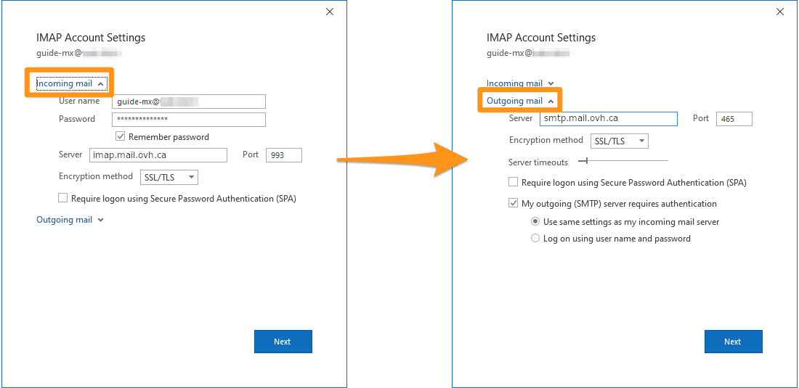

## Objective

You can configure MX Plan accounts on email clients, if they are compatible. By doing so, you can use your email address through your preferred email application.

> [!warning]
> This guide will show you how to use one or more OVHcloud solutions with external tools, and the changes you need to make in specific contexts. You may need to adapt the instructions according to your situation.
>
> If you experience any difficulties carrying out these operations, we recommend that you contact a [specialist service provider](https://partner.ovhcloud.com/asia/directory/) and/or discuss the issue with our community. OVHcloud cannot provide you with technical support in this regard. You can find more information in the [Go further](#gofurther) section of this guide.
>

## Requirements

- an MX Plan email address, available as part of our [Web Hosting plans](/links/web/hosting)
- Microsoft Outlook or later installed on your device
- login credentials for the email account to be configured
 
> [!primary]
>
> Are you using Outlook for Mac? Refer to our documentation: [Configuring an email address in Outlook](/pages/web_cloud/email_and_collaborative_solutions/mx_plan/how_to_configure_outlook_2016_mac).
>

## Instructions

> [!alert]
>
> Before you start configuring your services using this guide, make sure that the flag at the top right of this page matches your country or region, as the settings depend on your location.

### Adding the account

- **When you start the application for the first time**: A setup wizard will appear and prompt you to enter your email address.

- **If you have already added an account**: Click `File`{.action} in the menu bar at the top of your screen, then `Add account`{.action}.

- Enter your email address, then click `Advanced options`{.action}. Tick the box next to `Let me set up my account manually`{.action}, then click `Connect`{.action}. 

{.thumbnail}

> [!primary]
>
> Not sure if you need to configure your email account in **POP** or **IMAP**?
>
> Before you continue, please read the "[POP or IMAP, what is the difference?](#popimap)" section of this guide.
>
> In the following settings, you will see that you can enter 2 different host names for the same server (incoming or outgoing). These values refer to the same server, and have been set up to facilitate typing and avoid confusion between POP, IMAP and SMTP protocols that use different ports.

To configure your email address, follow the steps by clicking on the tabs below.

> [!tabs]
> **Step 1**
>> Choose between IMAP and POP accounts.  We recommend using IMAP.
>>
>> {.thumbnail .h-600}
>>
> **Step 2**
>> Enter the password for your email account, then click `Next`{.action}.
>>
>> {.thumbnail .h-600}
>>
> **Step 3**
>> If Outlook was unable to automatically configure your account, this window appears. Click `Change Account Settings`{.action}. Depending on your choice (**POP** or **IMAP**), go to step 4.
>>
>> {.thumbnail .h-600}
>>
> **Step 4 - IMAP**
>> If you chose IMAP, enter the following parameters. If you have chosen POP, go to the "**Step 4 - POP**" tab. 
>> In **Incoming Mail**, type: - Server **imap.mail.ovh.ca**  - Port **993** - **SSL/TLS encryption method**  In **Outgoing Mail**, type: - Server **smtp.mail.ovh.ca** - Port **465** - **SSL/TLS encryption method**  Click `Next`{.action} to confirm. 
>>
>> {.thumbnail .h-600}
>>
> **Step 4 - POP**
>> In **Incoming Mail**, type: - Server **pop.mail.ovh.ca** - Port **995** - **SSL/TLS encryption method**  In **Outgoing Mail**, type: - Server **smtp.mail.ovh.ca** server**  - Port **465** - **SSL/TLS encryption method**  Click `Next`{.action} to confirm. 
>>
>> {.thumbnail .h-600}

### Using your email address

Once you have configured your email address, you can start using it! You can now send and receive emails.

OVHcloud also has a web application you can use to access your email address from your browser. You can access this application at [Webmail](/links/web/email). You can log in using your email credentials. If you have any questions about how to use this interface, please refer to our guide on [Using the Outlook Web App](/pages/web_cloud/email_and_collaborative_solutions/using_the_outlook_web_app_webmail/email_owa).

### Retrieving a backup of your email address

If you need to make a change that could lead to the loss of your email account data, we advise you to make a backup of the email account concerned beforehand. To do this, please read the "**Exporting from Windows**" section in our guide on [Migrating your email address manually](/pages/web_cloud/email_and_collaborative_solutions/migrating/manual_email_migration#exporting-from-windows).

### Modifying existing settings

If your email account has already been set up and you need to access the account settings to change them:

- Go to `File`{.action} **(1)** from the menu bar at the top of your screen, then select the account you want to modify in the drop-down menu.
- Click `Account Settings`{.action} **(2)** below.
- Click `Server Settings`{.action} **(3)** to access the settings window.

{.thumbnail}

The window is divided into two parts, **Incoming Mail** and **Outgoing Mail**. Click either to edit them.

{.thumbnail}

### Reminder of POP, IMAP and SMTP settings 

When you choose your account type, we recommend using **IMAP** to receive emails. However, you can select **POP**. To understand how they work, see the section below on "[POP or IMAP, what's the difference?](#popimap)".

- **For POP configuration**

|Information|Description|
|---|---|
|Username|Enter the **full email address**|
|Password|Enter the password for the email account|
|Server (incoming)|pop.mail.ovh.ca|
|Port|995|
|Security type|SSL/TLS|

- **For IMAP configuration**

|Information|Description|
|---|---|
|Username|Enter the **full email address**|
|Password|Enter the password for the email account|
|Server (incoming)|imap.mail.ovh.ca|
|Port|993|
|Security type|SSL/TLS|

For sending emails, if you need to enter the **SMTP** settings manually in your account preferences, you will find the settings below:

- **SMTP configuration**

|Information|Description|
|---|---|
|Username|Enter the **full email address**|
|Password|Enter the password for the email account|
|Server (outgoing)|smtp.mail.ovh.ca|
|Port|465|
|Security type|SSL/TLS|

### POP or IMAP, what's the difference? 

When you set up your email account manually, your email client asks if you want to use **POP** (**P**ost **O**ffice **P**rotocol) or **IMAP**(**I**nternet **M**essage **A**ccess **P**rotocol). To understand this properly, you need to understand the role of POP and IMAP protocols in your email account configuration.

When you configure your mail client, you must enter the information from the **incoming server** to receive the emails, and the **outgoing server** to send the emails. To send emails, there is no choice, **SMTP** (**S**imple **M**ail **T**ransfer **P**rotocol) is used. For the reception, you will have the choice between **POP** or **IMAP**.

{.thumbnail .w-400}

To understand the difference between POP and IMAP, we will detail the elements that make up the processing of your incoming emails:

1. **Your device**: A computer, smartphone or tablet running an email client.
2. **Your email client**: A software used to manage email accounts and their content. Your choice will determine the level of usability and functionality you will need to view your emails.
3. **The receiving protocol**: The protocol setting determines how your client retrieves emails. This affects other email clients that access the same email account.
    - **IMAP**: Your email client queries the email server and downloads the emails to your device. When you view an unread email, the server marks it as "read" by default. Other clients configured in IMAP will be able to check this status and view this email until it has been deleted by one of the clients.
    - **POP**: Your email client queries the email server and downloads the emails to your device. By default, once the email is downloaded to your device, the message is deleted from the server. As a result, other devices connected to this email account will not be able to view this email.

{.thumbnail .w-400}

> [!primary]
>
> This description is a summary of the standard operation of these two protocols. You can set up POP to not delete emails from the server when you retrieve them. Our aim is to describe the native functioning of these two protocols.

## Go further 

Join our community of users on <https://community.ovh.com/en/>.