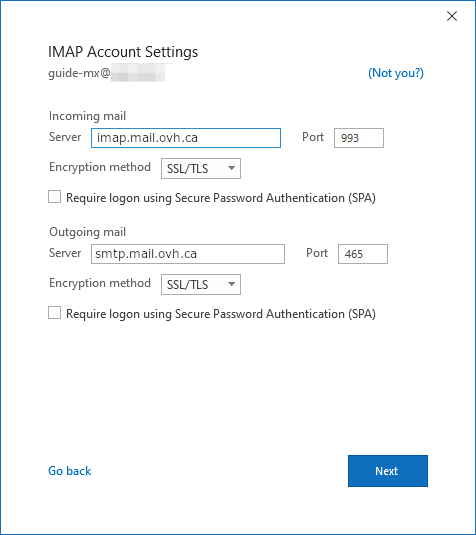
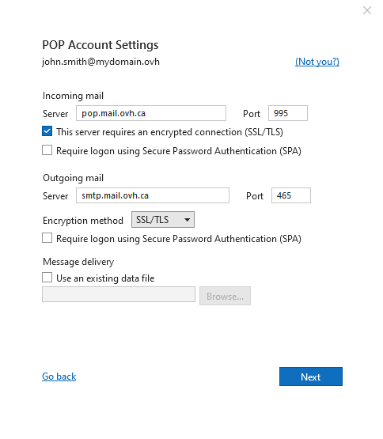

## Objectif

Les comptes MX Plan  peuvent être configurés sur différents logiciels de messagerie compatibles. Cela vous permet d’utiliser votre adresse e-mail depuis l’appareil de votre choix.

**Découvrez comment configurer votre adresse e-mail MX Plan sur Outlook ou ultérieur pour Windows.**

> [!warning]
>
> OVHcloud met à votre disposition des services dont la configuration, la gestion et la responsabilité vous incombent. Il vous revient de ce fait d'en assurer le bon fonctionnement.
>
> Nous mettons à votre disposition ce guide afin de vous accompagner au mieux sur des tâches courantes. Néanmoins, nous vous recommandons de faire appel à un [prestataire spécialisé](https://partner.ovhcloud.com/fr-ca/) et/ou de contacter l'éditeur du service si vous éprouvez des difficultés. En effet, nous ne serons pas en mesure de vous fournir une assistance. Plus d'informations dans la section "Aller plus loin" de ce guide.
>

## Prérequis

- Disposer d’une adresse e-mail MX Plan (comprise dans l’offre MX Plan ou dans une offre d’[hébergement web OVHcloud](/links/web/hosting)).
- Disposer du logiciel Microsoft Outlook ou ultérieur.
- Posséder les identifiants relatifs à l'adresse e-mail que vous souhaitez paramétrer.
 
> [!primary]
>
> Vous utilisez Outlook pour Mac ? Consultez notre documentation : [Configurer son adresse e-mail sur Outlook pour Mac](/pages/web_cloud/email_and_collaborative_solutions/mx_plan/how_to_configure_outlook_2016_mac).
>

## En pratique

### Ajouter le compte

- **Lors du premier démarrage de l'application** : un assistant de configuration s'affiche et vous invite à renseigner votre adresse e-mail.

- **Si un compte a déjà été paramétré** : cliquez sur `Fichier`{.action} dans la barre de menu en haut de votre écran, puis sur `Ajouter un compte`{.action}.

- Renseignez à présent votre adresse e-mail, puis appuyez sur `Options avancées`{.action}. Cochez la case à côté de `Configurer mon compte manuellement`{.action} qui vient d'apparaître, puis cliquez sur `Connexion`{.action}. 

{.thumbnail}

> [!primary]
>
> Vous ne savez pas si vous devez configurer votre compte e-mail en **POP** ou en **IMAP**?
>
> Avant de poursuivre, consultez la section "[POP ou IMAP, quelle est la différence ?](#popimap)" de ce guide.
>
> Dans les paramètres suivants, vous constaterez la possibilité de renseigner 2 noms d'hôtes différents pour le même serveur (entrant ou sortant). Ces valeurs renvoient exactement au même serveur, elles ont été mises en place pour faciliter la saisie et éviter la confusion entre les protocoles POP, IMAP et SMTP qui utilisent des ports différents.

> [!tabs]
> **Etape 1**
>> Parmi les différents types de comptes, choisissez entre IMAP et POP.  Nous vous conseillons une utilisation en IMAP.
>>
>> {.thumbnail .h-600}
>>
> **Etape 2**
>> Saisissez le mot de passe de votre adresse e-mail puis cliquez sur `Suivant`{.action}.
>>
>> {.thumbnail .h-600}
>>
> **Etape 3**
>> Si Outlook n'est pas parvenu à configurer automatiquement votre adresse, cette fenêtre s'affiche. Cliquez sur `Modifier les paramètres du compte`{.action}. En fonction de votre choix (**POP** ou **IMAP**), passez à l'étape 4 correspondante.
>>
>> {.thumbnail .h-600}
>>
> **Etape 4 - IMAP**
>> Si vous avez choisi IMAP, saisissez les paramètres suivants. Si vous avez choisi POP, passez à l'onglet "**Etape 4 - POP**". 
>> Dans **Courrier entrant**, saisissez : - Le serveur **imap.mail.ovh.ca** - Port **993** - Méthode de chiffrement **SSL/TLS**  Dans **Courrier sortant**, saisissez : - Le serveur **smtp.mail.ovh.ca - Port **465** - Méthode de chiffrement **SSL/TLS**  Cliquez sur `Suivant`{.action} pour valider. 
>>
>> {.thumbnail .h-600}
>>
> **Etape 4 - POP**
>> Dans **Courrier entrant**, saisissez : - Le serveur **pop.mail.ovh.ca** - Port **995** - Méthode de chiffrement **SSL/TLS**  Dans **Courrier sortant**, saisissez : - Le serveur **smtp.mail.ovh.ca** - Port **465** - Méthode de chiffrement **SSL/TLS**  Cliquez sur `Suivant`{.action} pour valider. 
>>
>> {.thumbnail .h-600}

### Utiliser l'adresse e-mail

Une fois l'adresse e-mail configurée, il ne reste plus qu’à l'utiliser ! Vous pouvez dès à présent envoyer et recevoir des messages.

OVHcloud propose aussi une application web permettant d'accéder à votre adresse e-mail depuis un navigateur internet. Celle-ci est accessible à l’adresse [Webmail](/links/web/email). Vous pouvez vous y connecter grâce aux identifiants de votre adresse e-mail. Pour toute question relative à son utilisation, n'hésitez pas à consulter notre guide [Consulter son compte Exchange depuis l’interface OWA](/pages/web_cloud/email_and_collaborative_solutions/using_the_outlook_web_app_webmail/email_owa).

### Récupérer une sauvegarde de votre adresse e-mail

Si vous devez effectuer une manipulation qui risquerait d'entrainer la perte des données de votre compte e-mail, nous vous conseillons d'effectuer une sauvegarde préalable du compte e-mail concerné. Pour ce faire, consulter le paragraphe "**Exporter depuis Windows**" sur notre guide [Migrer manuellement votre adresse e-mail](/pages/web_cloud/email_and_collaborative_solutions/migrating/manual_email_migration#exporter-depuis-windows).

### Modifier les paramètres existants

Si votre compte e-mail est déjà paramétré et que vous devez accéder aux paramètres du compte pour les modifier :

- Allez dans `Fichier`{.action} depuis la barre de menu en haut de votre écran, puis sélectionnez le compte à modifier dans le menu déroulant **(1)**.
- Cliquez sur `Paramètres du compte`{.action}**(2)** en dessous.
- Cliquez sur `Paramètres du serveur`{.action}**(3)** pour accéder à la fenêtre de paramètres.

{.thumbnail}

La fenêtre est divisée en deux parties, **Courrier entrant** et **Courrier sortant**. Cliquez sur l'un ou l'autre pour pouvoir les modifier.

{.thumbnail}

### Rappel des paramètres POP, IMAP et SMTP 

Pour la réception des e-mails, lors du choix du type de compte, nous vous conseillons une utilisation en **IMAP**. Vous pouvez cependant sélectionner **POP**. Pour comprendre leur fonctionnement respectif, consultez la section "[POP ou IMAP, quelle est la différence ?](#popimap)" ci-dessous.

- **Pour une configuration en POP**

|Information|Description|
|---|---|
|Nom d'utilisateur|Renseignez l'adresse e-mail **complète**|
|Mot de passe|Renseignez le mot de passe de l'adresse e-mail|
|Serveur (entrant)|pop.mail.ovh.ca|
|Port|995|
|Type de sécurité|SSL/TLS|

- **Pour une configuration en IMAP**

|Information|Description|
|---|---|
|Nom d'utilisateur|Renseignez l'adresse e-mail **complète**|
|Mot de passe|Renseignez le mot de passe de l'adresse e-mail|
|Serveur (entrant)|imap.mail.ovh.ca|
|Port|993|
|Type de sécurité|SSL/TLS|

Pour l'envoi des e-mails, si vous devez renseigner manuellement les paramètres **SMTP** dans les préférences du compte, vous trouverez ci-dessous les paramètres à utiliser :

- **Configuration SMTP**

|Information|Description|
|---|---|
|Nom d'utilisateur|Renseignez l'adresse e-mail **complète**|
|Mot de passe|Renseignez le mot de passe de l'adresse e-mail|
|Serveur (sortant)|smtp.mail.ovh.ca|
|Port|465|
|Type de sécurité|SSL/TLS|

### POP ou IMAP, quelle est la différence ? 

Lorsque vous configurez votre adresse e-mail manuellement, votre client de messagerie vous demande si vous souhaitez utiliser le protocole **POP** (**P**ost **O**ffice **P**rotocol) ou **IMAP**(**I**nternet **M**essage **A**ccess **P**rotocol). Pour bien comprendre, il faut situer le rôle des protocoles POP et IMAP dans la configuration de votre adresse e-mail.

Lors de la configuration de votre client de messagerie, vous devez lui renseigner les informations du **serveur entrant** pour recevoir les e-mails et le **serveur sortant** pour envoyer les e-mails. Pour envoyer les e-mails, il n'y a pas de choix, c'est le protocole **SMTP** (**S**imple **M**ail **T**ransfer **P**rotocol) qui est utilisé. Pour la réception, vous aurez donc le choix entre **POP** ou **IMAP**.

{.thumbnail .w-400}

Pour comprendre la différence entre l'utilisation du protocole POP et IMAP, nous allons détailler les éléments qui composent le traitement de vos e-mails en réception :

1. **Votre appareil** : un ordinateur, un smartphone ou une tablette. C'est votre support de consultation.
2. **Votre client de messagerie** : application dédiée à la gestion de vos e-mails. Son choix déterminera le niveau d'ergonomie et de fonctionnalités dont vous aurez besoin pour consulter vos e-mails.
3. **Le protocole de réception** : choix déterminant la façon de relever les e-mails sur votre appareil. Son choix a une incidence sur les autres appareils qui consultent ce même compte e-mail.
    - **IMAP** : votre client de messagerie interroge le serveur e-mail et télécharge les e-mails sur votre appareil. Lorsque vous consultez un e-mail non lu, le serveur le marque comme "lu" par défaut. Les autres appareils configurés en IMAP pourront constater cet état et consulter cet e-mail tant qu'il n'aura pas été supprimé sur l'un des appareils.
    - **POP** : votre client de messagerie interroge le serveur e-mail et télécharge les e-mails sur votre appareil. Par défaut, une fois l'e-mail téléchargé sur votre appareil, le message est supprimé du serveur. Par conséquent, les autres appareils connectés à cette adresse e-mail ne pourront pas consulter cet e-mail.

{.thumbnail .w-400}

> [!primary]
>
> Ce desriptif est une synthèse, il représente le fonctionnement standard de ces deux protocoles. Il est possible de paramétrer le POP pour que les e-mails ne soit pas supprimés lorsque vous relevez vos e-mails. Notre objectif est de décrire le fonctionnement natif de ces deux protocoles.

## Aller plus loin

[Configurer son compte E-mail Pro sur Outlook pour Windows](/pages/web_cloud/email_and_collaborative_solutions/email_pro/how_to_configure_outlook_2016)

[Configurer son compte Exchange sur Outlook pour Windows](/pages/web_cloud/email_and_collaborative_solutions/microsoft_exchange/how_to_configure_outlook_2016)

Échangez avec notre communauté d'utilisateurs sur <https://community.ovh.com>.
