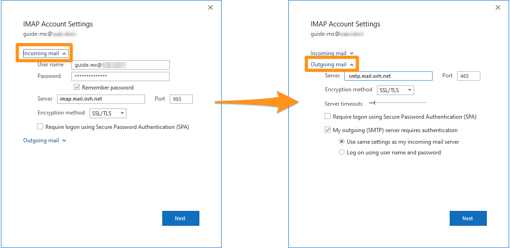

> [!primary]
> Questa traduzione è stata generata automaticamente dal nostro partner SYSTRAN. I contenuti potrebbero presentare imprecisioni, ad esempio la nomenclatura dei pulsanti o alcuni dettagli tecnici. In caso di dubbi consigliamo di fare riferimento alla versione inglese o francese della guida. Per aiutarci a migliorare questa traduzione, utilizza il pulsante "Contribuisci" di questa pagina.
>
 

## Obiettivo

Gli account MX Plan possono essere configurati su client di posta compatibili, per permetterti di utilizzare il tuo account email dal dispositivo che preferisci.

**Questa guida ti mostra come configurare un account email MX Plan su Outlook per Windows.**

> [!warning]
>
> OVHcloud mette a tua disposizione servizi di cui tu sei responsabile per la configurazione e la gestione. Garantirne quotidianamente il corretto funzionamento è quindi responsabilità dell’utente.
>
> Questa guida ti aiuta a realizzare le operazioni più ricorrenti. Tuttavia, in caso di difficoltà o dubbi, ti consigliamo di contattare un [fornitore specializzato](/links/partner) o il fornitore del servizio. OVHcloud non potrà fornirti alcuna assistenza. Per maggiori informazioni consulta la sezione “Per saperne di più” di questa guida.
>

## Prerequisiti

- Disporre di un account email MX Plan incluso nel servizio MX Plan o in una soluzione di [hosting Web OVHcloud](/links/web/hosting)
- Disporre di un software Microsoft Outlook o successivo
- Disporre delle credenziali associate all’indirizzo email da configurare
 
> [!primary]
>
> Utilizzi Outlook per Mac? Consulta la nostra guida:  [Configurare un indirizzo e-mail su Outlook per Mac](/pages/web_cloud/email_and_collaborative_solutions/mx_plan/how_to_configure_outlook_2016_mac). 
>

## Procedura

> [!alert]
>
> Prima di iniziare la configurazione, assicurati che la bandiera in alto a destra di questa pagina corrisponda al tuo paese, in quanto le impostazioni dipendono dalla tua localizzazione.

### Aggiungi l'account

- Durante il primo avvio dell’applicazione un assistente di configurazione apparirà sullo schermo e ti inviterà a inserire il tuo indirizzo e-mail.

- **Se hai già configurato un account**, clicca su `File`{.action} nella barra dei menù in alto nello schermo e poi su `Aggiungi account`{.action}.

- Ora inserisci il tuo indirizzo e-mail e clicca su Opzioni avanzate.  Selezione la voce accanto a Configurare il mio account manualmente appena comparsa e clicca su Connetti 

{.thumbnail}

> [!primary]
>
> Non sei sicuro di dover configurare il tuo account email in **POP** o **IMAP**?
>
> Prima di continuare, consulta la sezione "[POP o IMAP, qual è la differenza?](#popimap)" di questa guida.
>
> Nei parametri che seguono è possibile inserire 2 diversi nomi host per lo stesso server (in entrata o in uscita). Questi valori fanno riferimento esattamente allo stesso server, sono stati impostati per facilitare la digitazione ed evitare la confusione tra i protocolli POP, IMAP e SMTP che utilizzano porte differenti.

Per configurare il tuo indirizzo email, segui gli step cliccando sulle schede qui sotto.

> [!tabs]
> **Step 1**
>> Tra i diversi tipi di account, scegli tra IMAP e POP.  Ti consigliamo di utilizzare IMAP.
>>
>> {.thumbnail .h-600}
>>
> **Step 2**
>> Inserisci la password del tuo indirizzo email e clicca su `Seguente`{.action}.
>>
>> {.thumbnail .h-600}
>>
> **Step 3**
>> Se Outlook non è in grado di configurare automaticamente l'indirizzo, verrà visualizzata questa finestra. Fare clic su `Modifica impostazioni account`{.action}. In base alla tua scelta (**POP** o **IMAP**), passa allo step 4 corrispondente.
>>
>> {.thumbnail .h-600}
>>
> **Step 4 - IMAP**
>> Se avete scelto IMAP, immettete i seguenti parametri. Se hai scelto POP, vai alla scheda "**Step 4 - POP**". 
>> In **Posta in arrivo**, digitare: - Il server **imap.mail.ovh.net** o **ssl0.ovh.net**  - Porta **993** - Metodo di cifratura **SSL/TLS**  In **Posta in uscita** digitare: - Il server **smtp.mail.ovh.net** o **ssl0.ovh.net**  - Porta **465** - Metodo di cifratura **SSL/TLS**  Clicca su `Seguente`{.action} per confermare. 
>>
>> {.thumbnail .h-600}
>>
> **Step 4 - POP**
>> In **Posta in arrivo**, digitare: - Il server **pop.mail.ovh.net** o **ssl0.ovh.net**  - Porta **995** - Metodo di cifratura **SSL/TLS**  In **Posta in uscita** digitare: - Il server **smtp.mail.ovh.net** o **ssl0.ovh.net**  - Porta **465** - Metodo di cifratura **SSL/TLS**  Clicca su `Seguente`{.action} per confermare. 
>>
>> {.thumbnail .h-600}

### Utilizza l'indirizzo email

Una volta configurato l’indirizzo email, non ti resta che utilizzarlo! A partire da questo momento puoi inviare e ricevere messaggi.

OVHcloud propone anche un'applicazione Web che permette di accedere al tuo indirizzo email da un browser Internet. disponibile alla pagina [Webmail](/links/web/email) accessibile utilizzando le credenziali del tuo account. Per maggiori informazioni sul suo utilizzo, consulta la guida [Consultare il suo account Exchange dall'interfaccia OWA](/pages/web_cloud/email_and_collaborative_solutions/using_the_outlook_web_app_webmail/email_owa).

### Recuperare un backup del tuo indirizzo email

Se è necessario effettuare un'operazione che potrebbe comportare la perdita dei dati del tuo account email, ti consigliamo di effettuare un backup preliminare dell'account email in questione. Per effettuare questa operazione, consulta il paragrafo "**Esporta da Windows**" nella nostra guida [Migrare manualmente il tuo indirizzo email](/pages/web_cloud/email_and_collaborative_solutions/migrating/manual_email_migration#esporta-da-windows).

### Modifica i parametri esistenti

Se il tuo account email è già configurato e devi accedere alle impostazioni dell'account per modificarle:

- Accedi al `File`{.action} dalla barra dei menu in alto nello schermo e seleziona l'account da modificare nel menu a tendina **(1)**.
- Clicca su `Impostazioni dell'account`{.action}**(2)** sotto.
- Clicca su `Impostazioni del server`{.action}**(3)** per accedere alla finestra delle impostazioni.

{.thumbnail}

La finestra è divisa in due parti: **Posta in entrata** e **Posta in uscita**. Clicca sull'uno o sull'altro per poterli modificare.

{.thumbnail}

### Promemoria delle impostazioni POP, IMAP e SMTP 

Per la ricezione delle email, durante la scelta del tipo di account, ti consigliamo di utilizzare **IMAP**. Tuttavia, è possibile selezionare **POP**. Per maggiori informazioni sul loro funzionamento, consulta la sezione "[POP o IMAP, qual è la differenza?](#popimap)" qui sotto.

- **Configurazione POP**

|Campo|Descrizione|
|---|---|
|Nome utente|Inserisci l’indirizzo email **completo**|
|Password|Inserisci la password associata all’indirizzo email|
|Server (in entrata)|pop.mail.ovh.net **o** ssl0.ovh.net|
|Porta|995|
|Tipo di sicurezza|SSL/TLS|

- **per una configurazione IMAP**

|Campo|Descrizione|
|---|---|
|Nome utente|Inserisci l’indirizzo email **completo**|
|Password|Inserisci la password associata all’indirizzo email|
|Server (in entrata)|imap.mail.ovh.net **o** ssl0.ovh.net|
|Porta|993|
|Tipo di sicurezza|SSL/TLS|

Per l’invio delle email, se hai necessità di inserire manualmente le impostazioni **SMTP** nelle preferenze dell’account, ecco i parametri da utilizzare:

- **Configurazione SMTP**

|Campo|Descrizione|
|---|---|
|Nome utente|Inserisci l’indirizzo email **completo**|
|Password|Inserisci la password associata all’indirizzo email|
|Server (in uscita)|smtp.mail.ovh.net **o** ssl0.ovh.net|
|Porta|465|
|Tipo di sicurezza|SSL/TLS|

### POP o IMAP, qual è la differenza? 

Quando si configura l'indirizzo di posta elettronica manualmente, il client di posta elettronica chiede se si desidera utilizzare il protocollo **POP** (**P**ost **O**ffice **P**rotocol) o **IMAP**(**I**nternet **M**essage **A**ccess **P**rotocol). Per capire bene, è necessario localizzare il ruolo dei protocolli POP e IMAP nella configurazione del tuo indirizzo email.

Durante la configurazione del client di posta, è necessario fornire le informazioni sul **server in entrata** per ricevere le email e sul **server in uscita** per inviare le email. Per inviare le email non è possibile scegliere, ma viene utilizzato il protocollo **SMTP** (**S**imple **M**ail **T**ransfer **P**rotocol). Per la ricezione, potrete quindi scegliere tra **POP** o **IMAP**.

{.thumbnail .w-400}

Per comprendere la differenza tra l'utilizzo del protocollo POP e IMAP, andremo a descrivere nel dettaglio gli elementi che compongono l'elaborazione delle tue email in ricezione:

1. **Il tuo dispositivo**: un computer, uno smartphone o un tablet. È il vostro supporto di consultazione.
2. **Client di posta**: applicazione dedicata alla gestione delle email. La sua scelta determinerà il livello di ergonomia e funzionalità di cui avrete bisogno per consultare le vostre email.
3. **Protocollo di ricezione**: una scelta fondamentale per il rilevamento delle email sul dispositivo. La sua scelta ha un impatto sugli altri dispositivi che consultano lo stesso account email.
    - **IMAP**: il client di posta interroga il server di posta e scarica le email sul tuo dispositivo. Quando visualizzi un messaggio non letto, il server lo contrassegna come "letto" di default. Gli altri dispositivi configurati in IMAP potranno visualizzare questo stato e controllare questo messaggio fino a quando non verrà eliminato da uno dei dispositivi.
    - **POP**: il vostro client di posta interroga il server di posta e scarica le email sul vostro dispositivo. Per impostazione predefinita, una volta scaricata l'email sul dispositivo, il messaggio viene eliminato dal server. Di conseguenza, gli altri dispositivi connessi a questo indirizzo email non potranno consultare questa email.

{.thumbnail .w-400}

> [!primary]
>
> Questa descrizione è una sintesi, rappresenta il funzionamento standard di entrambi i protocolli. È possibile configurare il POP in modo che le email non vengano eliminate quando si raccolgono i messaggi. Il nostro obiettivo è descrivere il funzionamento nativo di questi due protocolli.

## Per saperne di più

[Configurare un account Email Pro su Outlook per Windows](/pages/web_cloud/email_and_collaborative_solutions/email_pro/how_to_configure_outlook_2016)

[Configurare un account Exchange su Outlook per Windows](/pages/web_cloud/email_and_collaborative_solutions/microsoft_exchange/how_to_configure_outlook_2016)

Contatta la nostra Community di utenti all’indirizzo <https://community.ovh.com/en/>.