

## Obiettivo

Gli indirizzi e-mail delle offerte **MX Plan** e [Zimbra Starter](/links/web/emails-zimbra) possono essere configurati su un client di posta compatibile. Ciò ti consente di inviare e ricevere messaggi dall'applicazione che preferisci.

**Questa guida ti mostra come configurare un account email MX Plan su Outlook per Windows.**

## Prerequisiti

- Disporre di una soluzione e-mail OVHcloud precedentemente configurata, tra le seguenti:
    - **MX Plan** proposta con le nostre [offerte di hosting web](/links/web/hosting) o incluse in un [hosting gratuito 100M](/links/web/domains-free-hosting).
    - [Zimbra](/links/web/emails-zimbra) Starter (solo).
- Disporre della [nuova versione di Outlook](https://support.microsoft.com/it-it/office/getting-started-with-the-new-outlook-for-windows-656bb8d9-5a60-49b2-a98b-ba7822bc7627) installata su Windows.
- Possedere le credenziali dell'indirizzo e-mail che si desidera configurare.

<!-- CP-NAV-START:web-mx-plan -->
---

### Accesso allo Spazio Cliente OVHcloud

- **Link diretto:** [MX Plan](/links/control-panel/web-mx-plan)
- **Percorso di navigazione:** `Web Cloud`{.action} > `MX Plan`{.action} > Seleziona il tuo servizio MX Plan

---
<!-- CP-NAV-END:web-mx-plan -->

/// details | Informazioni relative alla gestione e alla configurazione dei servizi OVHcloud

OVHcloud mette a tua disposizione servizi di cui tu sei responsabile per la configurazione e la gestione. Garantirne quotidianamente il corretto funzionamento è quindi responsabilità dell’utente.

Questa guida ti aiuta a realizzare le operazioni più ricorrenti. Tuttavia, in caso di difficoltà o dubbi, ti consigliamo di contattare un [fornitore specializzato](/links/partner) o il fornitore del servizio. OVHcloud non potrà fornirti alcuna assistenza. Per maggiori informazioni consulta la sezione “[Per saperne di più](#go-further)” di questa guida.

///

> [!primary]
>
> Utilizzi Outlook per Mac? Consulta la nostra guida:  [Configurare un indirizzo e-mail su Outlook per Mac](/pages/web_cloud/email_and_collaborative_solutions/mx_plan/how_to_configure_outlook_2016_mac). 
>

## Procedura

> [!warning]
>
> Questa documentazione si applica esclusivamente a **Outlook classico** disponibile nella suite Microsoft 365. Se utilizzi il nuovo Outlook, consulta la nostra guida [MX Plan / Zimbra Starter - Aggiungere un account e-mail sul nuovo Outlook per Windows](/pages/web_cloud/email_and_collaborative_solutions/mx_plan/how_to_configure_windows_10)
>
> Per installare Outlook classico sul tuo computer Windows, scaricalo dalla pagina Microsoft "[Installare o reinstallare Outlook classico su un PC Windows](https://support.microsoft.com/it-it/office/installer-ou-r%C3%A9installer-outlook-classique-sur-un-pc-windows-5c94902b-31a5-4274-abb0-b07f4661edf5)" e installalo.
>
> Una volta completata l'installazione, per distinguere le due versioni quando sono installate, digita "Outlook" nella barra di ricerca Windows. Potrai quindi notare la differenza come mostrato di seguito.
>
> 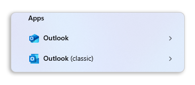{.thumbnail .h-500}

### Aggiungi l'account 

> [!primary]
>
> Non sei sicuro di dover configurare il tuo account email in **POP** o **IMAP**?
>
> Prima di continuare, consulta la sezione "[POP o IMAP, qual è la differenza?](#popimap)" di questa guida.
>
> Nei parametri che seguono è possibile inserire 2 diversi nomi host per lo stesso server (in entrata o in uscita). Questi valori fanno riferimento esattamente allo stesso server, sono stati impostati per facilitare la digitazione ed evitare la confusione tra i protocolli POP, IMAP e SMTP che utilizzano porte differenti.

- **All'avvio iniziale dell'applicazione**: un assistente di configurazione appare e ti chiede di inserire il tuo indirizzo e-mail. Passa direttamente all'etapa 1 più in basso su questa pagina.

- **Se è già stato configurato un account**: clicca su `File`{.action} nella barra del menu in alto sul tuo schermo, quindi su `Aggiungi un account`{.action}.

{.thumbnail}

**Su Windows 11, l'interfaccia classica di Outlook può differire quando aggiungi un account.**

A seconda della cronologia d'uso di Outlook sul computer in questione, una configurazione specifica può causare la visualizzazione di un'interfaccia diversa. In alcuni casi, l'interfaccia detta "moderna" (**interfaccia 1**) può essere disattivata a favore dell'interfaccia storica (**interfaccia 2**).

Per questo motivo ti invitiamo a consultare il capitolo corrispondente all'interfaccia visualizzata sul tuo schermo.

#### Configurazione con l'interfaccia 1 

Per configurare il tuo indirizzo e-mail, segui le tappe cliccando sui tab sottostanti.

> [!warning]
>
> È necessario inserire correttamente il valore corrispondente alla tua localizzazione (**EUROPA** o **AMERICA / PACIFICO**).

> [!tabs]
> **Passo 1**
>>
>> Inserisci il tuo indirizzo e-mail, quindi clicca su `Opzioni avanzate`{.action}.
>>
>> Seleziona quindi la casella `Configura il mio account manualmente`{.action} e clicca su `Connessione`{.action}.
>>
>> 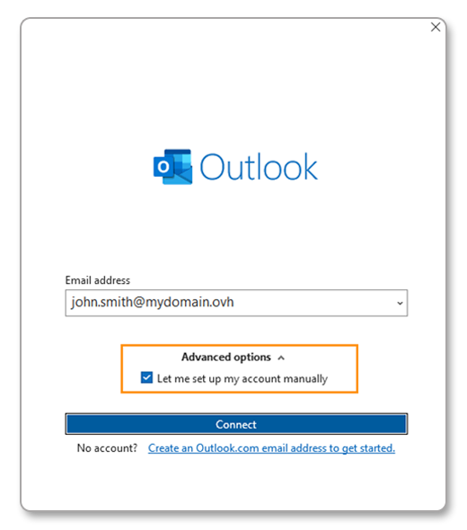{.thumbnail .h-500}
>>
> **Passo 2**
>>
>> Tra i tipi di account proposti, scegli IMAP o POP.
>>
>> Ti consigliamo di utilizzare il protocollo IMAP.
>>
>> {.thumbnail .h-500}
>>
> **Passo 3**
>>
>> Inserisci la password del tuo indirizzo e-mail, quindi clicca su `Connetti`{.action}.
>>
>> 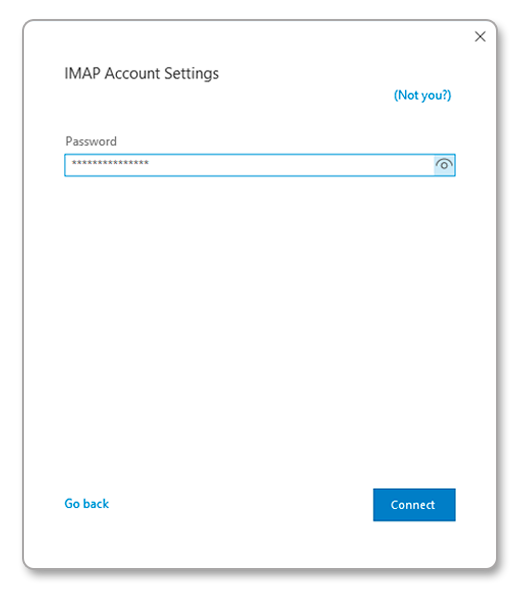{.thumbnail .h-500}
>>
> **Passo 4**
>>
>> Se Outlook non riesce a configurare automaticamente l'account, appare la finestra seguente.
>>
>> Clicca su `Modifica le impostazioni dell'account`{.action}.
>>
>> 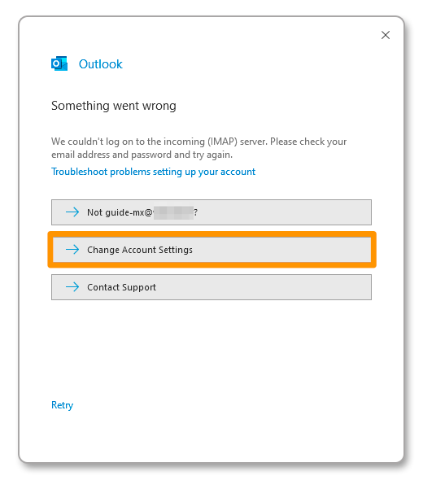{.thumbnail .h-500}
>>
> **Passo 5**
>>
>> Nella sezione **Posta in arrivo**, inserisci:
>>
>> - Server:
>>     - **EUROPA**: imap.mail.ovh.net **o** ssl0.ovh.net
>>     - **AMERICA/ASIA-PACIFICO**: imap.mail.ovh.ca
>> - Porta: **993**
>> - Metodo di crittografia: **SSL/TLS**
>>
>> Nella sezione **Posta in uscita**, inserisci:
>>
>> - Server:
>>     - **EUROPA**: smtp.mail.ovh.net **o** ssl0.ovh.net
>>     - **AMERICA/ASIA-PACIFICO**: smtp.mail.ovh.ca
>> - Porta: **465**
>> - Metodo di crittografia: **SSL/TLS**
>>
>> Clicca su `Avanti`{.action} per confermare.
>>
>> 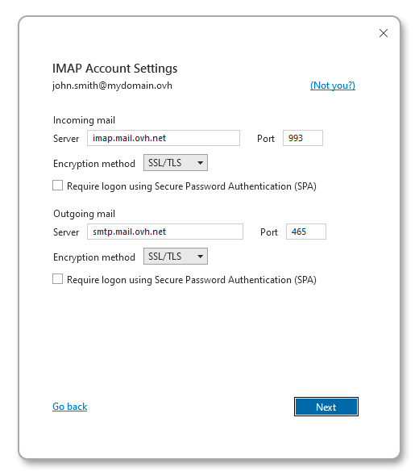{.thumbnail .h-500}
>>

#### Configurazione con l'interfaccia 2 

Per configurare il tuo indirizzo email, segui gli step cliccando sulle schede qui sotto.

> [!warning]
>
> È necessario inserire correttamente il valore corrispondente alla tua localizzazione (**EUROPA** o **AMERICA / PACIFICO**).

> [!tabs]
> **Passo 1**
>>
>> - Dalla finestra **Aggiungi un account**, seleziona `Configurazione manuale o tipi di server aggiuntivi`{.action}.
>> - Clicca su `Avanti`{.action} per proseguire.
>> - Seleziona `POP o IMAP`{.action}.
>> - Clicca su `Avanti`{.action} per proseguire.
>>
>> 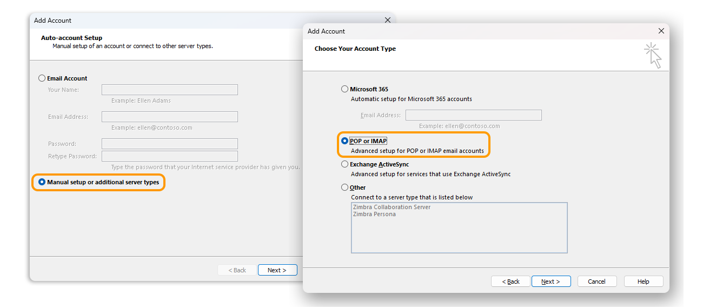{.thumbnail .h-500}
>>
> **Passo 2**
>>
>> Inserisci le informazioni di accesso al tuo account **(1)**:
>>
>> Informazioni sull'utente  
>> **Il tuo nome**: imposta un nome da visualizzare. 
>> **Indirizzo di posta**: lascia il tuo indirizzo e-mail completo. 
>>
>> Informazioni sul server  
>> - **Tipo di account**: seleziona IMAP 
>> - **Server di posta in entrata**:  
>>      - **EUROPA**: imap.mail.ovh.net **o** ssl0.ovh.net  
>>      - **AMERICA/PACIFICO**: imap.mail.ovh.ca  
>> - **Server di posta in uscita (SMTP)**:  
>>      - **EUROPA**: smtp.mail.ovh.net **o** ssl0.ovh.net  
>>      - **AMERICA/PACIFICO**: smtp.mail.ovh.ca  
>>
>> Informazioni di accesso  
>> **Nome utente**: inserisci il tuo indirizzo e-mail completo. 
>> **Password**: inserisci la password associata al tuo indirizzo e-mail. 
>>
>> Clicca su `Impostazioni aggiuntive...`{.action} **(2)** e passa al passo successiva
>>
>> 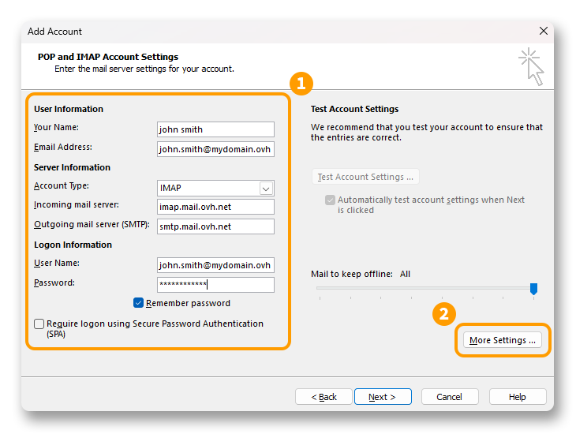{.thumbnail .h-500}
>>
> **Passo 3**
>>
>> Dal tab `Server in uscita`, seleziona `Il mio server in uscita (SMTP) richiede l'autenticazione`{.action} e lascia selezionato `Utilizza gli stessi parametri del mio server di posta in entrata`{.action}.
>>
>> Dal tab `Opzioni avanzate`:
>>
>> - **Server entrante (IMAP)**: 993
>> - **Utilizza il tipo di connessione crittografata seguente**: SSL/TLS
>> - **Server di posta in uscita (SMTP)**: 465
>> - **Utilizza il tipo di connessione crittografata seguente**: SSL/TLS
>>
>> Clicca su `OK`{.action} per confermare le informazioni. Clicca su `Avanti`{.action} per avviare la configurazione dell'account.
>>
>> 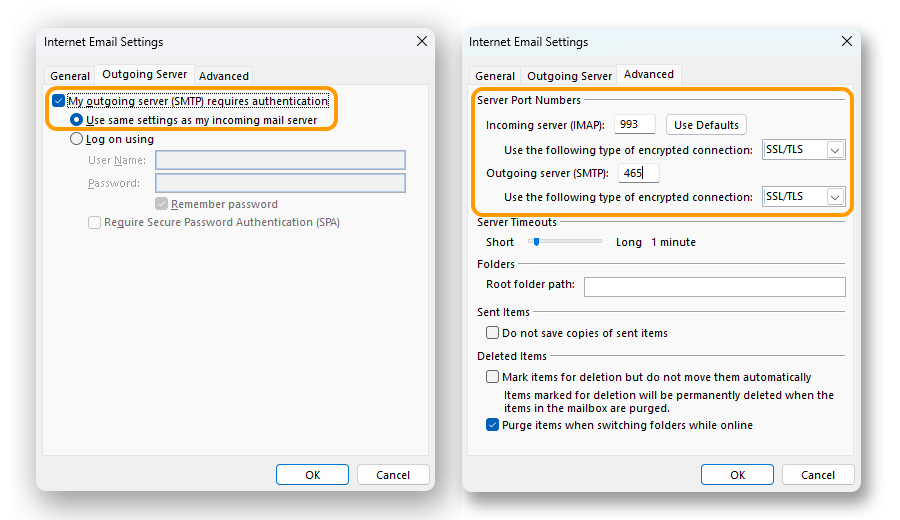{.thumbnail .h-500}
>>
> **Passo 4**
>>
>> Clicca su `Avanti`{.action} per avviare la configurazione dell'account. Se i parametri sono validi, otterrai la finestra sottostante.
>>
>> {.thumbnail .h-500}
>>

### Utilizza l'indirizzo email

Una volta configurato l’indirizzo email, non ti resta che utilizzarlo! A partire da questo momento puoi inviare e ricevere messaggi.

OVHcloud propone anche un'applicazione Web che permette di accedere al tuo indirizzo email da un browser Internet. È possibile accedere alla Webmail OVHcloud [qui](/links/web/email) e connettersi con le credenziali del proprio indirizzo email. Per maggiori informazioni sul suo utilizzo, consulta la guida [Consultare il suo account Exchange dall'interfaccia OWA](/pages/web_cloud/email_and_collaborative_solutions/using_the_outlook_web_app_webmail/email_owa).

### Recuperare un backup del tuo indirizzo email

Se è necessario effettuare un'operazione che potrebbe comportare la perdita dei dati del tuo account email, ti consigliamo di effettuare un backup preliminare dell'account email in questione. Per effettuare questa operazione, consulta il paragrafo "**Esporta da Windows**" nella nostra guida "[Migrare manualmente il tuo indirizzo email](/pages/web_cloud/email_and_collaborative_solutions/migrating/manual_email_migration#esporta-da-windows)".

### Modifica i parametri esistenti

**Su Windows 11, l'interfaccia classica di Outlook può differire quando modifichi un account.**

A seconda della cronologia d'uso di Outlook sul computer in questione, una configurazione specifica può causare la visualizzazione di un'interfaccia diversa. In alcuni casi, l'interfaccia detta "moderna" (**interfaccia 1**) può essere disattivata a favore dell'interfaccia storica (**interfaccia 2**).

Per questo motivo ti invitiamo a consultare il capitolo corrispondente all'interfaccia visualizzata sul tuo schermo.

> [!tabs]
> **Interfaccia 1**
>>
>> Se il tuo account e-mail è già configurato e devi accedere ai suoi parametri per modificarli:
>>
>> - Clicca su `File`{.action} nella barra del menu in alto sullo schermo, quindi seleziona l'account da modificare nel menu a discesa **(1)**.
>> - Clicca su `Impostazioni account`{.action } **(2)** in basso.
>> - Seleziona `Impostazioni del server`{.action} **(3)** per visualizzare la finestra di configurazione.
>>
>> {.thumbnail}
>>
>> La finestra è divisa in due parti, **Posta in arrivo** e **Posta in uscita**. Clicca sulla parte che desideri modificare.
>>
>> > [!primary]
>> >
>> > Nel nostro esempio, il nome del server utilizzato è "pro**?**.mail.ovh.net". Dovrai sostituire il carattere "?" con il numero corrispondente al server del tuo servizio Email Pro.
>> >
>> > Trova questo numero nel tuo [Spazio Cliente OVHcloud](/links/manager), nella sezione `Web Cloud`{.action} quindi `Email Pro`{.action}. Il nome del server è visibile nel riquadro **Connessione** della scheda `Informazioni generali`{.action}.
>>
>> 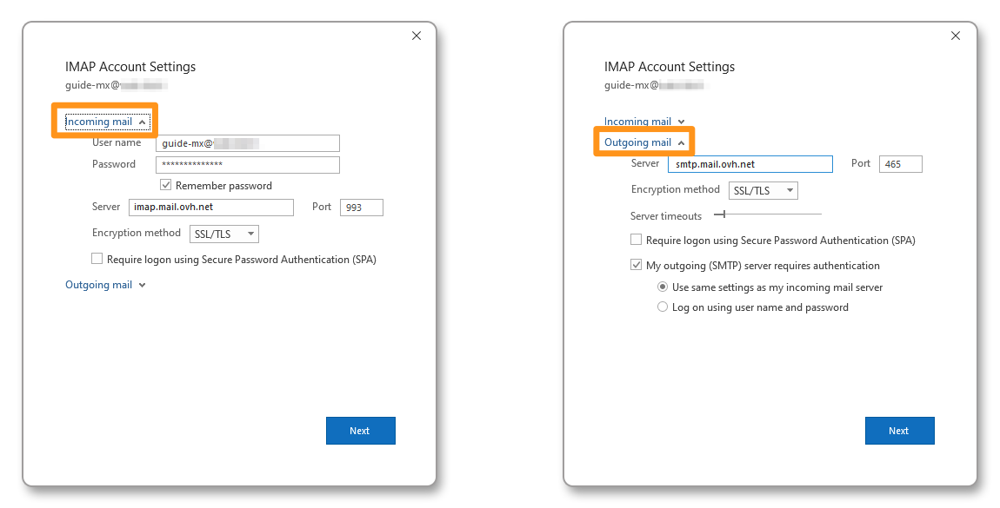{.thumbnail}
>>
> **Interfaccia 2**
>>
>> Se il tuo account e-mail è già configurato e devi accedere ai suoi parametri per modificarli:
>>
>> - Clicca su `File`{.action} nella barra del menu in alto sullo schermo, quindi seleziona l'account da modificare nel menu a discesa **(1)**.
>> - Clicca su `Impostazioni account`{.action} **(2)** in basso.
>> - Clicca su `Impostazioni dell'account...`{.action} **(3)** per accedere alla finestra di configurazione.
>>
>> 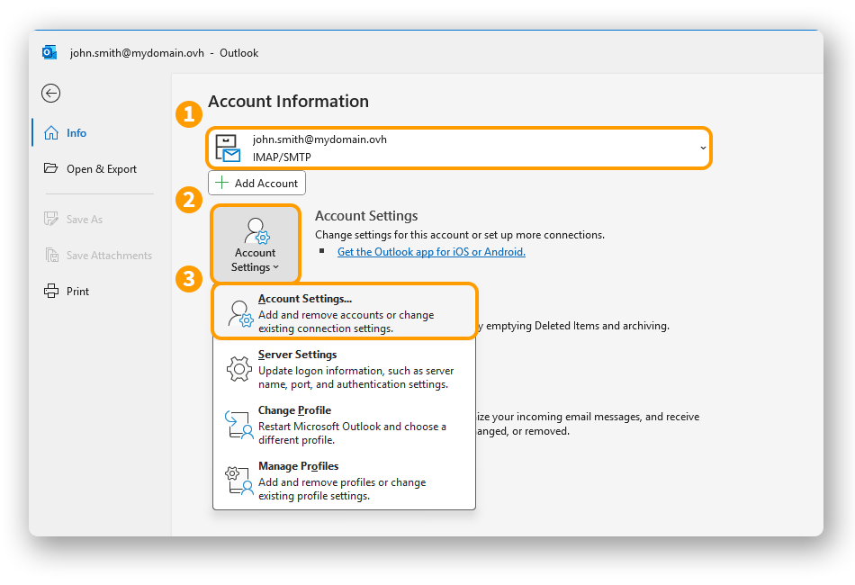{.thumbnail}
>>
>> - La finestra delle impostazioni degli account appare: seleziona l'account e-mail interessato, quindi clicca su `Modifica...`{.action}.
>>
>> 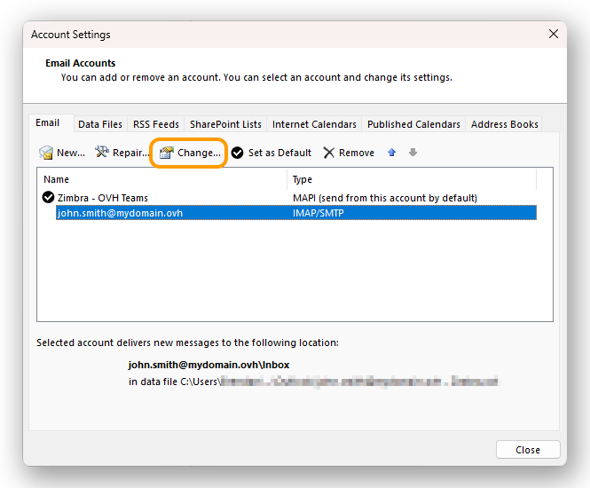{.thumbnail}
>>
>> Per configurare il tuo account, segui le istruzioni a partire dal **passo 2** nella sezione "[Aggiungi l'account - Configurazione con l'interfaccia 2](#add-account-int2)" di questa guida.
>>

### Parametri generali di invio e ricezione 

#### Parametri di ricezione IMAP e POP 

Per la ricezione delle e-mail, durante la scelta del tipo di account, ti consigliamo di utilizzare **IMAP**. Puoi però selezionare **POP**.

> [!warning]
>
> È necessario prendere nota correttamente del valore corrispondente alla tua localizzazione (**EUROPA** o **AMERICA / PACIFICO**).

Seleziona il tab corrispondente al tuo tipo di configurazione:

> [!tabs]
> **Configurazione IMAP**
>>
>> - **Nome utente**: inserisci l'indirizzo e-mail **completo**.
>> - **Password**: inserisci la password dell'indirizzo e-mail.
>> - **Server EUROPA (entrante)**: imap.mail.ovh.net **o** ssl0.ovh.net.
>> - **Server AMERICA/PACIFICO (entrante)**: imap.mail.ovh.ca.
>> - **Porta**: 993.
>> - **Tipo di sicurezza**: SSL/TLS.
>>
> **Configurazione POP**
>>
>> - **Nome utente**: inserisci l'indirizzo e-mail **completo**.
>> - **Password**: inserisci la password dell'indirizzo e-mail.
>> - **Server EUROPA (entrante)**: pop.mail.ovh.net **o** ssl0.ovh.net.
>> - **Server AMERICA/PACIFICO (entrante)**: pop.mail.ovh.ca.
>> - **Porta**: 995.
>> - **Tipo di sicurezza**: SSL/TLS.

#### Parametri di invio SMTP 

Per l'invio delle e-mail, troverai di seguito i parametri **SMTP** da utilizzare:

**Configurazione SMTP**

- **Nome utente**: inserisci l'indirizzo e-mail **completo**.
- **Password**: inserisci la password dell'indirizzo e-mail.
- **Server EUROPA (uscita)**: smtp.mail.ovh.net **o** ssl0.ovh.net.
- **Server AMERICA/PACIFICO (uscita)**: smtp.mail.ovh.ca.
- **Porta**: 465.
- **Tipo di sicurezza**: SSL/TLS.

### POP o IMAP, qual è la differenza? 

Quando si configura l'indirizzo di posta elettronica manualmente, il client di posta elettronica chiede se si desidera utilizzare il protocollo **POP** (**P**ost **O**ffice **P**rotocol) o **IMAP**(**I**nternet **M**essage **A**ccess **P**rotocol). Per capire bene, è necessario localizzare il ruolo dei protocolli POP e IMAP nella configurazione del tuo indirizzo email.

Durante la configurazione del client di posta, è necessario fornire le informazioni sul **server in entrata** per ricevere le email e sul **server in uscita** per inviare le email. Per inviare le email non è possibile scegliere, ma viene utilizzato il protocollo **SMTP** (**S**imple **M**ail **T**ransfer **P**rotocol). Per la ricezione, potrete quindi scegliere tra **POP** o **IMAP**.

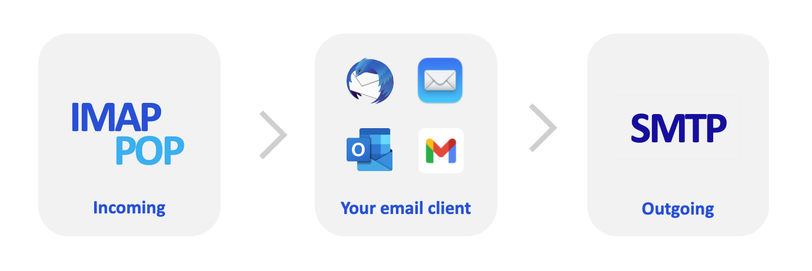{.thumbnail .w-400}

Per comprendere la differenza tra l'utilizzo del protocollo POP e IMAP, andremo a descrivere nel dettaglio gli elementi che compongono l'elaborazione delle tue email in ricezione:

1. **Il tuo dispositivo**: un computer, uno smartphone o un tablet. È il vostro supporto di consultazione.
2. **Client di posta**: applicazione dedicata alla gestione delle email. La sua scelta determinerà il livello di ergonomia e funzionalità di cui avrete bisogno per consultare le vostre email.
3. **Protocollo di ricezione**: una scelta fondamentale per il rilevamento delle email sul dispositivo. La sua scelta ha un impatto sugli altri dispositivi che consultano lo stesso account email.
    - **IMAP**: il client di posta interroga il server di posta e scarica le email sul tuo dispositivo. Quando visualizzi un messaggio non letto, il server lo contrassegna come "letto" di default. Gli altri dispositivi configurati in IMAP potranno visualizzare questo stato e controllare questo messaggio fino a quando non verrà eliminato da uno dei dispositivi.
    - **POP**: il vostro client di posta interroga il server di posta e scarica le email sul vostro dispositivo. Per impostazione predefinita, una volta scaricata l'email sul dispositivo, il messaggio viene eliminato dal server. Di conseguenza, gli altri dispositivi connessi a questo indirizzo email non potranno consultare questa email.

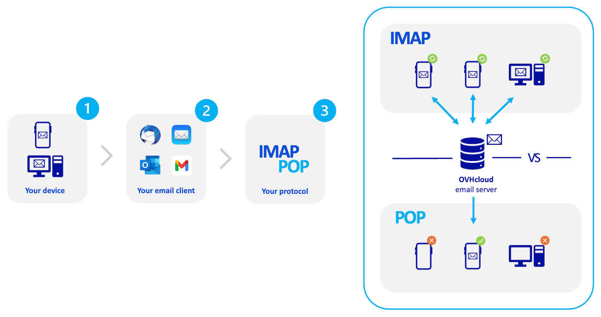{.thumbnail .w-400}

> [!primary]
>
> Questa descrizione è una sintesi, rappresenta il funzionamento standard di entrambi i protocolli. È possibile configurare il POP in modo che le email non vengano eliminate quando si raccolgono i messaggi. Il nostro obiettivo è descrivere il funzionamento nativo di questi due protocolli.

## Per saperne di più 

> [!primary]
>
> Per ulteriori informazioni sulla configurazione di un indirizzo e-mail dall'applicazione Outlook su macOS, vedere [Microsoft Help Center](https://support.microsoft.com/it-it/office/aggiungere-un-account-di-posta-in-outlook-6e27792a-9267-4aa4-8bb6-c84ef146101b).

[Configurare un account Email Pro su Outlook per Windows](/pages/web_cloud/email_and_collaborative_solutions/email_pro/how_to_configure_outlook_2016)

[Configurare un account Exchange su Outlook per Windows](/pages/web_cloud/email_and_collaborative_solutions/microsoft_exchange/how_to_configure_outlook_2016)

Contatta la nostra [Community di utenti](/links/community).