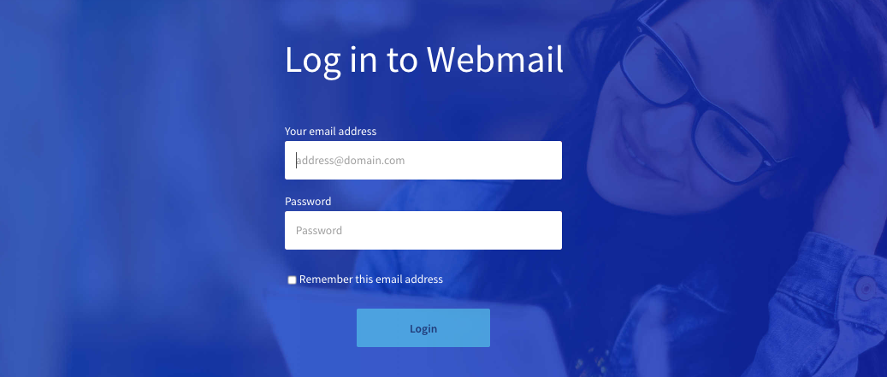
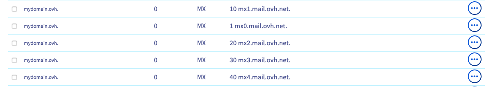

## Objective

Is your email account unable to send or receive emails when using webmail or your email software?

**Find out how to diagnose sending or receiving errors on your OVHcloud email solution.**

> [!primary]
>
> If you have any other questions that are not covered by this guide, please refer to our [Email FAQ](/pages/web_cloud/email_and_collaborative_solutions/mx_plan/faq-emails).

## Requirements

- an OVHcloud email solution (**MX Plan/Web Hosting emails**, **Email Pro**, **Exchange** or **Zimbra**)

<!-- CP-NAV-START:web-mx-plan -->
<!-- CP-NAV-START:web-email-pro -->
<!-- CP-NAV-START:web-exchange -->
---

### OVHcloud Control Panel Access

**MX Plan:**

- **Direct link:** [MX Plan](/links/control-panel/web-mx-plan)
- **Navigation path:** `Web Cloud`{.action} > `MX Plan`{.action} > Select your MX Plan service

**Email Pro:**

- **Direct link:** [Email Pro](/links/control-panel/web-email-pro)
- **Navigation path:** `Web Cloud`{.action} > `Email Pro`{.action} > Select your platform

**Exchange:**

- **Direct link:** [Exchange](/links/control-panel/web-exchange)
- **Navigation path:** `Web Cloud`{.action} > `Exchange`{.action} > Select your platform

---
<!-- CP-NAV-END:web-exchange -->
<!-- CP-NAV-END:web-email-pro -->
<!-- CP-NAV-END:web-mx-plan -->

## Instructions

> [!success]
>
> Use the **sending** and **receiving** keywords to quickly identify the issues that apply to each of the practical cases below.

/// details | Are my email service and/or accounts active? (**sending** and **receiving**)

For your emails to work, you need to have an active email service. If your email solution is linked to a Web Hosting plan, check that it has not expired. You can verify this directly in the OVHcloud Control Panel. The corresponding domain name must also be active.

Start by checking that you are up to date with your [payments](/pages/account_and_service_management/managing_billing_payments_and_services/invoice_management#pay-bills) and service [renewals](/pages/account_and_service_management/managing_billing_payments_and_services/how_to_use_automatic_renewal#renewal-management).

Follow these steps to ensure that your relevant services are up and running:

> [!tabs]
> **Domain name**
>>
>> Go to the `Web Cloud`{.action} section, click `Domain names`{.action}, then select your domain name. If your domain name has expired, this will be listed at the top of the page.
>>
> **Web Hosting**
>>
>> Go to the `Web Cloud`{.action} section, click `Hosting plans`{.action}, then select your Web Hosting plan. The date of expiry or automatic renewal of your hosting will be indicated at the top of the page.
>>
> **MX Plan email account**
>>
>> Go to the `Web Cloud`{.action} section, click `Emails`{.action} (or `MX Plan`{.action} depending on your plan), then select the domain name concerned. Click the `Emails`{.action} accounts tab. Check the email account status in the `Blocked due to SPAM` column.
>>
> **Email Pro**
>>
>> Go to the `Web Cloud`{.action} section, click `Email Pro`{.action}, then select your service. Click the `Email accounts`{.action} tab. Check the email account status in the `Status` column.
>>
> **Exchange**
>>
>> Go to the `Web Cloud`{.action} section, click `Exchange`{.action} in the **Microsoft** section and select your service. Click the `Email accounts`{.action} tab. Check the email account status in the `Status` column.
>>
> **Zimbra**
>>
>> Go to the `Web Cloud`{.action} section, click `Zimbra Mail`{.action}. Click the `Email account`{.action} tab. Check the email account status in the `Status` column.

///

/// details | I am unable to send and/or receive emails from my email software (**sending** and/or **receiving**)

If you use an email client on your computer (Outlook, Mac Mail, Thunderbird, etc.) or smartphone (iOS, Android, etc.), and you experience a sending or receiving technical issue:

1. From an Internet browser, log in to the [webmail](/links/web/email) using the email address concerned.
2. Check the configuration settings according to your email solution and the email client or application you are using:

> [!tabs]
> **MX Plan email account**
>>
>> For an **MX Plan** solution, go to [the MX Plan guides page](/products/web-cloud-email-collaborative-solutions-mx-plan) and check your email client configuration using the guides available in the `Setting up an email application on your computer` or `Setting up an email application on your mobile device` section, depending on the device you are using.
>>
> **Email Pro**
>>
>> For an **Email Pro** solution, go to [the Email Pro guides page](/products/web-cloud-email-collaborative-solutions-email-pro) and check your email client configuration using the guides available in the `Setting up an email application on your computer` or `Setting up an email application on your mobile device` section, depending on the device you are using.
>>
> **Exchange**
>>
>> For an **Exchange** solution, go to [the Microsoft Exchange guides page](/products/web-cloud-email-collaborative-solutions-microsoft-exchange) and check your email client configuration using the guides available in the `Setting up an email application on your computer` or `Setting up an email application on your mobile device` section, depending on the device you are using.
>>
> **Zimbra**
>>
>> For a **Zimbra** solution, go to [the Zimbra guides page](/products/web-cloud-email-collaborative-solutions-zimbra) and check your email client configuration using the guides available in the `Setting up an email application on your computer` or `Setting up an email application on your mobile device` section, depending on the device you are using.

///

/// details | I can't receive emails because my email address is full, I don't have any more space. What can I do?

If you have signed up to [one of our OVHcloud email solutions](/links/web/emails) and one of your email accounts is full, please read our guide "[Managing email account storage space](/pages/web_cloud/email_and_collaborative_solutions/troubleshooting/email_manage_quota)". This guide will help you decide whether you can optimize your existing storage space, or whether you need to change email solutions to increase storage capacity.

///

/// details | Are emails functional from webmail? (**sending** and/or **receiving**)

To ensure that the malfunction is not linked to a configuration error, send and receive a test email directly via OVHcloud webmail. If everything is working properly, check your software configuration using the guides provided.

From your computer browser or smartphone, go to the address [Webmail](/links/web/email).

{.thumbnail}

///

/// details | I cannot log in to webmail

Make sure you have the right password. If necessary, you can modify it. Also check if two-factor authentication is enabled ([Exchange](/links/web/emails-hosted-exchange) only).

Here is how to change the password for an email address:

> [!tabs]
> **MX Plan email account**
>>
>> For an **MX Plan** solution, please refer to our guide "[Changing a password for an MX Plan email address](/pages/web_cloud/email_and_collaborative_solutions/mx_plan/email_change_password)".
>>
> **Email Pro**
>>
>> For an **Email Pro** solution, go to the `Web Cloud`{.action} section, click `Email Pro`{.action}, then select your platform. In the `Email accounts`{.action} tab, click the `...`{.action} button, then click `Edit`{.action} to change the password.
>>
> **Exchange**
>>
>> For an **Exchange** solution, go to the `Web Cloud`{.action} section, click `Exchange`{.action} in the **Microsoft** section, then select your platform. In the `Email accounts`{.action} tab, click the `...`{.action} button, then click `Edit`{.action} to change the password.   Check if two-factor authentication is enabled in our guide "[Configuring two-factor authentication on an Exchange](/pages/web_cloud/email_and_collaborative_solutions/microsoft_exchange/manage_2fa_exchange)" account.
>>
> **Zimbra**
>>
>> For a **Zimbra** solution, go to the `Web Cloud`{.action} section and click `Zimbra Mail`{.action}. In the `Email account`{.action} tab, click the `⋮`{.action} button, then click `Edit`{.action} to change the password.

///

/// details | Is there an incident or maintenance in progress for my service? (**sending** and/or **receiving**)

You can check the various tasks that are currently in progress on <https://web-cloud.status-ovhcloud.com/>.

- For **MX Plan**, check in the `Emails` section
- For **Email Pro**, go to the `Microsoft` section
- For **Exchange**, go to the `Hosted Microsoft`, `Private Microsoft` and `Trusted Microsoft` sections, depending on your solution.
- For **Zimbra**, go to the `Zimbra` section

///

/// details | Is the domain name pointing correctly to my email service? (**receiving**)

Check that your domain name points correctly to the OVHcloud email servers. To do this, you will need to configure MX records in your DNS zone.  Please refer to our guide "[Adding an MX record to your domain name's configuration](/pages/web_cloud/domains/dns_zone_mx)".

{.thumbnail}

> [!primary]
>
> To check your domain name's DNS configuration, regardless of its registrar, you can use the [Zone Master](https://zonemaster.net/) tool, using our documentation "[Tutorial - Using Zonemaster](/pages/web_cloud/domains/dns_zonemaster)".

///

/// details | After sending an email, I receive a message that my email could not be sent, including a 3-digit code (**sending**)

This is an SMTP error return. This indicates that the exchange between the outgoing server and the incoming email server could not be completed correctly. The code is used to determine the type of error the server encountered. It is usually accompanied by a message detailing this error.

An SMTP response consists of a 3-digit number. The three digits of the answer each have a particular meaning:

- The first number indicates whether the answer is positive, negative or incomplete. An SMTP client will be able to determine its next action by examining this first digit.
- The second and third digits provide additional information.

There are four possible values for the first digit of the response code:

|Code|Description|
|---|---|
|2 xx|Positive response: the requested action has been completed. A new request can be initiated.|
|3 xx|Temporary positive response: the request has been accepted, but the requested action is pending receipt of more information. The SMTP client should send another command specifying this information.|
|4 xx|Persistent transient failure: the command was not accepted and the requested action not fulfilled. However, the error condition is temporary and the action can be requested again.|
|5 xx|Negative response: the command was not accepted and the requested action not fulfilled. The SMTP client should not repeat the same request.|

> [!primary]
>
> Use **Ctrl+F** / **Cmd+F** and enter your error code to quickly find it in the following table.

The majority of SMTP negative response codes used by servers are listed below:

> [!tabs]
> 4xx Errors — Temporary
>>
>> A **4xx** code indicates that the error is temporary. The message can be sent again at a later time. Identify the cause and try again after resolving it.
>>
>> |Response codes|Details|Actions|
>> |---|---|---|
>> |420|Timeout connection problem|This error message is returned only by GroupWise mail servers. Contact the destination mail server administrator.|
>> |421|Service not available, transmission channel being closed|Undetermined origin error, make sure that sending to another domain works. If yes, please try sending the original email again later.|
>> |432|The recipient's Exchange Server incoming mail queue has been stopped|This error message is returned only by Microsoft Exchange mail servers. Contact the destination mail server administrator.|
>> |449|A routing error|This error message is returned only by Microsoft Exchange mail servers. Microsoft recommends that you run a diagnostic with their WinRoute tool.|
>> |450|Requested action not taken – The user's mailbox is unavailable (for example, mailbox busy or temporarily blocked for security or blacklisting reasons).|Check if the IP address of the mail server is blacklisted ([Spamhaus](https://check.spamhaus.org/)), and also check if your mail contains words referring to SPAM.|
>> |451|Requested action aborted – Local error in processing|This may be due to a momentary overload, or an incorrect SPF check of the issuing domain. Refer to the additional message provided by the server, or contact the server administrator if this persists.|
>> |452|The command has been aborted because the server has insufficient system storage|The mail server is 'overloaded'. This could also be caused by too many messages trying to be sent at once. Please check your outbox and try again.|
>> |455|Server unable to deal with the command at this time.|Wait a while, then try again. If this fails, contact the recipient's email server administrator.|
>>
> 5xx Errors — Permanent
>>
>> A **5xx** code indicates that the error is permanent. The message will not be sent again automatically. You must take corrective action before attempting another send.
>>
>> |Response codes|Details|Actions|
>> |---|---|---|
>> |500|A syntax error: the server could not recognise the command (may include errors such as a too long command line)|This is often caused by the sender's antivirus or firewall. Check this and try again.|
>> |501|Syntax error in parameters or arguments|This is often caused by an incorrect recipient email address or a sender-side antivirus or firewall problem. Please check the destination address and your antivirus or firewall.|
>> |502|Command not implemented|The settings or options used when sending the email with your SMTP server are recognised but disabled in its configuration. Please contact your service provider.|
>> |503|Server encountered bad sequence of commands|This is usually due to an authentication problem, make sure you are authenticated on the SMTP server in terms of your email software configuration.|
>> |504|Command parameter not implemented|The settings or options used when sending the email with your SMTP server are recognised but disabled in its configuration. Please contact your service provider.|
>> |535|Authentication failed|User information/password is incorrect or sending is potentially blocked on your email address. Check the status of your email address in your OVHcloud Control Panel. A password change can unblock the sending if the account has been blocked for spam, see our guide "[What to do if your account is blocked for spam](/pages/web_cloud/email_and_collaborative_solutions/troubleshooting/locked_for_spam)" for more information.|
>> |550|Requested action not performed: mailbox unavailable|The destination mail server could not verify the email address used. This is most often caused by an invalid destination email address, but can also mean that the destination email server has firewall or connectivity issues. Check the recipient's email address, and/or try again.|
>> |550 5.7.1|Email rejected per policy reason|The destination email server rejected the sending email address for security policy reasons. There are many reasons for this, and they are usually detailed with the error code. In some cases, it can be an IP address in the transmission chain that is present in a reject list. To check the reputation of an IP address, you can test it, for example, on [MXtoolbox](https://mxtoolbox.com/blacklists.aspx) or check the chain of transmission of an email from the email address concerned with [Mailtester](https://www.mail-tester.com/)|
>> |550 5.7.26|*This message does not have authentication information or fails to pass authentication checks*|The mail was rejected because the sender's email service does not have SPF or DKIM configured on their domain name.  It is advisable to set up a priority SPF record, which is compatible with all email offers. Use our guide "[How to improve email security with an SPF record](/pages/web_cloud/domains/dns_zone_spf)".  If your email offer has the DKIM option, you can put it in place using our guide "[How to improve email security with a DKIM record](/pages/web_cloud/domains/dns_zone_dkim)".|
>> |551|User not local or invalid address – Relay denied|This is typically used as a spam prevention strategy. It says that the mail relay is not authorised for any reason to relay your message to another server than yours. Please contact your service provider.|
>> |552|Requested mail actions aborted – Exceeded storage allocation|The user you tried to contact no longer has space to receive messages. Unfortunately, the only solution is to contact the recipient via another method.|
>> |553|Requested action not taken – Mailbox name invalid|This is usually caused by an incorrect destination email address. Please check that the email address in question is correct.|
>> |554|Transaction failed, "No SMTP service here"|This is usually a blacklist problem. Check if your email server IP address is blacklisted ([Spamhaus](https://check.spamhaus.org/)).|
>> |555|MAIL FROM / RCPT TO, unrecognised or unimplemented arguments|The outgoing SMTP server cannot recognise the email address used in either your `From` or `To` settings. Please check that the email addresses entered are correct, and also check that you have not exceeded the limit set by OVHcloud: 200 mails/hour/account and 300 mails/hour/ip.|

///

## Go further

[Email FAQ](/pages/web_cloud/email_and_collaborative_solutions/mx_plan/faq-emails)

[How to improve email security with an SPF record](/pages/web_cloud/domains/dns_zone_spf)

[How to improve email security with a DKIM record](/pages/web_cloud/domains/dns_zone_dkim)

[Managing email account storage space](/pages/web_cloud/email_and_collaborative_solutions/troubleshooting/email_manage_quota)

[What to do if your account is blocked for spam](/pages/web_cloud/email_and_collaborative_solutions/troubleshooting/locked_for_spam)

Join our [community of users](/links/community).
