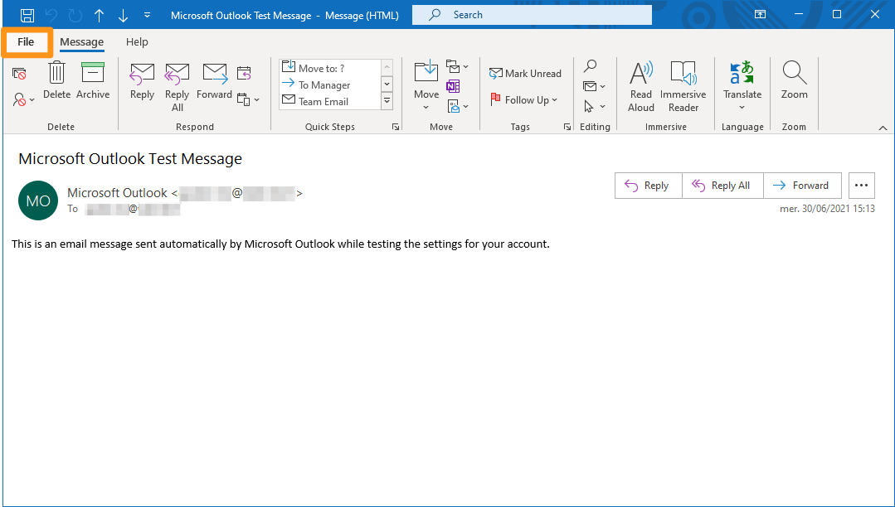
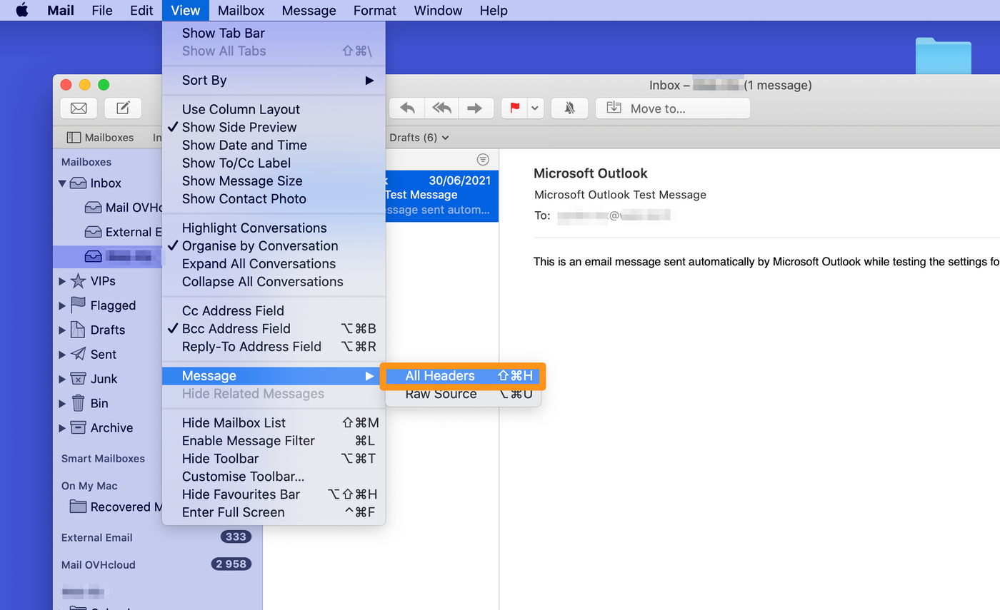
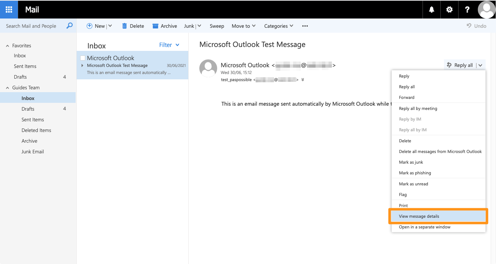
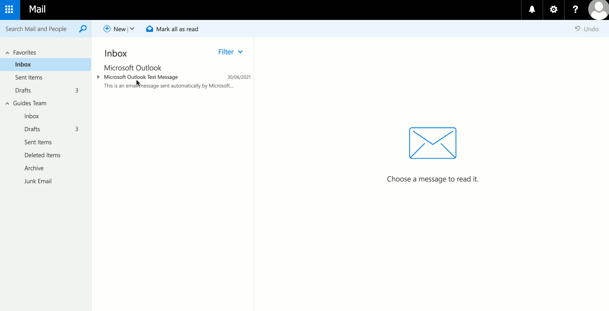
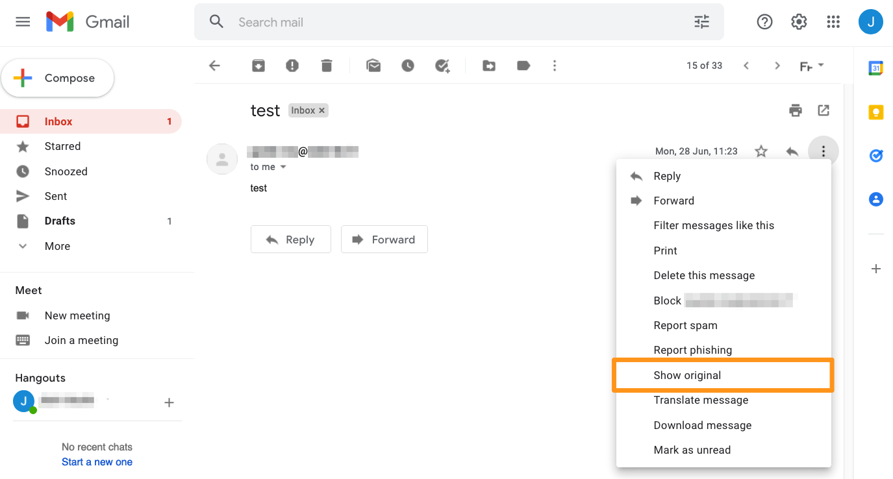

> [!primary]
> Diese Übersetzung wurde durch unseren Partner SYSTRAN automatisch erstellt. In manchen Fällen können ungenaue Formulierungen verwendet worden sein, z.B. bei der Beschriftung von Schaltflächen oder technischen Details. Bitte ziehen Sie im Zweifelsfall die englische oder französische Fassung der Anleitung zu Rate. Möchten Sie mithelfen, diese Übersetzung zu verbessern? Dann nutzen Sie dazu bitte den Button "Beitragen" auf dieser Seite.
>

**Letzte Aktualisierung am 19.11.2021**

## Ziel

Ein E-Mail-Header dient dazu, den Weg, den die E-Mail vom Absender bis zum Empfänger im Netzwerk genommen hat, nachzuverfolgen. 
Er ermöglicht unter anderem die Identifizierung einer schädlichen E-Mail oder die Erkennung einer Empfangsverzögerung.

Jede empfangene E-Mail verfügt über einen Header, der aber nicht angezeigt wird, wenn Sie Ihre E-Mail einsehen. Sie können ihn jedoch mit Ihrem E-Mail-Client oder in Ihrem Webmail-Interface abrufen.

Sie können die gesamte E-Mail auch als `.eml` Datei exportieren. Diese Datei kann beispielweise angefordert werden, um eine unerwünschte E-Mail zu analysieren, die Sie erhalten haben. 
Um eine `.eml` Datei abzurufen, gehen Sie direkt zum Abschnitt [Webmail](#webmail).

**Diese Anleitung erklärt, wie Sie E-Mail-Header mithilfe eines E-Mail-Clients abrufen können.**

## Voraussetzungen

- Sie verwenden eine E-Mail-Adresse mit einem [OVHcloud E-Mail Dienst](https://www.ovhcloud.com/de/emails/) oder einer externen Lösung.
- Sie haben über Webmail oder eine E-Mail-Software Zugriff auf die E-Mail-Adresse.

## In der praktischen Anwendung

### Inhalt eines Headers verstehen

Der Header setzt sich aus mehreren Elementen zusammen, die den Verlauf der E-Mail anzeigen. Diese sind umgekehrt chronologisch angeordnet, vom neuesten bis zum ältesten Eintrag, gefolgt von zusätzlichen Informationen. 
Im Folgenden finden Sie eine nicht erschöpfende Liste der Elemente, aus denen ein Header bestehen kann, sowie deren Bedeutung. 

- Ein `Received` Eintrag ist im Header für jedem Durchgang der E-Mail auf einen Ausgangsserver (SMTP) enthalten. Der Hostname des Servers wird in der Regel mit seiner IP-Adresse und einem Zeitstempel angegeben. Die Einträge für `Received` sind vom letzten Durchgang zum ältesten Durchgang auf einem Server sortiert:
<pre class="console"><code>
Received: from mxplan7.mail.ovh.net (unknown [10.109.143.250])
	by mo3005.mail-out.ovh.net (Postfix) with ESMTPS id 448F4140309
	for &lt;john@mydomain.ovh&gt; ;Wed, 30 Jun 2021 13:12:40 +0000 (UTC)
</code></pre>
*Hier wurde die E-Mail vom Server mxplan7.mail.ovh.net zum Server mo3005.mail-out.ovh.net am 30. Juni 2021 um 13:12:40 Uhr (UTC-Zeitzone) übertragen.*

- Der Eintrag `Return-Path` entspricht der Rücksendeadresse, wenn der Versand der Nachricht fehlgeschlagen ist. Die Rücksendeadresse ist im Allgemeinen die Versandadresse. 
<pre class="console"><code>
Return-Path: &lt;john@mydomain.ovh&gt;
</code></pre>

- Der `From`-Eintrag enthält die Adresse des Absenders der E-Mail und den Anzeigenamen.
<pre class="console"><code>
From: John &lt;john@mydomain.ovh&gt;
</code></pre>

- Der `To`-Eintrag enthält die Adresse des E-Mail-Empfängers und den Anzeigenamen.
<pre class="console"><code>
To: Robert &lt;robert@hisdomain.ovh&gt;
</code></pre>

- `Subject` ist der Betreff der E-Mail.
<pre class="console"><code>
Subject: Hello my friend
</code></pre>

- Der Eintrag `Message-ID` bezeichnet die eindeutige Kennung der E-Mail und endet mit dem Namen des Versendungsservers (nach "@"). 
<pre class="console"><code>
Message-ID: &lt;Dc55+mK3j7hdZkf5_r-ff=fjq380ozc2h5@mailserver.domain.ovh&gt;
</code></pre>

- Im Feld `Received-SPF` wird das Ergebnis der [SPF](/pages/web_cloud/domains/dns_zone_spf) Überprüfung des Domainnamens des Absenders angezeigt. Mit dem `client-ip`-Argument wird unter anderem die IP-Adresse des Servers ermittelt, der für den Versand der E-Mail verwendet wurde. 
<pre class="console"><code>
Received-SPF: Pass (mailfrom) identity=mailfrom; client-ip=000.11.222.33; helo=mail-smtp-001.domain.ovh; envelope-from=john@mydomain.ovh; receiver=robert@hisdomain.ovh
</code></pre>

- Die `X-`Einträge sind individuelle Felder und dienen als Ergänzung zu den Standardfeldern. Sie werden implementiert von den Servern, die E-Mails übertragen.
<pre class="console"><code>
X-OVH-Remote: 000.11.222.33 (mail-smtp-001.domain.ovh)
X-Ovh-Tracer-Id: 1234567891011121314
X-VR-SPAMSTATE: OK
X-VR-SPAMSCORE: 0
X-VR-SPAMCAUSE: 
</code></pre>

### Header mit einer E-Mail-Software abrufen

#### Microsoft Outlook 

Um den Header anzuzeigen, öffnen Sie die E-Mail Ihrer Wahl mit einem Doppelklick.

Klicken Sie im neuen Fenster oben links auf `Datei`{.action}.

{.thumbnail}

Wählen Sie dann links `Info`{.action} aus und klicken Sie auf `Eigenschaften`{.action}.

{.thumbnail}

Der vollständige Header der E-Mail wird unten angezeigt. Sie können den gesamten Text auswählen und in eine Datei kopieren.

{.thumbnail}

#### Mozilla Thunderbird

Um den Header anzuzeigen, öffnen Sie die E-Mail Ihrer Wahl und drücken Sie dann gleichzeitig auf die Tasten `Ctrl` und `U`.

{.thumbnail}

Der vollständige Header der E-Mail wird in einem separaten Fenster angezeigt. Sie können den gesamten Text auswählen und in eine Datei kopieren.

#### macOS Mail

Um den Header anzuzeigen, öffnen Sie die E-Mail Ihrer Wahl. Öffnen Sie `Ansicht`{.action} und dann `Nachricht`{.action} und klicken Sie auf `Alle Header`{.action}.

{.thumbnail}

Der vollständige Header der E-Mail wird in einem separaten Fenster angezeigt. Sie können den gesamten Text auswählen und in eine Datei kopieren.

### Header von Webmail aus abrufen 

#### Roundcube

##### **Header anzeigen**

Um den Header anzuzeigen, öffnen Sie die E-Mail Ihrer Wahl. Klicken Sie auf den Button `... Mehr`{.action} und auf `< > Quelle anzeigen`{.action}.

{.thumbnail}

Es öffnet sich ein neues Fenster mit dem vollständigen Header der E-Mail. Sie können den gesamten Text auswählen und in eine Datei kopieren.

##### **.eml Datei speichern**

Um die `.eml` Datei herunterzuladen wählen Sie eine E-Mail aus. Klicken Sie auf den `... Mehr`{.action} Danach auf `Download (.eml)`{.action}.

{.thumbnail}

#### Outlook Web Application (OWA) 

##### **Header anzeigen**

Wählen Sie die E-Mail aus, deren Header Sie anzeigen möchten. Klicken Sie auf den **Pfeil** rechts neben `Allen antworten`{.action} und dann auf `Nachrichtendetails anzeigen`{.action}. Es öffnet sich ein neues Fenster, in dem der vollständige Header der E-Mail abgerufen werden kann.

{.thumbnail}

Siehe auch unser Video-Tutorial:

<iframe width="560" height="315" src="https://www.youtube-nocookie.com/embed/UeNdpFwdXm0?start=36" title="YouTube video player" frameborder="0" allow="accelerometer; autoplay; clipboard-write; encrypted-media; gyroscope; picture-in-picture" allowfullscreen></iframe>

##### **.eml Datei speichern**

Um die `.eml` Datei herunterzuladen klicken Sie auf `(+) Neu`{.action}, um eine neue E-Mail zu erstellen. 

Wählen Sie die E-Mail aus, die Sie extrahieren möchten, und ziehen Sie sie in den Inhalt der neuen Nachricht. 

Klicken Sie auf den Pfeil der im gerade erstellten Anhang angezeigt wird, und klicken Sie dann auf `Download`{.action}, um die Datei auf Ihrem Gerät zu speichern.

{.thumbnail}

### Header von einem anderen E-Mail-Client abrufen

#### Gmail

Um den Header abzurufen, wählen Sie die betreffende E-Mail aus und klicken Sie auf die 3 vertikalen Punkte rechts. Klicken Sie dann auf `Quelle anzeigen`{.action} um ein neues Fenster mit dem vollständigen Header der E-Mail zu öffnen, den Sie auch im Format `.eml` herunterladen können.

{.thumbnail}

#### Outlook.com

Um den Header im Webmail-Interface von <Outlook.com> anzuzeigen, folgen Sie dem Abschnitt [Outlook Web Application](#owa) dieser Anleitung.

## Weiterführende Informationen

[E-Mail FAQ](/pages/web_cloud/email_and_collaborative_solutions/mx_plan/faq-emails)

Für den Austausch mit unserer User Community gehen Sie auf <https://community.ovh.com/en/>.
