

## Wprowadzenie

Nagłówek wiadomości e-mail umożliwia prześledzenie drogi, jaką pokonała wiadomość w sieci, od nadawcy do odbiorcy. 
Pozwala w szczególności zidentyfikować złośliwą wiadomość e-mail lub wykryć opóźnienie w odbiorze.

Każdy otrzymany e-mail posiada nagłówek (*header*), który nie wyświetla się domyślnie podczas przeglądania wiadomości. Można go jednak pobrać z programu pocztowego lub z interfejsu webmail.

Możesz również wyodrębnić cały e-mail w postaci pliku `.eml`. Plik ten może być wymagany w celu przeanalizowania otrzymanej złośliwej wiadomości. 
Aby pobrać plik `.eml`, przejdź do sekcji [webmail](#webmail).

**Dowiedz się, jak pobrać nagłówek wiadomości e-mail i wyodrębnić plik .eml z programu pocztowego.**

## Wymagania początkowe

- Posiadanie adresu e-mail w jednym z naszych [rozwiązań e-mail OVHcloud](/links/web/emails) lub w rozwiązaniu zewnętrznym.
- Dostęp do adresu e-mail przez interfejs webmail lub program pocztowy.

## W praktyce

### Zrozumienie zawartości nagłówka

Nagłówek składa się z kilku elementów wskazujących drogę wiadomości e-mail, uporządkowanych w odwrotnej kolejności chronologicznej, oraz z dodatkowych informacji. 
Poniżej znajduje się niewyczerpująca lista elementów, które mogą składać się na nagłówek, oraz ich znaczenie.

- Pole `Received` jest obecne w nagłówku przy każdym przejściu wiadomości e-mail przez serwer wysyłki (SMTP). Zwykle zawiera nazwę hosta serwera z jego adresem IP oraz datę. Pola `Received` są uporządkowane od najnowszego do najstarszego przejścia przez serwer:
<pre class="bgwhite"><code>
Received: from MX Plan7.mail.ovh.net (unknown [10.109.143.250])
	by mo3005.mail-out.ovh.net (Postfix) with ESMTPS id 448F4140309
	for &lt;john@mydomain.ovh&gt; ;Wed, 30 Jun 2021 13:12:40 +0000 (UTC)
</code></pre>
  *Wiadomość e-mail została przesłana z serwera MX Plan7.mail.ovh.net do serwera mo3005.mail-out.ovh.net 30 czerwca 2021 r. o godzinie 13:12:40 (strefa czasowa UTC)*

- Pole `Return-Path` odpowiada adresowi zwrotnemu w przypadku niepowodzenia wysyłki wiadomości. Adres zwrotny jest zazwyczaj adresem nadawcy.
<pre class="bgwhite"><code>
Return-Path: &lt;john@mydomain.ovh&gt;
</code></pre>

- Pole `From` oznacza adres nadawcy wiadomości e-mail oraz jego nazwę wyświetlaną.
<pre class="bgwhite"><code>
From: John &lt;john@mydomain.ovh&gt;
</code></pre>

- Pole `To` oznacza adres odbiorcy wiadomości e-mail oraz jego nazwę wyświetlaną.
<pre class="bgwhite"><code>
To: Robert &lt;robert@hisdomain.ovh&gt;
</code></pre>

- Pole `Subject` oznacza temat wiadomości e-mail.
<pre class="bgwhite"><code>
Subject: Hello my friend
</code></pre>

- Pole `Message-ID` oznacza unikalny identyfikator wiadomości e-mail i kończy się nazwą serwera wysyłki (po znaku "@").
<pre class="bgwhite"><code>
Message-ID: &lt;Dc55+mK3j7hdZkf5_r-ff=fjq380ozc2h5@mailserver.domain.ovh&gt;
</code></pre>

- Pole `Received-SPF` wyświetla wynik kontroli [SPF](/pages/web_cloud/domains/dns_zone_spf) przeprowadzonej na domenie nadawcy. Argument `client-ip` pozwala ustalić adres IP serwera, który wysłał wiadomość e-mail.
<pre class="bgwhite"><code>
Received-SPF: Pass (mailfrom) identity=mailfrom; client-ip=000.11.222.33; helo=mail-smtp-001.domain.ovh; envelope-from=john@mydomain.ovh; receiver=robert@hisdomain.ovh
</code></pre>

- Pola `X-` to pola niestandardowe, które uzupełniają pola standardowe. Są implementowane przez serwery, przez które przechodzą wiadomości e-mail.
<pre class="bgwhite"><code>
X-OVH-Remote: 000.11.222.33 (mail-smtp-001.domain.ovh)
X-Ovh-Tracer-Id: 1234567891011121314
X-VR-SPAMSTATE: OK
X-VR-SPAMSCORE: 0
X-VR-SPAMCAUSE:
</code></pre>

### Pobranie nagłówka w programie pocztowym

#### Microsoft Outlook

##### **Pobranie nagłówka**

Istnieją dwie wersje programu Outlook dla systemu Windows: **Outlook klasyczny** i **Nowy Outlook**. Aby zidentyfikować swoją wersję, wpisz "Outlook" w pasku wyszukiwania systemu Windows. Jeśli pojawi się oznaczenie "(klasyczny)", korzystasz z klasycznego programu Outlook. W przeciwnym razie jest to Nowy Outlook.

{.thumbnail .h-500}

**Outlook klasyczny:**

1. Kliknij dwukrotnie wiadomość e-mail, aby otworzyć ją w oddzielnym oknie.
2. W nowym oknie kliknij `Plik`{.action} w lewym górnym rogu.
3. Wybierz `Informacje`{.action} po lewej stronie i kliknij `Właściwości`{.action}.
4. Pełny nagłówek wiadomości e-mail wyświetla się w dolnym polu. Zaznacz cały tekst i skopiuj go do pliku.

{.thumbnail}

**Nowy Outlook:**

1. Otwórz wybraną wiadomość e-mail.
2. Kliknij **prawym przyciskiem myszy** na wiadomość e-mail.
3. Wybierz `Widok`{.action}, a następnie `Wyświetl szczegóły wiadomości`{.action}.
4. Pełny nagłówek wiadomości e-mail wyświetla się w panelu szczegółów wiadomości. Zaznacz cały tekst i skopiuj go do pliku.

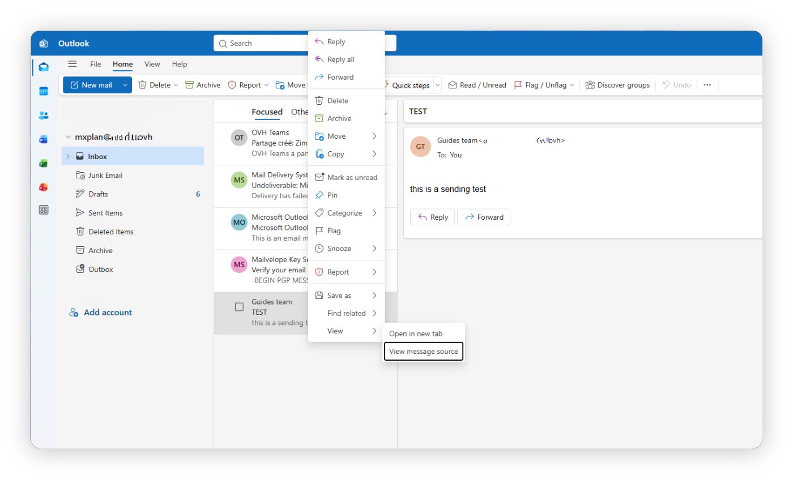{.thumbnail}

##### **Pobranie pliku .eml**

**Outlook klasyczny:**

1. Zaznacz wiadomość e-mail w skrzynce odbiorczej (nie otwieraj jej).
2. Kliknij `Plik`{.action} na pasku menu.
3. Kliknij `Zapisz jako`{.action}.
4. W menu rozwijanym "Zapisz jako typ" wybierz **Format wiadomości programu Outlook - Unicode (.msg)**. Wybierz lokalizację na komputerze (np. Pulpit) i kliknij `Zapisz`{.action}.

Możesz również **przeciągnąć i upuścić** wiadomość e-mail ze skrzynki odbiorczej bezpośrednio na Pulpit. Spowoduje to utworzenie pliku `.msg`, który możesz dołączyć do zgłoszenia.

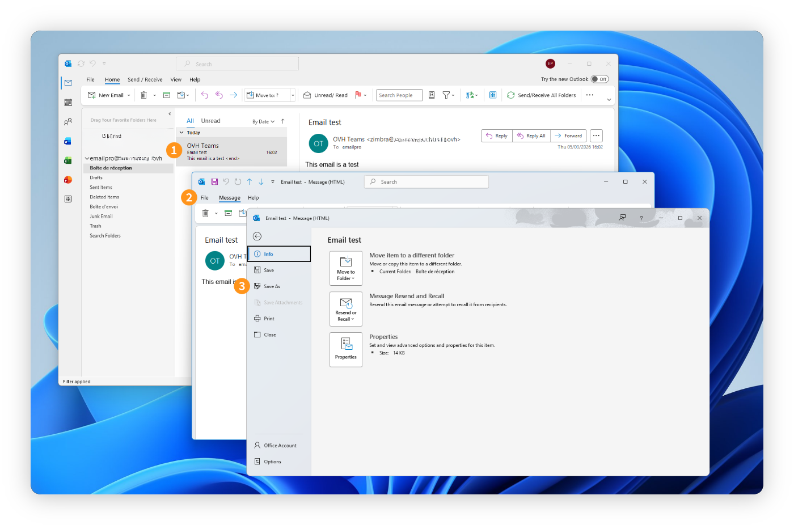{.thumbnail}

**Nowy Outlook:**

1. Na liście wiadomości kliknij **prawym przyciskiem myszy** na wiadomość e-mail.
2. Wybierz `Zapisz jako`{.action}, a następnie `Zapisz jako plik EML`{.action}.
3. Wybierz lokalizację na komputerze i kliknij `Zapisz`{.action}.

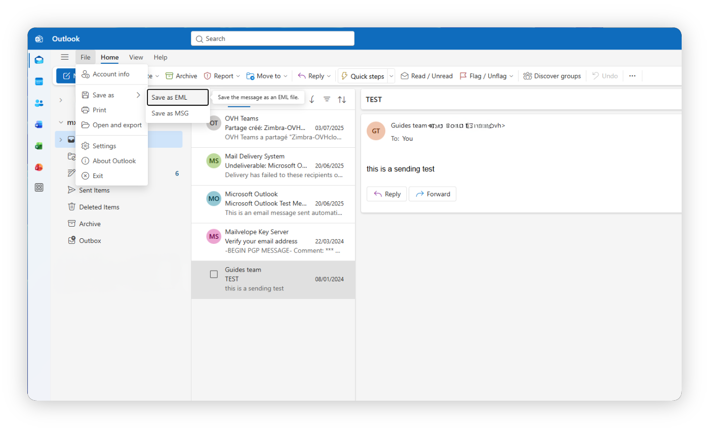{.thumbnail}

#### Mozilla Thunderbird

##### **Pobranie nagłówka**

1. Wybierz wiadomość e-mail.
2. Naciśnij jednocześnie klawisze `Ctrl` \+ `U` (`Cmd` \+ `U` w systemie macOS).
3. Pełny nagłówek wiadomości e-mail pojawi się w oddzielnym oknie. Zaznacz cały tekst i skopiuj go do pliku.

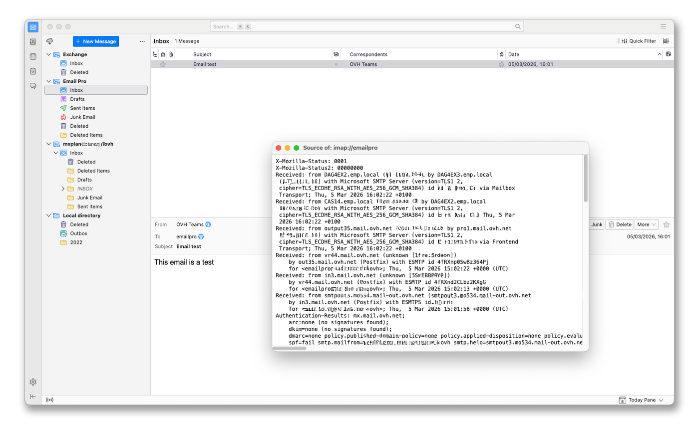{.thumbnail}

##### **Pobranie pliku .eml**

1. Wybierz wiadomość e-mail.
2. Naciśnij jednocześnie klawisze `Ctrl` \+ `S` (`Cmd` \+ `S` w systemie macOS).
3. Plik zostanie domyślnie zapisany w formacie `.eml`.

#### Mail macOS

##### **Pobranie nagłówka**

1. Wybierz wiadomość e-mail.
2. Naciśnij jednocześnie klawisze `Cmd` \+ `Shift` \+ `H`.
3. Pełny nagłówek wiadomości e-mail pojawi się. Zaznacz szary tekst i skopiuj go do pliku.

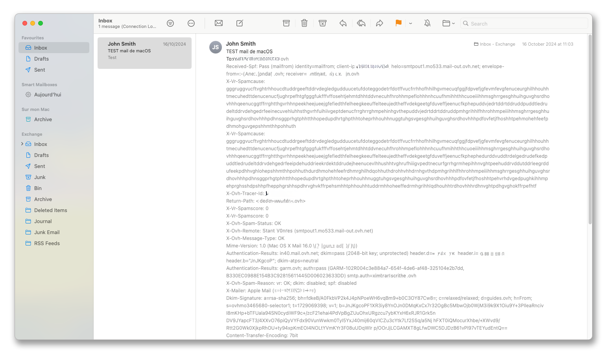{.thumbnail}

##### **Pobranie pliku .eml**

1. Wybierz wiadomość e-mail.
2. Naciśnij jednocześnie klawisze `Cmd` \+ `S`. Plik `.eml` zostanie utworzony automatycznie. Wybierz format `Surowe źródło wiadomości`.
3. Wybierz lokalizację na komputerze i kliknij `Zapisz`{.action}.

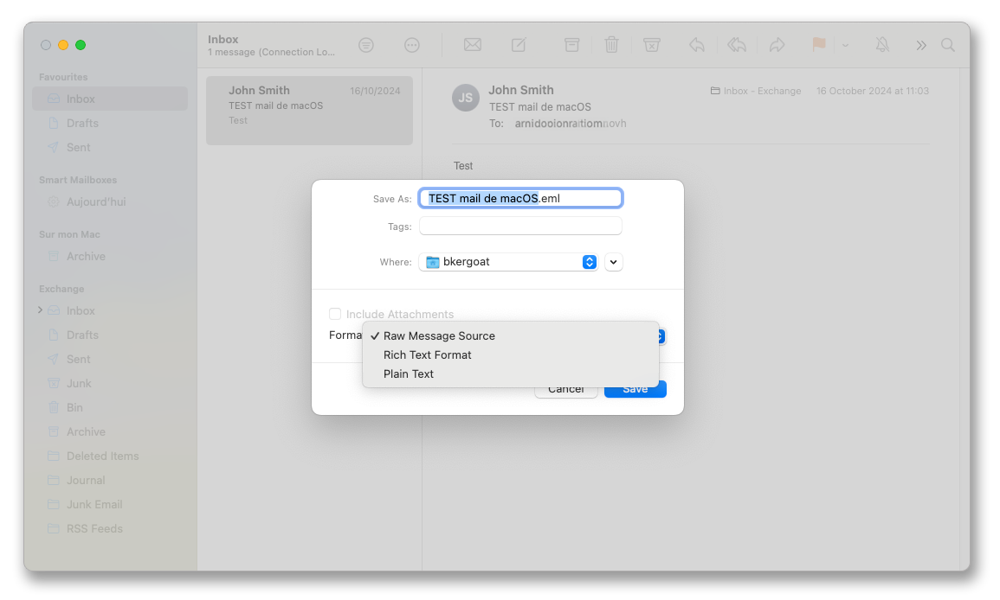{.thumbnail}

### Pobranie nagłówka w interfejsie webmail 

#### Roundcube

##### **Pobranie nagłówka**

1. Wybierz wiadomość e-mail.
2. Kliknij przycisk `... Więcej`{.action}, a następnie `< > Pokaż źródło`{.action}.
3. Otworzy się nowe okno z pełnym nagłówkiem wiadomości e-mail. Zaznacz cały tekst i skopiuj go do pliku.

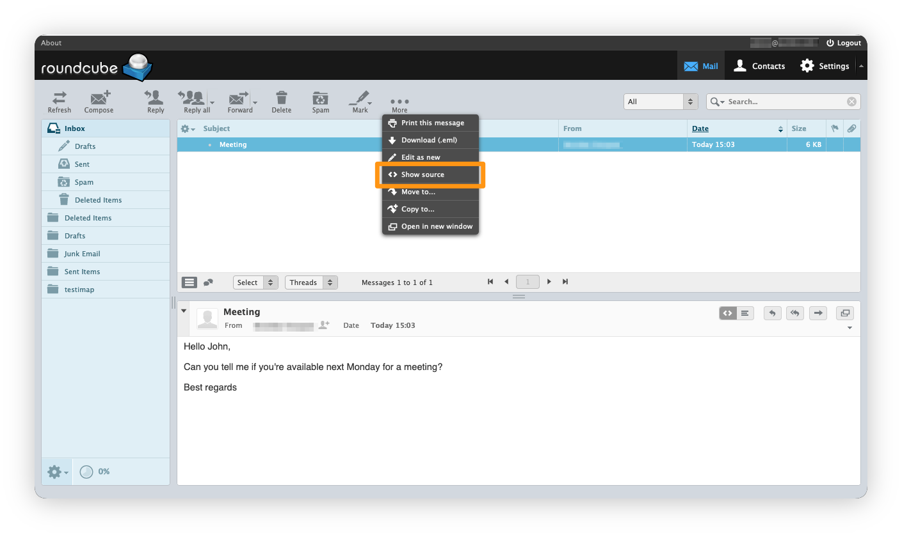{.thumbnail}

##### **Pobranie pliku .eml**

1. Wybierz wiadomość e-mail.
2. Kliknij przycisk `... Więcej`{.action}, a następnie `Pobierz (.eml)`{.action}.

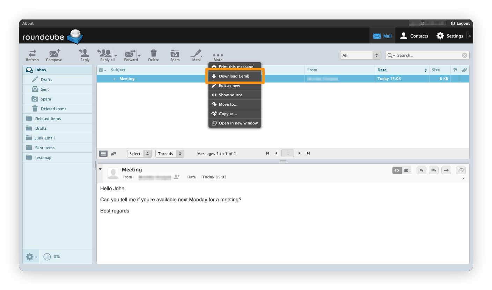{.thumbnail}

#### Outlook Web App (OWA) 

##### **Pobranie nagłówka**

1. Wybierz wiadomość e-mail, której nagłówek chcesz wyświetlić.
2. Kliknij **strzałkę** po prawej stronie przycisku `Odpowiedz wszystkim`{.action}, a następnie `Wyświetl szczegóły wiadomości`{.action}.
3. Otworzy się nowe okno z pełnym nagłówkiem wiadomości e-mail, umożliwiając jego pobranie.

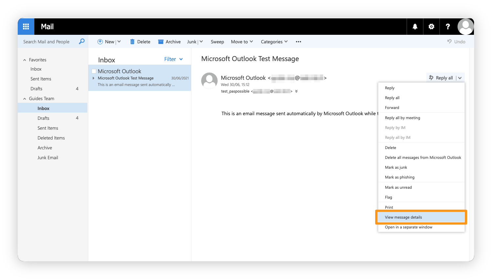{.thumbnail}

Zobacz także nasz samouczek wideo:

<iframe class="video" width="560" height="315" src="https://www.youtube-nocookie.com/embed/Ivad4FgJ2No?start=36" title="YouTube video player" frameborder="0" allow="accelerometer; autoplay; clipboard-write; encrypted-media; gyroscope; picture-in-picture" allowfullscreen></iframe>

##### **Pobranie pliku .eml**

1. Kliknij `(+) Nowy`{.action}, aby utworzyć nową wiadomość e-mail.
2. Wybierz wiadomość e-mail, którą chcesz wyodrębnić, i przeciągnij ją do treści nowej wiadomości.
3. Kliknij strzałkę w dół obok wygenerowanego załącznika, a następnie kliknij `Pobierz`{.action}, aby zapisać plik na swoim komputerze.

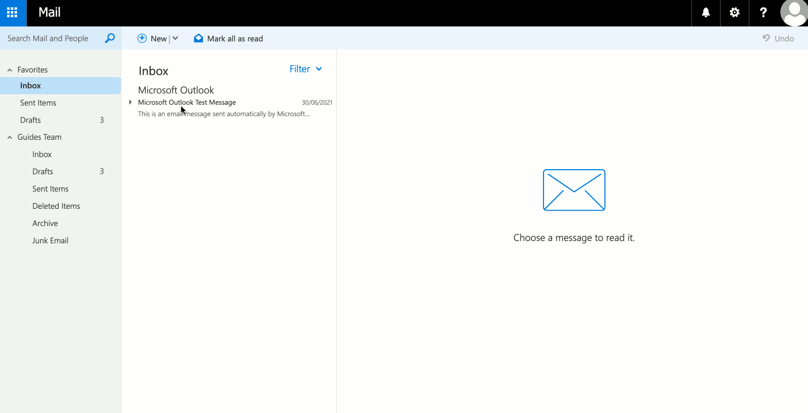{.thumbnail}

#### Zimbra

##### **Pobranie nagłówka**

1. Wybierz wiadomość e-mail.
2. Kliknij `Więcej`{.action} na pasku akcji i wybierz `Pokaż oryginał`{.action}.
3. Otworzy się nowe okno z pełnym nagłówkiem i surową treścią wiadomości e-mail.

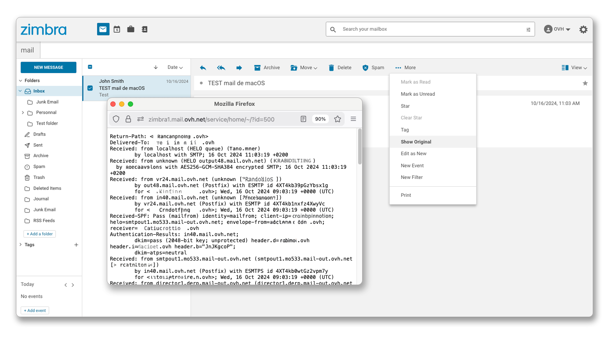{.thumbnail}

##### **Pobranie pliku .eml**

1. Wybierz wiadomość e-mail.
2. Kliknij `Więcej`{.action} na pasku akcji i wybierz `Pokaż oryginał`{.action}.
3. W oknie, które się otworzy, użyj skrótu `Ctrl` \+ `S` (lub `Cmd` \+ `S` w systemie macOS), aby zapisać stronę jako plik `.eml`.

### Pobranie nagłówka w innym kliencie poczty

#### Gmail

##### **Pobranie nagłówka**

1. Wybierz wiadomość e-mail.
2. Kliknij 3 pionowe kropki po prawej stronie, a następnie `Pokaż oryginał wiadomości`{.action}.
3. Otworzy się nowe okno z pełnym nagłówkiem wiadomości e-mail.

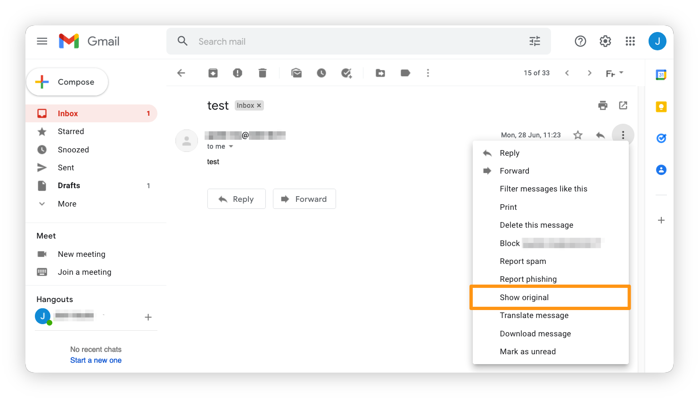{.thumbnail}

##### **Pobranie pliku .eml**

1. Wybierz wiadomość e-mail.
2. Kliknij 3 pionowe kropki po prawej stronie i wybierz `Pobierz wiadomość`{.action}.

#### Outlook.com

Aby pobrać nagłówek lub wyodrębnić plik `.eml` z interfejsu webmail &#60;Outlook.com&#62;, przejdź do sekcji [Outlook Web App](#owa) tego przewodnika.

## Sprawdź również

[FAQ e-mail](/pages/web_cloud/email_and_collaborative_solutions/mx_plan/faq-emails)

Dołącz do [grona naszych użytkowników](/links/community).
