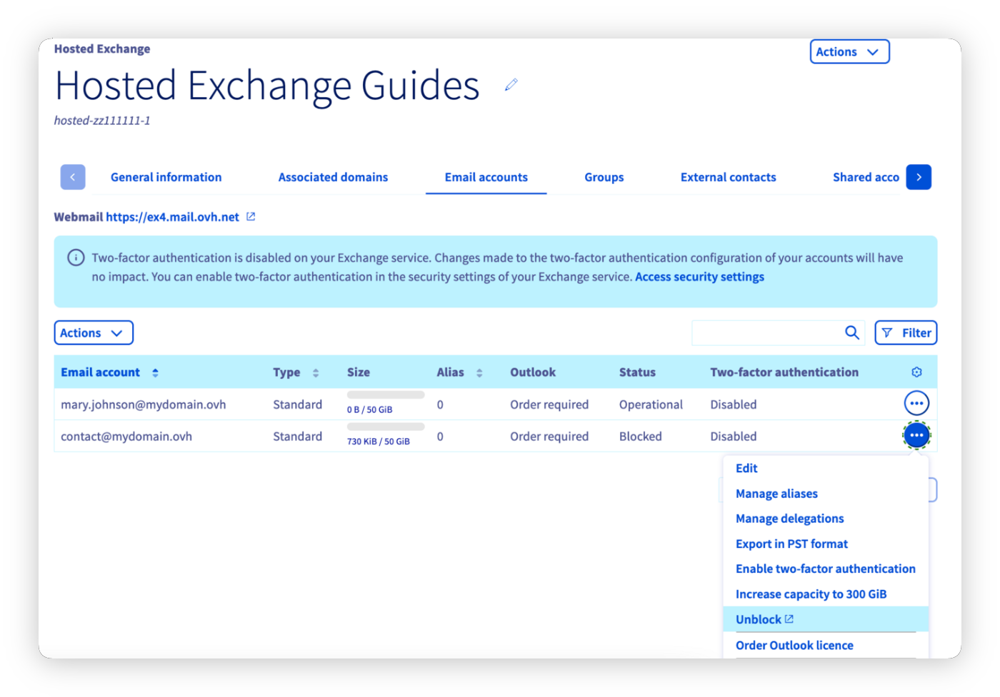
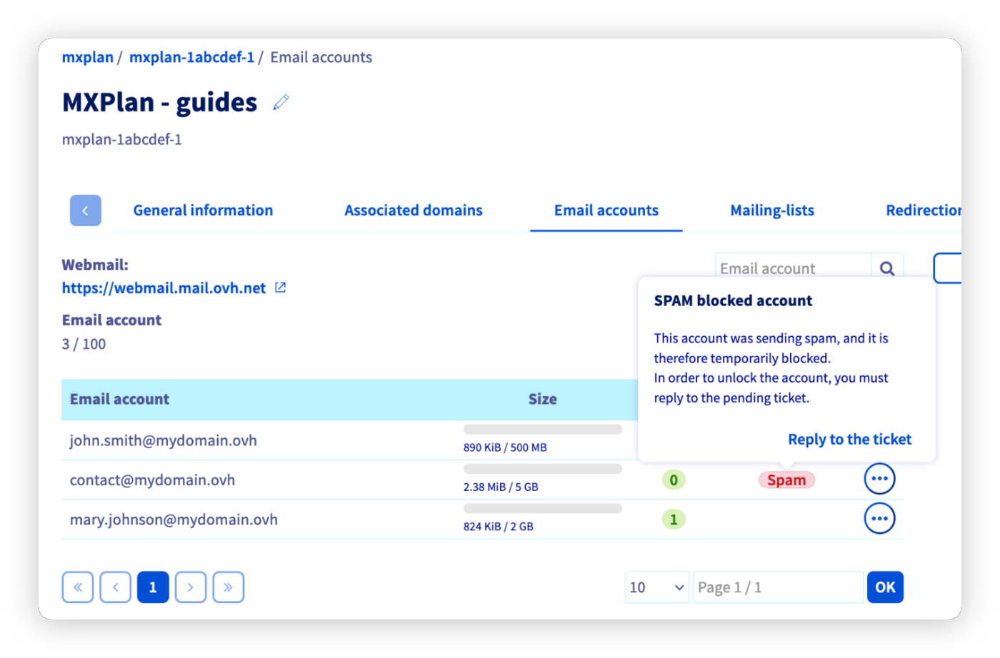
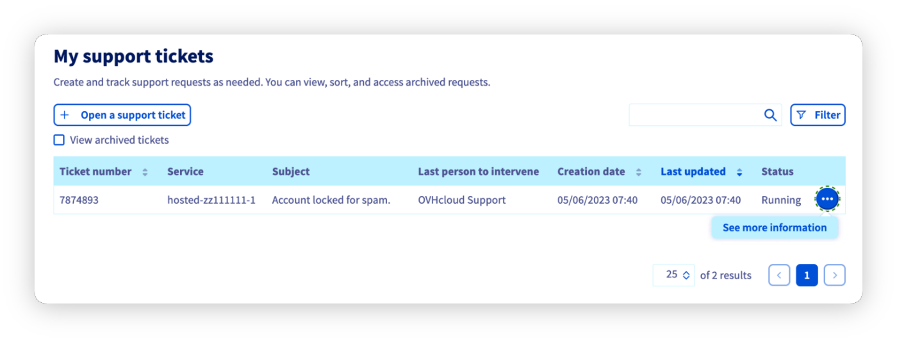

## Objective

When your email address is blocked for spam, it means that suspicious activity has been detected when sending emails from this address. In this situation, you can no longer send emails from this email address. You must then understand why suspicious activity was detected and take action to prevent this situation from recurring.

**Find out what to do when your address is blocked for spam.**

## Requirements

- An [OVHcloud email solution](/links/web/emails)

<!-- CP-NAV-START:web-mx-plan -->
<!-- CP-NAV-START:web-exchange -->
---

### OVHcloud Control Panel Access

**MX Plan:**

- **Direct link:** [MX Plan](/links/control-panel/web-mx-plan)
- **Navigation path:** `Web Cloud`{.action} > `MX Plan`{.action} > Select your MX Plan service

**Exchange:**

- **Direct link:** [Exchange](/links/control-panel/web-exchange)
- **Navigation path:** `Web Cloud`{.action} > `Exchange`{.action} > Select your platform

---
<!-- CP-NAV-END:web-exchange -->
<!-- CP-NAV-END:web-mx-plan -->

## Instructions 

### Step 1: Why is your email address blocked for spam? 

When suspicious activity is detected at the email sending level, the address concerned is automatically blocked. In this situation, you can no longer send emails from this email address.

> [!warning]
>
> "Suspicious activity" means that:
>
> - The anti-spam server, which scans emails when they are sent, has found that one or more elements of the email are considered suspicious and may constitute spam.
> - The sending frequency and the number of recipients are too high and contribute to considering the sending as spamming. Indeed, to carry out mass mailings, you need to use a mailing list service rather than a standard email address.
>
> The precise reasons for a block cannot be disclosed in order to prevent any attempt to bypass the spam detection system. To test the content of an email, you can use a tool external to OVHcloud such as [Mailtester](https://www.mail-tester.com/).
>

First of all, check with the user(s) of the blocked email address that they are not directly responsible for the block, following an unusual use of the email address (for example, mass email sending). If this is the case, you must rectify the situation before unblocking the address.

If the suspicious activity detected by the anti-spam system was not initiated by the legitimate user(s) of the email address, take the following measures:

- Run an antivirus scan on each device that uses the email address blocked for spam, and apply a fix if they are infected.

- Check all software using the credentials of the email address blocked for spam (e.g. fax machine, business software, email client).

- Check the redirections applied to the email address blocked for spam.

- Check the filters applied to the email address blocked for spam, via an email client or webmail.

- Check the auto-replies configured on the email address blocked for spam, via an email client or webmail.

### Step 2: Check the status of the email address and access the associated support ticket

Select the relevant email solution in the following tabs:

> [!tabs]
> **Exchange**
>>
>> Go to the `Email accounts`{.action} tab of your platform. If the "Status" column for the email address concerned shows "Blocked", click `...`{.action} to the right of the account, then `Unblock`{.action}. The email address is not unblocked automatically. Contact the support team via the support ticket by answering the 3 questions asked. 
>> Proceed to [step 3](#step3) of the guide.
>>
>> {.thumbnail}
>>
> **MX Plan**
>>
>> Go to the `Email accounts`{.action} tab of your platform. If the "Status" column to the right of the email address concerned shows "Spam", click on it, then `Reply to the ticket`{.action}. The email address is not unblocked automatically. Contact the support team via the support ticket by answering the 3 questions asked. 
>> Proceed to [step 3](#step3) of the guide.
>>
>> {.thumbnail}

### Step 3: Access the support ticket 

Following step 2, you will be redirected to the "My support requests" window. Click the `...`{.action} button to the right of the ticket with the subject "Account locked for spam.", then click `See more information`{.action}.

{.thumbnail}

Here you will find the email that was sent to you, which generated a support ticket.

The support ticket reads as follows:

>
> Dear Customer,
>
> Our system has detected that the address **address@example.com** hosted on our systems under the **service name** service is a source of spam.
> The sending of emails has been temporarily disabled.
>
> We have currently detected **X** suspicious message(s).
>
> To help us re-enable sending for the address: **address@example.com**,
> please reply to this email by answering the following questions:
>
> - Are you the sender of the email in question (see the header below)?
>
> - Do you have a redirection rule to another email address?
>
> - Have you responded to spam?
> 
> These answers will help us re-enable your account quickly.
>  
>  
> 

Following this message, a sample of headers from the sent emails has been provided to you.

These headers help determine the routing and origin of the sent emails.

> [!primary]
>
> Once your ticket has been processed by customer support and your email address has been unblocked, change the password of the email address, ensuring that it is sufficiently strong. You can use [CNIL's strong password generator](https://www.cnil.fr/fr/generer-un-mot-de-passe-solide). You can also refer to [CNIL's tips for a good password](https://www.cnil.fr/fr/les-conseils-de-la-cnil-pour-un-bon-mot-de-passe).

## Go further

For specialised services (SEO, development, etc.), contact [OVHcloud partners](/links/partner).

If you would like assistance using and configuring your OVHcloud solutions, please refer to our [support offers](/links/support).

Join our [community of users](/links/community).
