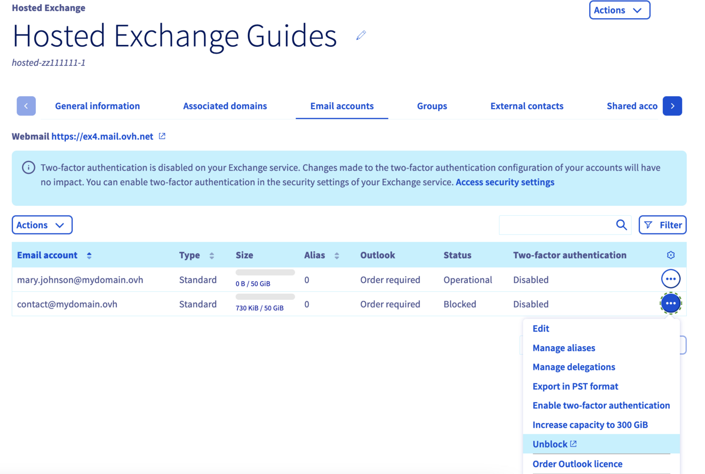
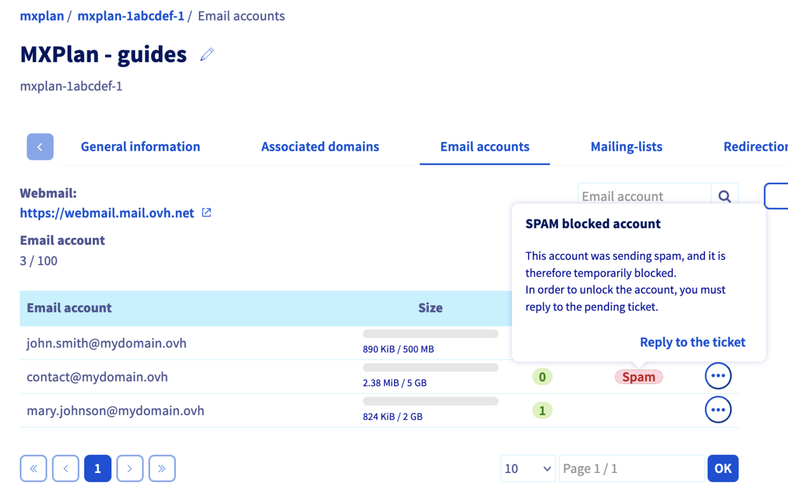

## Objectif

Lorsque votre adresse e-mail est bloquée pour SPAM, cela signifie qu'une activité suspecte a été détectée au niveau de l'envoi des e-mails depuis cette adresse. Dans cette situation, vous ne pouvez plus envoyer d'e-mail depuis cette adresse e-mail. Vous devez alors comprendre pourquoi une activité suspecte a été détectée et réaliser des actions afin d'éviter que cette situation ne se reproduise.

**Découvrez comment réagir lorsque votre adresse est bloquée pour SPAM.**

## Prérequis

## Prérequis

- Disposer d'une [offre e-mail OVHcloud](/links/web/emails).
- Être connecté à [l'espace client OVHcloud](/links/manager), partie `Web Cloud`{.action}.

## En pratique 

### Étape 1 : pourquoi votre adresse e-mail est bloquée pour SPAM ? 

Lorsqu'une activité suspecte est détectée au niveau de l'envoi des e-mails, l'adresse concernée est automatiquement bloquée. Dans cette situation, vous ne pouvez plus envoyer d'e-mails depuis cette adresse e-mail.

> [!warning]
>
> Une « activité suspecte » signifie que :
>
> - Le serveur anti-spam, qui scanne les e-mails à l'envoi, a constaté qu'un ou plusieurs éléments de l'e-mail sont considérés comme suspects et peuvent constituer un e-mail SPAM.
> - La fréquence d'envoi et le nombre de destinataires sont trop importants et contribuent à considérer l'envoi comme du spamming. En effet, pour réaliser des envois massifs, il est nécessaire d'utiliser un service de mailing list et non une adresse e-mail standard.
>
> Les raisons précises d'un blocage ne peuvent pas être divulguées pour éviter toute tentative de contournement du système de détection des SPAM. Pour tester le contenu d'un e-mail, vous pouvez utiliser un outil externe à OVHcloud tel que [Mailtester](https://www.mail-tester.com/).
>

Tout d'abord, assurez-vous, auprès du (des) utilisateur(s) de l'adresse e-mail bloquée, qu'il(s) n'est (ne sont) pas directement à l'origine du blocage, suite à une utilisation inhabituelle de l'adresse e-mail (par exemple, suite à la réalisation d'envois massifs d'e-mails). Si c'est le cas, vous devez corriger la situation avant de débloquer l'adresse.

Si l'activité suspecte détectée par l'anti-spam n'a pas été initiée par le (les) utilisateur(s) légitime(s) de l'adresse e-mail, prenez les mesures nécessaires et détaillées ci-dessous :

- Effectuez une analyse antivirus de chacun des postes utilisant l'adresse e-mail bloquée pour SPAM et appliquez un correctif si ces derniers sont infectés.

- Vérifiez tous les logiciels utilisant les identifiants de l'adresse e-mail bloquée pour SPAM (par exemple : télécopieur, logiciel métier, logiciel de messagerie).

### Étape 2 : vérifier le statut de l'adresse e-mail et accéder au ticket d'assistance associé

Sélectionnez l'offre e-mail concernée dans les onglets suivants:

> [!tabs]
> **Exchange**
>>
>> Connectez-vous à votre [espace client OVHcloud](/links/manager) et dirigez-vous dans la section `Web Cloud`{.action}. Cliquez sur `Microsoft`{.action} puis sur `Exchange`{.action} et sélectionnez la plateforme Exchange concernée.
>> 
>> Dirigez-vous vers l'onglet `Comptes e-mail`{.action} de votre plateforme. Si la colonne « statut » de l'adresse e-mail concernée mentionne « bloqué », cliquez sur `...`{.action} à droite du compte puis sur `Débloquer`{.action}. Le déblocage de l'adresse e-mail ne se fait pas automatiquement. Il est nécessaire de contacter le support, sur le ticket d'assistance, en répondant aux 3 questions posées. 
>> Passez à [l'étape 3](#step3) du guide.
>> 
>> {.thumbnail}
>>
> **MX plan**
>>
>> Connectez-vous à votre [espace client OVHcloud](/links/manager) et dirigez-vous dans la section `Web Cloud`{.action}. Cliquez sur `Emails`{.action}, puis sélectionnez le nom de domaine concerné.
>>
>> Dirigez-vous vers l'onglet `Comptes e-mail`{.action} de votre plateforme. Si la colonne « statut » à droite de l'adresse e-mail concernée mentionne « Spam », cliquez sur cette mention puis sur `Répondre au ticket`{.action}. Le déblocage de l'adresse e-mail ne se fait pas automatiquement. Il est nécessaire de contacter le support, sur le ticket d'assistance, en répondant aux 3 questions posées. 
>> Passez à [l'étape 3](#step3) du guide.
>>
>> {.thumbnail}

### Étape 3 : accéder au ticket d'assistance 

Suite à l'étape 2, vous serez alors redirigé vers la fenêtre « Mes demandes d'assistance ». Cliquez sur le bouton `...`{.action} à droite du ticket mentionnant l'objet « Account locked for spam.» puis cliquez sur `Voir le détail`{.action}.

{.thumbnail}

Vous retrouverez ainsi l'e-mail qui vous a été transmis, celui-ci génère un ticket d'assistance auprès du support.

Le ticket d'assistance qui a été créé se présente comme ci-dessous :

> 
> Cher Client,
>
> Notre système a détecté que l'adresse **youraddress@example.com** hébergée sur nos systèmes sous le service **servicename** est source d'envoi de courriers indésirables (spams).
> L'envoi d'e-mail a donc été temporairement désactivé.
>
> Nous avons actuellement détecté **X** message(s) suspect(s).
>
> Afin de nous aider à réactiver l'envoi d'e-mail pour l'adresse : **address@example.com**,
> répondez à cet e-mail en complétant les questions suivantes :
>
> - Êtes-vous l'émetteur de l'e-mail en question (voir l'entête ci-dessous) ?
>
> - Avez-vous une règle de redirection vers une autre adresse e-mail ?
>
> - Avez-vous répondu à un Spam ?
> 
> Ces réponses nous aideront à réactiver votre compte rapidement.
>  
>  
> 

Dans la continuité de ce message, un échantillon d'en-têtes des e-mails envoyés vous a été transmis.

Ces en-têtes permettent de déterminer le cheminement et l'origine des e-mails envoyés.

> [!primary]
>
> Une fois que votre ticket a été traité par le support client et que votre adresse e-mail a été débloquée, modifiez le mot de passe de l'adresse e-mail, en veillant à ce qu'il soit suffisamment fort. Vous pouvez utiliser [l'outil de création de mot de passe solide](https://www.cnil.fr/fr/generer-un-mot-de-passe-solide) de la CNIL.

## Aller plus loin

Pour des prestations spécialisées (référencement, développement, etc), contactez les [partenaires OVHcloud](https://partner.ovhcloud.com/fr-ca/directory/).

Si vous souhaitez bénéficier d'une assistance à l'usage et à la configuration de vos solutions OVHcloud, nous vous proposons de consulter nos différentes [offres de support](/links/support).

Échangez avec notre communauté d'utilisateurs sur <https://community.ovh.com>.
