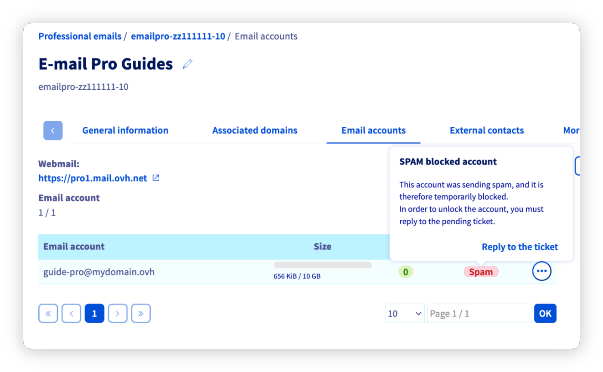
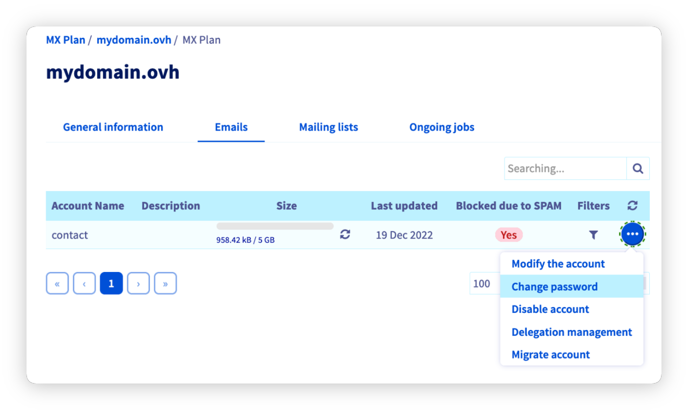

## Obiettivo

Quando il tuo indirizzo e-mail è bloccato per spam, significa che è stata rilevata un'attività sospetta durante l'invio di e-mail da questo indirizzo. In questa situazione, non puoi più inviare e-mail da questo indirizzo e-mail. È quindi necessario capire perché è stata rilevata un'attività sospetta e agire per evitare che questa situazione si ripeta.

**Scopri come procedere quando il tuo indirizzo è bloccato per spam.**

## Prerequisiti

- Disporre di una [soluzione e-mail OVHcloud](/links/web/emails).

<!-- CP-NAV-START:web-mx-plan -->
<!-- CP-NAV-START:web-email-pro -->
<!-- CP-NAV-START:web-exchange -->
---

### Accesso allo Spazio Cliente OVHcloud

**MX Plan:**

- **Link diretto:** [MX Plan](/links/control-panel/web-mx-plan)
- **Percorso di navigazione:** `Web Cloud`{.action} > `MX Plan`{.action} > Seleziona il tuo servizio MX Plan

**Email Pro:**

- **Link diretto:** [Email Pro](/links/control-panel/web-email-pro)
- **Percorso di navigazione:** `Web Cloud`{.action} > `Email Pro`{.action} > Seleziona la tua piattaforma

**Exchange:**

- **Link diretto:** [Exchange](/links/control-panel/web-exchange)
- **Percorso di navigazione:** `Web Cloud`{.action} > `Exchange`{.action} > Seleziona la tua piattaforma

---
<!-- CP-NAV-END:web-exchange -->
<!-- CP-NAV-END:web-email-pro -->
<!-- CP-NAV-END:web-mx-plan -->

## Procedura 

Prima di proseguire, se il blocco riguarda un indirizzo e-mail di tipo MX Plan, identifica la tecnologia e-mail utilizzata dalla tua offerta per seguire il corretto processo di sblocco.

> [!primary]
>
> **Identificare la tecnologia e-mail della tua offerta MX Plan.**
>
> In base alla data di attivazione della tua offerta MX Plan o a una migrazione recente, la tecnologia e-mail associata può essere diversa. Questa versione è caratterizzata dall'interfaccia della sua webmail. Per identificarla:
>
> - Dalla scheda `Informazioni generali`{.action}, individua la tecnologia utilizzata sotto la voce **Webmail** presente nel riquadro `Abbonamento`{.action}.
>
> {.thumbnail .w-500}
>
> - Se la tecnologia mostrata è **RoundCube**, segui le istruzioni della scheda **MX Plan - RoundCube**.
> - Se la tecnologia mostrata è **OWA** o **Zimbra**, segui le istruzioni della scheda **MX Plan - OWA / Zimbra**.

### Step 1: perché il tuo indirizzo e-mail è bloccato per spam? 

Quando viene rilevata un'attività sospetta a livello di invio delle e-mail, l'indirizzo interessato viene automaticamente bloccato. In questa situazione, non è possibile inviare e-mail da questo indirizzo e-mail.

> [!warning]
>
> Un'"attività sospetta" significa che:
>
> - Il server anti-spam, che analizza le e-mail al momento dell'invio, ha rilevato che uno o più elementi dell'e-mail sono considerati sospetti e possono costituire un'e-mail spam.
> - La frequenza di invio e il numero di destinatari sono troppo elevati e contribuiscono a far considerare l'invio come spamming. Per effettuare invii massivi, è infatti necessario utilizzare un servizio di mailing list e non un indirizzo e-mail standard.
>
> I motivi precisi di un blocco non possono essere divulgati per evitare qualsiasi tentativo di elusione del sistema di rilevamento dello spam. Per testare il contenuto di un'e-mail, puoi utilizzare uno strumento esterno a OVHcloud come [Mailtester](https://www.mail-tester.com/).
>

Per prima cosa, assicurati presso gli utenti dell'indirizzo e-mail bloccato che non siano direttamente all'origine del blocco, a causa di un utilizzo insolito dell'indirizzo e-mail (ad esempio, in seguito a invii massivi di e-mail). In tal caso, è necessario correggere la situazione prima di sbloccare l'indirizzo.

Se l'attività sospetta rilevata dall'anti-spam non è stata avviata dagli utenti legittimi dell'indirizzo e-mail, adotta le seguenti misure:

- Effettua un'analisi antivirus di ciascun dispositivo che utilizza l'indirizzo e-mail bloccato per spam e applica una correzione se risultano infetti.

- Verifica tutti i software che utilizzano le credenziali dell'indirizzo e-mail bloccato per spam (ad esempio: fax, software gestionale, client di posta).

- Verifica i reindirizzamenti applicati all'indirizzo e-mail bloccato per spam.

- Verifica i filtri applicati all'indirizzo e-mail bloccato per spam, tramite un client di posta o la webmail.

- Verifica le risposte automatiche configurate sull'indirizzo e-mail bloccato per spam, tramite un client di posta o la webmail.

### Step 2: verifica lo stato dell'indirizzo e-mail e accedi al ticket di assistenza associato

Seleziona il servizio e-mail interessato nelle schede seguenti:

> [!tabs]
> **Exchange**
>>
>> Accedi alla scheda `Account email`{.action} della tua piattaforma. Se la colonna "stato" dell'indirizzo e-mail interessato indica "bloccato", clicca sui `...`{.action} a destra dell'account e poi su `Sblocca`{.action}. Lo sblocco dell'indirizzo e-mail non avviene automaticamente. Contatta il supporto tramite il ticket di assistenza rispondendo alle 3 domande poste. 
>> Passa allo [step 3](#step3) della guida.
>>
>> {.thumbnail}
>>
> **Email Pro**
>>
>> Accedi alla scheda `Account email`{.action} della tua piattaforma. Se la colonna "stato" a destra dell'indirizzo e-mail interessato indica "Spam", clicca su questa voce e poi su `Rispondi al ticket`{.action}. Lo sblocco dell'indirizzo e-mail non avviene automaticamente. Contatta il supporto tramite il ticket di assistenza rispondendo alle 3 domande poste. 
>> Passa allo [step 3](#step3) della guida.
>>
>> {.thumbnail}
>>
> **MX Plan - OWA / Zimbra**
>>
>> Accedi alla scheda `Account email`{.action} della tua piattaforma. Se la colonna "stato" a destra dell'indirizzo e-mail interessato indica "Spam", clicca su questa voce e poi su `Rispondi al ticket`{.action}. Lo sblocco dell'indirizzo e-mail non avviene automaticamente. Contatta il supporto tramite il ticket di assistenza rispondendo alle 3 domande poste. 
>> Passa allo [step 3](#step3) della guida.
>>
>> {.thumbnail}
>>
> **MX Plan - RoundCube**
>>
>> Se il blocco riguarda un indirizzo e-mail MX Plan con la webmail **RoundCube**, non è presente alcun ticket di assistenza. Assicurati di consultare lo [step 1](#step1) di questa guida prima di seguire le istruzioni seguenti.
>>
>> Accedi alla scheda `Email`{.action} della tua piattaforma. Se la colonna "Bloccato per SPAM" indica "Sì", clicca su questa voce e poi su `Modifica la password`{.action}. Il tuo indirizzo e-mail è ora sbloccato, non è necessario seguire lo [step 3](#step3).
>>
>> {.thumbnail}
>>
>> > [!warning]
>> >
>> > In rari casi, la colonna "Bloccato per SPAM" può indicare "No" nonostante il blocco dell'indirizzo e-mail. Se hai fatto il necessario per mettere in sicurezza l'indirizzo e-mail, la soluzione resta la stessa indicata sopra.

### Step 3: accedi al ticket di assistenza 

In seguito allo step 2, verrai reindirizzato verso la finestra "Le mie richieste di assistenza". Clicca sul pulsante `...`{.action} a destra del ticket con oggetto "Account locked for spam.", poi clicca su `Mostra dettagli`{.action}.

{.thumbnail}

Troverai così l'e-mail che ti è stata inviata, la quale genera un ticket di assistenza presso il supporto.

Il ticket di assistenza si presenta nel modo seguente:

>
> Gentile Cliente,
>
> Il nostro sistema ha rilevato che l’indirizzo **youraddress@domain.com** ospitato sui nostri sistemi sotto il servizio **servicename** è fonte di invio di messaggi indesiderati (spam).
> Pertanto, l’invio di email è stato temporaneamente disattivato.
>
> Abbiamo rilevato **X** messaggio/i sospetto/i.
>
> Per consentirci di riattivare l’invio di email per l’indirizzo: **address@domain.com**,
> rispondi a questa email fornendo le seguenti informazioni:
>
> - Sei tu il mittente dell’email in questione (vedi l’intestazione qui di seguito)?
>
> - Disponi di una regola di reindirizzamento verso un altro indirizzo email?
>
> - Hai risposto a un messaggio Spam?
>
> Queste risposte ci consentiranno di riattivare rapidamente il tuo account.
>  
>  
>

A completamento di questo messaggio, ti è stato trasmesso un campione di intestazioni delle e-mail inviate.

Queste intestazioni permettono di determinare il percorso e l'origine delle e-mail inviate.

> [!primary]
>
> Una volta che il tuo ticket è stato trattato dal supporto clienti e il tuo indirizzo e-mail è stato sbloccato, modifica la password dell'indirizzo e-mail, assicurandoti che sia sufficientemente robusta. Puoi utilizzare lo [strumento di creazione di password sicure](https://www.cnil.fr/fr/generer-un-mot-de-passe-solide) della CNIL. Puoi anche consultare [I consigli della CNIL per una buona password](https://www.cnil.fr/fr/les-conseils-de-la-cnil-pour-un-bon-mot-de-passe).

## Per saperne di più

Per prestazioni specializzate (referenziamento, sviluppo, ecc.), contatta i [partner OVHcloud](/links/partner).

Per usufruire di un supporto per l'utilizzo e la configurazione delle soluzioni OVHcloud, consulta le nostre [offerte di supporto](/links/support).

Contatta la nostra [Community di utenti](/links/community).
