## Objective

With OVHcloud email solutions, you can send and receive your emails from a device and client of your choice. OVHcloud provides an online email service called Outlook Web App (OWA) that lets you access an account from anywhere via a web browser. All active email accounts on MX Plan share a single point of access to their respective OWA interface: our [webmail login page](/links/web/email).

**Find out how to perform common actions with your email address from the OWA interface.**

## Requirements

- An OVHcloud email solution already set up:
    - [**MX Plan**](/links/web/hosting), available with our Web Hosting plans or ordered as a standalone solution.
- The login credentials for the email address you want to use.

## Instructions

This guide will help you better understand the usual tasks available in an email account using OWA. However, since this interface was not originally created by OVHcloud, we are unable to provide specific instructions for any settings not covered in this guide.

> [!primary]
>
> After logging in and getting familiar with the interface, you do not need to follow the instructions in the order given.

### Logging in to OWA

To log in to OWA with your email address, open the [webmail login page](/links/web/email). Enter your full email address and password. Then click `Sign in`{.action}.

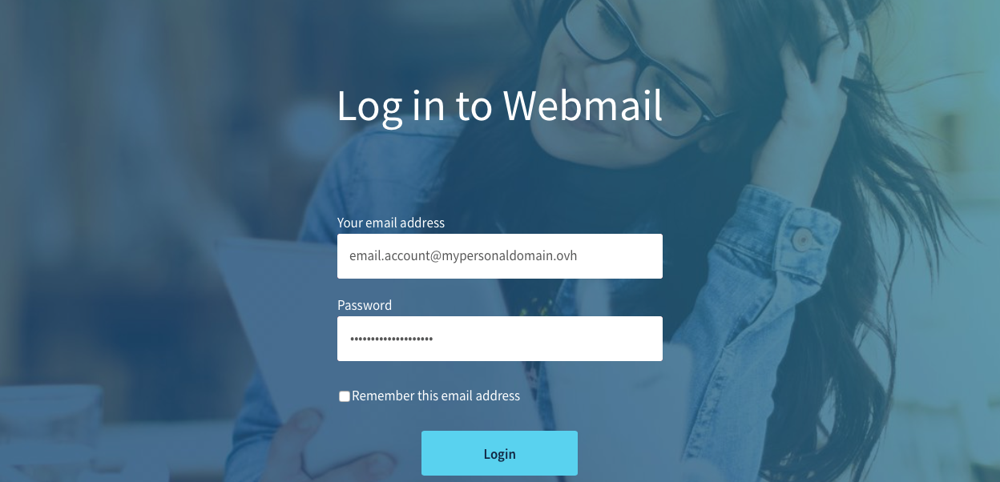{.thumbnail}

If this is your first time logging in to OWA with this email address, you will be prompted to set the interface language and time zone. Then click `Save`{.action} to continue.

> [!primary]
>
> Time zones are listed according to [the UTC (Coordinated Universal Time) standard](https://en.wikipedia.org/wiki/Coordinated_Universal_Time#/media/File:World_Time_Zones_Map.png), not in alphabetical order of cities.
>
> **Example**: For Western Europe, this is UTC +1 (Brussels, Copenhagen, Madrid, Paris).

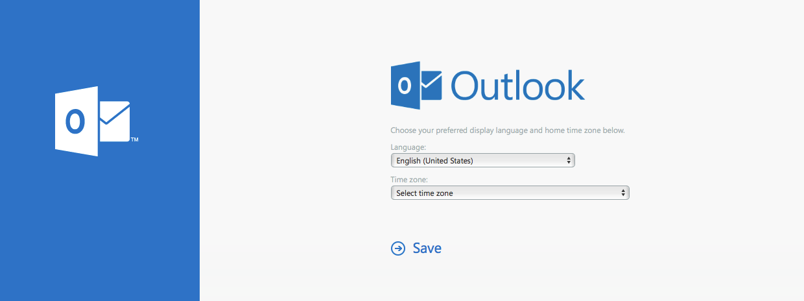{.thumbnail}

From now on, your inbox will appear by default as soon as you log in.

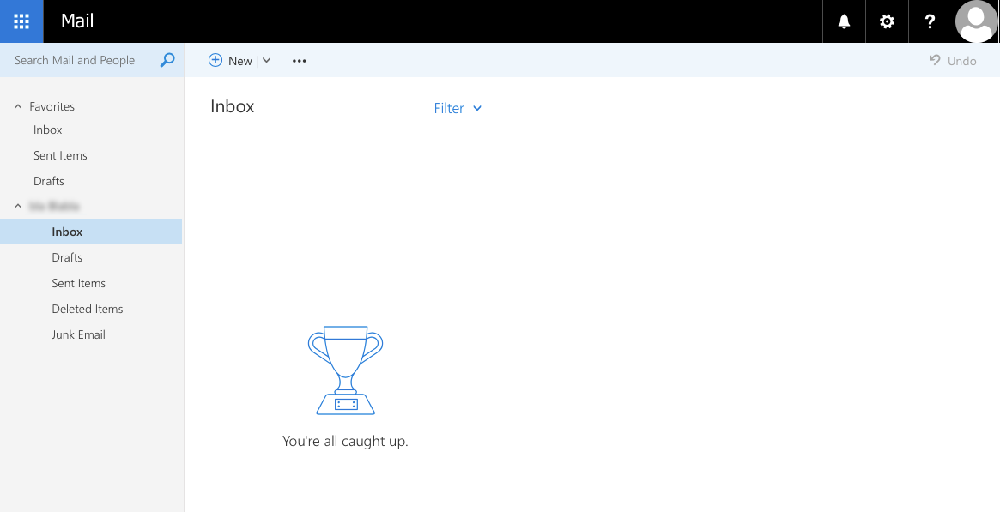{.thumbnail}

### Understanding the OWA display

The OWA interface contains several sections. Refer to the table and image below to familiarise yourself with it.

|Parts|Description|  
|---|---|  
|Top section (1)|Contains two tab bars: the first one provides access to general settings (such as the [Options section](./#accessing-the-options-section)). The second bar can be used for specific actions with your address (such as sending or replying to emails).|  
|Left-hand side (2)|Displays the list of folders for your email address. These folders appear as a tree-view that you can expand or collapse.|
|Central segment (3)|Displays the list of messages (read and unread) from the folder selected in the left-hand menu. This section can also display search results.|
|Right-hand side (4)|Displays the reading pane when an email has been selected.|

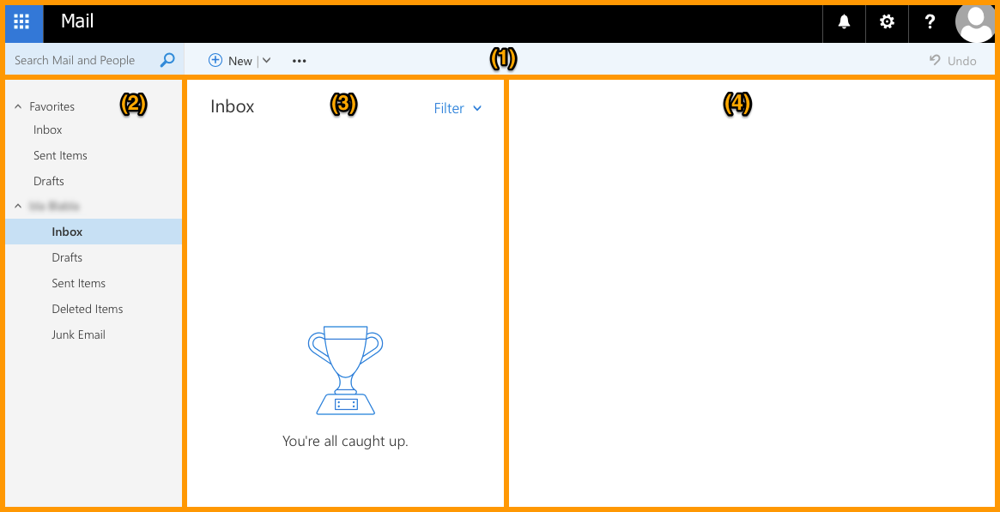{.thumbnail}

Note that you can change the size of the vertical sections by clicking and dragging their border lines.

### Viewing emails

To view your emails, select a folder on the left-hand side. Incoming emails that are not processed by inbox rules will appear in the "Inbox" folder. To check whether you have received any new emails, see if a number appears next to the corresponding folder.

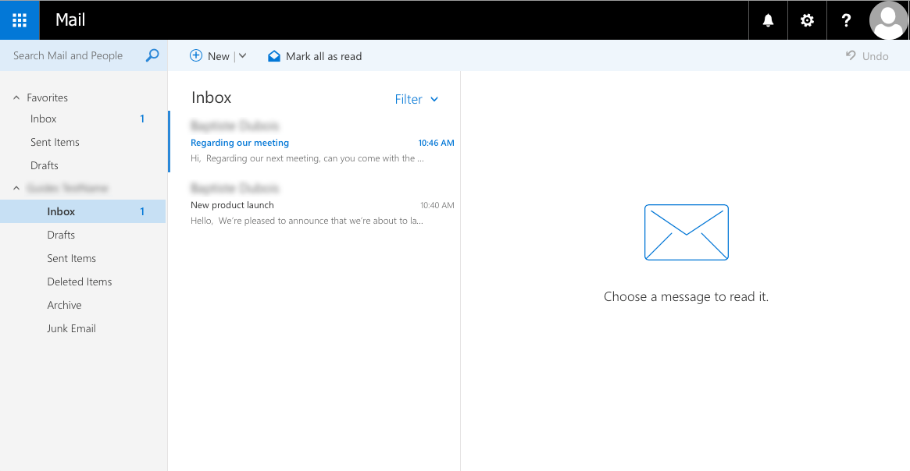{.thumbnail}

To read an email, select its folder if necessary. Then click on the email to display its content in the reading pane. Unread messages appear in bold to distinguish them from read messages.

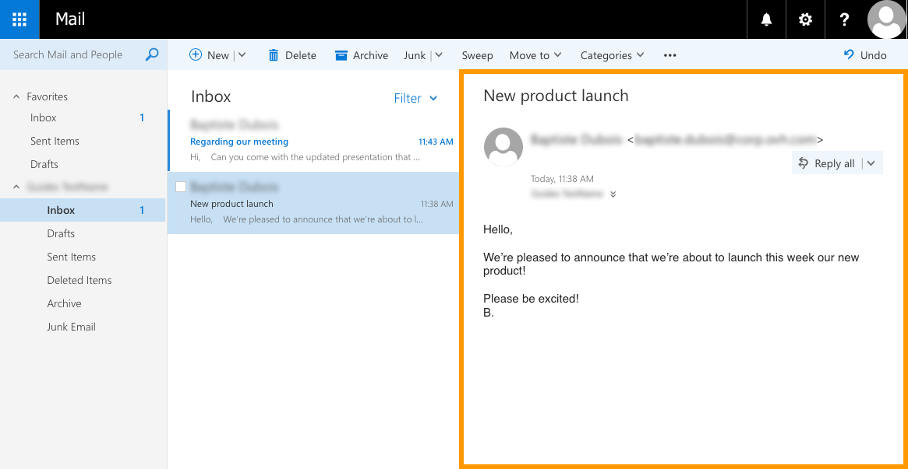{.thumbnail}

### Sorting and filtering emails

At the top right of the message list, the `Filter`{.action} button opens a menu that gathers all display options for the selected folder.

- **Filter by category**: select an entry to display only a selection of emails among `All`{.action}, `Unread`{.action}, `To me`{.action} (emails addressed directly to your address), `Flagged`{.action} (emails marked for follow-up) or `Mentions`{.action} (emails in which your address is mentioned).

- **Sort by**: hover over the `Sort by`{.action} entry to choose the sort criterion for emails: **Date**, **From**, **To**, **Subject**, **Attachments**, **Importance** or **Size**. The arrow to the left of the criterion indicates the current order; click the same criterion again to reverse it.

- **Show as**: hover over the `Show as`{.action} entry to switch between the **Messages** view (one email per line) and the **Conversations** view (emails grouped by discussion thread).

### Sending and replying

To **send a new message**, click the `New`{.action} icon at the top of the OWA interface. The editing pane will appear on the right-hand side. Fill in the fields of your email (recipients, subject, message body, attachments). Click `Send`{.action} once your email is ready.

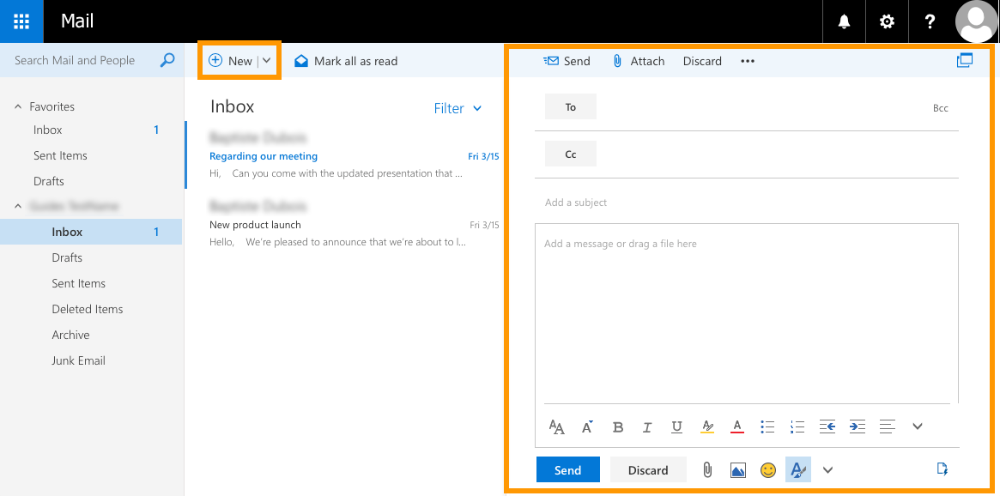{.thumbnail}

To **reply to a message**, first click on it to display it. Then click `Reply all`{.action} to reply to all recipients. Use the down-arrow button if you only want to reply to the sender of the email (excluding any recipient in copy), then click `Reply`{.action}.

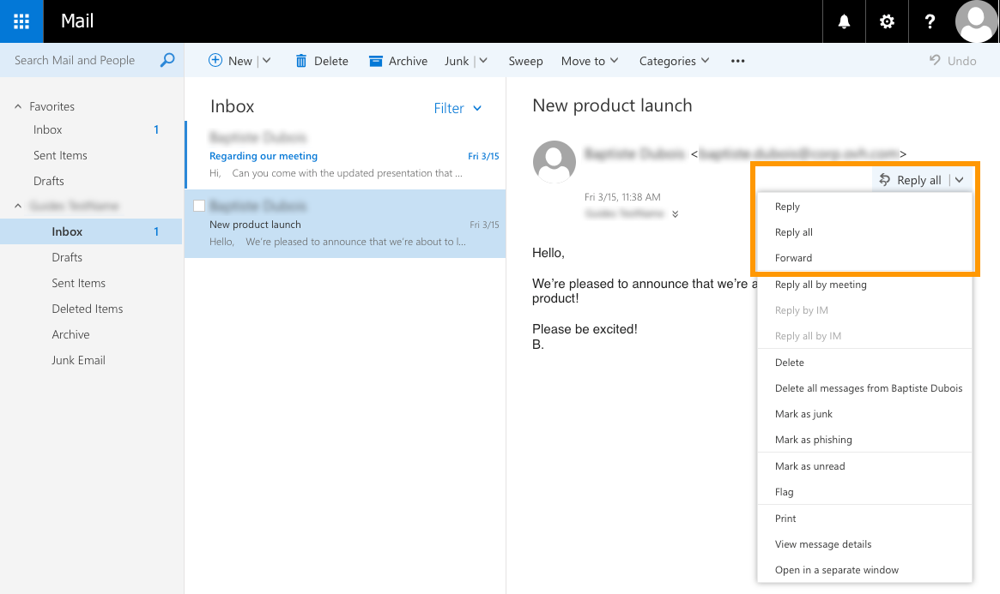{.thumbnail}

When you choose to reply, the quick-reply editor will appear above the email. Type your reply there, and once you are ready to send your message, click `Send`{.action}. Note that for each reply option (such as adding a signature), you must first expand it to the full editing pane by clicking the double-arrow symbol.

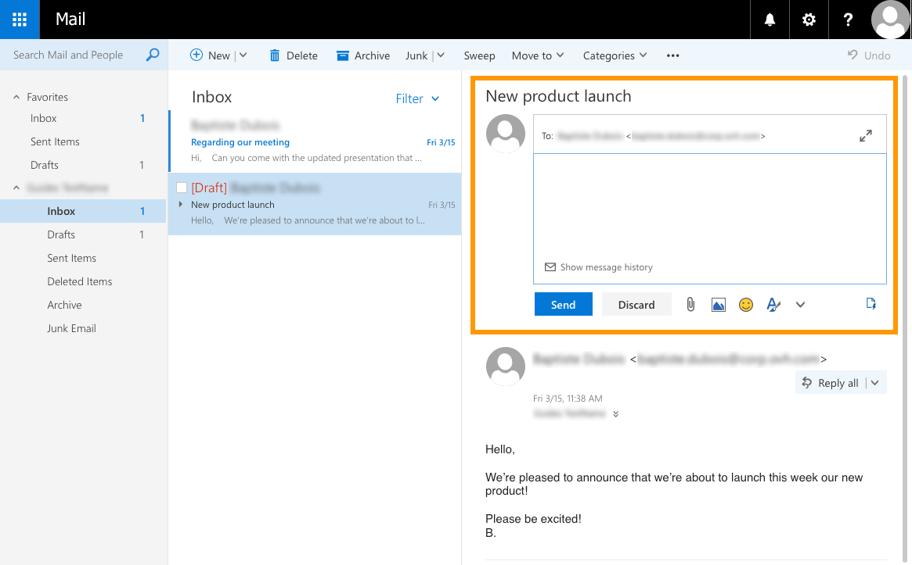{.thumbnail}

### Organising your inbox

OWA offers several ways to organise your inbox. You can:

- [create folders and subfolders](./#creating-a-folder),
- [move emails](./#moving-emails),
- [set rules](./#creating-inbox-rules) to automatically perform actions when a new email is received,
- [block a sender](./#blocking-a-sender) to stop receiving their messages.

#### Creating a folder

To create a new folder, right-click the name of your email address in the folder tree, then choose `Create new folder`{.action}. You can create a subfolder in existing folders in the same way by clicking `Create new subfolder`{.action}.

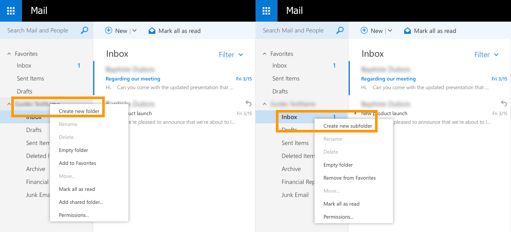{.thumbnail}

#### Moving emails

To **move an email**, you can simply drag-and-drop it into the target folder, or right-click it and select `Move`{.action}.
To **move multiple emails** at once, select them all using their tick boxes. Then click `Move`{.action} (on the right-hand side) or `Move to`{.action} (in the top section). Then choose the destination folder.

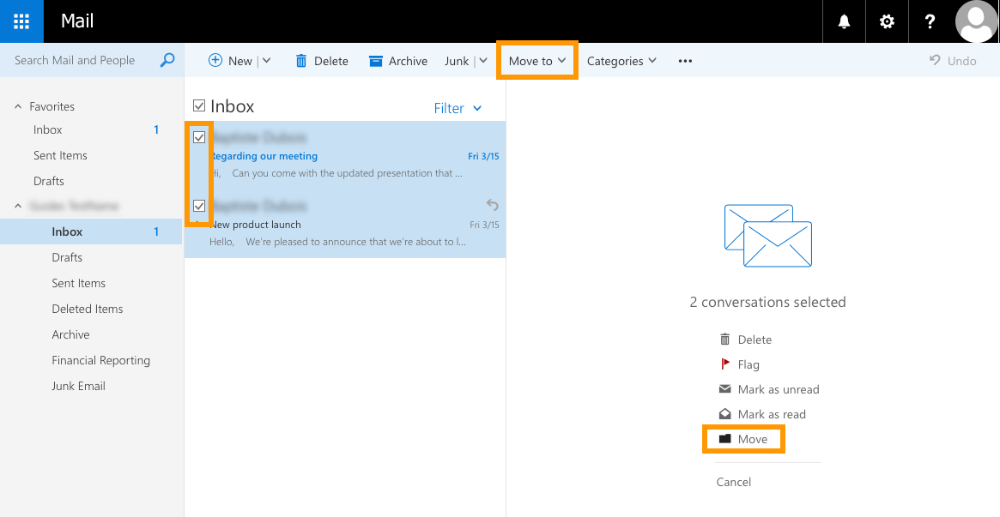{.thumbnail}

#### Creating inbox rules

<iframe class="video" width="560" height="315" src="https://www.youtube-nocookie.com/embed/z1D2wc7XWX4?start=48" title="YouTube video player" frameborder="0" allow="accelerometer; autoplay; clipboard-write; encrypted-media; gyroscope; picture-in-picture" allowfullscreen></iframe>

To create and manage rules, first click the gear icon at the top, then click `Options`{.action}.

{.thumbnail}

On the new page that opens, click `Inbox and sweep rules`{.action} in the left-hand menu. In the "Options" tree-view, you can find this feature under "Mail", in "Automatic processing". Here you can create, edit and move rules in the list.

To add a new rule, click the `+`{.action} button.

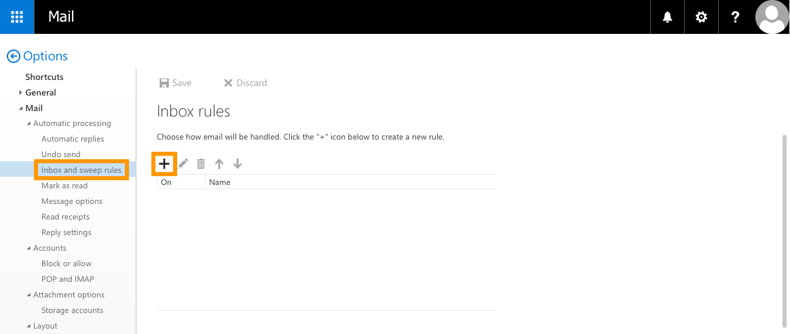{.thumbnail}

Fill in the requested information depending on the task you want this rule to perform. Then click `OK`{.action}.

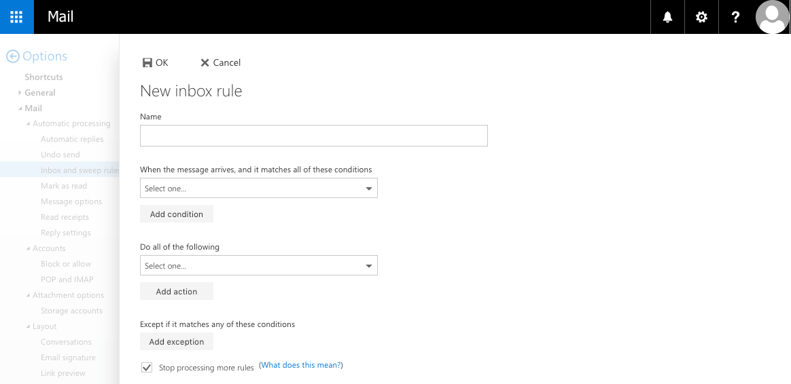{.thumbnail}

For more detailed instructions on creating inbox rules, please refer to our guide: [Creating inbox rules in OWA](/pages/web_cloud/email_and_collaborative_solutions/using_the_outlook_web_app_webmail/creating-inbox-rules-in-owa-mx-plan).

#### Blocking a sender

<iframe class="video" width="560" height="315" src="https://www.youtube-nocookie.com/embed/Ivad4FgJ2No" title="YouTube video player" frameborder="0" allow="accelerometer; autoplay; clipboard-write; encrypted-media; gyroscope; picture-in-picture" allowfullscreen></iframe>

Click the gear icon at the top right, then click `Options`{.action}. Still in the left-hand column, browse the "Mail" tree under "Accounts", then "Block or allow".

In the "**Blocked Senders**" section, type an email address or domain name to block, then click the `+`{.action} button to add it to the list.

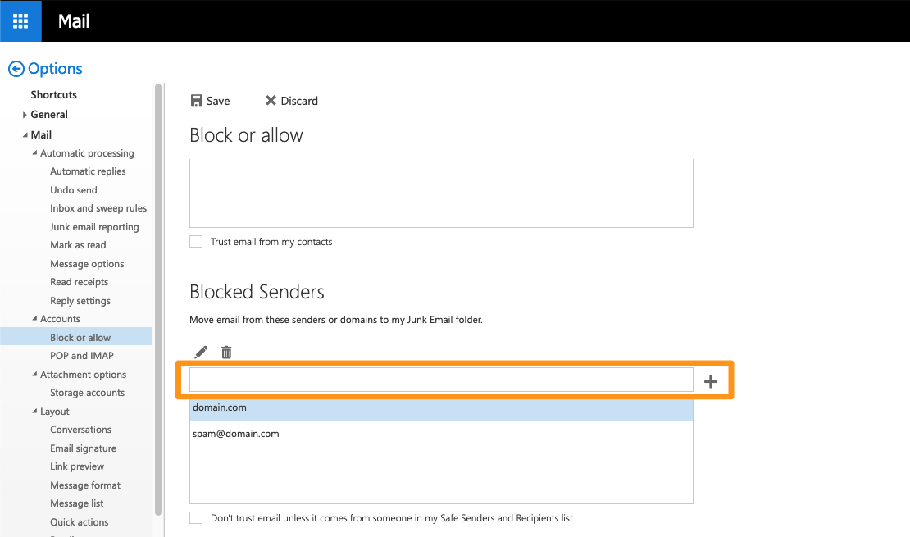{.thumbnail}

### Managing your contacts

To manage your contacts, first click the blue app launcher button at the top left of the page (which also gives access to calendar, tasks and other modules), then click `People`{.action}.

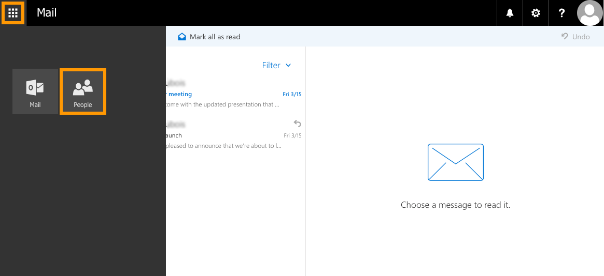{.thumbnail}

On the new page, you can add a new contact, create a contact list and remove existing contacts.

#### Adding a contact

Click `New`{.action}, then enter the details of the contact you want to add. Once done, click `Save`{.action}.

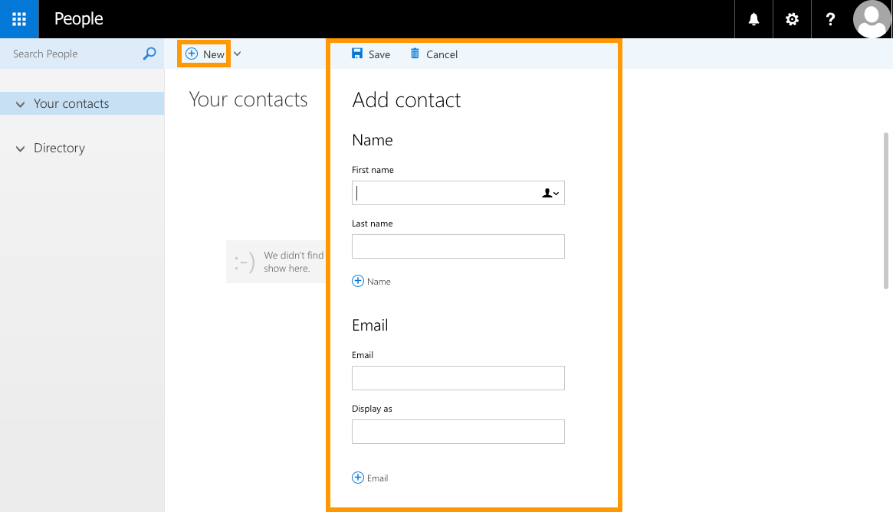{.thumbnail}

#### Creating a contact list

Click the down arrow next to `New`{.action}, then click `Contact list`{.action}. Give it a name, add contacts to it, then click `Save`{.action}.

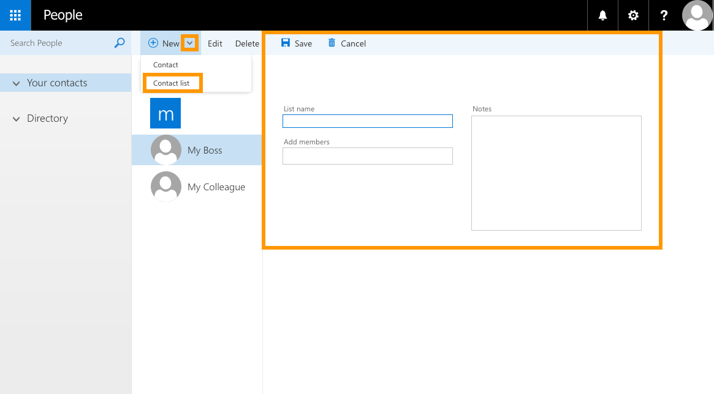{.thumbnail}

### Changing your password

<iframe class="video" width="560" height="315" src="https://www.youtube-nocookie.com/embed/z1D2wc7XWX4" title="YouTube video player" frameborder="0" allow="accelerometer; autoplay; clipboard-write; encrypted-media; gyroscope; picture-in-picture" allowfullscreen></iframe>

You can change your account password while logged in to OWA. To do so, click the gear icon at the top, then click `Options`{.action}.

{.thumbnail}

On the new page, expand the "General" tab in the left-hand tree, then click `My account`{.action}. Finally, click `Change your password`{.action}.

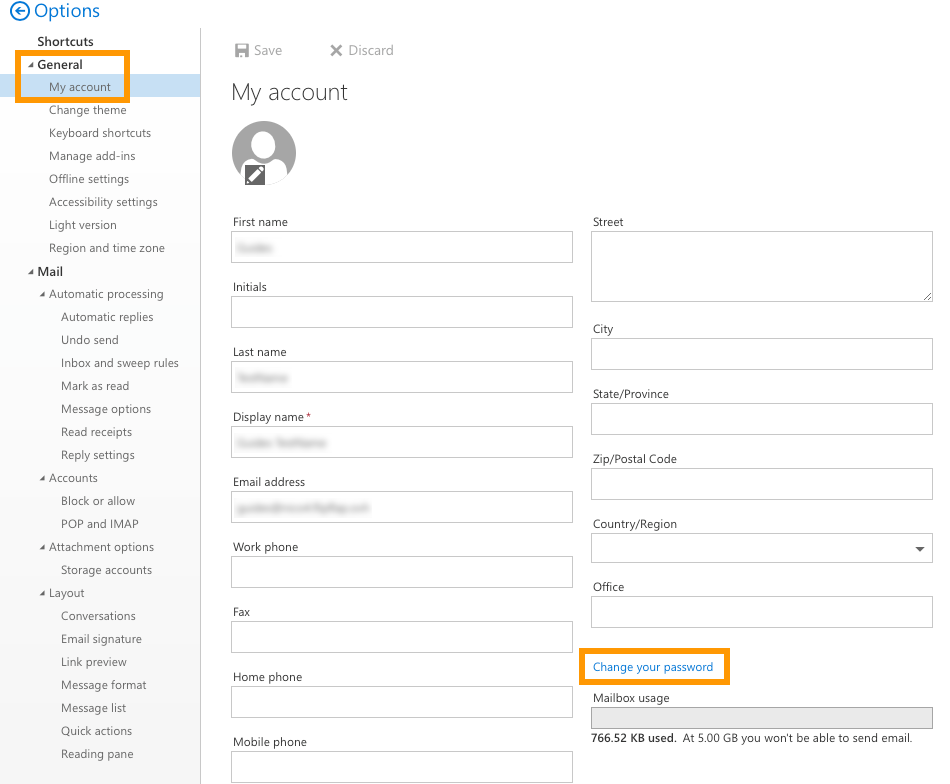{.thumbnail}

In the new window that opens, enter your current password. Then enter a new password and confirm it by typing it again. Click `Save`{.action} to save the new password.

> [!primary]
>
> Remember to enter your new password on all devices used to access this account (for example in your email client software). If you have any difficulties with your password, contact your service administrator.

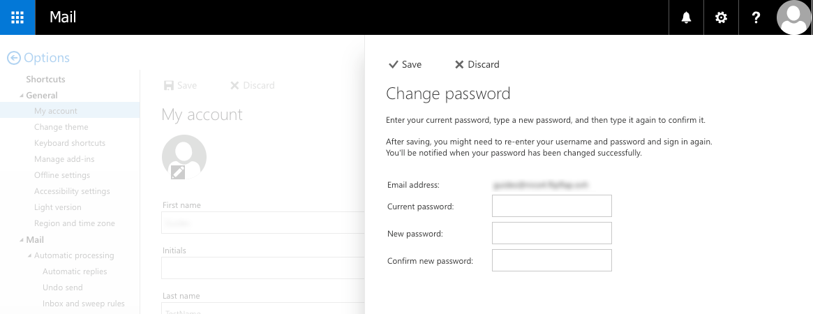{.thumbnail}

### Adding an automatic reply

In OWA, you can create an automatic reply on your inbox so that emails are not left unanswered while you are away. To do so, click the gear icon at the top, then click `Automatic replies`{.action}.

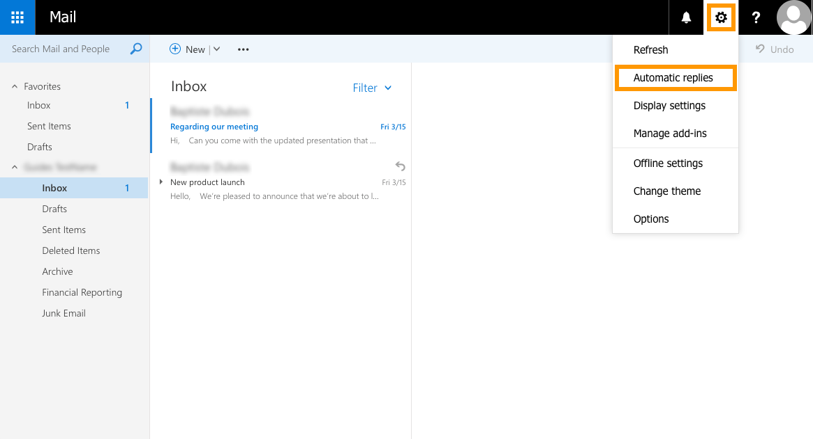{.thumbnail}

In the window that opens, select the "Send automatic replies" option. You can then configure the auto-responder to match several criteria, such as:

- send automatic reply emails for a fixed time interval, or continuously until manually disabled
- define which senders will receive automatic reply emails (internal senders only, or include external senders)

Fill in the requested information depending on the task you want to perform with this rule. Once done, click `OK`{.action}.

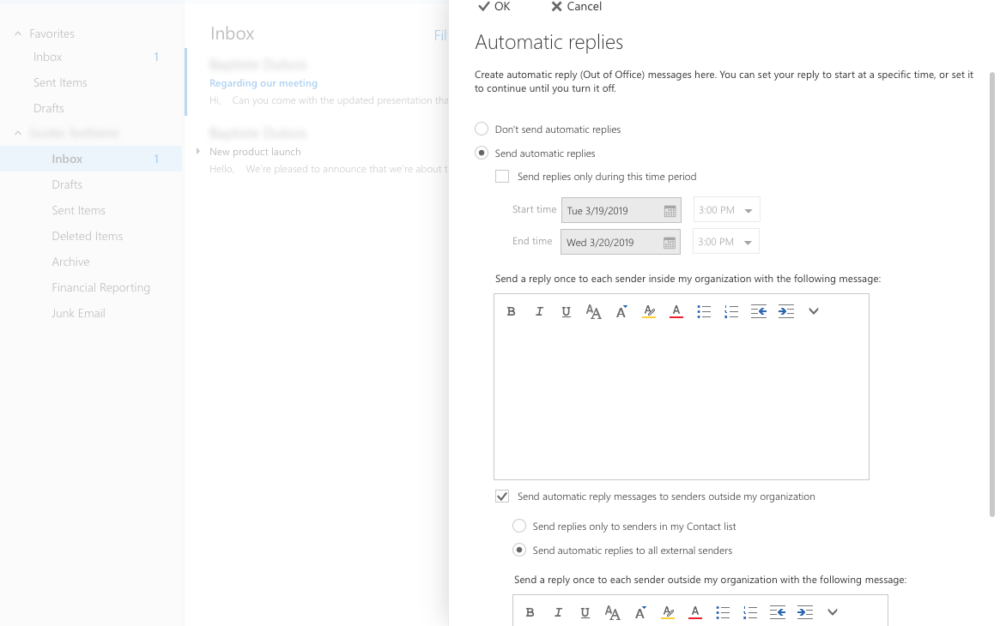{.thumbnail}

For more detailed instructions on creating automatic replies, please refer to our guide: [Creating an automatic reply in OWA](/pages/web_cloud/email_and_collaborative_solutions/using_the_outlook_web_app_webmail/owa_automatic_replies).

### Adding a signature

To add an email signature, click the gear icon at the top, then click `Options`{.action}.

{.thumbnail}

On the left-hand side of the new page, click `Email signature`{.action}. In the tree options, this item is located under "Mail" and "Layout". From here, you can enable, disable and edit the signature.

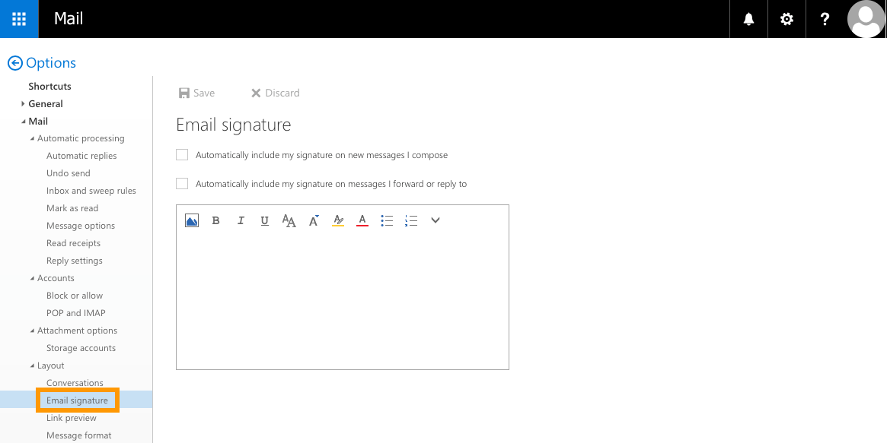{.thumbnail}

Compose your email signature in the editor box. You can specify whether you want to include the default signature in new emails only, or also in replies and forwarded emails. Once you are done, click `Save`{.action} to confirm.

### Accessing the Options section

To access all your settings, click the gear icon at the top, then click `Options`{.action}.

{.thumbnail}

You can then browse the "Options" tree-view on the left-hand side of the page. Further adjustments to the layout and behaviour of your email account can be made from this page. Note that for security reasons, some account options may be disabled by OVHcloud.

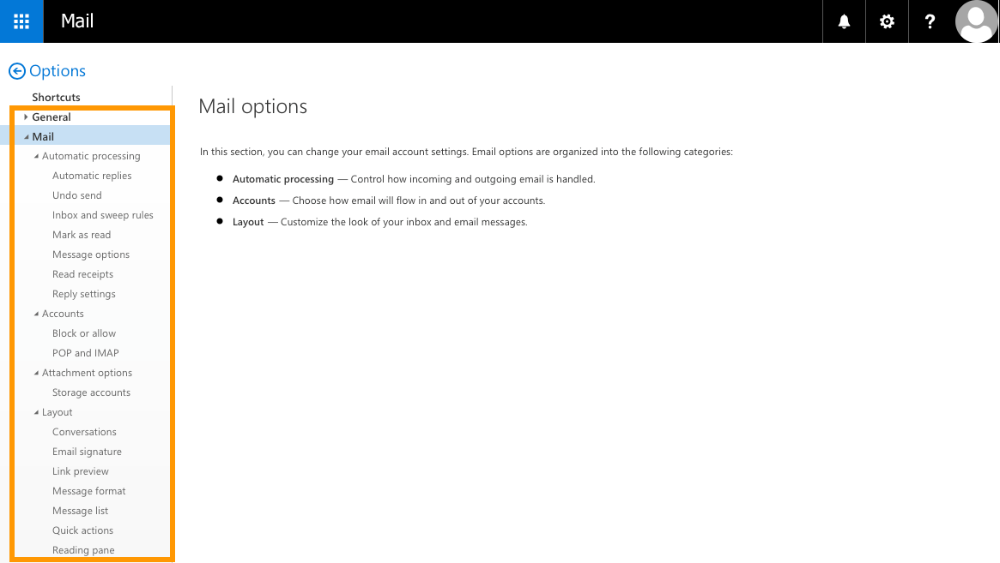{.thumbnail}

### Cookie management

The webmail used for our email offers is based on Microsoft Outlook Web App software. It is therefore likely to exchange metadata with Microsoft servers, in the form of cookies named `appsforoffice.microsoft.com`.

If you want to disable these exchanges, you can use a content blocking extension on your browser (such as uBlock Origin or Ghostery).
However, disabling these cookies may affect the stability of your webmail.

## Go further

[Creating automatic replies in OWA](/pages/web_cloud/email_and_collaborative_solutions/using_the_outlook_web_app_webmail/owa_automatic_replies)

[Sharing a folder from the OWA interface](/pages/web_cloud/email_and_collaborative_solutions/using_the_outlook_web_app_webmail/owa_directory_sharing)

[Sharing calendars via the OWA interface](/pages/web_cloud/email_and_collaborative_solutions/using_the_outlook_web_app_webmail/owa_calendar_sharing)

Join our [community of users](/links/community).
