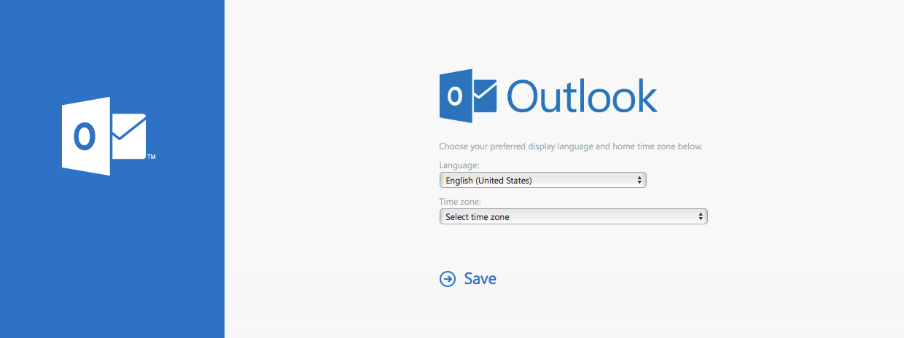
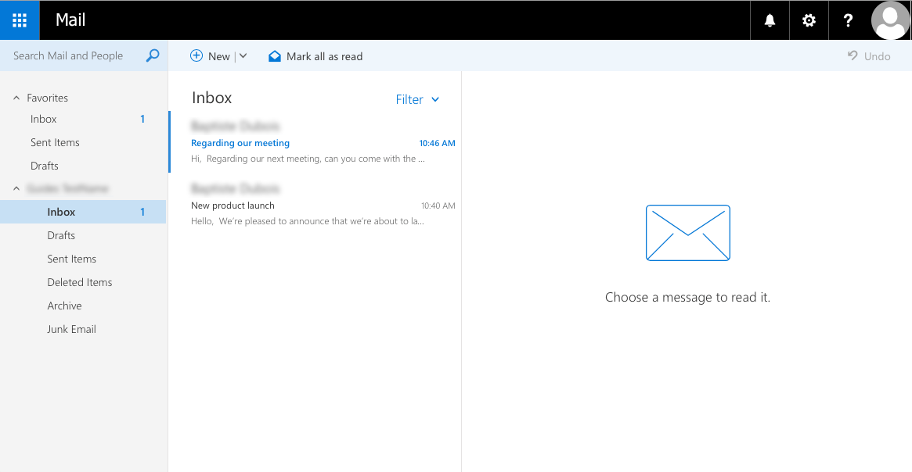
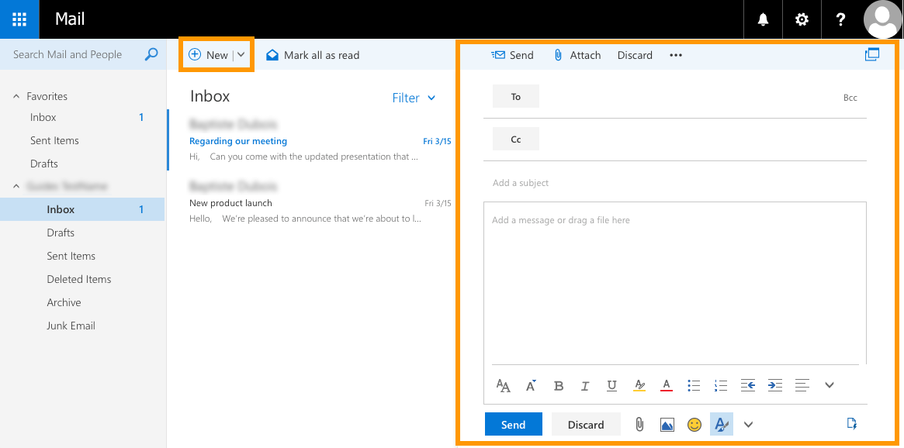
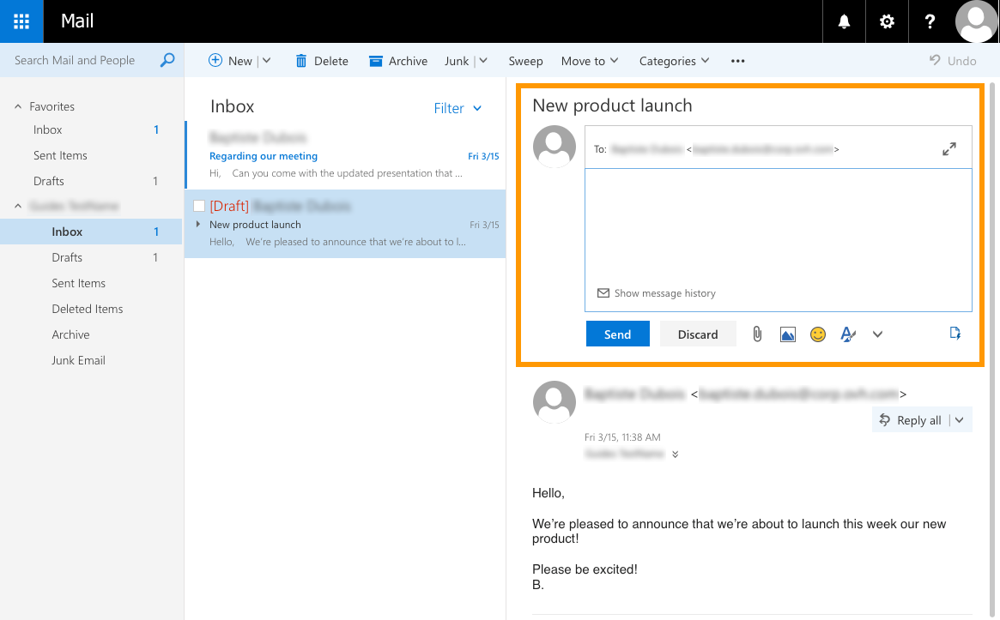
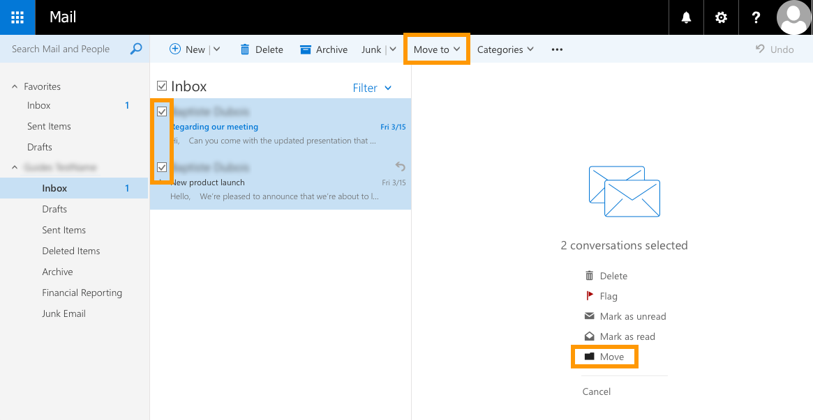
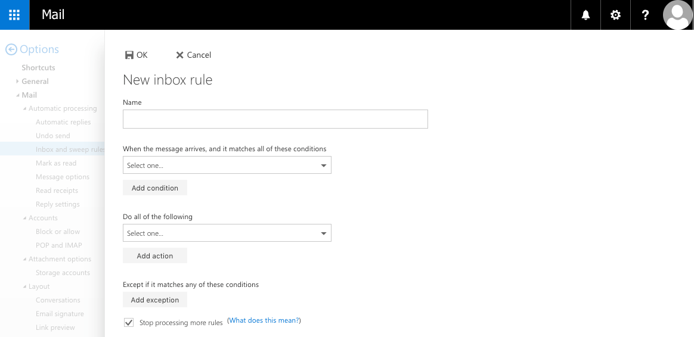
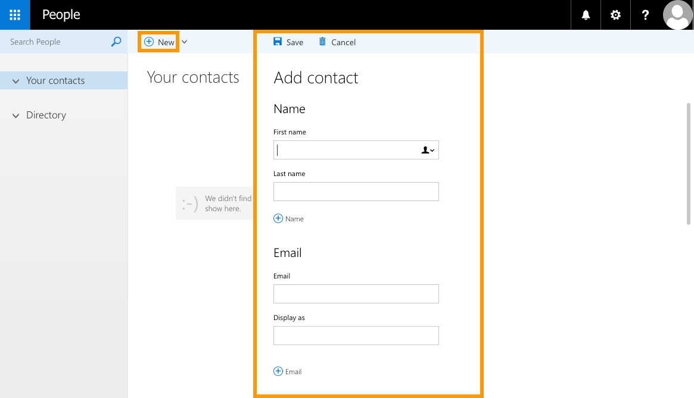
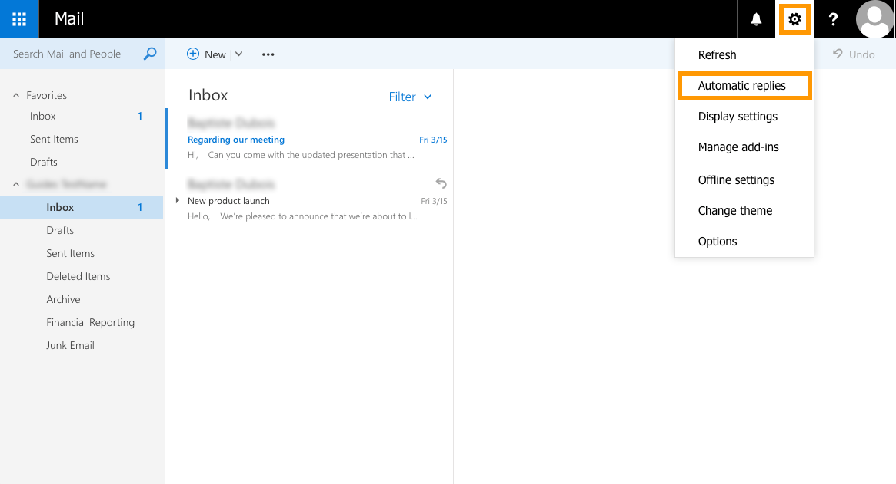
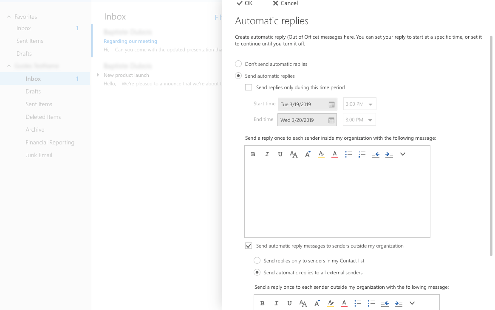
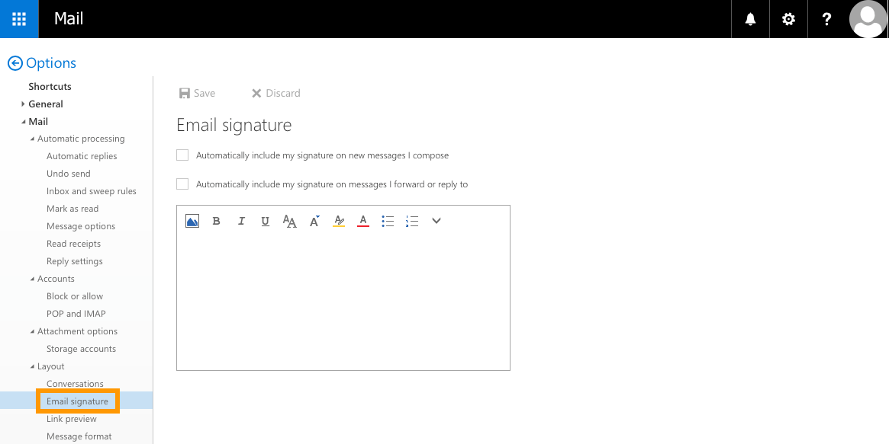

## Objectif

Avec les solutions e-mail OVHcloud, vous pouvez envoyer et recevoir vos e-mails à partir d’un appareil et d’un logiciel client de votre choix. OVHcloud fournit un service de messagerie en ligne appelé Outlook Web App (OWA) qui permet, via un navigateur web, d’accéder à un compte, quel que soit l’endroit. Tous les comptes de messagerie actifs sur MX Plan, Email Pro et Hosted Exchange ont un seul point d’accès à l’interface OWA qui leur correspond : notre page de [connexion au webmail](https://www.ovh.com/fr/mail/).

**Découvrez comment effectuer des actions courantes avec votre adresse électronique depuis l'interface OWA.**

## Prérequis

- Disposer d'une solution e-mail OVHcloud qui doit avoir été configurée au préalable (**MX Plan**, proposée parmi nos [offres d’hébergement web](https://www.ovhcloud.com/fr/web-hosting/), incluse dans un [hébergement gratuit 100M](https://www.ovhcloud.com/fr/domains/free-web-hosting/) ou commandée séparément comme solution autonome, telles que [**Hosted Exchange**](https://www.ovhcloud.com/fr/emails/hosted-exchange/) ou [**Email Pro**](https://www.ovhcloud.com/fr/emails/email-pro/))
- Connaître les identifiants de connexion de l’adresse e-mail que vous souhaitez configurer

## En pratique

Ce guide vous permettra de mieux comprendre les tâches habituelles disponibles dans un compte de messagerie sous OWA. Cependant, comme cette interface n'a pas été créée à l'origine par OVHcloud, nous ne pouvons pas fournir des instructions spécifiques sur des paramètres non abordés dans ce guide. 

Concernant les fonctionnalités spécifiques à Exchange, vous pourrez retrouver quelques guides supplémentaires dans la section [Aller plus loin](./#aller-plus-loin_1) en bas de ce guide.

> [!primary]
>
> Après les deux premières étapes, il n'est pas nécessaire de suivre les instructions dans l'ordre donné. Vous pouvez utiliser la barre de navigation sur le côté droit de ce guide pour passer aux paragraphes qui vous sont utiles.
>

### Étape 1 : Se connecter à OWA

Pour vous connecter à OWA avec votre adresse e-mail, ouvrez la page de [connexion au webmail](https://www.ovh.com/fr/mail/). Saisissez entièrement votre adresse e-mail et votre mot de passe. Ensuite, cliquez sur `Connexion`{.action}.

{.thumbnail}

Si c'est la première fois que vous vous connectez à OWA avec cette adresse e-mail, vous serez invité à définir la langue de l'interface ainsi que le fuseau horaire. Ensuite, cliquez sur `Enregistrer`{.action} pour continuer.

{.thumbnail}

Dorénavant, votre boîte de réception apparaîtra par défaut dès que vous serez connecté.

{.thumbnail}

### Étape 2 : Comprendre l’affichage d’OWA

L'interface OWA comporte plusieurs sections. Veuillez vous référer au tableau et à l'image ci-dessous pour vous familiariser avec celle-ci.

|Parties|Description|  
|---|---|  
|Section supérieure (1)|Elle dispose de deux barres d'onglets : la première permet d'accéder aux paramètres généraux (tels que la [rubrique Options](./#acceder-a-la-section-options)). La seconde barre peut être utilisée pour des actions spécifiques avec votre adresse (telles que l'envoi ou la réponse aux e-mails).|  
|Côté gauche (2)|Affiche la liste des dossiers pour votre adresse e-mail. Ces dossiers se présentent sous la forme d'une arborescence que vous pouvez développer ou masquer.|
|Segment central (3)|Affiche la liste des messages (lus et non lus) du dossier sélectionné dans le menu de gauche. Cette section peut également afficher les résultats de recherche.|
|Côté droit (4)|Affiche le volet de lecture lorsqu'un e-mail a été sélectionné.|

{.thumbnail}

Notez que vous pouvez modifier la taille des sections verticales en cliquant et en faisant glisser leurs lignes de bordure.

### Afficher les e-mails

Pour consulter vos e-mails, sélectionnez un dossier sur le côté gauche. Les e-mails entrants qui ne sont pas traités par les règles de messagerie s’afficheront dans le dossier « Boîte de réception ». Pour savoir si vous avez reçu de nouveaux e-mails, vérifiez si un numéro apparaît à côté du dossier correspondant.

{.thumbnail}

Pour lire un e-mail, sélectionnez son dossier si nécessaire. Cliquez ensuite sur l’e-mail pour afficher son contenu dans le coin de lecture. Une couleur différente est utilisée pour les messages non lus afin de les distinguer de ceux qui ont été lus.

{.thumbnail}

### Envoyer et répondre

Pour **envoyer un nouveau message**, cliquez sur l'icône feuille-crayon `Créer un nouveau courriel`{.action} en haut de l'interface du webmail. Le volet d’édition apparaîtra comme une nouvelle page. Remplissez les champs de votre e-mail (destinataires, objet, corps du message, pièces jointes). Dès que vous êtes prêt/e/s à l'envoyer, cliquez sur `Envoyer`{.action}.

{.thumbnail}

Pour **répondre à un message**, [cliquez d'abord](./#afficher-les-e-mails) sur celui-ci pour l'afficher, certaines icônes de la barre supérieure seront alors disponibles. 
Si vous souhaitez répondre uniquement à l'expéditeur, cliquez sur l'enveloppe `Répondre à l'expéditeur`{.action}. 
Si vous souhaitez répondre également aux personnes mises en copie du mail, cliquez sur la double enveloppe `Répondre à la liste ou à l'expéditeur et à tous les destinataires`{.action}. 

{.thumbnail}

Lorsque vous choisissez de répondre, l'éditeur de réponse rapide apparaîtra en-dessous de l’e-mail. Saisissez-y votre réponse, et dès que vous êtes prêt à envoyer votre message, cliquez sur `Envoyer`{.action}. Si néanmoins vous souhaitez annuler votre réponse, cliquer sur la flèche verte `Retourner à la liste des courriels`{.action}, située sur la barre supérieure. Un message s'affichera alors pour vous demander si vous souhaitez supprimer le message ou annuler le retour en arrière. 

{.thumbnail}

### Organiser votre messagerie

OWA propose plusieurs façons d'organiser votre messagerie. Vous pouvez :

- [créer des dossiers et des sous-dossiers](./#creer-un-dossier),
- [déplacer des e-mails](./#deplacer-des-e-mails),
- [définir des règles](./#creer-des-regles-de-gestion-de-la-messagerie) afin d’effectuer automatiquement des actions dès la réception d'un nouvel e-mail.

#### Créer un dossier

Pour créer un nouveau dossier, rendez-vous sur la partie gauche de votre page, dans le cadre intitulé "Dossiers". Tout en bas à gauche, cliquez sur l'icône représentée par un rouage et sélectionnez l'option "Gérer les dossiers". Puis, allez à nouveau vers le coin inférieur à gauche et, à côté du rouage, vous trouverez un "+". Lorsque vous cliquez dessus le cadre central apparaît, intitulé "Propriétés du dossier". Remplissez les informations relatives à votre dossier : 

Dans l'onglet 'Emplacement' : 
- Nom de dossier : choisissez le nom que vous désirez donner à votre dossier. Exemple : Mission OVH.
- Dossier parent : si vous désirez que ce dossier soit un sous-dossier d'un dossier existant, sélectionnez alors le dossier existant dans la liste déroulante. Le cas échéant, laissez le champ libre.

Dans l'onglet 'Paramètres' : 
Sélectionnez le mode d'affichage que vous désirez pour votre nouveau dossier. 

Une fois que ces paramètres sont fixés, cliquez sur 'Enregistrer". Votre dossier va alors apparaître dans la barre latérale gauche, en dessous des autres dosiers existants. S'il s'agit d'un sous-dossier, celui-ci apparaîtra alors sous le dossier principal. 

Vous pouvez à tout moment placer un dossier en sous dossier. Il vous suffit de déplacer ce dernier à l'aide de votre souris d'ordinateur, vers le dossier souhaité. Un message d'alerte apparaîtra alors pour vous demander de valider ou non la manoeuvre. 

{.thumbnail}

#### Déplacer des e-mails

Pour **déplacer un e-mail**, vous pouvez simplement le glisser-déposer dans le dossier cible. Vous puvez également cliquer sur le mail en question, puis cliquer sur le rouage du haut "Plus d'actions" et cliquez sur `Déplacer vers`{.action}
Pour simultanément **déplacer plusieurs e-mails**, sélectionnez le premier email de votre liste, puis sélectionnez la touche "Maj" de votre clavier, et sélectionnez enfin le dernier email de la liste. De cette manière, l'ensemble des mails situés entre le premier et le dernier email sélectionnés seront pris en compte également dans la sélection. Puis, vous pouvez glisser-déposer votre sélection dans le dossier cible. 
Si vous désirez sélectionner plusieurs e-emails simultanément mais qui ne suivent pas forcément un ordre de liste, sélectionnez alors le premier e-mail souhaité, puis, à l'aide de votre touche "Ctrl" de votre clavier, sélectionnez tous les dossiers que vous souhaitez inclure dans la sélection, puis refaites la même manoeuvre que précédemment. 

{.thumbnail}

#### Créer des règles de gestion de la messagerie

<iframe width="560" height="315" src="https://www.youtube-nocookie.com/embed/z1D2wc7XWX4?start=48" title="YouTube video player" frameborder="0" allow="accelerometer; autoplay; clipboard-write; encrypted-media; gyroscope; picture-in-picture" allowfullscreen></iframe>

Pour créer et gérer des règles, cliquez d’abord sur l'icône d'engrenage en haut, puis sur `Options`{.action}.

{.thumbnail}

Dans la nouvelle page qui s’ouvre, cliquez sur `Règles de boîte de réception et de rangement`{.action} qui se trouve dans le menu de gauche. Dans l’arborescence « Options », vous pouvez trouver cette fonctionnalité dans « Courrier », sous « Traitement automatique ». Ici, vous pouvez créer, modifier et déplacer des règles de la liste. 

Pour ajouter une nouvelle règle, cliquez sur le bouton `+`{.action}  

{.thumbnail}

Renseignez les informations demandées en fonction de la tâche que vous voudrez effectuer avec cette règle. Cliquez ensuite sur `OK`{.action}. 

{.thumbnail}

Pour des instructions plus détaillées sur la création des règles de gestion de messagerie, veuillez vous référer à notre guide : [Création de règles de gestion de messagerie sous OWA](/pages/web_cloud/email_and_collaborative_solutions/using_the_outlook_web_app_webmail/creating-inbox-rules-in-owa-mx-plan).

#### Bloquer un expéditeur

<iframe width="560" height="315" src="https://www.youtube-nocookie.com/embed/Ivad4FgJ2No" title="YouTube video player" frameborder="0" allow="accelerometer; autoplay; clipboard-write; encrypted-media; gyroscope; picture-in-picture" allowfullscreen></iframe>

Cliquez sur l'icône de l'engrenage en haut à droite, puis cliquez sur `Options`{.action}. Toujours dans la colonne de gauche, parcourez l'arborescence « Courrier » sous « Comptes », puis « Bloquer ou autoriser ».

Dans la section « **Expéditeurs bloqués** », tapez une adresse e-mail ou un nom de domaine à bloquer, puis cliquez sur le bouton `+`{.action} pour l'ajouter dans la liste. 

{.thumbnail}

### Gérer une liste de contacts

Pour gérer vos contacts, cliquez d’abord sur le bouton bleu du « App launcher » en haut de la page, ensuite sur `Contacts`{.action}.

{.thumbnail}

Dans la nouvelle page, vous pouvez ajouter un nouveau contact, créer une liste de contacts et supprimer des contacts existants.

Pour **ajouter un nouveau contact**, cliquez sur `Nouveau`{.action}, et introduisez les coordonnées du contact à ajouter. Une fois cela fait, cliquez sur `Enregistrer`{.action}.

{.thumbnail}

Pour **créer une liste de contacts**, cliquez sur la flèche vers le bas à côté de « Nouveau », puis cliquez sur `Liste de contacts`{.action}. Donnez-lui un nom, ajoutez-y des contacts et cliquez sur `Enregistrer`{.action}.

{.thumbnail}

### Modifier le mot de passe

<iframe width="560" height="315" src="https://www.youtube-nocookie.com/embed/z1D2wc7XWX4" title="YouTube video player" frameborder="0" allow="accelerometer; autoplay; clipboard-write; encrypted-media; gyroscope; picture-in-picture" allowfullscreen></iframe>

Vous pouvez modifier le mot de passe de votre compte lorsque vous êtes connecté à OWA. Pour ce faire, cliquez sur l'icône d'engrenage en haut, puis cliquez sur `Options`{.action}.

{.thumbnail}

Sur la nouvelle page, développez l'onglet « Général » dans l'arborescence de gauche, puis cliquez sur `Mon compte`{.action}. Enfin, cliquez sur `Modifier votre mot de passe`{.action}.

{.thumbnail}

Dans la nouvelle fenêtre qui s'ouvre, entrez votre mot de passe actuel. Saisissez ensuite un nouveau mot de passe, puis confirmez-le en le saisissant à nouveau. Cliquez sur `Enregistrer`{.action} pour enregistrer le nouveau mot de passe.

> [!primary]
>
> N'oubliez pas d’enter votre nouveau mot de passe sur tous vos appareils utilisés pour accéder à ce compte (par exemple dans le logiciel client de messagerie). En cas de difficultés avec votre mot de passe, contactez votre administrateur de services.
>

{.thumbnail}

### Ajouter la réponse automatique

Sous OWA, vous pouvez créer un répondeur automatique dans votre messagerie afin de ne pas laisser les e-mails sans réponse pendant vos absences. Pour ce faire, cliquez sur l'icône de l'engrenage en haut, puis cliquez sur `Réponses automatiques`{.action}.

{.thumbnail}

Dans la fenêtre qui s’ouvre, sélectionnez l’option « Envoyer des réponses automatiques ». Vous pouvez alors paramétrer le répondeur automatique pour qu'il réponde à plusieurs critères tels que :

- envoyer des e-mails de réponse automatique pendant un intervalle de temps fixe, ou en continu jusqu'à ce qu'il soit désactivé manuellement
- définir les expéditeurs qui recevront les e-mails de réponse automatique (expéditeurs internes uniquement, ou inclure les expéditeurs externes)

Remplissez les informations demandées en fonction de la tâche que vous voudrez effectuer grâce à cette règle. Une fois cela fait, cliquez sur OK.

{.thumbnail}

Pour des instructions plus détaillées sur la création des règles de gestion de messagerie, veuillez vous référer à notre guide : [Créer un répondeur automatique sous OWA](/pages/web_cloud/email_and_collaborative_solutions/using_the_outlook_web_app_webmail/owa_automatic_replies).

### Ajouter une signature

Pour ajouter une signature électronique, cliquez sur l'icône de l'engrenage en haut, puis cliquez sur `Options`{.action}.

{.thumbnail}

Sur le côté gauche de la nouvelle page, cliquez sur `Signature électronique`{.action}. Dans les options de l’arborescence, cet élément se trouve sous « Courrier » et « Disposition ». À partir de là, vous pouvez activer, désactiver et modifier la signature.

{.thumbnail}

Composez votre signature électronique dans la boîte d'éditeur. Vous pouvez spécifier si vous souhaitez inclure la signature par défaut dans les nouveaux e-mails uniquement ou également dans les réponses et les e-mails transférés. Une fois que vous avez terminé, cliquez sur `Enregistrer`{.action} pour confirmer.

Pour obtenir des instructions sur la création de signatures automatiques en utilisant des modèles pour l'ensemble du domaine, veuillez vous référer à notre guide : [Créer des signatures automatiques](/pages/web_cloud/email_and_collaborative_solutions/microsoft_exchange/feature_footers).

### Accéder à la section Options

Pour accéder à tous vos paramètres, cliquez sur l'icône d’engrenage en haut, puis cliquez sur `Options`{.action}.

{.thumbnail}

Vous pouvez ensuite naviguer dans l'arborescence « Options » sur le côté gauche de la page. D'autres ajustements sur la présentation et le comportement de votre compte de messagerie peuvent être effectués à partir de cette page. Veuillez noter que pour des raisons de sécurité, certaines options du compte peuvent être désactivées par OVHcloud.

{.thumbnail}

### Gestion des cookies

Le webmail qui est utilisé pour nos offres e-mail est basé sur le logiciel Microsoft Outlook Web App. Il est donc susceptible d'échanger des métadonnées avec les serveurs de Microsoft, sous forme de cookies nommés `appsforoffice.microsoft.com`.

Si vous souhaitez désactiver ces échanges, vous pouvez utiliser sur votre navigateur une extension de type bloqueur de contenus (tel que uBlock Origin ou Ghostery).
La désactivation de ces cookies peut néanmoins affecter la stabilité de votre webmail.

## Aller plus loin

[Création de réponses automatiques sous OWA](/pages/web_cloud/email_and_collaborative_solutions/using_the_outlook_web_app_webmail/owa_automatic_replies)

[Partager un dossier depuis l’interface OWA](/pages/web_cloud/email_and_collaborative_solutions/using_the_outlook_web_app_webmail/owa_directory_sharing)

[Partager des calendriers via l’interface OWA](/pages/web_cloud/email_and_collaborative_solutions/using_the_outlook_web_app_webmail/owa_calendar_sharing)

[Créer un groupe de contacts](/pages/web_cloud/email_and_collaborative_solutions/microsoft_exchange/feature_groups)

Échangez avec notre communauté d'utilisateurs sur <https://community.ovh.com/>.
