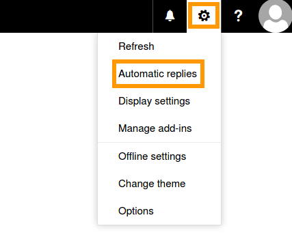
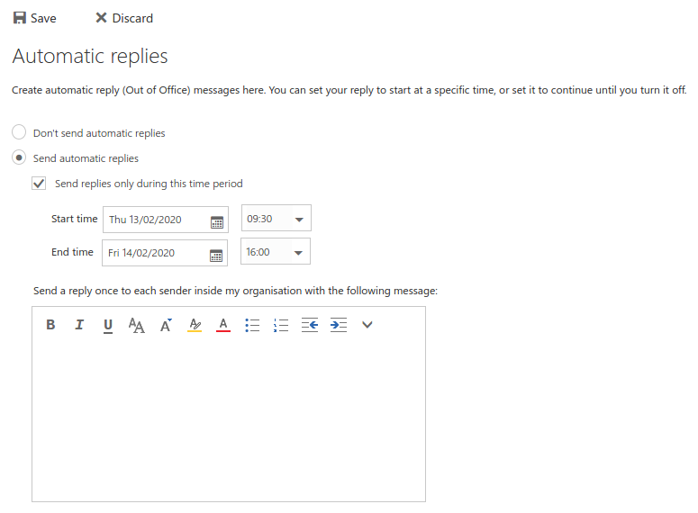
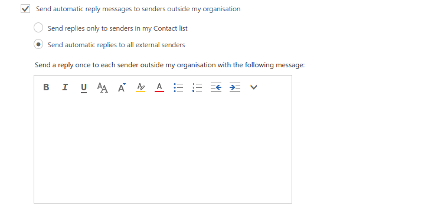

## Sumário

Esta funcionalidade do Exchange permite-lhe configurar respostas automáticas aos e-mails enviados para a sua conta, por exemplo mensagens de ausência (fora do escritório).

**Descubra como ativar respostas automáticas utilizando o Outlook Web App (OWA).**

## Requisitos

 - Ter instalado uma solução de e-mail OVHcloud [Exchange](/links/web/emails-hosted-exchange) ou [E-mail Pro](/links/web/email-pro)
- Ter acesso à conta e-mail (com endereço de e-mail e palavra-passe).

## Instruções

> [!warning]
>
> Se o seu endereço de e-mail estiver associado a uma oferta **MX Plan** (incluída com os [alojamentos web](/links/web/hosting) e os [alojamentos gratuitos 100M](/links/web/domains-free-hosting)), o seu espaço cliente propõe uma secção intitulada `Gestão das respostas automáticas`{.action}. Deverá criar uma resposta automática a partir da Área de Cliente OVHcloud, recorrendo à documentação "[MX Plan - Criar uma resposta automática num endereço de e-mail](/pages/web_cloud/email_and_collaborative_solutions/mx_plan/feature_auto_responses)".

### Ativar a funcionalidade

Aceda à sua conta Exchange através do [webmail OVHcloud](/links/web/email). Clique no símbolo da engrenagem na parte superior direita para abrir o menu “Opções” e selecione `Respostas automáticas`{.action}.

{.thumbnail}

Nesta interface, basta ativar a funcionalidade selecionando `Enviar respostas automáticas`{.action}. Pode configurar uma hora exata nos campos abaixo ou ativá-la indefinidamente.

> [!primary]
>
> Se não especificar a hora de início e de fim, a resposta automática deverá ser desativada manualmente por si.

Escreva a sua mensagem na caixa do editor de texto e confirme clicando no botão `Guardar`{.action} no canto superior esquerdo.

{.thumbnail}

### Tipos de resposta

As instruções acima mencionadas aplicam-se aos e-mails enviados pelos utilizadores do seu serviço Exchange. Pode preparar uma mensagem diferenciada para os restantes utilizadores, bastando para isso marcar a opção “Enviar mensagens de resposta automática para remetentes exteriores à minha empresa”. Terá então mais duas opções de resposta automática:

- **"Enviar resposta apenas para remetentes da minha lista de contactos"**: Apenas os seus contactos irão receber uma mensagem.

- **"Enviar resposta automática para todos os remetentes externos"**: Todas as pessoas que lhe enviem e-mails durante a sua ausência irão receber uma mensagem.

Poderá inserir uma mensagem alternativa para remetentes externos na segunda caixa de edição de texto. Uma forma mais comum de resposta seria utilizar a primeira mensagem para os seus colegas de trabalho e a segunda para amigos, clientes ou qualquer outra pessoa que o possa contactar.

{.thumbnail}

### Informação adicional

- Com a funcionalidade de respostas automáticas ativada, receberá os e-mails na sua caixa de entrada tal como é habitual. 

- Para evitar spam e ciclos de e-mail, cada remetente receberá apenas uma resposta automática.

## Saiba mais

[Guia de utilização do Outlook Web App](/pages/web_cloud/email_and_collaborative_solutions/using_the_outlook_web_app_webmail/email_owa)

[Atribuir permissões a uma conta Exchange](/pages/web_cloud/email_and_collaborative_solutions/microsoft_exchange/feature_delegation)

[Partilhar calendários em OWA](/pages/web_cloud/email_and_collaborative_solutions/using_the_outlook_web_app_webmail/owa_calendar_sharing)

Para serviços especializados (referenciamento, desenvolvimento, etc), contacte os [parceiros OVHcloud](/links/partner).

Se pretender usufruir de uma assistência na utilização e na configuração das suas soluções OVHcloud, consulte as nossas diferentes [ofertas de suporte](/links/support).

Fale com nossa [comunidade de utilizadores](/links/community).