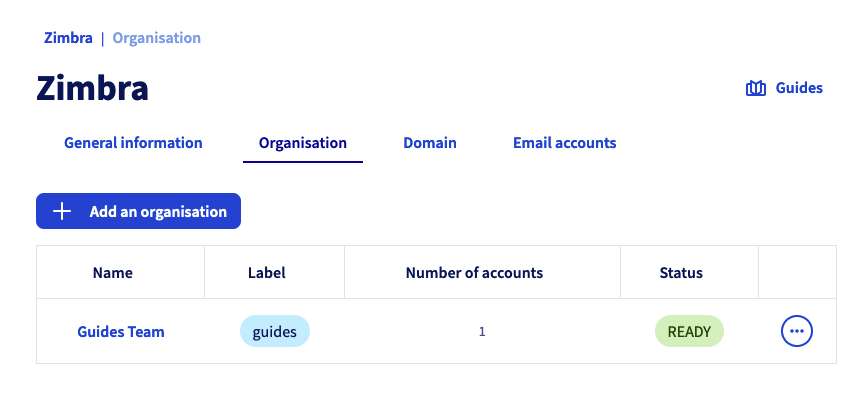
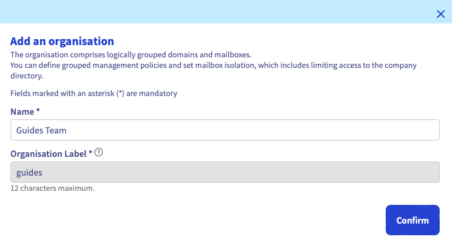
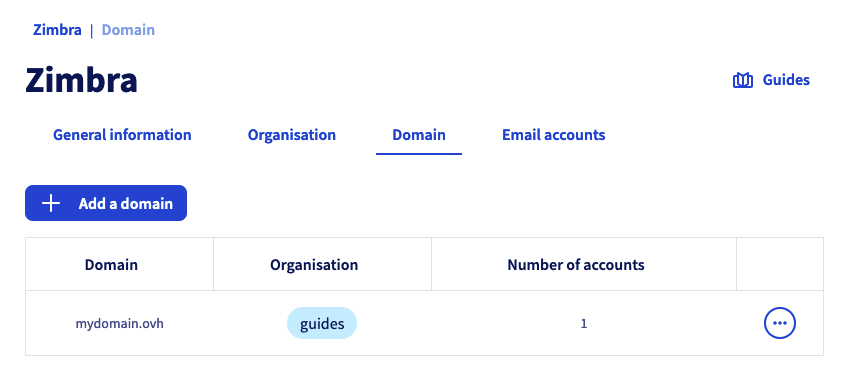
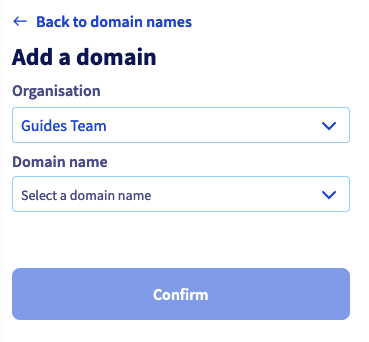
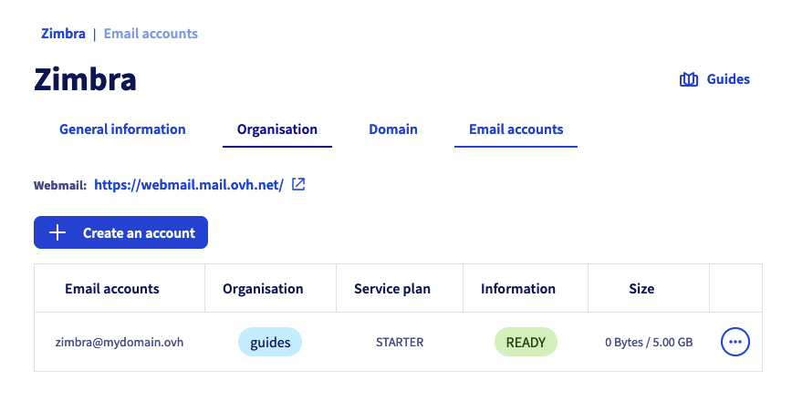
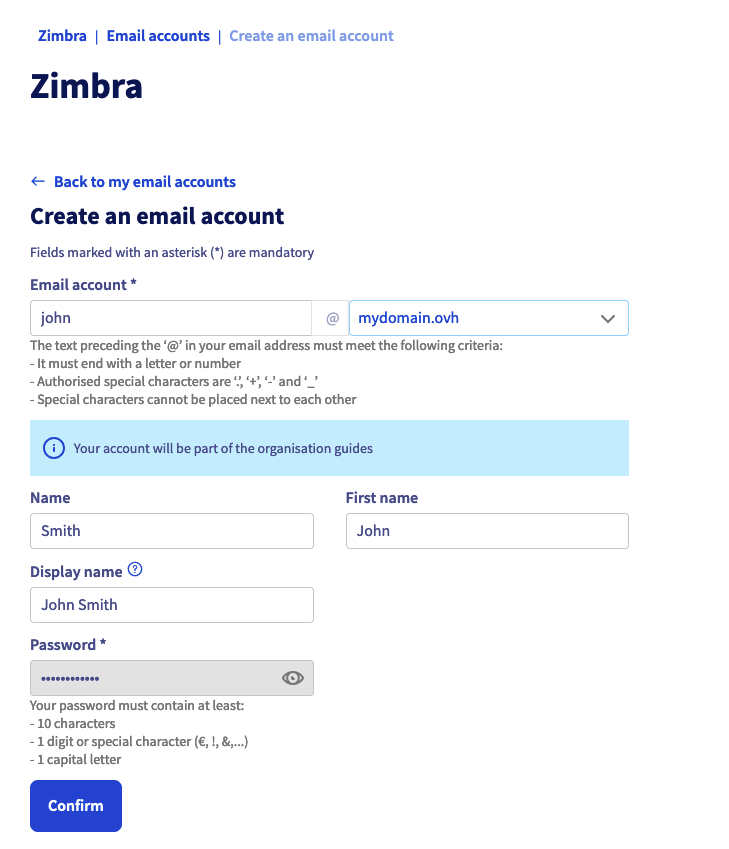

> [!warning]
>
> **Important**
>
> The Zimbra solution is a beta-phase product.
>
> It is only available to those who have completed the [beta registration form](https://labs.ovhcloud.com/en/zimbra-beta/).
>
> Some of the features or limitations described in this guide may change as the product is released.

## Objective

With the Zimbra solution, OVHcloud offers an open-source collaborative messaging platform, with all the features you need for professional use. In this guide, you will find the information you need to get started configuring your Zimbra email accounts.

**Find out how to get started with the Zimbra email solution.**

## Requirements

- An email account on our Zimbra OVHcloud email solution
- An [OVHcloud domain name](/links/web/domains)
- Access to the [OVHcloud Control Panel](/links/manager)

## Instructions

### Access your service management

To access your Zimbra service, log in to your [OVHcloud Control Panel](/links/manager) and click on the `Web Cloud`{.action} tab. In the `Emails`{.action} section, click `Zimbra`{.action}.

### Configure your Zimbra service

Before you start configuring your Zimbra email accounts, take note of the three elements that structure your Zimbra service hierarchically:

- [**Organization**](#organizations): It enables domain names to be grouped together in order to associate them.kkk
- [**Domain name**](#domains): It is essential to create an email account. You will need to manage at least one domain name via the OVHcloud Control Panel, and add it to your Zimbra service.
- [**Email accounts**](#emails): By using the domain names added to your Zimbra service, you can create an email address.

> [!primary]
>
> An *Organization* is used to represent an entity (a company, association, personal project, etc.). It enables email accounts to be partitioned, specific security policies to be applied (future feature) and rights to be delegated to an organization (future feature). By using organizations, you can make it easier to browse and manage your Zimbra platform.

The diagram below summarizes the hierarchical link between the above-mentioned elements.

{.thumbnail .w-400}

### Organizations 

If you are adding a large number of domain names to your Zimbra service, it may be useful to group them together by associating them with an "organization". From your Zimbra service, click `Organization`{.action}.

{.thumbnail .w-400}

#### Create an organization

To create an organization, click `Add Organization`{.action}. Define the `Name` of the organization and the `Label of the organization`, the latter being a short description of the organization allowing you to find your way when you filter the display of domain names and email accounts of your Zimbra service.

{.thumbnail .w-400}

#### Filter by organization

From the `Organization`{.action}, `Domain`{.action} and `Email accounts`{.action} tabs, by clicking on an organization’s label, you can create a filter that will only display items related to that organization.

You can see that the filter is applied when the label appears next to the name of your Zimbra service.

To remove the filter, simply click on the cross of the filter.

{.thumbnail .w-400}

### Domains 

> [!warning]
>
> For optimal operation when you use the same domain name between OVHcloud solutions [Exchange](/links/web/emails-hosted-exchange), [Email Pro](/links/web/email-pro) and Zimbra, it is necessary to configure the domain name in `non-authoritative`. To find out how to configure a non-authoritative domain name on an Exchange or Email Pro platform, please read our guide on [Adding a domain name on an email platform](/pages/web_cloud/email_and_collaborative_solutions/microsoft_exchange/exchange_adding_domain).

In this tab, you will find all of the domain names added to your Zimbra service. They must be managed via the OVHcloud Control Panel in order to be added.

The domain name table gives you two pieces of information:

- **Organization**: It is determined when you add your domain name. You will automatically find its label in this column.
- **Number of accounts**: Here, you can find all of the accounts created under the domain name concerned.

{.thumbnail .w-400}

#### Add a domain name

To add a domain name to your Zimbra service, click on the `Domain`{.action} tab, then click `Add a domain`{.action}.

Select an organization from the drop-down menu, and then select a domain name from the list (it is necessary that domain names are managed in your OVHcloud Control Panel). Then click `Confirm`{.action} to finish adding the domain name.

{.thumbnail .w-400 .h400}

### Email accounts 

You can manage your Zimbra service email addresses from the `Email accounts`{.action} tab. The table displays the list of email accounts on your service, as well as 3 pieces of information for each:

- **Organization**: If your email account domain name is linked to an organization, you will automatically find its label in this column.
- **Offer**: Since your Zimbra service can host several Zimbra solutions, you will find the solution associated with your email account in this column.
- **Size**: This column shows the total capacity of your email account and the space it currently occupies.

At the top of this page, you will also find a link to [Webmail](/links/web/email), so that you can log in directly to the content of your email account via your web browser.

{.thumbnail .w-400}

#### Create an email account

To create an email account on your Zimbra service, click on the `Email accounts`{.action} tab, then `Create an account`{.action}.

Fill in the information displayed.

- **Email account**: Enter the *account name* that your email address will contain (your "first name.surname", for example), and *select a domain name* in the dropdown menu.

> [!warning]
>
> The name of your email address must meet the following conditions:
>
> - Minimum 2 characters
> - Maximum 32 characters
> - No accents
> - No special characters, except for the following characters: `.`, `,`, `-` and `_`

- **First name**: Enter a first name.
- **Name**: Enter a name.
- **Full name**: Enter the name that will appear as a sender when emails are sent from this address.
- **Password**: Set a strong password consisting of (at least) 9 characters, an upper-case letter, a lower-case letter and a number. For security reasons, do not use the same password twice. Choose one that has no relation to your personal information (for example, avoid your surname, first name and date of birth). Change it regularly.

> [!warning]
>
> The password must meet the following requirements:
>
> - Minimum 10 characters
> - Maximum 64 characters
> - Minimum 1 upper case
> - Minimum 1 special character
> - No accents

Click `Confirm`{.action} to start creating the account.

{.thumbnail .w-400}

### View your email account 

To view your email account:

- Log in to [webmail](/links/web/email) from a web browser and enter your email address and password. For further details, please refer to our page “[Using Zimbra webmail](/pages/web_cloud/email_and_collaborative_solutions/mx_plan/email_zimbra)”.
- Configure an email software on your computer, smartphone or tablet. Visit our page “[Configuring your Zimbra email address in an email client](/pages/web_cloud/email_and_collaborative_solutions/zimbra/zimbra_mail_apps)”.

## Go further 

[Configuring your Zimbra email address on an email client](/pages/web_cloud/email_and_collaborative_solutions/zimbra/zimbra_mail_apps)

[Use Zimbra webmail](/pages/web_cloud/email_and_collaborative_solutions/mx_plan/email_zimbra)

[OVHcloud Zimbra FAQ](/pages/web_cloud/email_and_collaborative_solutions/mx_plan/faq-zimbra)

For specialised services (SEO, development, etc.), contact [OVHcloud partners](/links/partner).

Join our [community of users](/links/community).