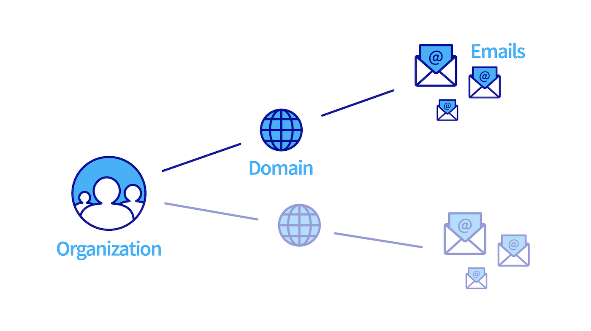

> [!primary]
>
> **Important**
>
> L'offre Zimbra est un produit en phase bêta.
>
> Il est uniquement disponible aux personnes ayant complété le [formulaire d'inscription à la bêta](https://labs.ovhcloud.com/en/zimbra-beta/).
>
> Certaines fonctionnalités ou limitations présentées dans ce guide sont susceptibles d'évoluer lorsque le produit sera commercialisé.

## Objectif

Avec l'offre Zimbra, OVHcloud vous propose une plateforme de messagerie collaborative open source offrant toutes les fonctionnalités nécessaires à une utilisation professionnelle. Vous trouverez dans ce guide les éléments permettant de débuter dans la configuration de vos comptes e-mail Zimbra.

**Découvrez comment débuter avec l'offre e-mail Zimbra**

## Prérequis

- Avoir souscrit à un compte e-mail sur notre solution e-mail Zimbra OVHcloud.
- Disposer d'un [nom de domaine OVHcloud](/links/web/domains).
- Être connecté à votre [espace client OVHcloud](/links/manager).

## En pratique

### Accéder à la gestion de votre service

Pour accéder à votre service Zimbra , connectez-vous à votre [espace client OVHcloud](/links/manager) et cliquez sur l'onglet `Web Cloud`{.action}. Dans la partie `E-mails`{.action}, cliquez sur `Zimbra`{.action}.

### Configurer votre service Zimbra

Avant de débuter la configuration de vos comptes e-mail Zimbra, prenez connaissance des trois éléments qui structurent hiérarchiquement votre service Zimbra :

- [**Organisation**](#organizations) : elle permet de regrouper les noms de domaine afin de les associer. **Il n'est pas nécessaire de créer une organisation pour pouvoir créer un compte e-mail**.
- [**Nom de domaine**](#domains) : il est indispensable pour créer un compte e-mail. Vous devez en gérer au moins un depuis votre espace client OVHcloud et l'ajouter sur votre service Zimbra.
- [**Comptes e-mail**](#emails) : en utilisant les noms de domaines ajoutés à votre service Zimbra, vous pourrez créer une adresse e-mail.

Le schéma ci-dessous résume le lien hiérarchique entre les éléments précédemment cités.

{.thumbnail .w-400}

### Organisations 

Si vous ajoutez un grand nombre de noms de domaine sur votre service Zimbra, il peut être utile de les regrouper en les associant à une « oraganisation ». Depuis votre service Zimbra, cliquez sur `Organisation`{.action}.

#### Créer une organisation

Pour créer une organisation, cliquez sur `Ajouter une organisation`{.action}. Définissez le `Nom` de l'organisation et le `Label de l'organisation`, ce dernier étant une description courte de l'organisation vous permettant de vous repérer lorsque vous filtrez l'affichage des noms de domaine et comptes e-mail de votre service Zimbra.

#### Filtrer par organisation

Une fois vos organisations créées, assurez-vous que les noms de domaine déclarés sur votre service Zimbra sont associés à une organisation.

Depuis les onglets `Organisation`{.action}, `Domaine`{.action} et `Comptes e-mail`{.action}, en cliquant sur le label d'une organisation, vous créez un filtre qui affichera uniquement les éléments liés à cette organisation. 
Vous pouvez constater que le filtre est appliqué lorsque le label s'affiche à côté du nom de votre service Zimbra. 
Pour retirer le filtre, cliquez simplement sur la croix du filtre.

{.thumbnail .w-400}

### Domaines <a name="domains"></a 

Vous retrouvez dans cet onglet l'ensemble des noms de domaine ajoutés à votre service Zimbra. Ils doivent être gérés depuis votre espace client OVHcloud pour être ajoutés.

Le tableau des noms de domaine vous donne deux informations :

- **Organisation** : elle est déterminée lorsque vous ajoutez votre nom de domaine, vous retrouverez automatiquement son label dans cette colonne.
- **Nombre de comptes** : Vvus retrouvez ici tous les comptes qui ont été créés sous le nom de domaine concerné.

#### Ajouter un nom de domaine

Pour ajouter un nom de domaine à votre service Zimbra, cliquez sur l'onglet `Domaine`{.action} puis cliquez sur `Ajouter un domaine`{.action}.

Si vous avez créé des organisations, sélectionnez l'une d'elles dans le menu déroulant, puis sélectionnez un nom de domaine dans la liste (il est nécessaire que les noms de domaines soient gérés dans votre espace client OVHcloud). Cliquez ensuite sur `Confirmer`{.action} pour finaliser l'ajout du nom de domaine.

### Comptes e-mail 

La gestion des adresses e-mail de votre service Zimbra se fait depuis l'onglet `Comptes e-mail`{.action}. Le tableau affiche la liste des comptes e-mail présents sur votre service ainsi que 3 informations pour chacun d'eux :

- **Organisation** : si le nom de domaine de votre compte e-mail est associé à une organisation, vous retrouverez automatiquement son label dans cette colonne.
- **Offre** : comme votre service Zimbra peut héberger plusieurs offres Zimbra en son sein, vous retrouverez l'offre associée à votre compte e-mail dans cette colonne.
- **Taille** : cette colonne vous affiche la capacité totale de votre compte e-mail et l'espace qu'il occupe actuellement.

Vous retrouvez également en haut de cette page un lien vers le [Webmail](/links/web/email) pour pouvoir vous connecter directement au contenu de votre compte e-mail depuis votre navigateur internet.

#### Créer un compte e-mail

Pour créer un compte e-mail sur votre service Zimbra, cliquez sur l'onglet `Comptes e-mail`{.action} puis sur `Créer un compte`{.action}.

Complétez les informations qui s'affichent.

- **Compte e-mail** : renseignez le *nom du compte* que portera votre adresse e-mail (votre prénom.nom, par exemple) et *sélectionnez un nom de domaine* dans le menu déroulant.

> [!warning]
>
> Le choix du nom de votre adresse e-mail doit respecter les conditions suivantes :
>
> - Minimum 2 caractères
> - Maximum 32 caractères
> - Aucun caractère accentué
> - Pas de caractères spéciaux, à l'exception des caractères suivants : `.`, `,`, `-` et `_`

- **Prénom** : renseignez un prénom.
- **Nom** : renseignez un nom.
- **Nom complet** : renseignez le nom qui s'affichera en tant qu'expéditeur lorsque des e-mails seront envoyés depuis cette adresse.
- **Mot de passe** : définissez un mot de passe fort composé de (au minimum) 9 caractères, une majuscule, une minuscule et un chiffre. Pour des raisons de sécurité, n'utilisez pas deux fois le même mot de passe. Choisissez-en un qui n'a aucun rapport avec vos informations personnelles (évitez par exemple de mentionner vos nom, prénom et date de naissance). Changez-le régulièrement.

> [!warning]
>
> Le choix du mot de passe doit respecter les conditions suivantes :
>
> - Minimum 9 caractères
> - Maximum 30 caractères
> - Aucun caractère accentué

Cliquez sur `Confirmer`{.action} pour lancer la création du compte.

## Aller plus loin

[Utiliser le webmail Zimbra](/pages/web_cloud/email_and_collaborative_solutions/mx_plan/email_zimbra)

[FAQ sur la solution Zimbra OVHcloud](/pages/web_cloud/email_and_collaborative_solutions/mx_plan/faq-zimbra)

Pour des prestations spécialisées (référencement, développement, etc), contactez les [partenaires OVHcloud](/links/partner).

Si vous souhaitez bénéficier d'une assistance à l'usage et à la configuration de vos solutions OVHcloud, nous vous proposons de consulter nos différentes [offres de support](/links/support).

Échangez avec notre [communauté d'utilisateurs](/links/community).
