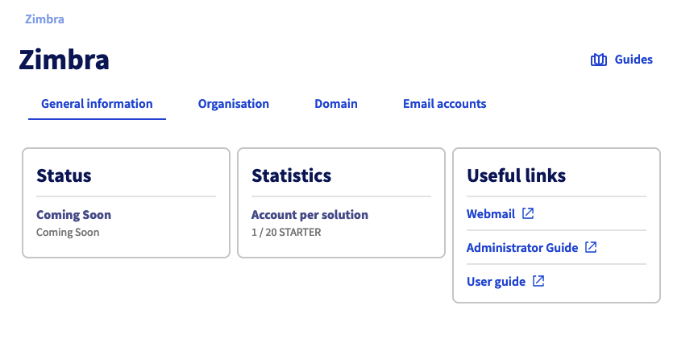

> [!primary]
> Questa traduzione è stata generata automaticamente dal nostro partner SYSTRAN. I contenuti potrebbero presentare imprecisioni, ad esempio la nomenclatura dei pulsanti o alcuni dettagli tecnici. In caso di dubbi consigliamo di fare riferimento alla versione inglese o francese della guida. Per aiutarci a migliorare questa traduzione, utilizza il pulsante "Contribuisci" di questa pagina.
>

> [!warning]
>
> **Importante**
>
> L'offerta Zimbra è un prodotto in fase beta.
>
> È disponibile solo per coloro che hanno compilato il [modulo di iscrizione alla beta](https://labs.ovhcloud.com/en/zimbra-beta/).
>
> Alcune delle funzionalità e dei limiti illustrati in questa guida potrebbero cambiare quando il prodotto viene immesso sul mercato.

## Obiettivo

Con l'offerta Zimbra, OVHcloud ti propone una piattaforma di messaggeria collaborativa open source che offre tutte le funzionalità necessarie ad un utilizzo professionale. In questa guida ti forniamo le informazioni necessarie per iniziare a configurare il tuo account email Zimbra.

**Questa guida ti mostra come iniziare a utilizzare il servizio di posta elettronica Zimbra**

## Prerequisiti

- Aver sottoscritto un account email sulla soluzione email Zimbra OVHcloud.
- Disporre di un [dominio OVHcloud](/links/web/domains).
- Avere accesso allo [Spazio Cliente OVHcloud](/links/manager).

## Procedura

### Accedi alla gestione del servizio

Per accedere al servizio Zimbra, accedi allo [Spazio Cliente OVHcloud](/links/manager) e clicca sulla scheda `Web Cloud`{.action}. Nella sezione `Email`{.action}, clicca su `Zimbra`{.action}.

{.thumbnail .w-400}

### Configura il servizio Zimbra

Prima di iniziare a configurare i tuoi account email Zimbra, ti consigliamo di prendere visione dei tre elementi che strutturano gerarchicamente il tuo servizio :

- [**Organizzazione**](#organizations) : permette di raggruppare i domini per associarli. 
- [**Dominio**](#domains) : è indispensabile per creare un account email. È necessario gestirne almeno uno dallo Spazio Cliente OVHcloud e aggiungerlo al servizio Zimbra.
- [**Account email**](#emails) : utilizzando i domini aggiunti al servizio Zimbra, è possibile creare un indirizzo email.

> [!primary]
>
> L'*organizzazione* viene utilizzata per rappresentare un'entità (un'azienda, un'associazione, un progetto personale e così via). Permette di suddividere gli account email, applicare policy di sicurezza specifiche (funzionalità in arrivo) e delegare i diritti a un'organizzazione (funzionalità in arrivo). L'utilizzo di organizzazioni permette di facilitare la navigazione nella piattaforma Zimbra e la sua gestione.

Il diagramma seguente riassume il collegamento gerarchico tra gli elementi sopra citati.

{.thumbnail .w-400}

### Organizzazioni 

Se aggiungi un numero elevato di domini sul tuo servizio Zimbra, può rivelarsi utile raggrupparli associandoli a una "organizzazione". Dal servizio Zimbra, clicca su `Organizzazione`{.action}.

{.thumbnail .w-400}

#### Crea un'organizzazione

Per creare un’organizzazione, clicca su `Aggiungi un’organizzazione`{.action}. Definisci il `Nome` dell’organizzazione e il `Label dell’organizzazione`, quest’ultimo rappresenta una breve descrizione dell’organizzazione che ti permette di identificarti quando filtri la visualizzazione dei nomi a dominio e degli account email del tuo servizio Zimbra.

{.thumbnail .w-400}

#### Filtra per organizzazione

Accedendo alle schede `Organizzazione`{.action}, `Dominio`{.action} e `Account email`{.action}, clicca sull’etichetta di un’organizzazione per creare un filtro che mostri solo gli elementi associati all’organizzazione. 
Il filtro viene applicato quando l'etichetta viene visualizzata accanto al nome del servizio Zimbra. 
Per rimuovere il filtro, fare semplicemente clic sulla croce del filtro.

{.thumbnail .w-400}

### Domini 

> [!warning]
>
> Per un funzionamento ottimale quando utilizzi lo stesso dominio tra le soluzioni OVHcloud [Exchange](/links/web/emails-hosted-exchange), [Email Pro](/links/web/email-pro) e Zimbra, è necessario configurare il dominio in `non-autoritativa`. Per sapere come configurare un dominio in modalità non autoritativa su una piattaforma Exchange o Email Pro, consulta la nostra guida [Aggiungere un dominio su una piattaforma e-mail](/pages/web_cloud/email_and_collaborative_solutions/microsoft_exchange/exchange_adding_domain).

In questa scheda vengono mostrati tutti i domini aggiunti al servizio Zimbra. Per poterli aggiungere, è necessario gestirli dallo Spazio Cliente OVHcloud.

Nella tabella dei domini trovi due informazioni :

- **Organizzazione** : questa data viene determinata al momento dell'aggiunta del dominio. Il label verrà visualizzato automaticamente in questa colonna.
- **Numero di account** : qui trovi tutti gli account creati con il nome di dominio corrispondente.

{.thumbnail .w-400}

#### Aggiungi un dominio

Per aggiungere un dominio al servizio Zimbra, clicca sulla scheda `Dominio`{.action} e poi su `Aggiungi un dominio`{.action}.

Seleziona un'organizzazione dal menu a tendina e seleziona un dominio dall'elenco (è necessario che i domini siano gestiti nello Spazio Cliente OVHcloud). Clicca su `Conferma`{.action} per aggiungere il dominio.

{.thumbnail .w-400 .h400}

### Account email 

Per gestire gli indirizzi email del servizio Zimbra accedi alla scheda `Account email`{.action}. Visualizzi una lista degli account email associati al tuo servizio e 3 informazioni per ognuno di essi :

- **Organizzazione** : se il dominio del tuo account email è associato a un'organizzazione, visualizzi automaticamente il suo label in questa colonna.
- **Offerta** : dato che il servizio Zimbra può ospitare diverse offerte Zimbra, è possibile trovare il servizio associato al tuo account email in questa colonna.
- **Dimensione** : questa colonna mostra la capacità totale del tuo account email e lo spazio occupato attualmente.

Nella parte superiore della pagina è inoltre disponibile un link alla [Webmail](/links/web/email) con cui è possibile accedere al contenuto del proprio account email direttamente dal browser Internet.

{.thumbnail .w-400}

#### Creare un account email

Per creare un account email sul tuo servizio Zimbra, clicca sulla scheda `Account email`{.action} e poi su `Crea un account`{.action}.

Inserisci le informazioni richieste.

- **Account email** : inserisci il *nome dell’account* che vuoi assegnare al tuo indirizzo email (ad esempio nome.cognome) e *seleziona un dominio* nel menu a tendina.

> [!warning]
>
> La scelta del nome dell’indirizzo email deve rispettare queste condizioni :
>
> - Minimo 2 caratteri
> - Massimo 32 caratteri
> - Nessun carattere accentato
> - Nessun carattere speciale eccetto i seguenti : `.`, `,`, `-` e `_`

- **Nome** : inserisci un nome.
- **Cognome** : inserisci un nome.
- **Nome da visualizzare** : inserisci il nome che comparirà come mittente dei messaggi inviati da questo indirizzo.
- **Password** : definisci una password complessa composta da (almeno) 9 caratteri, una maiuscola, una minuscola e una cifra. Per motivi di sicurezza, non utilizzare due volte la stessa password. Sceglierne uno che non contenga informazioni personali (ad esempio, non inserire cognome, nome e data di nascita). Cambialo regolarmente.

> [!warning]
>
> La scelta della password deve rispettare queste condizioni :
>
> - Minimo 10 caratteri
> - Massimo 64 caratteri
> - Minimo 1 maiuscolo
> - minimo 1 carattere speciale
> - Nessun carattere accentato

Clicca su `Conferma`{.action} per avviare la creazione dell’account.

{.thumbnail .w-400}

### Consultare il proprio account email 

Per consultare il tuo account email:

- Connettiti alla [webmail](/links/web/email) da un browser internet e inserisci il tuo indirizzo e-mail e la tua password. Per maggiori informazioni consulta la nostra pagina "[Utilizzare la webmail Zimbra](/pages/web_cloud/email_and_collaborative_solutions/mx_plan/email_zimbra)".
- Configura un client di posta sul tuo computer, smartphone o tablet. Consulta la nostra pagina "[Configurare un indirizzo email Zimbra su un client di posta](/pages/web_cloud/email_and_collaborative_solutions/zimbra/zimbra_mail_apps)".

## Per saperne di più 

[Configurare un indirizzo email Zimbra su un client di posta](/pages/web_cloud/email_and_collaborative_solutions/zimbra/zimbra_mail_apps)

[Webmail Zimbra](/pages/web_cloud/email_and_collaborative_solutions/mx_plan/email_zimbra)

[FAQ soluzione Zimbra OVHcloud](/pages/web_cloud/email_and_collaborative_solutions/mx_plan/faq-zimbra)

Per prestazioni specializzate (referenziamento, sviluppo, ecc...), contatta i [partner OVHcloud](/links/partner).

Per usufruire di un supporto per l'utilizzo e la configurazione delle soluzioni OVHcloud, è possibile consultare le nostre soluzioni [offerte di supporto](/links/support).

Contatta la nostra [Community di utenti](/links/community).