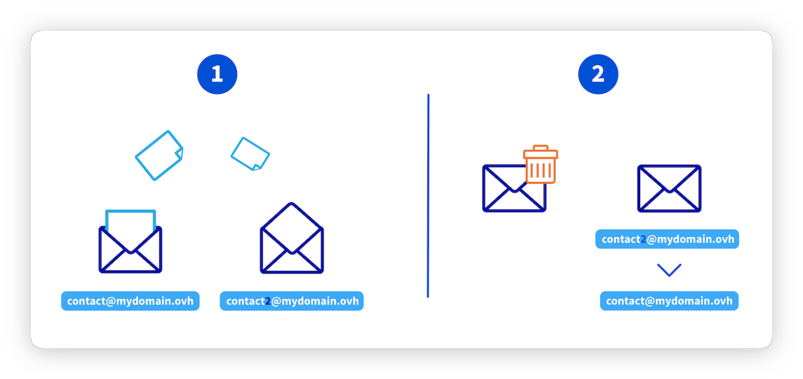
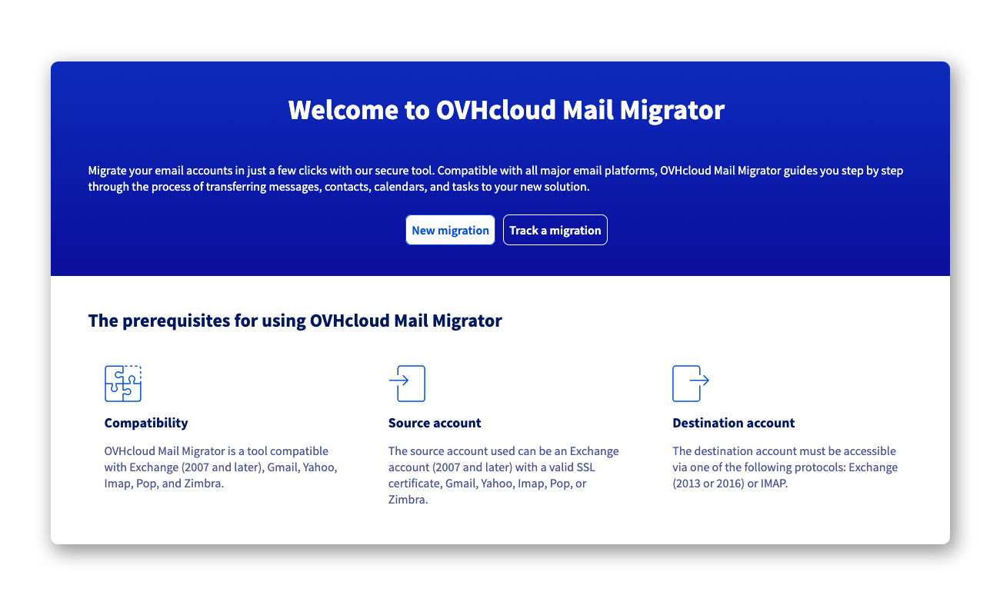
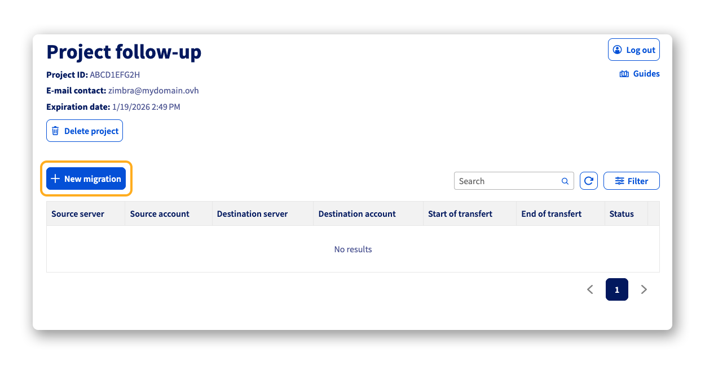
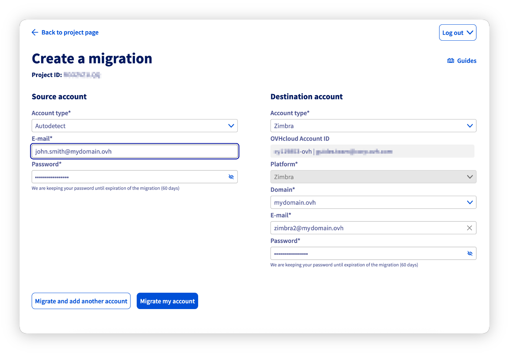
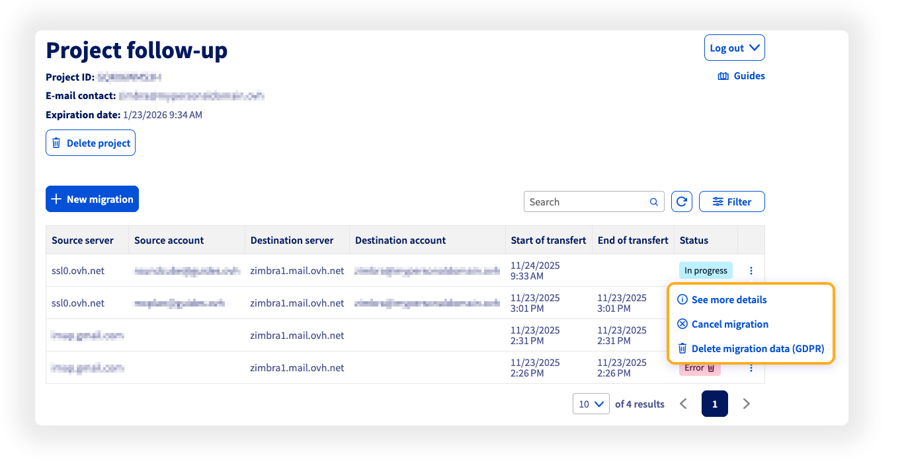

## Objetivo

Si desea cambiar su servicio de correo electrónico MX Plan por un servicio [Zimbra de OVHcloud](/links/web/zimbra), puede utilizar la herramienta [**O**VH **M**ail **M**igrator](/links/web/omm) para realizar su migración.

**Descubra cómo migrar una dirección de correo electrónico MX Plan a una cuenta Zimbra de OVHcloud.**

## Requisitos

- Disponer de una dirección de correo electrónico MX Plan (mediante el servicio MX Plan o incluida en un servicio de [alojamiento web de OVHcloud](/links/web/hosting)).
- Disponer de una cuenta de correo electrónico Zimbra de OVHcloud.
- **No haber configurado ninguna redirección en la dirección de correo electrónico MX Plan que desea migrar**.

<!-- CP-NAV-START:web-zimbra -->
---

### Acceso al área de cliente de OVHcloud

- **Enlace directo:** [Zimbra](/links/control-panel/web-zimbra)
- **Para acceder a sus servicios:** `Web Cloud`{.action} > `Zimbra Mail`{.action}

---
<!-- CP-NAV-END:web-zimbra -->

## Procedimiento

> [!warning]
>
> Si su cuenta de correo electrónico gestiona información sensible o si tiene problemas durante la migración, le recomendamos que espere a la implementación de la herramienta de automatización en el área de cliente de OVHcloud.

La migración de una cuenta de correo electrónico MX Plan a una cuenta de correo electrónico Zimbra se realiza en 2 etapas. Para evitar interrumpir la recepción de correos en la dirección original, es necesario seguir el proceso siguiente:

1. **[Transferir el contenido de la cuenta MX Plan a una cuenta Zimbra](#step1)**
    - [1.1 - Creación de una dirección de correo electrónico Zimbra](#step11)
    - [1.2 - Migración de los correos electrónicos con OVHcloud Mail Migrator](#step12)
    - [1.3 - Copia de seguridad de los correos electrónicos de la cuenta de origen (opcional)](#step13)
2. **[Eliminar la cuenta MX Plan original y reasignar su dirección a la cuenta Zimbra](#step2)**
    - [2.1 - Eliminación de la antigua dirección de correo electrónico MX Plan](#step21)
    - [2.2 - Cambio del nombre de la dirección de correo electrónico Zimbra](#step22)

En el ejemplo siguiente, migramos la dirección `contact@mydomain.ovh`. Para ello, vamos a crear la cuenta Zimbra con el nombre `contact2@mydomain.ovh`.

{.thumbnail}

### 1 - Transferir el contenido de la cuenta MX Plan a una cuenta Zimbra 

#### 1.1 - Creación de una dirección de correo electrónico Zimbra 

> [!primary]
>
> Si ya dispone de una dirección de correo electrónico Zimbra, vaya a la sección [Migración de los correos electrónicos con OVHcloud Mail Migrator](#step12).

En primer lugar, cree una dirección de correo electrónico con un nombre provisional. Por ejemplo, puede crear la dirección `contact2@mydomain.ovh` si necesita migrar la dirección `contact@mydomain.ovh`.

Para crear una dirección de correo electrónico Zimbra, consulte la sección «Crear una cuenta de correo electrónico» de nuestra guía [Primeros pasos con el servicio Zimbra](/pages/web_cloud/email_and_collaborative_solutions/zimbra/getting_started_zimbra).

#### 1.2 - Migración de los correos electrónicos con OVHcloud Mail Migrator 

Utilice la herramienta de migración [**O**VH **M**ail **M**igrator](/links/web/omm) (**OMM**) para transferir el contenido de la cuenta MX Plan original a la nueva cuenta de destino Zimbra, tomando como ejemplo el esquema mostrado anteriormente.

La migración con OMM se realiza en 3 pasos: crear un proyecto, configurar la migración y, a continuación, seguir su progreso. Haga clic en cada pestaña para ver las instrucciones correspondientes.

> [!tabs]
> **Paso 1**
>>
>> **Crear un proyecto de migración**
>>
>> Acceda a <https://omm.ovhcloud.com/> y haga clic en `Nueva migración`{.action}.
>>
>> {.thumbnail}
>>
>> - **Dirección de correo electrónico de contacto del proyecto**: Introduzca una dirección de correo electrónico que recibirá las credenciales de acceso y las notificaciones de seguimiento. No utilice una dirección que vaya a migrarse en este proyecto.
>> - **Contraseña del proyecto**: Defina una contraseña (mínimo 10 caracteres, con al menos 1 carácter especial, 1 número, 1 mayúscula y 1 minúscula).
>>
>> Haga clic en `Crear mi proyecto`{.action}. Recibirá un correo electrónico de confirmación con el identificador único del proyecto.
>>
> **Paso 2**
>>
>> **Conectarse al proyecto y crear la migración**
>>
>> Desde la página de inicio de [OMM](/links/web/omm), haga clic en `Seguir una migración`{.action}, introduzca el `Identificador del proyecto` y la `Contraseña del proyecto`, y haga clic en `Conectarse al proyecto`{.action}.
>>
>> A continuación, haga clic en `Nueva migración`{.action} para configurar su migración:
>>
>> {.thumbnail}
>>
>> - **Cuenta de origen**:
>>     - **Tipo de cuenta**: Seleccione `OVHcloud` y, a continuación, elija `MX Plan` o `Autodetección`. Haga clic en `Conectarse`{.action} para identificarse con su cuenta de OVHcloud y seleccionar automáticamente el servicio y la dirección que desea migrar (p. ej.: `john.smith@mydomain.ovh`). Introduzca a continuación la contraseña de esta cuenta de correo electrónico.
>> - **Cuenta de destino**:
>>     - **Tipo de cuenta**: Seleccione `OVHcloud` y, a continuación, elija `Zimbra`. Haga clic en `Conectarse`{.action} para identificarse con su cuenta de OVHcloud y seleccionar el servicio Zimbra y la dirección de destino (p. ej.: `zimbra2@mydomain.ovh`). Introduzca a continuación la contraseña de esta cuenta de correo electrónico.
>> - **Datos a transferir**: Verifique los tipos de datos compatibles y desmarque los que no desee migrar.
>> - **Inicio de la transferencia**: Elija `Inmediatamente` o marque `Más tarde` para programar la migración en una fecha y hora determinadas.
>>
>> Haga clic en `Migrar mi cuenta`{.action} para iniciar la migración.
>>
>> {.thumbnail}
>>
> **Paso 3**
>>
>> **Seguir la migración**
>>
>> Hay dos métodos para acceder al seguimiento de su proyecto de migración:
>>
>> - Desde el correo electrónico recibido al crear el proyecto, mediante el enlace proporcionado (el identificador del proyecto aparece rellenado previamente).
>> - Desde la página de inicio de [OMM](/links/web/omm): haga clic en `Seguir una migración`{.action}, introduzca su `Identificador del proyecto` y su `Contraseña del proyecto`, y haga clic en `Conectarse al proyecto`{.action}.
>>
>> Desde la página del proyecto, haga clic en el botón `⋮`{.action} a la derecha de la línea de su migración para ver las opciones:
>>
>> - `Ver más detalles`{.action}: Siga el progreso de la migración y consulte el informe una vez finalizada.
>> - `Cancelar la migración`{.action}: Cancela la migración en curso. Los elementos ya migrados se conservan en la cuenta de destino.
>> - `Eliminar mis datos de migración (RGPD)`{.action}: Activa la eliminación de todos los datos relacionados con la migración. La información sobre los eventos de la migración se conserva.
>>
>> {.thumbnail}

Para más información sobre el uso de OMM, consulte nuestra guía «[Migrar cuentas de correo electrónico mediante OVHcloud Mail Migrator](/pages/web_cloud/email_and_collaborative_solutions/migrating/migration_omm)».

> [!primary]
>
> El tiempo de migración varía en función del volumen de datos y puede oscilar entre unos minutos y varias horas. Una vez finalizada la migración, compruebe que todos los correos electrónicos se han migrado correctamente.

#### 1.3 - Copia de seguridad de los correos electrónicos de la cuenta de origen (opcional) 

> [!warning]
>
> Antes de eliminar su cuenta MX Plan, **realice una copia de seguridad de sus correos electrónicos** para evitar cualquier pérdida de datos.

Utilice las opciones de exportación de su cliente de correo electrónico. En nuestra guía «[Migrar manualmente su dirección de correo electrónico](/pages/web_cloud/email_and_collaborative_solutions/migrating/manual_email_migration)», encontrará los detalles de exportación manual de una dirección de correo electrónico desde un cliente de correo.

### 2 - Eliminar la cuenta MX Plan original y reasignar su dirección a la cuenta Zimbra 

#### 2.1 - Eliminación de la antigua dirección de correo electrónico MX Plan 

Para eliminar la dirección de correo electrónico MX Plan (p. ej.: `contact@mydomain.ovh`), siga nuestra guía «[Eliminar una cuenta de correo electrónico](/pages/web_cloud/email_and_collaborative_solutions/common_email_features/email_reset_account)».

> [!warning]
>
> Si está migrando desde una cuenta MX Plan que utiliza el webmail Zimbra, espere 5 minutos para que la eliminación sea efectiva antes de cambiar el nombre de la segunda cuenta de correo electrónico.

#### 2.2 - Cambio del nombre de la dirección de correo electrónico Zimbra 

En su área de cliente de OVHcloud, acceda a su servicio Zimbra y cambie el nombre de la dirección de correo electrónico Zimbra provisional por la dirección MX Plan migrada. Retomando el ejemplo del paso 2 del capítulo 1.2, la dirección provisional `zimbra2@mydomain.ovh` pasará a llamarse `john.smith@mydomain.ovh`, que es su dirección de correo electrónico habitual.

### Conclusión 

Su cuenta de correo electrónico ya ha sido migrada a Zimbra. Para finalizar la configuración, consulte las guías siguientes:

- [Primeros pasos con el servicio Zimbra](/pages/web_cloud/email_and_collaborative_solutions/zimbra/getting_started_zimbra)
- [Configurar su dirección de correo electrónico Zimbra en un cliente de correo electrónico](/pages/web_cloud/email_and_collaborative_solutions/zimbra/zimbra_mail_apps)

## Más información 

[FAQ sobre la solución Zimbra de OVHcloud](/pages/web_cloud/email_and_collaborative_solutions/mx_plan/faq-zimbra)

Para servicios especializados (posicionamiento, desarrollo, etc.), contacte con los [partners de OVHcloud](/links/partner).

Si desea disfrutar de ayuda para utilizar y configurar sus soluciones de OVHcloud, puede consultar nuestras distintas [soluciones de soporte](/links/support).

Interactúe con nuestra [comunidad de usuarios](/links/community).
