

## Wprowadzenie

Konta e-mail Zimbra mogą być skonfigurowane w różnych kompatybilnych z nimi programach poczty. Dzięki temu możesz korzystać ze swojego adresu e-mail z wybranego urządzenia. Zimbra zawiera funkcję kalendarza online, który można zsynchronizować z oprogramowaniem kompatybilnym z protokołem CalDAV.

**Dowiedz się, jak dodać kalendarz Zimbra do aplikacji przy użyciu protokołu CalDAV.**

## Wymagania początkowe

- Posiadanie adresu e-mail Zimbra OVHcloud.
- Zainstalowanie aplikacji obsługującej protokół kalendarza CalDAV.
- Dane do logowania do adresu e-mail przypisanego do kalendarza, który chcesz skonfigurować.

## W praktyce

### Co to jest protokół CalDAV?

CalDAV to protokół edycji kalendarza i zadań online. Adresy e-mail Zimbra mają kalendarze korzystające z protokołu CalDAV.

Konfiguracja kalendarza CalDAV jest podobna do konfiguracji adresu e-mail i wymaga aplikacji obsługującej ten protokół.

### Udostępnianie kalendarza

> [!warning]
>
> Niniejszy rozdział dotyczy wyłącznie ofert [Zimbra Starter lub Pro](/links/web/emails), które posiadają funkcję udostępniania kalendarza.

#### Publiczne udostępnianie w formacie ICS

> [!primary]
>
> Format pliku ICS używany tutaj jest statyczny: wersja pliku odpowiada momentowi, w którym użytkownik generuje link. Oznacza to, że wydarzenie dodane po wygenerowaniu linku do pliku ICS nie będzie widoczne w pliku ani w kalendarzu, do którego zostanie zaimportowany. Brak jest synchronizacji.

Aby wygenerować link do pliku ICS, wykonaj poniższe kroki:

- Zaloguj się do swojego adresu e-mail Zimbra za pomocą [webmaila](/links/web/email).
- Przejdź do zakładki `Kalendarz`{.action}.
- Kliknij prawym przyciskiem myszy na kalendarz i kliknij `Udostępnij...`{.action}.
- Kliknij na zakładkę `Upublicznij`{.action}.
- Zaznacz pole `Wygeneruj łącze publiczne`{.action}, skopiuj lub otwórz link w nowej karcie i pobierz plik ICS.

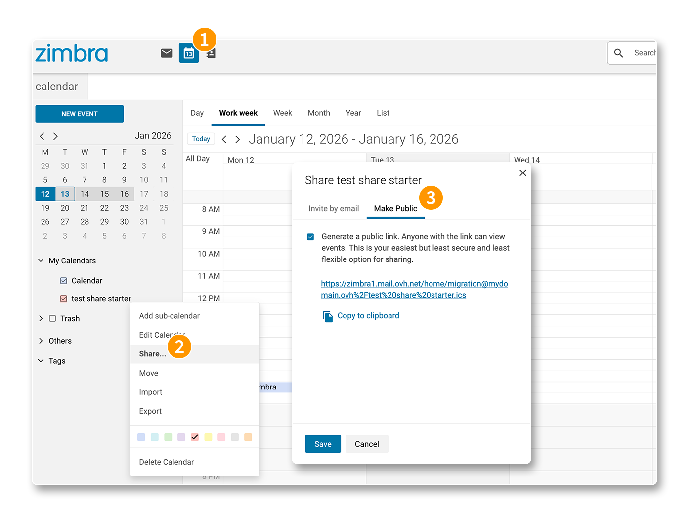{.thumbnail .w-600 .h-600}

Plik ICS, który pobrałeś, może zostać zaimportowany do istniejącego lub nowego kalendarza.

#### Udostępnianie za pomocą zaproszenia e-mail

W przeciwieństwie do udostępniania pliku ICS, udostępnianie za pomocą zaproszenia e-mail umożliwia dynamiczne udostępnianie kalendarza innym adresom e-mail w tej samej domenie. Wydarzenia i działania na udostępnionym kalendarzu będą zsynchronizowane.

> [!warning]
>
> Tylko adresy e-mail w tej samej domenie mogą otrzymywać ten rodzaj udostępnienia.

Aby rozpocząć udostępnianie innemu adresowi e-mail:

- Zaloguj się do swojego adresu e-mail Zimbra za pomocą [webmaila](/links/web/email).
- Przejdź do zakładki `Kalendarz`{.action}.
- Kliknij prawym przyciskiem myszy na kalendarz i kliknij `Udostępnij...`{.action}.
- Kliknij na zakładkę `Zaprosić przez email`{.action}.

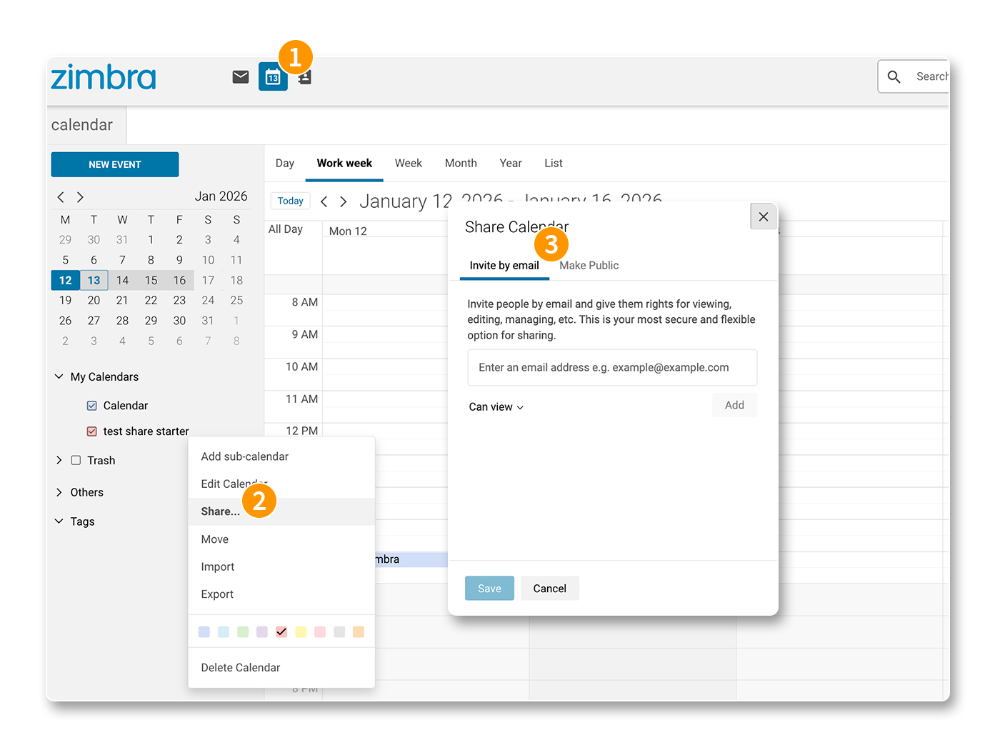{.thumbnail .w-600 .h-600}

Wykonaj poniższe kroki, aby udostępnić kalendarz jednemu lub wielu adresom e-mail:

> [!tabs]
> **Krok 1**
>>
>> Wpisz adres e-mail, z którym chcesz udostępnić kalendarz.
>>
>> 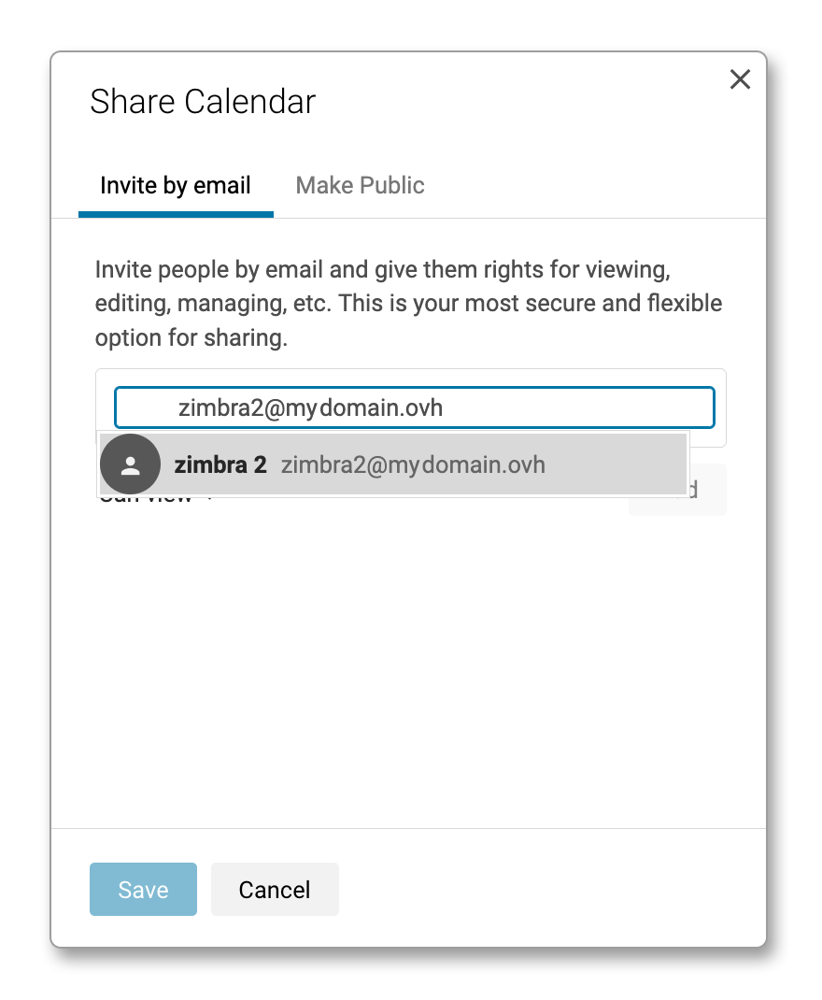{.thumbnail .w-600 .h-600}
>>
> **Krok 2**
>>
>> Ustaw uprawnienia konta e-mail do kalendarza, a następnie kliknij `Dodaj`{.action}.
>>
>> 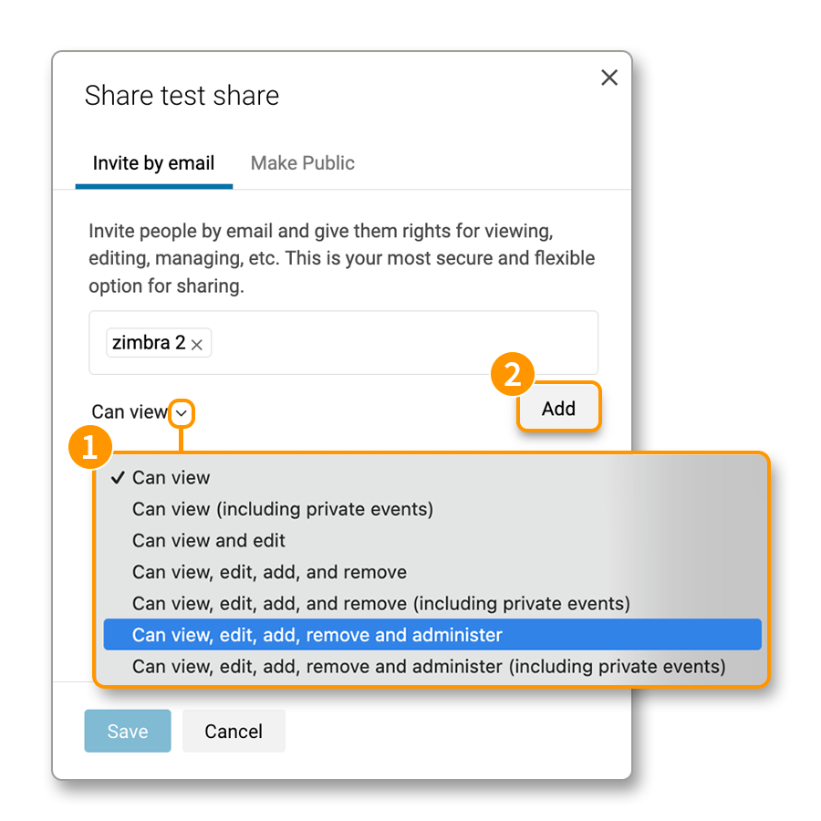{.thumbnail .w-600 .h-600}
>>
> **Krok 3**
>>
>> Powtórz kroki 1 i 2, aby udostępnić ten sam kalendarz innym adresom e-mail w tej samej domenie, a następnie kliknij `Zapisz`{.action}.
>>
>> 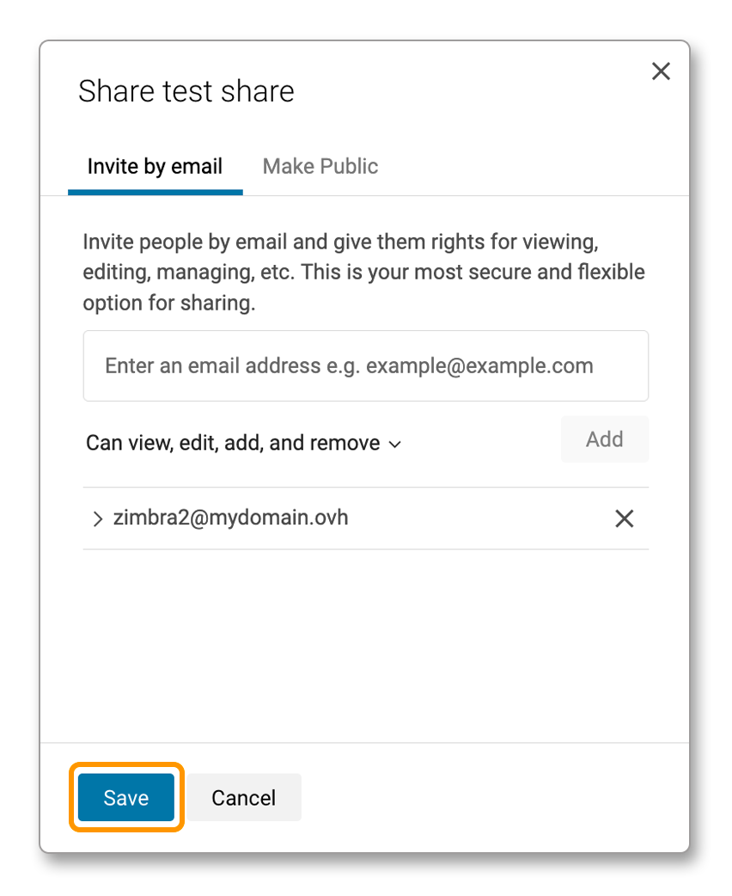{.thumbnail .w-600 .h-600}
>>
> **Krok 4**
>>
>> Każdy odbiorca udostępnienia otrzymuje wiadomość e-mail, która umożliwia zaakceptowanie lub odrzucenie udostępnionego kalendarza. Wiadomość ta również wskazuje prawa przypisane do tego kalendarza.
>>
>> 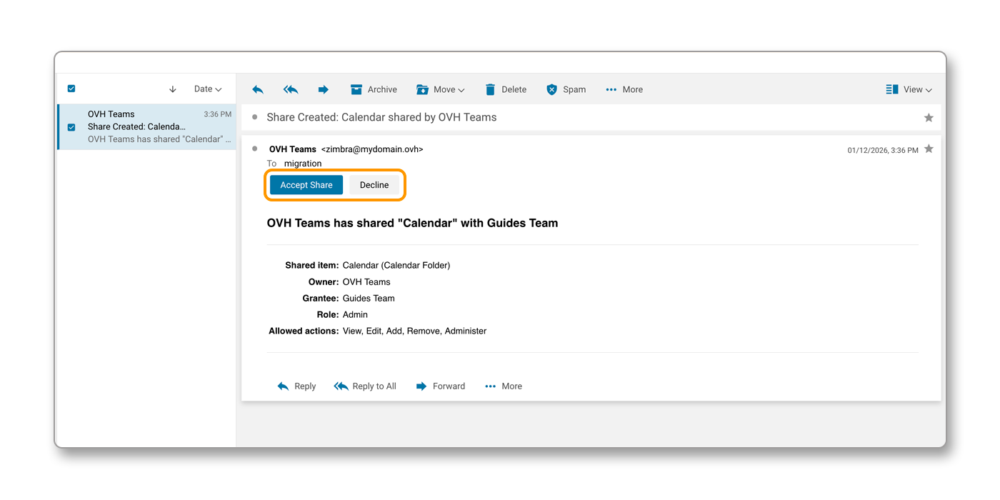{.thumbnail .w-600 .h-600}

> [!primary]
>
> Jeśli udostępniasz swój kalendarz innemu adresowi e-mail w tej samej domenie, który korzysta z webmaila Roundcube (oferta MX Plan) lub OWA (oferty E-mail Pro i Exchange), adres e-mail odbiorcy otrzymuje link do webmaila Zimbra, który umożliwia utworzenie konta "gościa" do przeglądania kalendarza.
>
> 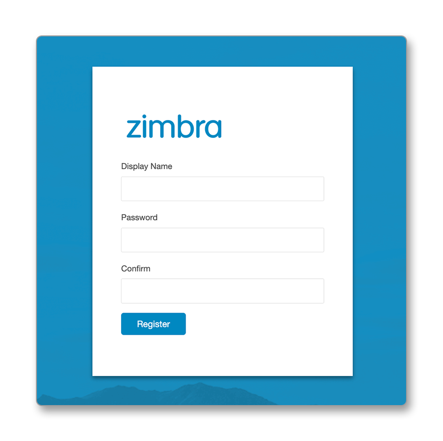{.thumbnail .w-600 .h-600}

### Konfiguracja kalendarza CalDAV w kompatybilnym programie

Wybraliśmy stabilne aplikacje kompatybilne z protokołem CalDAV.

- **Dla systemu Windows**: Zapoznaj się z rozdziałem [Dodaj kalendarz do Thunderbirda](#thunderbird)
- **Dla systemu macOS**: Zapoznaj się z rozdziałem [Dodaj kalendarz na macOS](#apple-macos) lub [Dodaj kalendarz na Thunderbirdzie](#thunderbird)
- **Dla systemu Linux**: Zapoznaj się z rozdziałem [Dodaj kalendarz do Thunderbirda](#thunderbird)
- **Na iPhone'a i iPada**: Zapoznaj się z rozdziałem [Dodaj kalendarz na iOS i iPadOS](#apple-ios)
- **Dla systemu Android**: Zapraszamy do zapoznania się z przewodnikiem [Zimbra - Konfiguracja konta e-mail w aplikacji mobilnej Zimbra](/pages/web_cloud/email_and_collaborative_solutions/zimbra/mail_app_zimbra_for_android_ios).

> [!warning]
>
> Urządzenia z systemem Android obecnie nie obsługują natywnie protokołu CalDAV. Nie znaleźliśmy również stabilnej aplikacji innej firmy, która mogłaby synchronizować kalendarze Zimbra naszych ofert.
>
> Tylko aplikacja Zimbra, oparta na jej Webmailu, umożliwia przeglądanie kalendarzy online na urządzeniu Android.

#### Ustawienia ogólne kalendarza CalDAV Zimbra 

Jeśli używasz aplikacji kompatybilnej z protokołem CalDAV, poniżej przedstawiamy ogólne parametry, które należy znać podczas konfigurowania kalendarza CalDAV Zimbra:

- **Serwer / Adres / URL**: wprowadź wartość `zimbra1.mail.ovh.net`. W przypadku niektórych programów konieczne jest dodanie protokołu "https" w adresie, wpisz wartość `https://zimbra1.mail.ovh.net`.
- **Nazwa użytkownika**: wprowadź pełny adres e-mail skojarzony z kalendarzem.
- **Hasło**: wprowadź hasło przypisane do adresu e-mail kalendarza.

### Dodaj kalendarz w Thunderbirdzie 

> [!primary]
>
> [Mozilla Thunderbird](https://www.thunderbird.net/) jest dostępna dla systemów Windows, macOS i Linux. Poniższe etapy instalacji zostały przeprowadzone z poziomu macOS, ale dotyczą w taki sam sposób systemów Windows i Linux.

Otwórz Thunderbirda i kliknij ikonę "Kalendarz" w kolumnie po lewej stronie.

Postępuj zgodnie z kolejnymi instrukcjami, klikając poniższe zakładki:

> [!tabs]
> **Etap 1**
>>
>> - Kliknij `Nowy kalendarz`{.action} na dole kolumny kalendarza lub kliknij prawym przyciskiem myszy istniejący kalendarz i wybierz `Nowy kalendarz`{.action} z menu rozwijanego, które się wyświetli.
>> - Wybierz `W sieci`, a następnie kliknij `Dalej`{.action}.
>>
>> 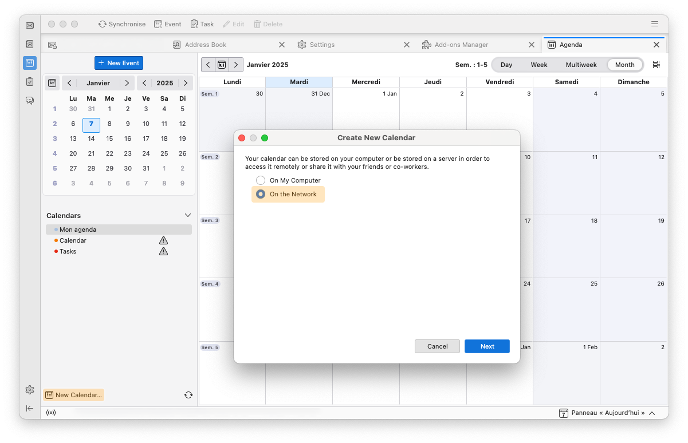{.thumbnail .w-600 .h-600}
>>
> **Etap 2**
>>
>> Wpisz informacje dotyczące logowania do kalendarza:
>>
>> - **Nazwa użytkownika**: wprowadź pełny adres e-mail skojarzony z kalendarzem.
>> - **Adres**: wprowadź wartość `zimbra1.mail.ovh.net`.
>> - **Ten adres nie prosi o podanie identyfikatora logowania**: niech to pole nie jest zaznaczone. Zostanie wyświetlony monit o wprowadzenie hasła dla podanego powyżej adresu e-mail.
>> - **Obsługa trybu offline**: możesz pozostawić tę opcję zaznaczoną.
>>
>> Kliknij przycisk `Znajdź kalendarze`{.action}, aby rozpocząć synchronizację kalendarza. Wpisz hasło przypisane do nazwy użytkownika w oknie, które się wyświetli i potwierdź wpisanie.
>>
>> 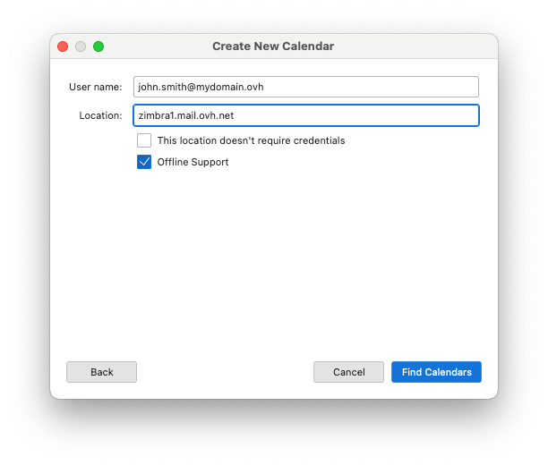{.thumbnail .w-600 .h-600}
>>
> **Etap 3**
>>
>> Poniższe okno pojawi się z elementami CalDAV obecnymi na koncie e-mail Zimbra. Zaznacz elementy, które chcesz umieścić w kalendarzu Thunderbirda i kliknij przycisk `Zaloguj się`{.action}, aby zakończyć konfigurację.
>>
>> 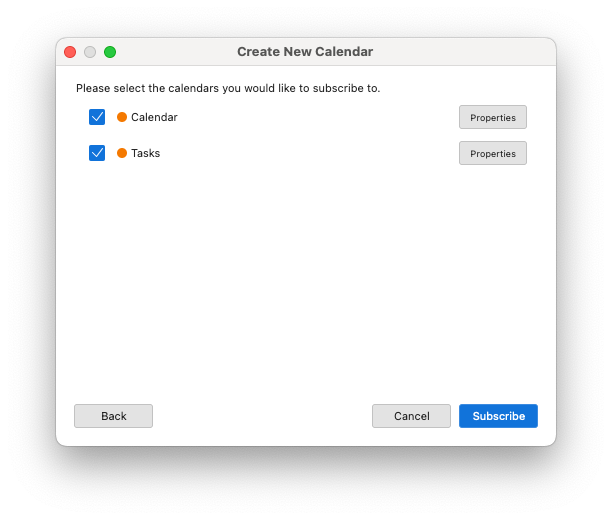{.thumbnail .w-600 .h-600}
>>

### Dodaj kalendarz na iOS i iPadOS 

> [!warning]
>
> Poniższa konfiguracja została wykonana z iPhone'a. Operacja przebiega jednak tak samo z poziomu iPada.

Aby dodać kalendarz CalDAV do aplikacji Apple `Kalendarz` na urządzeniu iPhone lub iPad, wykonaj kolejne kroki instalacji, klikając poniższe zakładki:

> [!tabs]
> **Etap 1**
>>
>> Przejdź do `Ustawienia`{.action} telefonu iPhone lub iPad. Aby odnaleźć sekcję `Kalendarz`{.action}, przewiń menu lub wpisz "Kalendarz" na pasku wyszukiwania ustawień.
>>
>> 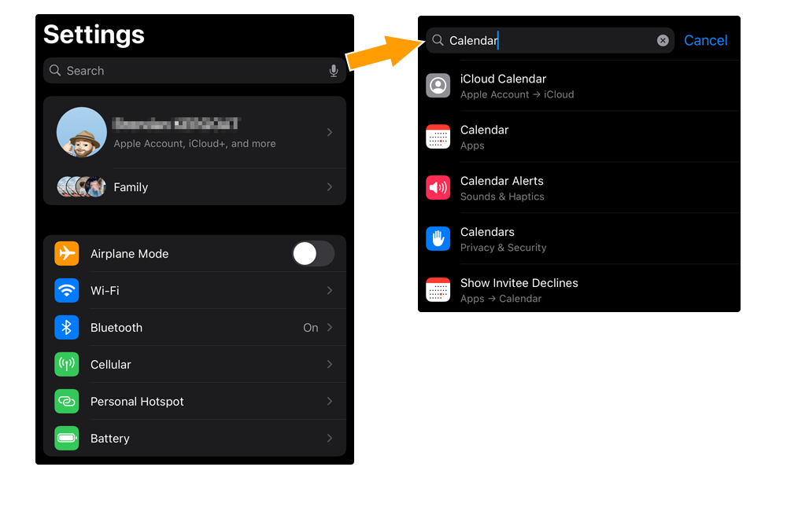{.thumbnail .w-600 .h-600}
>>
> **Etap 2**
>>
>> Przejdź do `Konta kalendarza`{.action} i wybierz `Dodaj konto`{.action}.
>>
>> 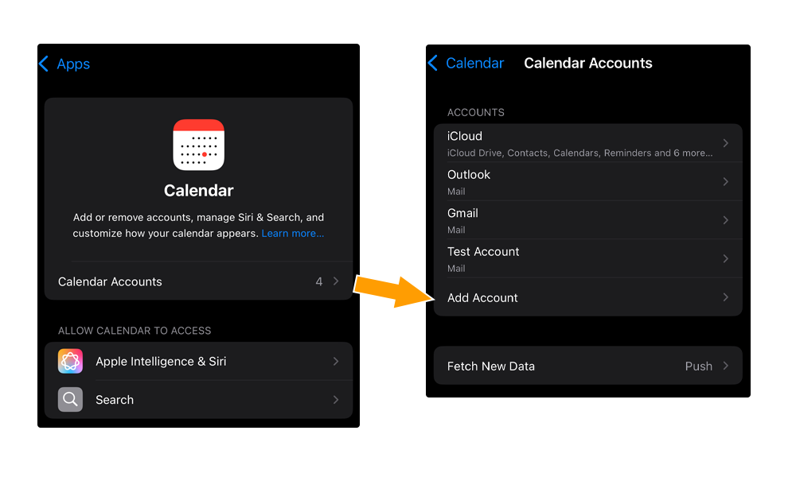{.thumbnail .w-600 .h-600}
>>
> **Etap 3**
>>
>> Wybierz `Inne`{.action}, następnie wybierz `Dodaj konto CalDAV`{.action} w sekcji "KALENDARZ".
>>
>> 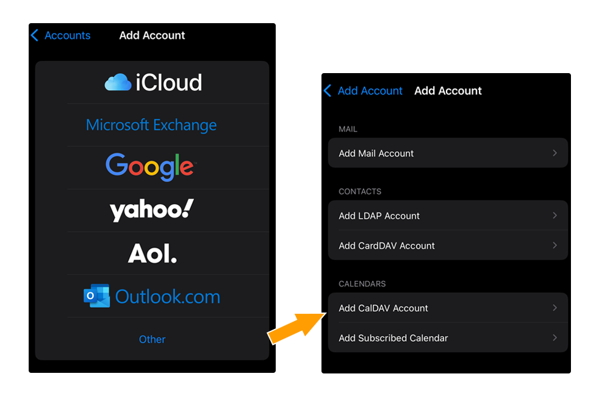{.thumbnail .w-600 .h-600}
>>
> **Etap 4**
>>
>> Wpisz informacje dotyczące logowania do kalendarza:
>>
>> - **Serwer**: wprowadź wartość `zimbra1.mail.ovh.net`.
>> - **Nazwa użytkownika**: wprowadź pełny adres e-mail skojarzony z kalendarzem.
>> - **Hasło**: wprowadź hasło przypisane do konta e-mail.
>> - **Opis**: dodaj opis do kalendarza.
>>
>> Zatwierdź przyciskiem `Dalej`{.action}.
>>
>> Wybierz aplikacje `Kalendarz` i `Przypomnienie`, które będą używać informacji z kalendarza Zimbra.
>>
>> 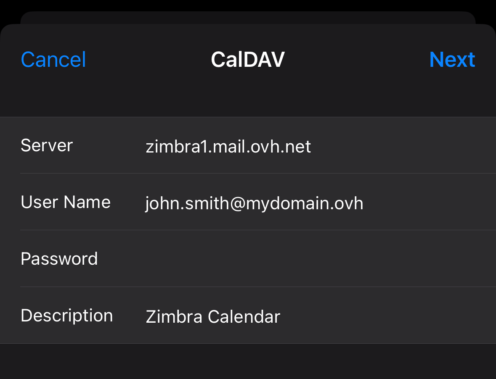{.thumbnail .w-600 .h-600}
>>

### Dodaj kalendarz na macOS 

Aby dodać kalendarz CalDAV do aplikacji Apple `Kalendarz` na komputerze Mac, uruchom aplikację i wykonaj kroki instalacji, klikając poniższe zakładki:

> [!tabs]
> **Etap 1**
>>
>> Kliknij `Kalendarz`{.action} na górnym pasku menu, następnie `Dodaj konto`{.action}. Wybierz `Dodaj konto CalDAV`, a następnie kliknij `Kontynuuj`{.action}.
>>
>> 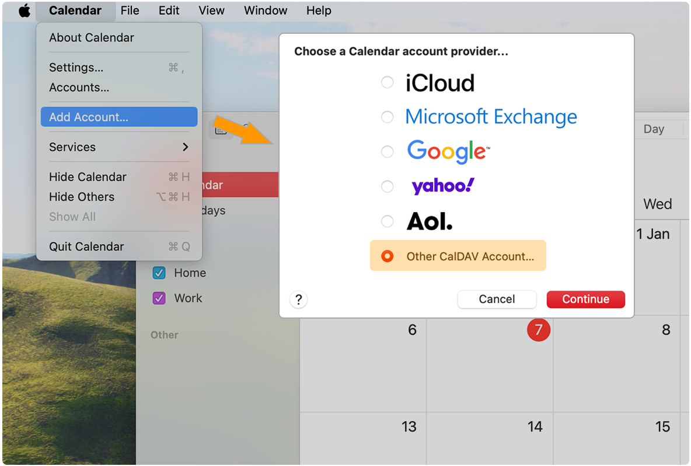{.thumbnail .w-600 .h-600}
>>
> **Etap 2**
>>
>> W oknie konfiguracyjnym uzupełnij następujące informacje:
>>
>> - **Typ konta**: wybierz `Ręczny` z menu rozwijanego.
>> - **Nazwa użytkownika**: wprowadź pełny adres e-mail skojarzony z kalendarzem.
>> - **Hasło**: wprowadź hasło przypisane do konta e-mail.
>> - **Adres serwera**: wprowadź wartość `zimbra1.mail.ovh.net`.
>>
>> Aby zakończyć operację, kliknij przycisk `Zaloguj się`{.action}.
>>
>> 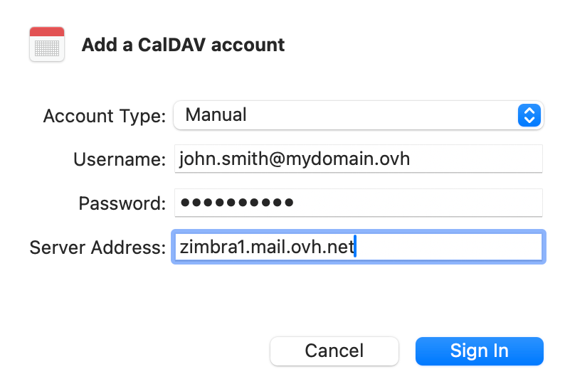{.thumbnail .w-600 .h-600}
>>

## Sprawdź również 

[Pierwsze kroki z ofertą Zimbra](/pages/web_cloud/email_and_collaborative_solutions/zimbra/getting_started_zimbra)

[Konfiguracja konta e-mail Zimbra w programie pocztowym](/pages/web_cloud/email_and_collaborative_solutions/zimbra/zimbra_mail_apps)

[Skorzystaj z poczty Zimbra Webmail](/pages/web_cloud/email_and_collaborative_solutions/mx_plan/email_zimbra)

[FAQ dotyczący rozwiązania Zimbra OVHcloud](/pages/web_cloud/email_and_collaborative_solutions/mx_plan/faq-zimbra)

W przypadku wyspecjalizowanych usług (pozycjonowanie, rozwój, etc.) skontaktuj się z [partnerami OVHcloud](/links/partner).

Jeśli chcesz otrzymywać wsparcie w zakresie konfiguracji i użytkowania Twoich rozwiązań OVHcloud, zapoznaj się z naszymi [ofertami pomocy](/links/support).

Dołącz do [grona naszych użytkowników](/links/community).