

## Obiettivo

I conti e-mail Zimbra Pro dispongono di uno spazio di archiviazione, chiamato **Malette**, che si può utilizzare per scambiare file tramite la funzione WebDAV. Questa funzione è disponibile tramite il Webmail Zimbra e può essere configurata anche sul tuo computer per far apparire la Malette come un volume di archiviazione.

**Scopri come montare una cartella WebDAV Zimbra sul tuo computer.**

## Prerequisiti

- Disporre di un indirizzo e-mail [Zimbra Pro](/links/web/emails) OVHcloud.
- Disporre di un computer Windows o macOS.
- Possedere le credenziali relative all'indirizzo e-mail associato al conto Zimbra Pro interessato.

## Procedura

WebDAV (Web-based Distributed Authoring and Versioning) è un'estensione del protocollo HTTP che permette di gestire da remoto file su un server e di modificarli come se fossero locali.

Lo spazio di archiviazione assegnato al tuo conto e-mail Zimbra è suddiviso tra le tue e-mail e i file presenti nella Malette. Ogni file caricato nella Malette Zimbra non può superare i 100 MB.

In questa documentazione utilizzeremo l'indirizzo e-mail di esempio `john.smith@mydomain.ovh` e la cartella della Malette che monteremo sarà la cartella `Briefcase`, che è presente per default.

### Montare una cartella da Windows

Prima di poterti connettere alla tua cartella WebDAV dal file manager di Windows, è necessario abilitare e configurare i servizi necessari per la connessione a un volume WebDAV.

#### 1. Abilitare il servizio WebClient

> [!tabs]
> **Passo 1**
>>
>> - Apri `Servizi`{.action} dal menu Start di Windows.
>>
>> 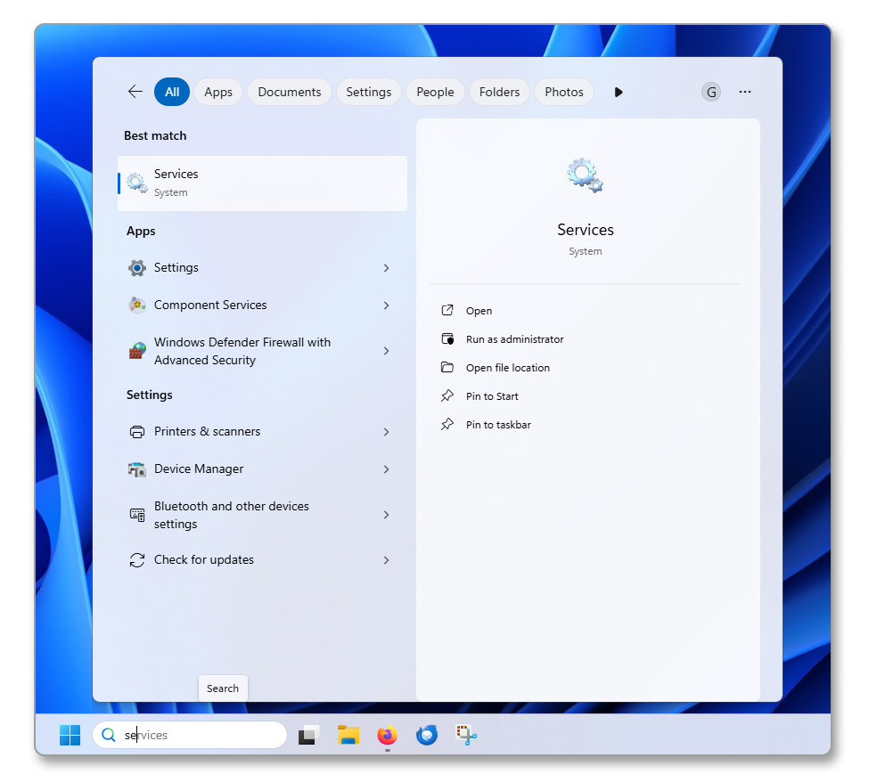{.thumbnail .w-600}
>>
> **Passo 2**
>>
>> 1. Individua il servizio **WebClient** nell'elenco.
>> 2. Fai clic destro su **WebClient**, quindi clicca su `Proprietà`{.action}.
>> 3. Cambia il *Tipo di avvio* in **Automatico**.
>> 4. Clicca su `Avvia`{.action} per avviare il servizio, quindi clicca su `OK`{.action} per confermare le modifiche.
>>
>> 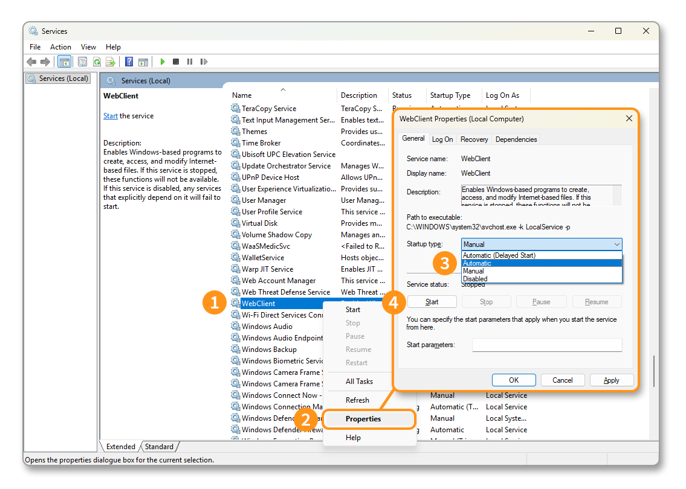{.thumbnail .w-600}

#### 2. Modificare la chiave di registro WebClient

> [!tabs]
> **Passo 1**
>>
>> - Apri l'`Editor del Registro`{.action} dal menu Start di Windows.
>>
>> 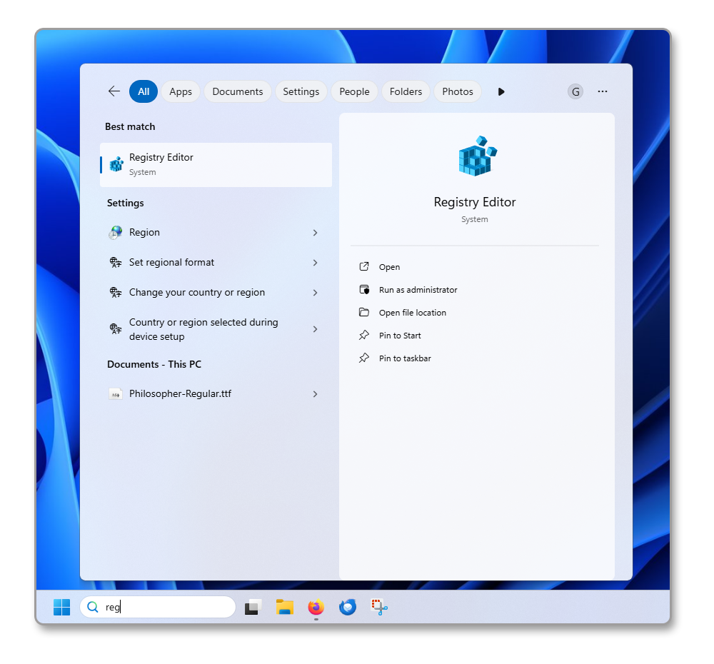{.thumbnail .w-600}
>>
> **Passo 2**
>>
>> 1. Individua il servizio **WebClient** nell'albero `HKEY_LOCAL_MACHINE\SYSTEM\CurrentControlSet\Services\WebClient\Parameters\BasicAuthLevel`.
>> 2. Fai doppio clic sulla chiave del registro `BasicAuthLevel`.
>> 3. Cambia il *Valore dati*: di default impostato su `1`, sostituiscilo con il valore `2` e clicca su `OK`{.action} per confermare le modifiche.
>>
>> 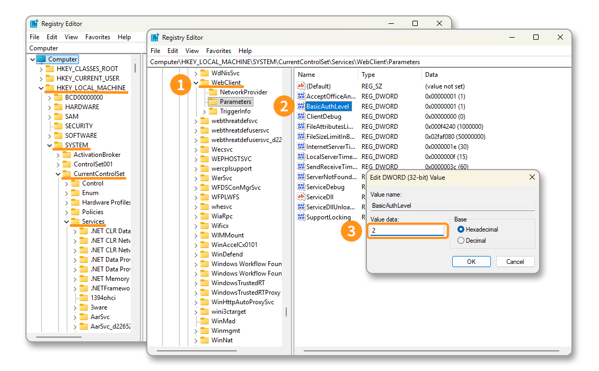{.thumbnail .w-600}

#### 3. Importare il certificato SSL del server Zimbra

> [!primary]
>
> Per esportare il certificato SSL, abbiamo utilizzato il browser [Mozilla Firefox](https://www.firefox.com/).

> [!tabs]
> **Passo 1**
>>
>> 1. Apri il tuo browser Internet, carica la pagina https://zimbra1.mail.ovh.net/, quindi clicca sull'icona del lucchetto nella barra degli indirizzi.
>> 2. Clicca su `Connessione sicura`{.action}.
>> 3. Clicca su `Ulteriori informazioni`{.action}.
>>
>> 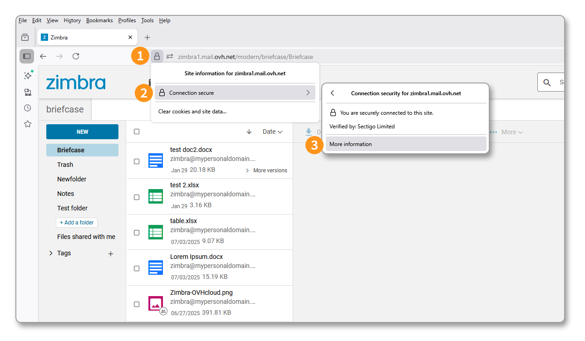{.thumbnail .w-600}
>>
> **Passo 2**
>>
>> 1. Clicca su `Mostra certificato`{.action}.
>> 2. Dalla finestra che appare, rimani sull'etichetta `zimbra1.mail.ovh.net` e clicca su `PEM (cert)`{.action} per scaricare il certificato SSL.
>>
>> 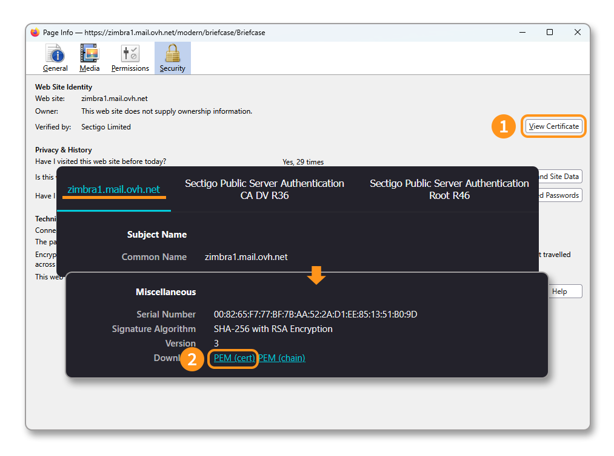{.thumbnail .w-600}
>>
> **Passo 3**
>>
>> - Modifica l'estensione del file da `.pem` a `.cer`.
>>
>> 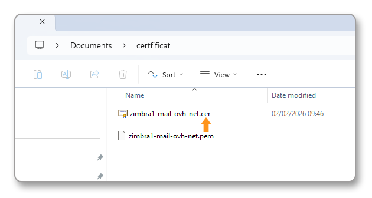{.thumbnail .w-600}
>>
> **Passo 4**
>>
>> 1. Apri il file `zimbra1-mail-ovh-net.cer`, quindi clicca su `Installa certificato…`{.action}.
>> 2. Clicca su `Computer locale`{.action}, quindi clicca su `Avanti`{.action}.
>> 3. Seleziona `Inserisci tutti i certificati nel seguente archivio`, quindi clicca su `Sfoglia…`{.action}.
>> 4. Seleziona la cartella `Autorità di certificazione radice attendibili`, quindi clicca su `OK`{.action}.
>>
>> 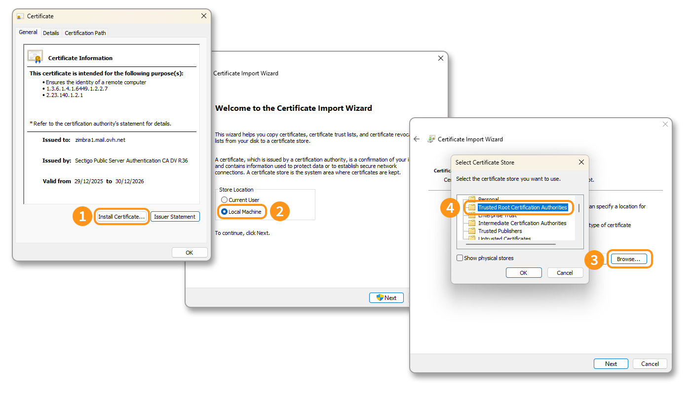{.thumbnail .w-600}

#### 4. Montare il volume

Nel nostro esempio, utilizziamo l'indirizzo e-mail del conto Zimbra `john.smith@mydomain.ovh` e la cartella `Briefcase`, creata per default nello spazio di archiviazione di Zimbra.

1. Apri il file manager di Windows e clicca su `Questo PC`{.action}.
2. Nella barra superiore, clicca sul pulsante `…`{.action}, quindi su `Connetti unità di rete`{.action}.
3. Nella finestra che appare, inserisci il percorso della cartella. Secondo il nostro esempio, il percorso è `\\zimbra1.mail.ovh.net@SSL\dav\john.smith@mydomain.ovh\Briefcase`. Clicca su `Fine`{.action}.
4. Una finestra di autenticazione si apre, inserisci il `Nome utente` che corrisponde all'indirizzo e-mail completo e la `Password` associata. Clicca su `OK`{.action}.

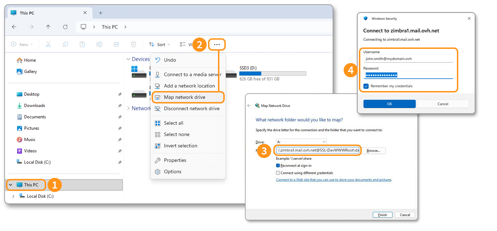{.thumbnail .w-600}

Il tuo volume di rete appare ora. Puoi depositarvi i tuoi file, entro il limite di 100 MB per file.

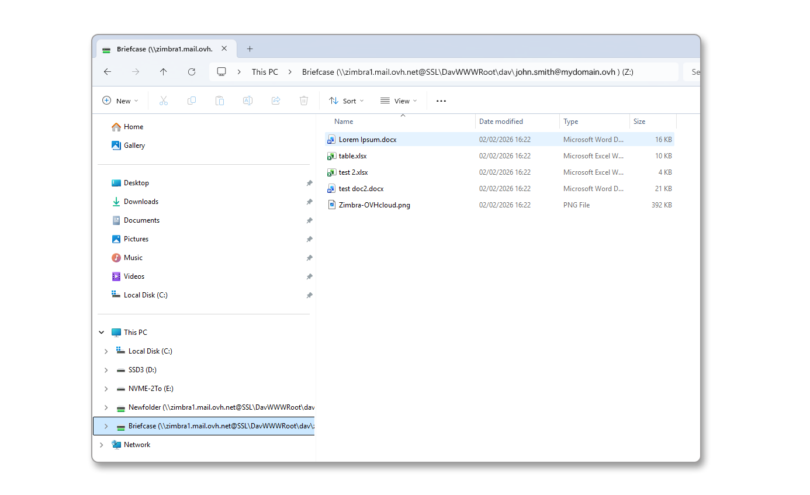{.thumbnail .w-600}

### Montare una cartella da macOS

Su macOS, non è necessario abilitare un servizio o registrare il certificato SSL, basta montare il volume direttamente dal **Finder**.

> [!tabs]
> **Passo 1**
>>
>> - Apri il **Finder**.
>> - Nella barra superiore, clicca sul menu `Vai`{.action}.
>> - Clicca su `Connetti al server`{.action} (`⌘ + K`).
>>
>> 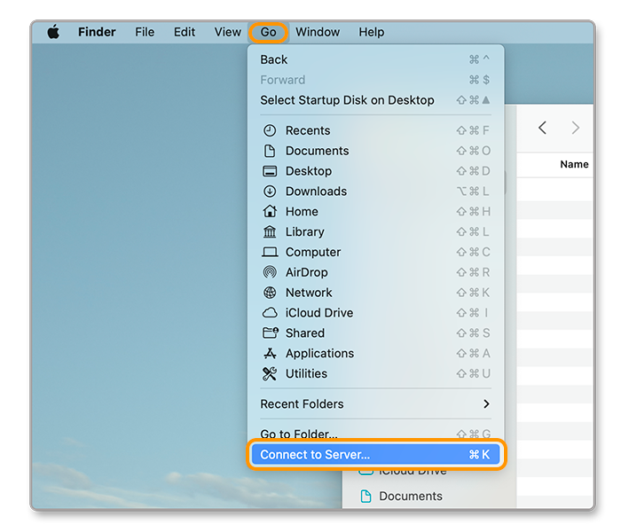{.thumbnail .w-600}
>>
> **Passo 2**
>>
>> > [!warning]
>> >
>> > È importante sostituire il `@` del tuo indirizzo e-mail con `%40` nell'inserimento del percorso di accesso.
>>
>> - Dalla finestra che appare, inserisci il percorso di connessione adatto al tuo indirizzo e-mail e alla cartella che desideri collegare. Secondo il nostro esempio, il percorso è `https://zimbra1.mail.ovh.net/dav/john.smith%40mydomain.ovh/Briefcase`.
>> - Clicca su `Connetti`{.action}.
>>
>> 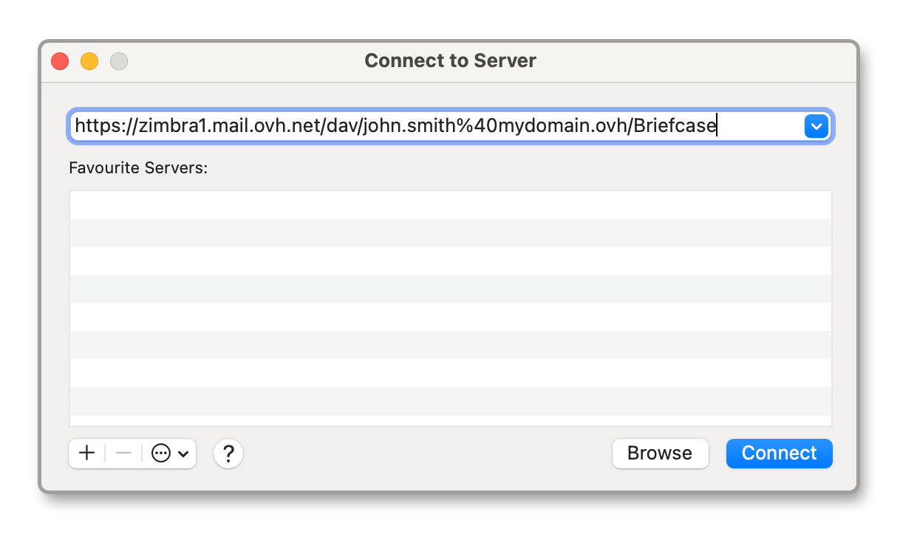{.thumbnail .w-600}
>> 
> **Passo 3**
>>
>> 1. Una finestra di validazione del server `zimbra1.mail.ovh.net` appare, clicca su `Connetti`{.action}.
>> 2. Una finestra ti chiederà di inserire il `Nome` che corrisponde al tuo indirizzo e-mail completo e la `Password` associata. Seleziona `Mantieni questa password nel mio portachiavi` se desideri conservarla per una futura connessione ad un'altra cartella. Clicca su `Connetti`{.action} per montare il volume.
>>
>> 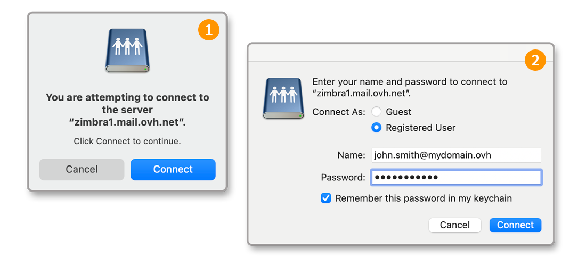{.thumbnail .w-600}

Hai ora accesso allo spazio di archiviazione della tua Malette Zimbra. Puoi depositarvi qualsiasi tipo di file non superiore a 100 MB.

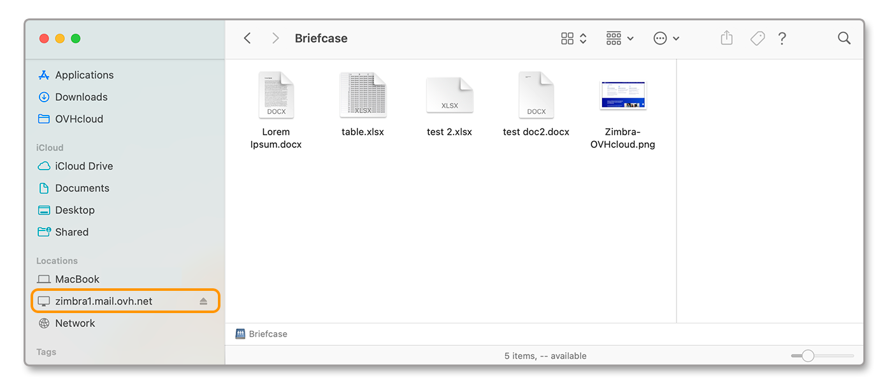{.thumbnail .w-600}

## Per saperne di più 

[Primi passi con l'offerta Zimbra](/pages/web_cloud/email_and_collaborative_solutions/zimbra/getting_started_zimbra)

[Configurare l'indirizzo e-mail Zimbra su un software di posta](/pages/web_cloud/email_and_collaborative_solutions/zimbra/zimbra_mail_apps)

[Utilizzare il webmail Zimbra](/pages/web_cloud/email_and_collaborative_solutions/mx_plan/email_zimbra)

[FAQ sulla soluzione Zimbra OVHcloud](/pages/web_cloud/email_and_collaborative_solutions/mx_plan/faq-zimbra)

Per prestazioni specializzate (posizionamento, sviluppo, ecc.), contatta i [partner OVHcloud](/links/partner).

Se desideri beneficiare di un supporto sull'utilizzo e la configurazione delle tue soluzioni OVHcloud, ti proponiamo di consultare le nostre diverse [offerte di supporto](/links/support).

Contatta la nostra [Community di utenti](/links/community).