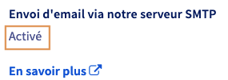
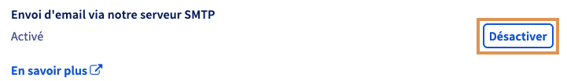

## Objectif

Afin de protéger votre réseau et vos adresses e-mail, nous désactivons l'envoi d'e-mails via le serveur d'e-mail sortant SMTP `smtp.ovh.dsl.net`

**Découvrez comment activer ou désactiver l'envoi d'e-mails depuis votre connexion internet OVHcloud via l'espace client.**

## Prérequis

- Disposer d'un [accès à Internet OVHcloud](https://www.ovhtelecom.fr/offre-internet/).
- Être connecté à l’[espace client OVHcloud](/links/manager), partie `Télécom`{.action} :

{.thumbnail}

## En pratique

### Étape 1 : Activer ou désactiver l'envoi d'e-mails

> [!primary]
>
> Par défaut, l'envoi d'e-mails est désactivé sur tous les accès internet livrés après le mois d'octobre 2024. Aucune manipulation n'est nécessaire si vous n'utilisez pas d'adresse e-mail configurée sur un logiciel de messagerie installé directement sur votre ordinateur.
>
> Exemples de logiciels de messagerie : Outlook, Thunderbird, Mail sur macOS, etc... Si vous utilisez votre adresse e-mail via un webmail ou que vous n'utilisez pas le serveur `smtp.dsl.ovh.net` comme serveur d'envoi, nous vous recommandons de laisser ce paramètre sur `désactivé` ou de le désactiver dans le cas où il serait `Activé`.
>

Connectez-vous à votre [espace client OVHcloud](/links/manager), partie « Télécom ». Cliquez sur `Accès Internet`{.action}, puis sélectionnez le pack et l’accès à Internet concerné. Assurez-vous d'être positionné sur l'onglet `Mon accès`{.action}.

Dans le cadre « Informations générales », reportez-vous à l'élément de la partie `Envoi d'email`. Vous retrouverez dans cette dernière le statut actuel du service d'envoi d'e-mails.

{.thumbnail}

> [!alert]
>
> En activant l'envoi d'e-mails, vous autorisez vos machines, avec une adresse e-mail configurée, à envoyer des e-mails via notre serveur d'envoi sans authentification. De ce fait, si l'une de vos adresses est compromise, celle-ci pourra être utilisée à des fins malveillantes, généralement pour envoyer des courriers indésirables, communément appelés "spam". En cas de détection de "spam", nous bloquerons automatiquement l'envoi d'e-mails depuis votre accès.
>
> De plus, dès lors où une adresse e-mail ou une adresse IP (celle de votre accès internet) est détectée comme étant utilisée pour des envois de courrier indésirable, elle se verra être systématiquement bloquée par les adresses de vos correspondants même si votre e-mail est légitime. De plus, votre adresse IP risque d'être répertoriée comme étant " à risque " sur les différents sites internet et solutions de protection contre le spam.
>

> [!alert]
>
> Le changement de statut entraînera une déconnexion/reconnexion de votre accès internet dans un intervalle de 5 à 10 minutes après avoir validé l'action.
>

- Pour changer l'état, cliquez simplement sur l'action disponible. Par exemple ici pour la désactivation :

{.thumbnail}

## Aller plus loin

Échangez avec notre [communauté d'utilisateurs](/links/community).

