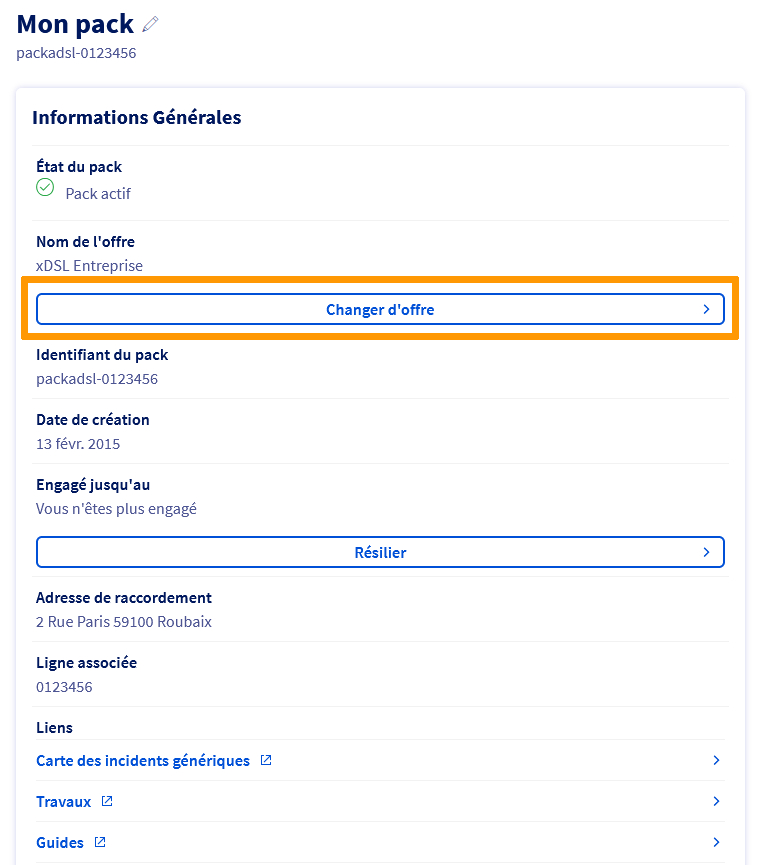
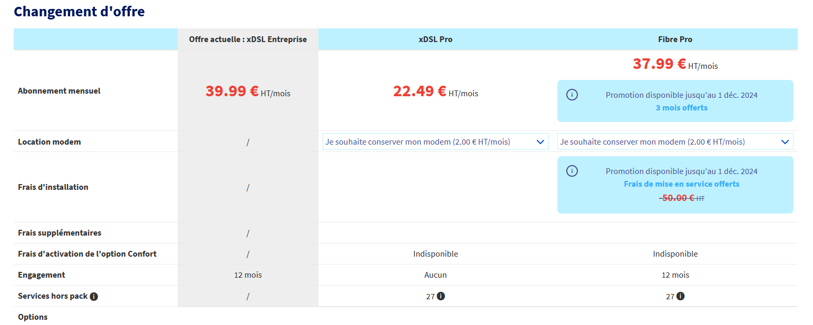
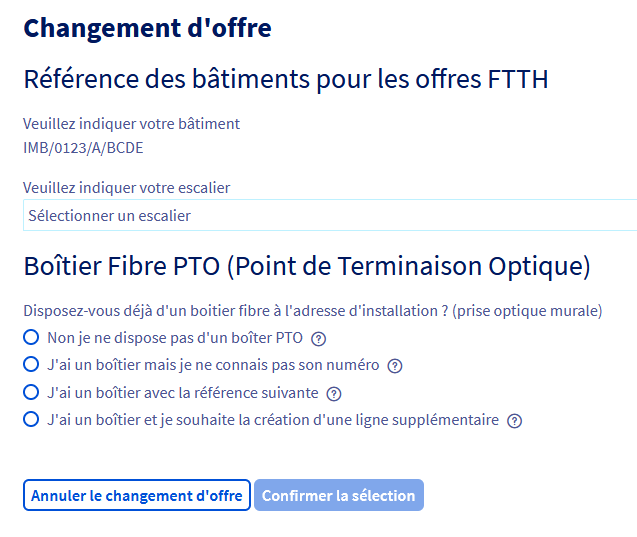

## Objectif

Vous pouvez faire évoluer votre offre xDSL/FTTH afin de pouvoir accéder à de nouvelles fonctionnalités et services.

## Prérequis

- Disposer d'un accès xDSL/FTTH actif.
- Disposer d'une offre éligible au changement d'offre.
- Être connecté à l’[espace client OVHcloud](/links/manager), partie `Télécom` :

{.thumbnail}

> [!primary]
> Le changement d'offre n'est pas disponible sur les offres SDSL.
>

## En pratique

### Conservation des options

Les options suivantes ne peuvent pas être conservées en tant qu'**options incluses** dans les nouvelles offres FTTH Pro et xDSL Pro :

- Nom de domaine
- EcoFax Pro
- Compte(s) Exchange

Lors d'un changement d'offre vers les nouvelles offres FTTH Pro et xDSL Pro, vous pourrez choisir de résilier ces options ou de les conserver aux tarifs en vigueur.

### Changer d’offre

La demande de changement d'offre s'effectue via votre [espace client OVHcloud](/links/manager). 
Dans l'onglet `Télécom`{.action}, sélectionnez la rubrique `Accès Internet`{.action} puis choisissez le pack que vous souhaitez faire évoluer. 
Cliquez ensuite sur `Changer d'offre`{.action} dans le cadre « Informations Générales ».

{.thumbnail}

Sur la page suivante, retrouvez les informations nécessaires pour effectuer votre choix d'offre.

La première colonne du tableau récapitule votre offre actuelle (son nom, son prix et les services actifs). Les autres colonnes concernent les offres auxquelles vous pouvez souscrire, compte tenu de votre adresse actuelle. 
Sélectionnez les options souhaitées (lignes téléphoniques, comptes e-mail, Garantie de Temps de Rétablissement) puis cliquez sur le bouton `Choisir cette offre`{.action} sous la colonne correspondant à l'offre que vous souhaitez souscrire.

> [!primary]
> Si vous souhaitez conserver les lignes téléphoniques de votre offre actuelle, veillez à ajouter un nombre équivalent de lignes dans votre nouvelle offre.

{.thumbnail}

Selon l'offre choisie, sélectionnez les informations requises.

> [!tabs]
> xDSL Pro
>>
>> {.thumbnail}
>>
>> Cochez les cases des services à conserver et cliquez sur `Confirmer la sélection des services`{.action}.
>>
> Fibre Pro
>> 
>> {.thumbnail}
>>
>> Indiquez les informations relatives à votre habitation, répondez à la question concernant votre boîtier fibre PTO et cliquez sur `Confirmer la sélection`{.action}.
>>
>> {.thumbnail}
>>
>> Cochez les cases des services à conserver et cliquez sur `Confirmer la sélection des services`{.action}.
>>
>> À l'étape suivante, sélectionnez les informations du rendez-vous et cliquez sur `Confirmer la sélection`{.action}.

Lors de la dernière étape, une demande de confirmation apparaît afin de valider le changement d'offre. 
Lisez les contrats, cochez la case afin de les accepter puis cliquez sur le bouton `Valider le changement d'offre`{.action}.

Comptez un délai d'une heure pour que le changement soit effectif, sauf pour les cas particuliers suivants :

- en cas de remplacement du modem. Un délai de livraison de 24 à 48 heures est alors à prendre en compte suite à l'expédition du modem.
- en cas de changement de collecte (un changement physique au niveau de la ligne qui implique une demande auprès de l'opérateur de collecte). Un délai moyen de 7 à 10 jours peut alors être constaté, ainsi qu'une coupure probable du service.

Suivant votre offre actuelle, un remplacement du modem peut s'avérer nécessaire. Cela vous sera indiqué lors du choix de votre nouvelle offre.

Les nouveaux services liés à votre nouvelle offre Pro seront accessibles une fois le changement effectif. 

## Aller plus loin

Échangez avec notre communauté d'utilisateurs sur <https://community.ovh.com>
