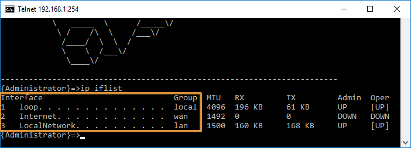
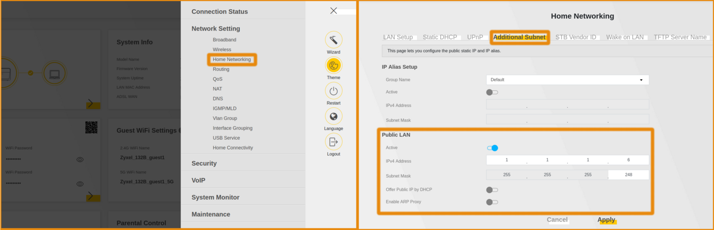
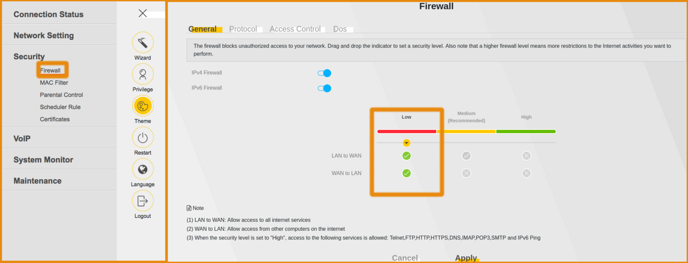
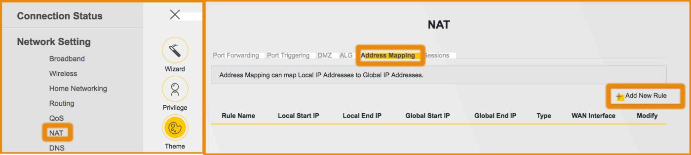
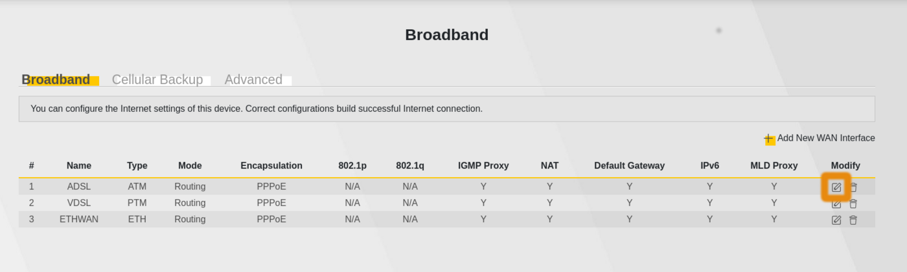

## Objectif

Un bloc IP vous permet d'associer des équipements de votre réseau interne à une adresse IP publique. Celui-ci comprend huit adresses IP au total (soit une /29) dont cinq que vous pourrez associer à vos machines et services.

**Apprenez à gérer un bloc IP /29 et à le configurer sur votre box OVHcloud.**

## Prérequis

- Disposer d’un [accès internet xDSL ou fibre OVHcloud](https://www.ovhtelecom.fr/offre-internet/){.external}. 
- Être connecté à l'[espace client OVHcloud](https://www.ovh.com/auth?onsuccess=https%3A%2F%2Fwww.ovhtelecom.fr%2Fmanager&ovhSubsidiary=fr){.external} dans la partie `Telecom`{.action}.
- Avoir la possibilité de se connecter à l'interface de votre box OVHcloud.
- Disposer d'une box OVHcloud compatible avec la configuration d'un bloc IP.

> [!primary]
>
> La configuration d'un bloc IP n'est pas possible sur le modèle de box suivant : Technicolor TG799vac. 
>
> Si vous le possédez, vous pouvez utiliser votre propre routeur en adaptant les éléments de la documentation à votre situation.
>

## En pratique

### Étape 1 : retrouver les IP associées à votre accès

Connectez-vous à votre [espace client OVHcloud](https://www.ovh.com/auth?onsuccess=https%3A%2F%2Fwww.ovhtelecom.fr%2Fmanager&ovhSubsidiary=fr){.external}, partie « Télécom ». Cliquez sur `Accès Internet`{.action}, puis sélectionnez le pack et l’accès à Internet concerné. Assurez-vous d'être positionné sur l'onglet `Mon accès`{.action}.

{.thumbnail}

Sur la page, dans le cadre « Caractéristiques », reportez-vous aux éléments de la partie `IPs`. Vous retrouverez dans cette dernière les adresses IP associées à votre accès à Internet. Concernant les adresses IPv4, deux lignes peuvent apparaître :

- l'adresse IP initiale de votre accès à Internet associée à un bloc /32 ;
- une adresse IP associée à un bloc /29. 

Si vous ne possédez pas de bloc IP /29, vous pouvez en commander un en cliquant sur le bouton `Commander`{.action} puis en suivant les étapes.

{.thumbnail}

Collectez à présent les adresses IP qui serviront lors des étapes suivantes. Pour cela :

- **récupérez l'adresse initiale de votre accès à Internet** : elle apparaît à côté du bloc /32 ;
- **récupérez les huit adresses IP (dont cinq associables à vos équipements)** : aidez-vous du tableau ci-dessous pour les retrouver.

|Types d'adresses|Description|Exemple|
|---|---|---|
|Adresse de réseau (_network_)|Il s'agit de la première adresse de votre bloc IP /29. Elle apparaît dans votre espace client à côté de ce bloc et n'est pas associable à l'un de vos équipements.|1.1.1.0|
|Adresses associables|Ce sont les cinq adresses IP que vous pouvez associer à vos équipements. Elles suivent l'adresse de réseau.|1.1.1.1<br>1.1.1.2<br>1.1.1.3<br>1.1.1.4<br>1.1.1.5|
|Adresse de passerelle (_gateway_)|Il s'agit de l'avant-dernière adresse de votre bloc IP /29. Elle n'est pas associable à l'un de vos équipements.|1.1.1.6|
|Adresse de diffusion (_broadcast_)|Elle représente la dernière adresse votre bloc IP /29. Celle-ci n'est pas associable à l'un de vos équipements.|1.1.1.7|

Vous devez à présent avoir récupéré l'adresse IP initiale (mentionnée à côté du bloc /32) et vos huit adresses du bloc /29.

### Étape 2 : désactiver la prise en main à distance de la box

> [!primary]
>
> Si vous possédez une box Technicolor ou Thomson (excepté le modèle Technicolor TG799vac) et souhaitez utiliser les API d'OVHcloud (utilisateurs expert) pour configurer le bloc IP : poursuivez directement vers l'étape 3.1 « [Configuration sur une box Technicolor ou Thomson](./#31-configuration-sur-une-box-technicolor-ou-thomson){.external} ».
>

Afin que la configuration du bloc IP puisse s'effectuer en local sur votre box OVHcloud, il est impératif de désactiver la prise en main à distance de celle-ci. Pour cela, toujours depuis votre [espace client OVHcloud](https://www.ovh.com/auth?onsuccess=https%3A%2F%2Fwww.ovhtelecom.fr%2Fmanager&ovhSubsidiary=fr){.external} sur l’accès à Internet concerné, positionnez-vous sur l'onglet `Mon modem`{.action}.

Sur la page, dans la partie « Configuration générale », assurez-vous de décocher la case à côté de `Configuration à distance activée`{.action} et confirmez le changement en cliquant sur `Ok`{.action}. Patientez alors le temps de la désactivation. 

{.thumbnail}

### Étape 3 : configurer le bloc IP sur votre box

Maintenant que vous êtes en possession de votre bloc IP, vous pouvez le configurer dans votre box OVHcloud. Poursuivez selon le modèle que vous possédez :

- [3.1 Configuration sur une box Technicolor ou Thomson](./#31-configuration-sur-une-box-technicolor-ou-thomson){.external} (**excepté pour le modèle Technicolor TG799vac**).
- [3.2 Configuration sur une box Zyxel](./#32-configuration-sur-une-box-zyxel){.external}.

> [!primary]
>
> Pour rappel, la configuration d'un bloc IP n'est pas possible sur le modèle de box suivant : Technicolor TG799vac. 
>
> Si vous le possédez, vous pouvez utiliser votre propre routeur en adaptant les éléments de la documentation à votre situation.
>

#### 3.1 Configuration sur une box Technicolor ou Thomson

La configuration d'un bloc IP sur une box Technicolor ou Thomson est possible de deux manières.

##### 3.1.1 Via les API OVHcloud

Cette méthode s'adresse aux utilisateurs expert uniquement. Nous ne serons pas en mesure de vous fournir une assistance.

Rendez-vous sur le lien <https://api.ovh.com/console/> puis connectez-vous avec votre identifiant client OVHcloud. Dès lors, utilisez les deux API ci-dessous afin de configurer le bloc IP /29.

> [!api]
>
> @api {v1} /xdsl GET /xdsl/{serviceName}/modem/blocIp
> 

Permet de récupérer l'état d'activation du bloc IP /29.

> [!api]
>
> @api {v1} /xdsl POST /xdsl/{serviceName}/modem/blocIp
> 

Permet d'activer ou de désactiver la configuration du bloc IP /29 sur votre box OVHcloud Technicolor ou Thomson compatible.

Une fois configurée, poursuivez vers l'étape 4 « [Configurer les adresses IP sur vos équipements](./#etape-4-configurer-les-adresses-ip-sur-vos-equipements){.external} ».

##### 3.1.2 Via un client Telnet

Afin de réaliser cette configuration, un client Telnet doit être installé sur votre ordinateur. Par défaut, celui-ci n'est pas activé sur Windows. Sur macOS ou Linux, vous disposez déjà d'une application « Terminal » permettant de réaliser la manipulation. 

Pour l'activer sur Windows 10, effectuez un clic droit sur l’image en bas à gauche représentant le logo Windows et cliquez sur `Applications et fonctionnalités`{.action}. Descendez en bas de la fenêtre qui apparaît et cliquez sur `Programmes et fonctionnalités`{.action}. Sélectionnez ensuite `Activer ou désactiver des fonctionnalités Windows`{.action}, puis assurez-vous de cocher la case à côté de `Client Telnet`. Validez en cliquant sur le bouton `OK`{.action}.

Si vous utilisez une version antérieure à Windows 10, vous devriez pouvoir retrouver un équivalent depuis le « Panneau de configuration ».

{.thumbnail}

Pour réaliser la connexion Telnet, ouvrez maintenant le « Terminal » (macOS et Linux) ou l'invite de commande (Windows). Utilisez ensuite la commande suivante pour vous connecter à votre box OVHcloud (si vous avez modifié l'adresse de passerelle vers votre box, remplacez l'adresse spécifiée par celle que vous avez définie).

```
telnet 192.168.1.254
```

Renseignez alors l'identifiant et le mot de passe d'accès à votre box. Par défaut, l'identifiant est « Administrator » et il n'y a pas de mot de passe.

{.thumbnail}

Une fois connecté, utilisez la commande suivante pour afficher des informations sur la configuration actuelle de votre box. 

```
ip iflist
```

Relevez les correspondances entre la colonne « Interface » et « Group » du tableau qui apparaît. Notez les interfaces correspondant à **wan** et **lan**, elles vous seront utiles par la suite. Voici un exemple de résultat que vous pourriez obtenir :

|Interface|Group|
|---|---|
|Internet|wan|
|LocalNetwork|lan|

{.thumbnail}

Désactivez le serveur DHCP grâce à la commande :

```
dhcp server config state disabled
```

Supprimez ensuite les baux DHCP en cours :

```
dhcp server lease flush
```

Configurez la passerelle (_gateway_) du bloc IP sur l'interface **lan**.

Prenez soin de remplacer « LocalNetwork » par le nom de l'interface correspondant à **lan** récupéré précédemment. Changez également l'adresse « 1.1.1.6/29 » par celle de passerelle (_gateway_) récupérée lors de [l'étape 1](./#etape-1-retrouver-les-ip-associees-a-votre-acces){.external}. 

```
ip ipadd intf=LocalNetwork addr=1.1.1.6/29
```

Désactivez le NAT sur l'interface **wan**. Ici, prenez soin de remplacer « Internet » par le nom de l'interface correspondant à **wan** récupéré précédemment.

```
nat ifconfig intf=Internet translation=disabled
```

Sauvegardez les changements réalisés. Cette configuration restera active même après un redémarrage de votre box. 

```
saveall
```

Le paramétrage maintenant effectué, poursuivez vers l'étape 4 « [Configurer les adresses IP sur vos équipements](./#etape-4-configurer-les-adresses-ip-sur-vos-equipements){.external} ».

#### 3.2 Configuration sur une box Zyxel

La configuration d'un bloc IP /29 sur une box Zyxel s'effectue dans l'interface de cette dernière, depuis un navigateur internet. Connectez-vous en accédant à l'adresse `192.168.1.1`.

> [!primary]
>
> S'il s'agit de votre première connexion à l'interface de votre box Zyxel, vous serez invité à personnaliser le mot de passe administrateur. Réalisez cette manipulation en précisant un mot de passe complexe. 
>

Une fois connecté à l'interface, plusieurs manipulations sont nécessaires. La première consiste à rendre le réseau local public. Pour cela, cliquez sur l'icône menu en haut à droite, puis sur  `Network Settings`{.action} puis sur `Home Networking`{.action}. Dans la nouvelle fenêtre, positionnez-vous sur l'onglet `Additional Subnet`{.action}. Dans la partie « Public LAN », complétez les deux informations ci-dessous :

|Informations|Description|
|---|---|
|IPv4 Address|Renseignez l'adresse de passerelle (_gateway_) récupérée lors de [l'étape 1](./#etape-1-retrouver-les-ip-associees-a-votre-acces){.external}.|
|Subnet Mask|Indiquez l'adresse `255.255.255.248` (qui correspond au bloc /29).|

Cliquez ensuite sur le bouton `Apply`{.action}.

{.thumbnail}

Cliquez à nouveau sur l'icône menu en haut à droite, puis sur `Security`{.action} et pour finir sur `Firewall`{.action}. Modifiez le niveau du pare-feu sur « Low », puis cliquez sur le bouton `Apply`{.action}.

{.thumbnail}

À présent, il est nécessaire de créer une règle afin d'autoriser les équipements connectés en local à accéder à Internet. Pour cela, retounez dans le menu `Network Settings`{.action}, puis sur `NAT`{.action}. Dans la nouvelle fenêtre, positionnez-vous sur l'onglet `Address Mapping`{.action} et cliquez sur le bouton `Add New Rule`{.action}.

{.thumbnail}

Complétez les informations demandées en vous aidant du tableau ci-dessous :

|Informations|Description|
|---|---|
|Rule Name|Il s'agit du nom de la règle. Vous pouvez spécifier celui que vous souhaitez.|
|Type|Sélectionnez dans le menu déroulant `Many-to-One`.|
|Local Start IP|Indiquez `192.168.1.2`. Il s'agit de l'adresse par défaut, sauf si vous l'avez changée dans la configuration de votre box.|
|Local End IP|Indiquez `192.168.1.254`. Il s'agit de l'adresse par défaut, sauf si vous l'avez changée dans la configuration de votre box.|
|Global Start IP|Indiquez l'adresse IPv4 initiale que vous avez récupérée lors de [l'étape 1](./#etape-1-retrouver-les-ip-associees-a-votre-acces){.external} (celle mentionnée avec le bloc /32).|
|WAN Interface|Sélectionnez le nom de l'interface récupéré précédemment (mentionné en dessous de « Connected Interface »).|

Cliquez ensuite sur le bouton `OK`{.action}.

{.thumbnail}

Toujours dans le menu `Network Settings`{.action}, selectionnez le menu `Broadband`{.action}. Cliquez sur l'icône représentant une feuille et un crayon, à droite du nom de l'interface utilisée par votre modem. L'interface dépend de votre type de connexion :

- **ADSL**: Pour une connexion de type ADSL
- **VDSL**: Pour une connexion de type VDSL
- **ETHWAN**: Pour une connexion de type FTTH

{.thumbnail}

En cas de doute, le type de votre connexion est disponible sur l’espace client OVHcloud.

{.thumbnail}

Dans la fenêtre qui apparaît, descendez jusqu'à la partie « Routing feature ». Désactivez le curseur à droite de `NAT`{.action}. Cliquez enfin sur le bouton `Apply`{.action}.

{.thumbnail}

### Étape 4 : configurer les adresses IP sur vos équipements

Votre bloc IP /29 étant à présent paramétré sur votre box OVHcloud, vous pouvez associer manuellement vos cinq adresses IP à vos équipements. À noter que le DHCP de votre box continue de fonctionner normalement, attribuant une adresse IP locale aux équipements reliés.

Pour réaliser une configuration sur l'un de vos équipements, vous aurez besoin des trois informations suivantes :

- **l'une des cinq adresses IP associables de votre bloc /29** : vous les avez récupérées lors de [l'étape 1](./#etape-1-retrouver-les-ip-associees-a-votre-acces){.external} ;
- **l'adresse de passerelle de votre bloc /29** : vous l'avez récupérée lors de [l'étape 1](./#etape-1-retrouver-les-ip-associees-a-votre-acces){.external} ;
- **le masque de sous-réseau** : vous l'avez configuré lors de l'étape précédente ; il doit correspondre à `255.255.255.248`.

Une fois cette opération effectuée depuis un ordinateur, vous aurez la possibilité de tester l'attribution de nouvelles adresses IP en réalisant un test de débit depuis notre site <http://ovh.net/>. À la fin, celles-ci apparaîtront à côté de **IPv4** à gauche.

{.thumbnail}

## Aller plus loin

Échangez avec notre communauté d'utilisateurs sur <https://community.ovh.com>.
